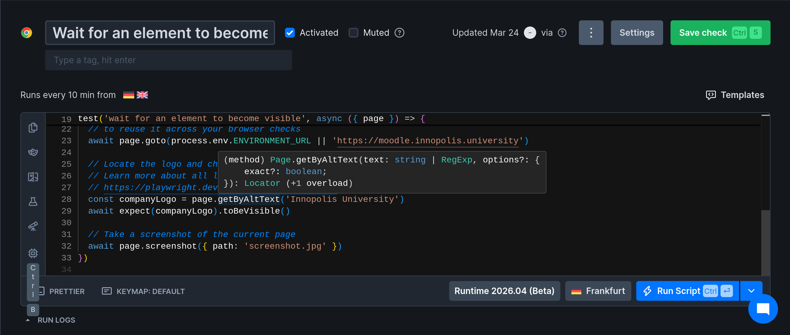
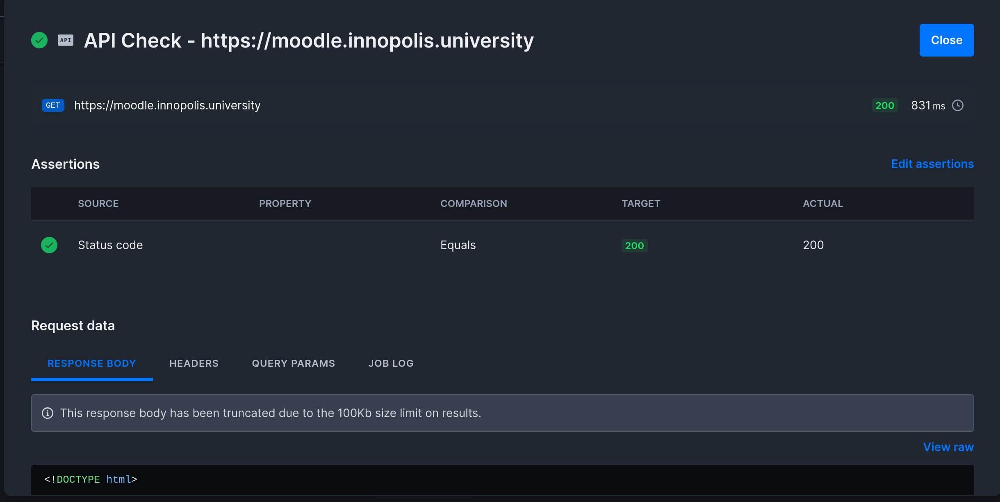
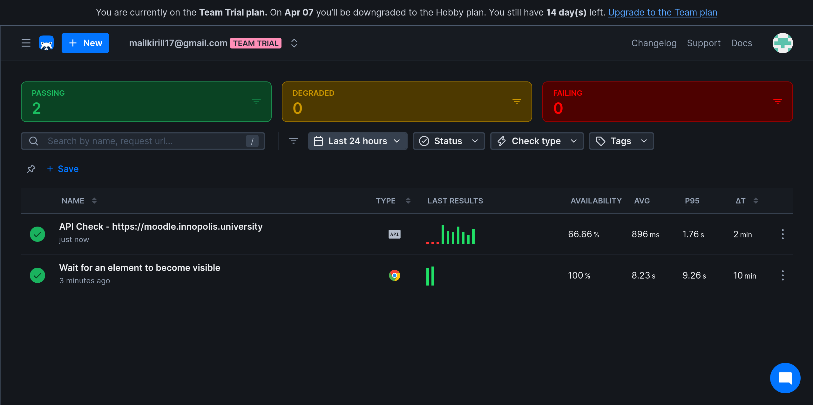

# Task 1

## Top 3 most consuming applications for CPU, memory, and I/O usage
CPU: 1. htop, wayland, firefox

Mem: Telegram, Firefox, plasmashell

I/O: btrfs-transaction, plasmashell, systemd

## Command outputs showing resource consumption
`iostat -x 1 5`

```
Linux 6.14.9-300.fc42.x86_64 (fedora)   03/24/26        _x86_64_        (32 CPU)

avg-cpu:  %user   %nice %system %iowait  %steal   %idle
           2.51    0.01    1.28    0.11    0.00   96.09

Device            r/s     rkB/s   rrqm/s  %rrqm r_await rareq-sz     w/s     wkB/s   wrqm/s  %wrqm w_await wareq-sz     d/s     dkB/s   drqm/s  %drqm d_await dareq-sz     f/s f_await  aqu-sz  %util
nvme0n1          0.51     13.35     0.01   2.83    0.20    26.41    0.50      9.81     0.05   8.66    4.10    19.80    0.21    119.58     0.00   0.00    2.76   560.40    0.01    3.17    0.00   0.08
zram0            0.00      0.01     0.00   0.00    0.00    21.02    0.00      0.00     0.00   0.00    0.00     4.00    0.00      0.00     0.00   0.00    0.00     0.00    0.00    0.00    0.00   0.00

```

`htop`

```

    0[|   1.3%]  4[|   3.2%]  8[|   0.6%] 12[|   0.6%]  16[|   1.2%]  20[    0.0%] 24[    0.0%] 28[    0.0%]
    1[    0.0%]  5[||  8.7%]  9[    0.0%] 13[    0.0%]  17[    0.0%]  21[|   0.6%] 25[|   0.6%] 29[|   3.2%]
    2[|   1.3%]  6[|   1.3%] 10[||  1.2%] 14[|   1.3%]  18[    0.0%]  22[    0.0%] 26[    0.0%] 30[||  3.1%]
    3[    0.0%]  7[||| 4.4%] 11[    0.0%] 15[    0.0%]  19[|   0.6%]  23[    0.0%] 27[    0.0%] 31[    0.0%]
  Mem[||||||||||||||||||||||||||||||||||||7.58G/15.3G] Tasks: 167, 1340 thr, 396 kthr; 1 running
  Swp[|                                     84K/8.00G] Load average: 0.27 0.68 0.91 
                                                       Uptime: 4 days, 23:44:07

  [Main] [I/O]
    PID USER       PRI  NI  VIRT   RES   SHR S  CPU%▽MEM%   TIME+  Command
   2796 kirill      -2   0 3170M  491M  315M R   8.1  3.1 24:45.75 /usr/bin/kwin_wayland --wayland-fd 7 --sock
  57117 kirill      24   4  231M  6544  3728 R   5.6  0.0  0:09.05 htop
   2862 kirill      -2   0 3185M  490M     0 S   3.1  3.1  4:46.37 /usr/bin/kwin_wayland --wayland-fd 7 --sock
  56175 kirill      20   0 2118M  238M  205M S   1.9  1.5  0:05.16 /usr/bin/konsole
   3005 kirill      20   0 6996M  500M  200M S   1.3  3.2  1:13.79 /usr/bin/plasmashell --no-respawn
   1922 root        20   0 2794M 77896     0 S   0.6  0.5  0:00.15 /usr/bin/dockerd -H fd:// --containerd=/run
   2889 kirill      20   0 3185M  490M     0 S   0.6  3.1  0:00.26 /usr/bin/kwin_wayland --wayland-fd 7 --sock
   3098 kirill      20   0  394M 34612 29456 S   0.6  0.2  0:34.52 /usr/bin/ksystemstats
F1Help  F2Setup F3SearchF4FilterF5Tree  F6SortByF7Nice -F8Nice +F9Kill  F10Quit  

```

`df -h`

```
Filesystem      Size  Used Avail Use% Mounted on
/dev/nvme0n1p7   70G   54G   14G  80% /
devtmpfs        4.0M     0  4.0M   0% /dev
tmpfs           7.7G   35M  7.7G   1% /dev/shm
efivarfs        268K  222K   42K  85% /sys/firmware/efi/efivars
tmpfs           3.1G  2.4M  3.1G   1% /run
tmpfs           1.0M     0  1.0M   0% /run/credentials/systemd-journald.service
/dev/nvme0n1p7   70G   54G   14G  80% /home
tmpfs           7.7G   64K  7.7G   1% /tmp
/dev/nvme0n1p4   60G   41G   20G  69% /mnt/shared
/dev/nvme0n1p6  974M  492M  416M  55% /boot
/dev/nvme0n1p1   96M   79M   18M  82% /boot/efi
tmpfs           1.0M     0  1.0M   0% /run/credentials/systemd-resolved.service
tmpfs           1.6G  284K  1.6G   1% /run/user/1000
```

## Top 3 largest files in the /var directory

`sudo find /var -type f -exec du -h {} + | sort -rh | head -n 3`

```
223M    /var/lib/flatpak/repo/objects/1a/4c5d7ea27834964487036b22f3d818b13dec1162f87a96d4c25a81c35a85f2.file
223M    /var/lib/flatpak/app/com.obsproject.Studio/x86_64/stable/caf0e8d12e2e072b8955a01815fac498746fd8da8de752f6d38a986fd5b21462/files/lib/obs-plugins/libcef.so
163M    /var/lib/clamav/main.cvd

```

## Analysis: What patterns do you observe in resource utilization?
Cpu utilization is low, while memory is moderately used by GUI apps. I/O and disk usage are normal for my workload now (no opened heavy tasks).

## Reflection: How would you optimize resource usage based on your findings?
If I needed more memory I would close some heavy GUI apps or switched to terminal mode (remove GUI completely or changed display protocol)

# Task 2


## Website URL you chose to monitor
https://moodle.innopolis.university


## Screenshots of browser check configuration


## Screenshots of successful check results




## Screenshots of alert settings


## Analysis: Why did you choose these specific checks and thresholds?

I choose loading logo as browser check as a marker that indicates moodle successfully loads images. As for alert thresholds, I loosened them down, since IU moodle is known by its instability.

## Reflection: How does this monitoring setup help maintain website reliability?

Detects failures early and triggers alerts so incidents are noticed. That reduces time for repair. Also collects downtime stats and test logs which can be useful for fixing and debugging. 