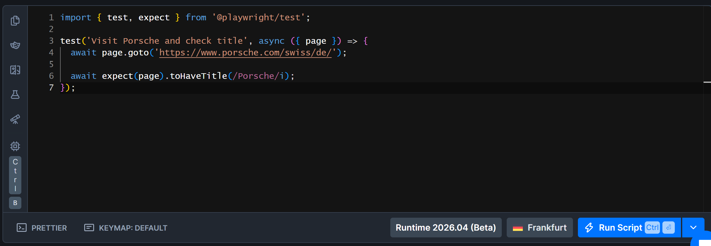
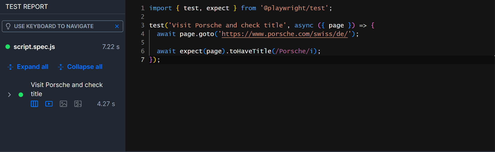
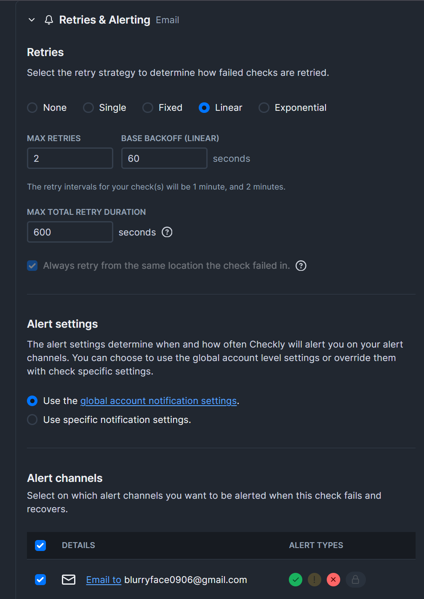
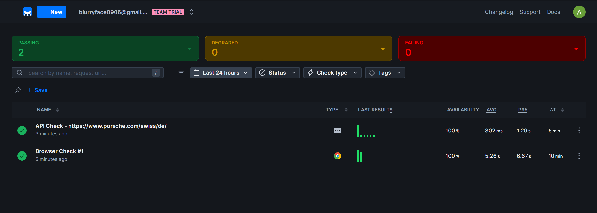

# Lab 8 — Site Reliability Engineering (SRE) Submission

## Task 1 — Key Metrics for SRE and System Analysis

### Top 3 most consuming applications for CPU, memory, and I/O usage
`htop`
- **CPU usage:** 1. firefox, 2. htop, 3. Xorg.
- **Memory usage:** 1. firefox, 2. firefox, 3. firefox.
- **I/O usage:** 1. firefox, 2. firefox

### Command outputs showing resource consumption
`iostat -x 1 5`
```text
Linux 6.17.0-14-generic (UbuntuLab5)  03/20/2026  _x86_64_ (2 CPU)

avg-cpu:  %user   %nice %system %iowait  %steal   %idle
           2.57    0.03    5.24    0.16    0.00   92.00

Device            r/s     rkB/s   rrqm/s  %rrqm r_await rareq-sz     w/s     wkB/s   wrqm/s  %wrqm w_await wareq-sz     d/s     dkB/s   drqm/s  %drqm d_await dareq-sz     f/s f_await  aqu-sz  %util
loop0            0.01      0.01     0.00   0.00    0.21     1.21    0.00      0.00     0.00   0.00    0.00     0.00    0.00      0.00     0.00   0.00    0.00     0.00    0.00    0.00    0.00   0.00
loop1            0.22      2.77     0.00   0.00    2.26    12.51    0.00      0.00     0.00   0.00    0.00     0.00    0.00      0.00     0.00   0.00    0.00     0.00    0.00    0.00    0.00   0.05
loop10           1.02     53.56     0.00   0.00    0.53    52.40    0.00      0.00     0.00   0.00    0.00     0.00    0.00      0.00     0.00   0.00    0.00     0.00    0.00    0.00    0.00   0.04
loop11           0.32     11.12     0.00   0.00    0.23    35.00    0.00      0.00     0.00   0.00    0.00     0.00    0.00      0.00     0.00   0.00    0.00     0.00    0.00    0.00    0.00   0.00
loop12           0.01      0.01     0.00   0.00    0.27     1.27    0.00      0.00     0.00   0.00    0.00     0.00    0.00      0.00     0.00   0.00    0.00     0.00    0.00    0.00    0.00   0.00
loop2            0.03      0.50     0.00   0.00   12.48    18.47    0.00      0.00     0.00   0.00    0.00     0.00    0.00      0.00     0.00   0.00    0.00     0.00    0.00    0.00    0.00   0.02
loop3            0.02      0.17     0.00   0.00    8.02     8.04    0.00      0.00     0.00   0.00    0.00     0.00    0.00      0.00     0.00   0.00    0.00     0.00    0.00    0.00    0.00   0.01
loop4            1.09      3.29     0.00   0.00    0.34     3.03    0.00      0.00     0.00   0.00    0.00     0.00    0.00      0.00     0.00   0.00    0.00     0.00    0.00    0.00    0.00   0.03
loop5            0.02      0.16     0.00   0.00   18.63     8.07    0.00      0.00     0.00   0.00    0.00     0.00    0.00      0.00     0.00   0.00    0.00     0.00    0.00    0.00    0.00   0.02
loop6            0.02      0.17     0.00   0.00   13.70     8.13    0.00      0.00     0.00   0.00    0.00     0.00    0.00      0.00     0.00   0.00    0.00     0.00    0.00    0.00    0.00   0.02
loop7            0.02      0.29     0.00   0.00    0.87    13.93    0.00      0.00     0.00   0.00    0.00     0.00    0.00      0.00     0.00   0.00    0.00     0.00    0.00    0.00    0.00   0.00
loop8            1.90     46.98     0.00   0.00    0.41    24.68    0.00      0.00     0.00   0.00    0.00     0.00    0.00      0.00     0.00   0.00    0.00     0.00    0.00    0.00    0.00   0.06
loop9            0.04      0.83     0.00   0.00    8.38    19.97    0.00      0.00     0.00   0.00    0.00     0.00    0.00      0.00     0.00   0.00    0.00     0.00    0.00    0.00    0.00   0.02
sda             11.07   1054.46     3.54  24.20    1.82    95.25    4.41    321.59    11.10  71.55    3.37    72.86    0.00      0.00     0.00   0.00    0.00     0.00    1.35    1.66    0.04   2.40
```

### Disk Usage Output
`df -h`
```text
Filesystem      Size  Used Avail Use% Mounted on
tmpfs           392M  1.6M  390M   1% /run
/dev/sda2        25G  6.4G   17G  28% /
tmpfs           2.0G     0  2.0G   0% /dev/shm
tmpfs           5.0M  8.0K  5.0M   1% /run/lock
tmpfs           392M  116K  392M   1% /run/user/1000
```

`du -h /var | sort -rh | head -n 10`
```text
2.0G /var
1.7G /var/lib
1.4G /var/lib/snapd
1.1G /var/lib/snapd/seed/snaps
1.1G /var/lib/snapd/seed
320M /var/lib/snapd/snaps
240M /var/lib/apt/lists
240M /var/lib/apt
163M /var/cache
125M /var/log
```

### Top 3 largest files in the /var
`sudo find /var -type f -exec du -h {} + | sort -rh | head -n 3`
```text
532M /var/lib/snapd/seed/snaps/gnome-42-2204_247.snap
255M /var/lib/snapd/cache/e1980a40b86b25c7212576fbb1ccb993f8237aeb65bde8725129ecf2730bcf44012e6034480c2442a2b2905f604f11f8
252M /var/lib/snapd/seed/snaps/firefox_7766.snap
```

### Analysis
**What patterns do you observe in resource utilization?**
На виртуальной машине без высокой нагрузки основные ресурсы потребляют системные процессы и firefox, который у меня был запущен для телеграма. Нагрузка на CPU и I/O минимальна и держится в районе нескольких процентов и всего у нескольких процессов. Что касается дисковой подсистемы, самые большие файлы в директории `/var` приходятся на систему контейнеризации пакетов `snapd` (`/var/lib/snapd/`). Это связано с архитектурой Snap-пакетов (таких как Firefox и базовые компоненты GNOME), которые хранят все свои зависимости внутри себя и создают объемные образы (`.snap`) и кеши.

**How would you optimize resource usage based on your findings?**
1. **Для диска:** Так как основное место занимают Snap-пакеты, можно изменить политику хранения (retention policy), чтобы система хранила меньше старых резервных версий программ (по умолчанию Snap хранит несколько прошлых версий на случай отката). Это делается командой `snap set system refresh.retain=2`. Также стоит настроить ротацию обычных логов (logrotate) и очистку кеша `apt`.
2. **Для CPU/Memory:** Отключить неиспользуемые фоновые службы и, при необходимости, запускать сервер в headless-режиме (без графического интерфейса), что сильно сэкономит оперативную память.


## Task 2 — Practical Website Monitoring Setup

**Website URL:** https://www.porsche.com/swiss/de/

### Browser Check Configuration


### Successful Check Result


### Alert Settings


### Dashboard Overview


### Analysis
**Why did you choose these specific checks and thresholds?**
Я выбрал API Check для быстрой и легковесной проверки доступности сервера (статус 200). Browser Check добавлен для симуляции действий реального пользователя, чтобы убедиться, что не просто отдает код 200, но и корректно рендерит интерфейс. Алерты настроены с повторением, чтобы избежать ложных срабатываний из-за случайных сетевых задержек, но при этом гарантированно заметить реальную деградацию сервиса.

**How does this monitoring setup help maintain website reliability?**
Подобный сетап удобен для проактивного подхода SRE. Вместо того чтобы узнавать о падении сайта от недовольных клиентов, мы получаем уведомление (alert) в ту же минуту, когда метрики выходят за рамки нормы. Это позволяет начать чинить проблему до того, как инцидент станет массовым.