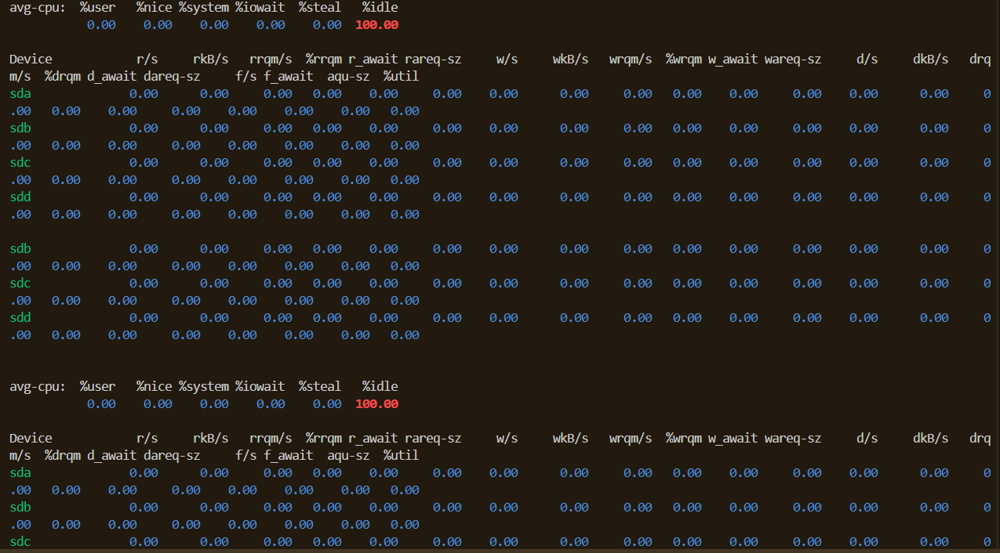

# 1

1.1:
- CPU: firefox, gnome, htop
- Memory: firefox, gnome, vscode
- I/O: only firefox is actively using

1.2 I used `htop` for CPU, Memory; `iostat -x 1 5` for I/O info

1.3 
```
sudo find /var -type f -exec du -h {} + | sort -rh | head -n 3
1.1G	/var/lib/docker/volumes/pg_data/_data/base/16653/16664
1.1G	/var/lib/docker/volumes/pg_data/_data/base/16653/16659
1.1G	/var/lib/docker/overlay2/.../diff/usr/local/lib/python3.9/site-packages/tensorflow/libtensorflow_cc.so.2
```

1.4 Firefox is present in all three resource categories (CPU, memory, and I/O), while Docker PSQL volumes account for the largest files in /var, indicating containerized database storage is consuming significant disk space.

1.5 To optimize resource usage, I would either prune unused Docker volumes or relocate PostgreSQL data to a dedicated cloud storage location to free up disk space.

# 2

2.1 https://moodle.innopolis.university/

2.2 

2.3 

2.4 

2.5 As a student I expect moodle to be available at any time. I also expect it to load in 2 seconds. Therefore, if it takes longer than 2 seconds to load, it's considered degraded. If it takes longer than 10 seconds, I receive the notification.

2.6 The monitoring setup allows to identify resources bottlenecks causes and write automatic tests that verify that your site is available at any given moment. Otherwise, you get notificated.