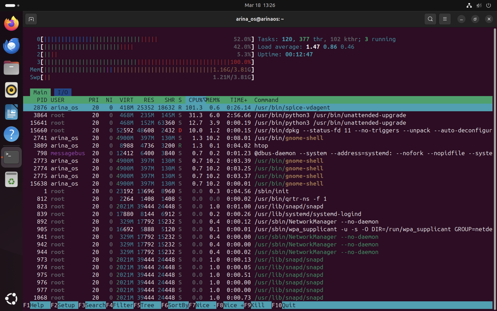
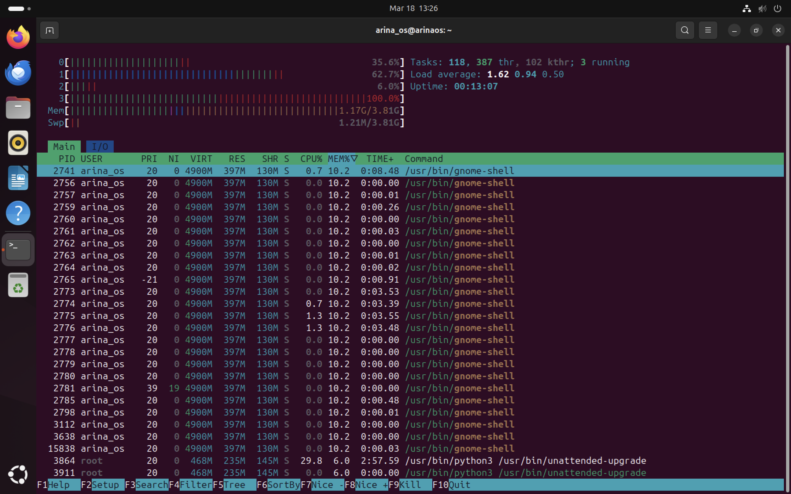
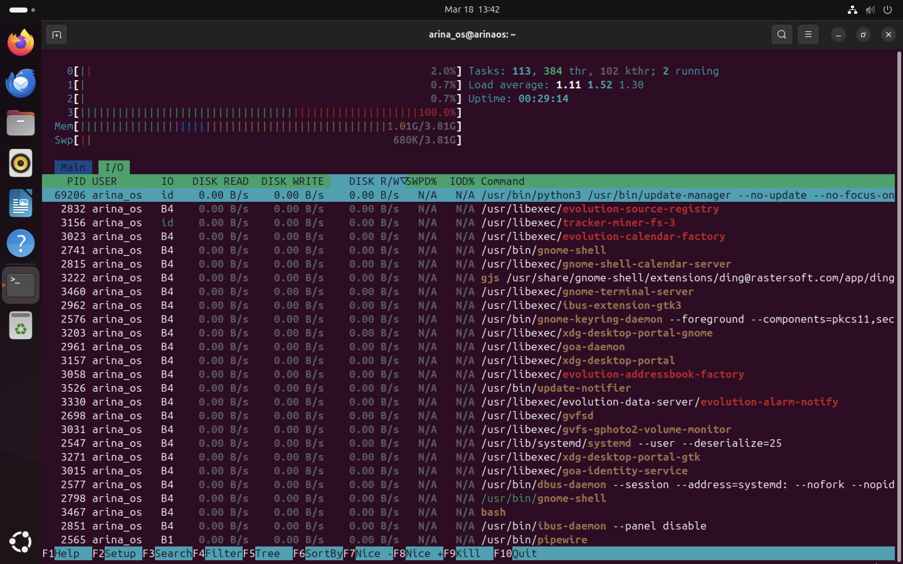
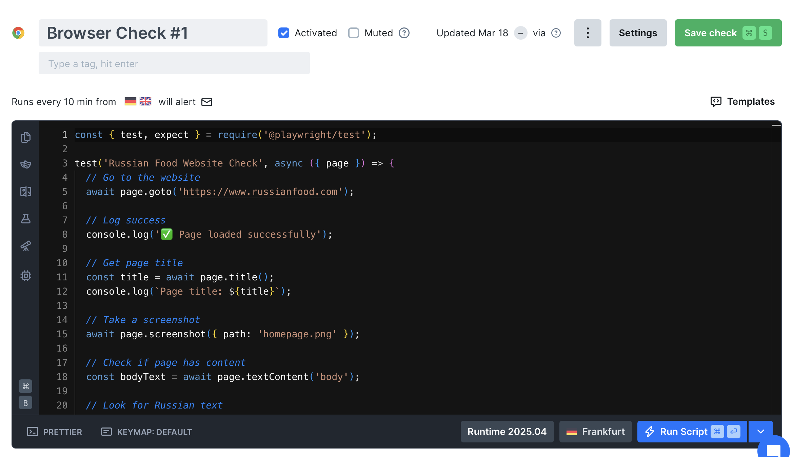
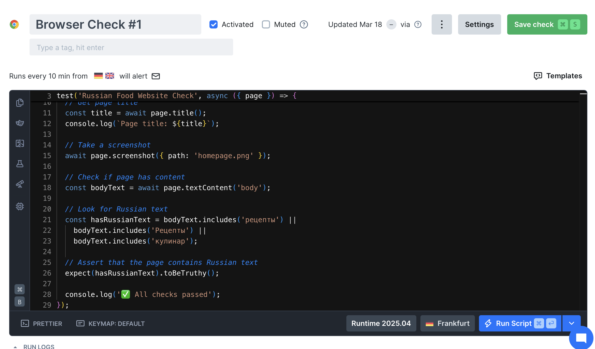
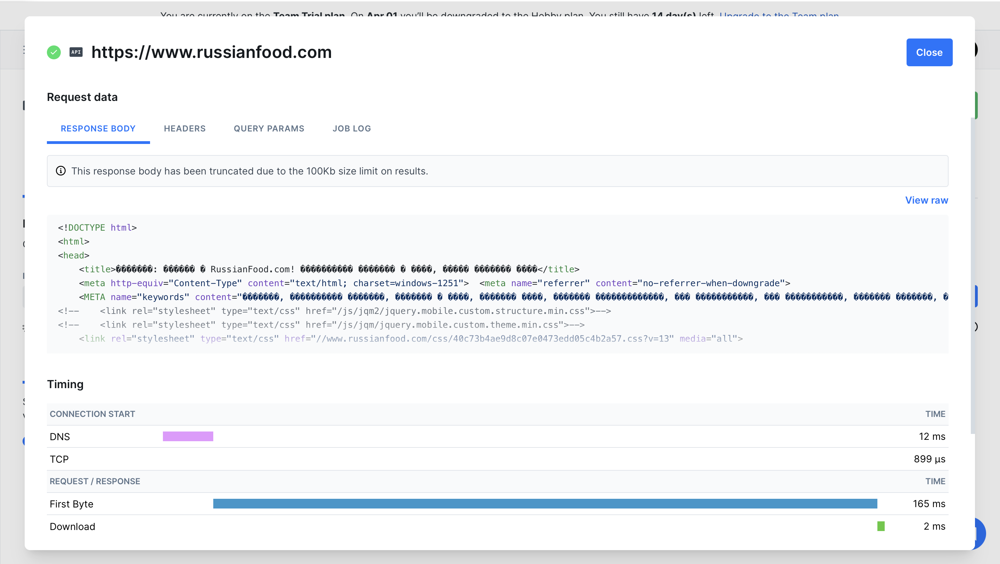
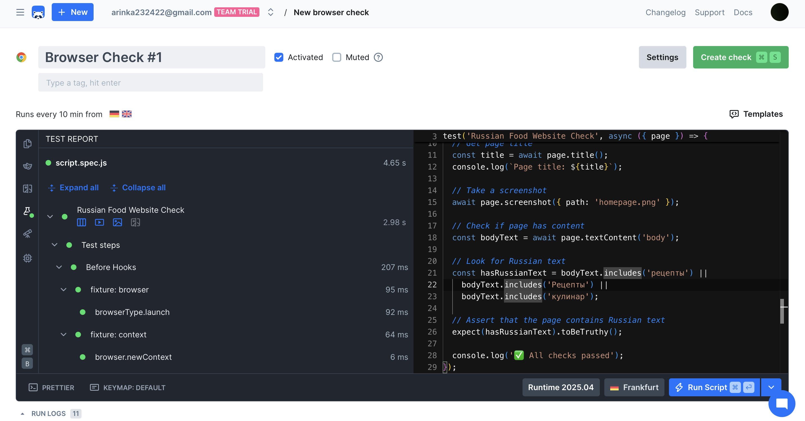
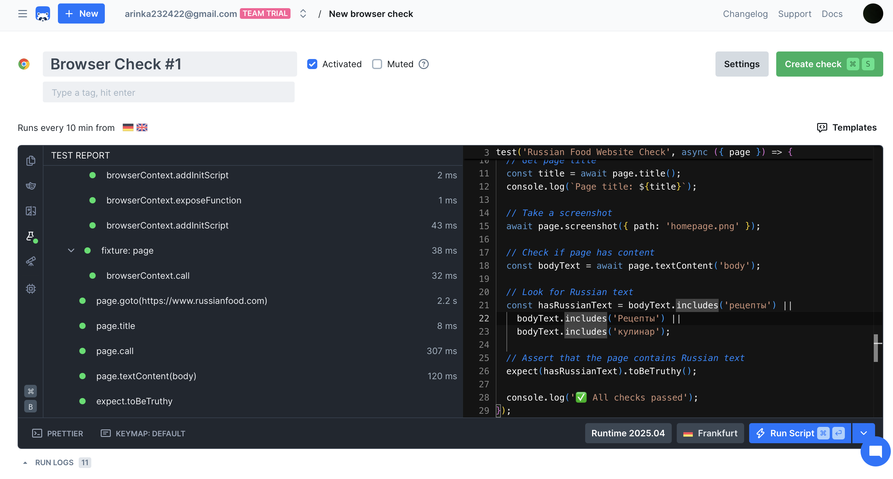
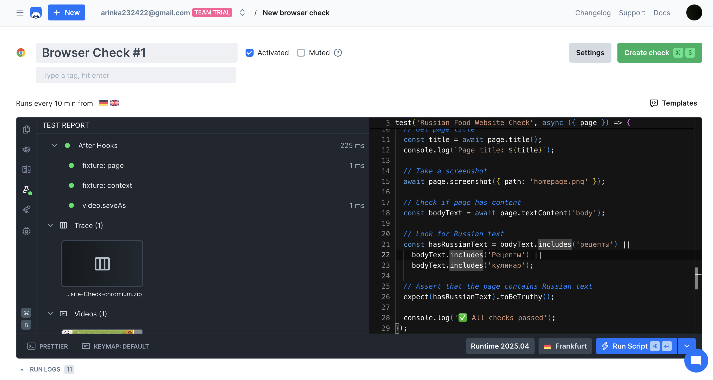

# Lab 8 Submission
## Task 1: Key Metrics for SRE and System Analysis 
#### Top 3 most consuming applications for CPU (with screenshot output):
1. **spice-vdagent (PID 2876) - 101.3% CPU:** VM integration agent for UTM. Handles clipboard sharing, mouse integration, display optimization

2. **unattended-upgrade (PID 3864) - 31.3% CPU:** System automatic update process. Currently installing/checking for updates.

3. **unattended-upgrade (PID 15641) - 12.7% CPU:** Secondary unattended-upgrade process. Multiple processes handling different update tasks



#### Top 3 most consuming applications for memory (with screenshot output):
1. **gnome-shell (PID 2741, 2756, 2757, etc.) - 10.2% Memory (each):** The multiple entries with identical 10.2% memory usage are threads of the same gnome-shell process. This is the desktop environment/GUI.

2. **unattended-upgrade (PID 3864, 3911) - 6.0% Memory:** Main system update process. This memory is used to load package information, maintain the package database in memory, and process update metadata during installation.

3. **unattended-upgrade (PID 15641) - 3.9% Memory:** Secondary unattended-upgrade process (child/spawned process). Handles specific update subtasks while sharing some memory with the parent.



#### Top 3 most consuming applications for I/O usage (with screenshot output):
According to the screenshot, there were no applications that used I/O at that moment. It is related to the fact that the system was in an idle state with minimal disk reads/writes.



#### Top 3 largest files in the /var directory:
**Disk Usage:**
```
arina_os@arinaos:~$ df -h
du -h /var | sort -rh | head -n 10
Filesystem                         Size  Used Avail Use% Mounted on
tmpfs                              391M  1.9M  389M   1% /run
efivarfs                           256K   28K  229K  11% /sys/firmware/efi/efivars
/dev/mapper/ubuntu--vg-ubuntu--lv   30G   16G   14G  54% /
tmpfs                              2.0G     0  2.0G   0% /dev/shm
tmpfs                              5.0M  8.0K  5.0M   1% /run/lock
/dev/vda2                          2.0G  301M  1.5G  17% /boot
/dev/vda1                          1.1G  6.4M  1.1G   1% /boot/efi
tmpfs                              391M  124K  391M   1% /run/user/1000
du: cannot read directory '/var/tmp/systemd-private-6e9bf392836c4dc383e3648ba1e4cd56-systemd-timedated.service-74QJ1H': Permission denied
du: cannot read directory '/var/tmp/systemd-private-6e9bf392836c4dc383e3648ba1e4cd56-fwupd.service-b5b30H': Permission denied
du: cannot read directory '/var/tmp/systemd-private-6e9bf392836c4dc383e3648ba1e4cd56-systemd-logind.service-lTrpfj': Permission denied
du: cannot read directory '/var/tmp/systemd-private-6e9bf392836c4dc383e3648ba1e4cd56-polkit.service-BUAjK2': Permission denied
du: cannot read directory '/var/tmp/systemd-private-6e9bf392836c4dc383e3648ba1e4cd56-ModemManager.service-lljQyn': Permission denied
du: cannot read directory '/var/tmp/systemd-private-6e9bf392836c4dc383e3648ba1e4cd56-systemd-oomd.service-Wa6GdZ': Permission denied
du: cannot read directory '/var/tmp/systemd-private-6e9bf392836c4dc383e3648ba1e4cd56-spice-vdagentd.service-RKW5iw': Permission denied
du: cannot read directory '/var/tmp/systemd-private-6e9bf392836c4dc383e3648ba1e4cd56-switcheroo-control.service-GvvDxm': Permission denied
du: cannot read directory '/var/tmp/systemd-private-6e9bf392836c4dc383e3648ba1e4cd56-systemd-timesyncd.service-VmrsCU': Permission denied
du: cannot read directory '/var/tmp/systemd-private-6e9bf392836c4dc383e3648ba1e4cd56-power-profiles-daemon.service-k7RLRE': Permission denied
du: cannot read directory '/var/tmp/systemd-private-6e9bf392836c4dc383e3648ba1e4cd56-upower.service-WE2VSP': Permission denied
du: cannot read directory '/var/tmp/systemd-private-6e9bf392836c4dc383e3648ba1e4cd56-systemd-resolved.service-eQ6WP7': Permission denied
du: cannot read directory '/var/tmp/systemd-private-6e9bf392836c4dc383e3648ba1e4cd56-colord.service-cKUrqG': Permission denied
du: cannot read directory '/var/lib/bluetooth': Permission denied
du: cannot read directory '/var/lib/gdm3': Permission denied
du: cannot read directory '/var/lib/saned': Permission denied
du: cannot read directory '/var/lib/private': Permission denied
du: cannot read directory '/var/lib/openvpn/chroot': Permission denied
du: cannot read directory '/var/lib/colord/.cache': Permission denied
du: cannot read directory '/var/lib/AccountsService/users': Permission denied
du: cannot read directory '/var/lib/fprint': Permission denied
du: cannot read directory '/var/lib/polkit-1': Permission denied
du: cannot read directory '/var/lib/gnome-remote-desktop': Permission denied
du: cannot read directory '/var/lib/NetworkManager': Permission denied
du: cannot read directory '/var/lib/update-notifier/package-data-downloads/partial': Permission denied
du: cannot read directory '/var/lib/snapd/cookie': Permission denied
du: cannot read directory '/var/lib/snapd/void': Permission denied
du: cannot read directory '/var/lib/snapd/cache': Permission denied
du: cannot read directory '/var/lib/apt/lists/partial': Permission denied
du: cannot read directory '/var/lib/fwupd/gnupg': Permission denied
du: cannot read directory '/var/lib/ubuntu-advantage/apt-esm/var/lib/apt/lists/partial': Permission denied
du: cannot read directory '/var/lib/ubuntu-advantage/apt-esm/var/cache/apt/archives/partial': Permission denied
du: cannot read directory '/var/lib/sss/db': Permission denied
du: cannot read directory '/var/lib/sss/pipes/private': Permission denied
du: cannot read directory '/var/lib/sss/deskprofile': Permission denied
du: cannot read directory '/var/lib/sss/keytabs': Permission denied
du: cannot read directory '/var/lib/sss/secrets': Permission denied
du: cannot read directory '/var/lib/udisks2': Permission denied
du: cannot read directory '/var/spool/cups': Permission denied
du: cannot read directory '/var/spool/cron/crontabs': Permission denied
du: cannot read directory '/var/spool/rsyslog': Permission denied
du: cannot read directory '/var/log/gdm3': Permission denied
du: cannot read directory '/var/log/private': Permission denied
du: cannot read directory '/var/log/speech-dispatcher': Permission denied
du: cannot read directory '/var/log/sssd': Permission denied
du: cannot read directory '/var/cache/cups': Permission denied
du: cannot read directory '/var/cache/private': Permission denied
du: cannot read directory '/var/cache/pollinate': Permission denied
du: cannot read directory '/var/cache/ldconfig': Permission denied
du: cannot read directory '/var/cache/apparmor/baad73a1.0': Permission denied
du: cannot read directory '/var/cache/apt/archives/partial': Permission denied
3.6G	/var
2.1G	/var/lib
1.7G	/var/lib/snapd/snaps
1.7G	/var/lib/snapd
1.3G	/var/cache/apt
1.3G	/var/cache
1.2G	/var/cache/apt/archives
296M	/var/log
292M	/var/log/journal/d9d987f1ef9342639b1d58d683bcc891
292M	/var/log/journal
```

**Largest Files:**
```
arina_os@arinaos:~$ sudo find /var -type f -exec du -h {} + | sort -rh | head -n 3
[sudo] password for arina_os: 
515M	/var/cache/apt/archives/linux-firmware_20240318.git3b128b60-0ubuntu2.21_arm64.deb
484M	/var/lib/snapd/snaps/gnome-42-2204_178.snap
248M	/var/lib/snapd/cache/8afe31cd36ba23ac9938cbe26ba2d35b020e04d5b29232ffc92f2c655ee37acf3fd47aeb2d59af488c823500aedf6da1
arina_os@arinaos:~$ 
```

#### Analysis:
The automatic update process `unattended-upgrade` is using the most CPU and memory. Together, its two processes are taking up 44% of the CPU and about 10% of memory. The `GNOME desktop` is using a steady 10% of memory through its many threads. The `spice-vdagent` (which helps to run Linux VM on Mac) is using over 100% CPU, which means it's using more than one full CPU core, which seems really high. When it comes to disk space, the biggest files are all system packages and applications, with a Linux firmware file taking up 515MB and Snap packages filling up space in `/var/lib/snapd`.

#### Reflection:
To optimize resource usage, I would first look into why `spice-vdagent` is using so much CPU and maybe turn off some features that I don't need. I would also schedule system updates to run at night when I'm not using the computer, so they don't slow things down during the day. To free up disk space, I would run `sudo apt clean` to delete the 1.2GB of old package files sitting in the cache. I would also set up automatic log cleanup so logs in `/var/log` don't keep growing forever, and put a size limit on Snap package cache so it doesn't fill up with big files I don't need.

## Task 2: Practical Website Monitoring Setup
#### Website URL to monitor:
[RussianFood](https://www.russianfood.com)

#### Screenshots of browser check configuration:
**Configuration code:**
```
const { test, expect } = require('@playwright/test');

test('Russian Food Website Check', async ({ page }) => {
  // Go to the website
  await page.goto('https://www.russianfood.com');

  // Log success
  console.log('✅ Page loaded successfully');

  // Get page title
  const title = await page.title();
  console.log(`Page title: ${title}`);

  // Take a screenshot
  await page.screenshot({ path: 'homepage.png' });

  // Check if page has content
  const bodyText = await page.textContent('body');

  // Look for Russian text
  const hasRussianText = bodyText.includes('рецепты') ||
    bodyText.includes('Рецепты') ||
    bodyText.includes('кулинар');

  // Assert that the page contains Russian text
  expect(hasRussianText).toBeTruthy();

  console.log('✅ All checks passed');
});   
```




#### Screenshots of successful check results:
**API Check:**


**Browser Check:**




**Dashboard:**


#### Screenshots of alert settings:


#### Analysis:
I chose this browser check to verify that the website actually loads and displays content in Russian since it's a Russian recipe site. The test checks for common Russian words to confirm that the page content is loading correctly, not just returning a blank page or error message. I set the check to take a screenshot for visual verification and included a simple pass/fail assertion - if the Russian text isn't found, the test fails and triggers an alert. This approach ensures the site is not just "up" but actually usable for its target audience.

#### Reflection:
This monitoring setup helps maintain reliability by automatically catching content-related issues that basic uptime monitoring would miss. For example, if the site's database fails and pages load without recipe text, or if the site gets hacked and content is replaced, this check would immediately fail and make alert. The screenshot provides visual proof of what the page looked like when the check ran, which helps with debugging. Since this runs automatically every few minutes, there's no need to manually visit the site to know it's working correctly - all will be sent in alert notifications.