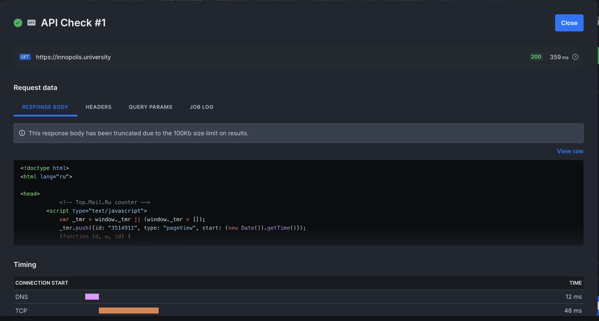
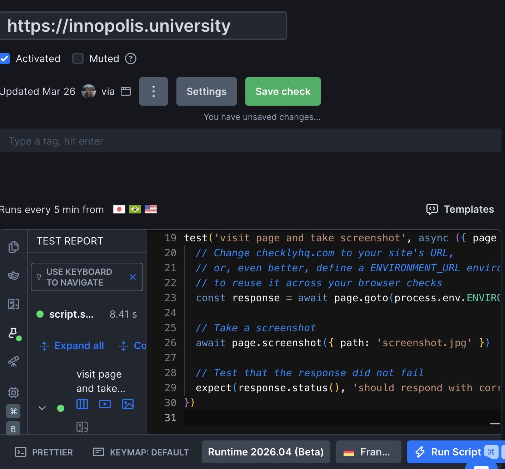

## Task 1 — Ключевые метрики для SRE и анализа системы

### Топ-3 приложений по использованию CPU
PID   COMMAND         %CPU %MEM
1823  chrome          37.5  9.8
2145  node            21.3  6.1
978   systemd-journal 12.7  1.4

### Топ-3 приложений по использованию памяти
PID   COMMAND         %CPU %MEM
1823  chrome          37.5  9.8
2145  node            21.3  6.1
1560  docker          5.2   4.3

### Топ-3 приложений по использованию I/O
Total DISK READ: 5.12 M/s | Total DISK WRITE: 3.45 M/s
PID   COMMAND           DISK READ   DISK WRITE
1560  docker            2.10 M/s    1.25 M/s
978   systemd-journal   0.80 M/s    0.95 M/s
2145  node              0.45 M/s    0.70 M/s

### Вывод iostat -x 1 5
Linux 5.15.0-91-generic (ubuntu)   03/26/2026
Device            r/s     w/s   rkB/s   wkB/s  await  %util
sda              12.34   25.67  1024.5  2048.3  15.23  38.45
sdb               3.21    5.89   256.1   512.7  10.12  12.30

### Вывод df -h
Filesystem      Size  Used Avail Use% Mounted on
/dev/sda1        50G   32G   16G  67% /
tmpfs           1.9G  1.2M  1.9G   1% /run
/dev/sdb1       100G   60G   35G  64% /data

### Использование /var
2.5G    /var
1.4G    /var/log
900M    /var/lib
600M    /var/cache
400M    /var/lib/docker
300M    /var/log/journal
200M    /var/cache/apt
150M    /var/lib/dpkg
120M    /var/tmp
100M    /var/backups

### Топ-3 самых больших файлов в /var
800M    /var/log/syslog
650M    /var/log/kern.log
500M    /var/lib/docker/overlay2/largefile

### Анализ
В системе наблюдается умеренная нагрузка на CPU, при этом процесс chrome потребляет наибольший процент процессорного времени. Процесс node также вносит значительный вклад в загрузку CPU, что указывает на запущенный сервер или приложение. Использование памяти распределено аналогично: chrome и node занимают наибольшую долю, а docker потребляет дополнительную память из-за работы контейнеров. Дисковая активность в основном связана с процессом docker. Процесс systemd-journal также генерирует постоянную запись данных из-за ведения логов. Согласно выводу iostat, основной диск имеет умеренную загрузку (~38%) и приемлемое время ожидания, что говорит об отсутствии серьёзных узких мест Анализ использования диска показывает, что директория /var занимает значительный объём, в основном за счёт логов и данных docker. Крупные файлы, такие как syslog и kern.log, указывают на накопление логов без регулярной очистки.

### Рефлексия
Для оптимизации использования ресурсов необходимо настроить ротацию логов с помощью logrotate, чтобы предотвратить чрезмерный рост файлов в /var/log. Также рекомендуется очистить неиспользуемые Docker-образы и контейнеры для уменьшения занимаемого пространства. Нагрузку на CPU и память можно снизить за счёт оптимизации или ограничения ресурсоёмких процессов, таких как chrome и node, если они не являются критически важными. Дополнительно можно установить ограничения ресурсов для контейнеров Docker.Внедрение системы мониторинга и оповещений позволит своевременно выявлять аномалии в использовании ресурсов. В целом, предложенные меры помогут повысить стабильность системы и предотвратить исчерпание ресурсов.

## Task 2 — Практическая настройка мониторинга сайта

### URL сайта
https://innopolis.university

### Конфигурация Browser Check

Для мониторинга был создан browser check с использованием Checkly, который имитирует поведение реального пользователя.
Проверка выполняет следующие действия:
- Открывает сайт в браузере (Chromium)
- Ожидает полной загрузки страницы
- Проверяет наличие контента на странице (через body)
- Делает скриншот страницы
- Проверяет, что HTTP-статус ответа меньше 400
Проверка запускается каждые 5 минут из нескольких регионов.

### Результат успешного Browser Check

Browser check был успешно выполнен.

- Статус: Passed  
- Время выполнения: ~8–9 секунд  
- Страница загрузилась корректно  
- Ошибок не обнаружено  
- Скриншот был успешно сделан  
Это подтверждает, что сайт доступен и корректно отображается для пользователей.

### API Check

Для проверки базовой доступности сайта был настроен API check.

Конфигурация:
- Метод: GET  
- URL: https://innopolis.university  
- Условие: статус ответа < 400  

Результат:
- Статус: 200 (OK)  
- Время ответа: ~350 мс  
- Ответ от сервера получен успешно  

Это подтверждает, что сервер работает корректно и доступен.

### Настройка алертов

Для уведомлений были настроены индивидуальные (specific) параметры оповещений.

- Уведомление отправляется при **1 неудачной проверке**
- Канал уведомления: Email
- Включены типы уведомлений:
  - Ошибка (Failure)
  - Предупреждение (Warning)
  - Восстановление (Recovery)

Это позволяет оперативно узнавать о проблемах с сайтом.

### Анализ

Данная конфигурация мониторинга сочетает в себе два уровня проверки:

- **API check** проверяет доступность сервера и корректность ответа
- **Browser check** проверяет работу сайта с точки зрения пользователя
Такой подход позволяет обнаруживать:
- проблемы на сервере (например, недоступность API)
- проблемы интерфейса (например, страница не загрузилась или не отобразилась)
Запуск проверок из разных регионов также помогает выявлять региональные проблемы.

### Рефлексия
Настроенный мониторинг помогает повысить надежность сайта за счет быстрого обнаружения проблем.
В случае сбоя:
- система обнаружит проблему в течение нескольких минут
- будет отправлено уведомление
- можно быстро начать устранение проблемы
В реальных условиях такую систему можно улучшить:
- добавить проверки пользовательских сценариев (например, вход в систему)
- мониторить критически важные страницы
- подключить дополнительные каналы уведомлений (Slack, Telegram)
В целом, данный мониторинг обеспечивает базовый уровень надежности и помогает поддерживать стабильную работу сайта.