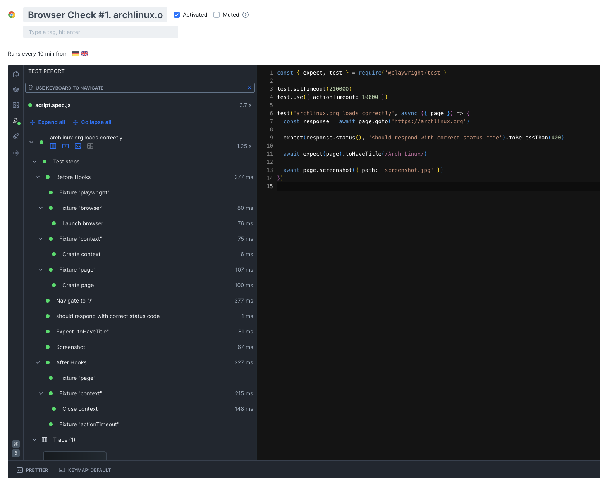
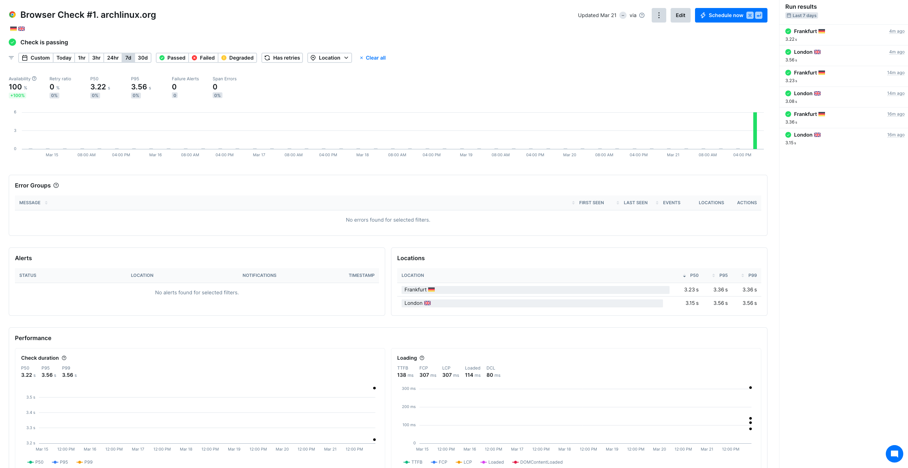
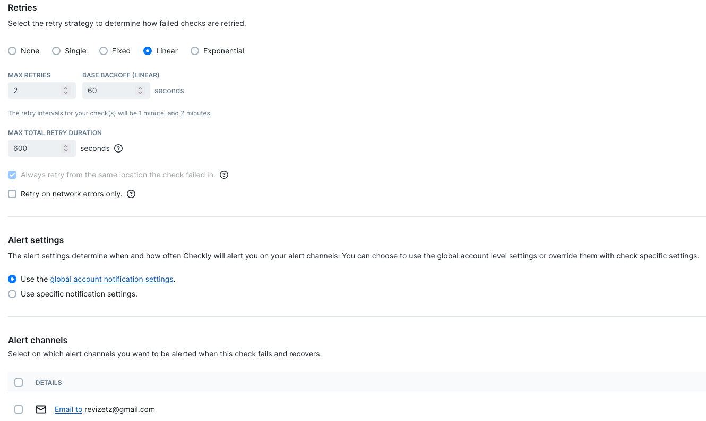
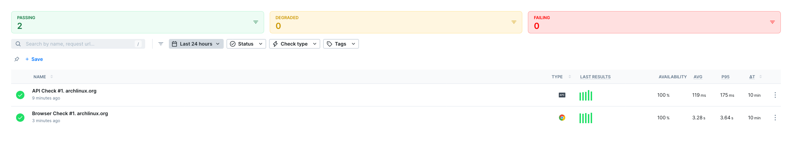

# Lab 8 Submission

All Task 1 commands were run on an Arch Linux ARM VM (UTM, aarch64).

## Task 1 — Key Metrics for SRE and System Analysis

### 1.1 System Resources

#### iostat -x 1 5

<details>
<summary>Output</summary>

```
Linux 6.19.9-1-aarch64-ARCH (alarm) 	03/21/26 	_aarch64_	(4 CPU)

avg-cpu:  %user   %nice %system %iowait  %steal   %idle
           0.07    0.00    0.29    0.03    0.00   99.62

Device             tps    kB_read/s    kB_wrtn/s    kB_dscd/s    kB_read    kB_wrtn    kB_dscd
vda               6.12       233.29       121.46         0.00     150151      78173          0


avg-cpu:  %user   %nice %system %iowait  %steal   %idle
           0.00    0.00    0.25    0.00    0.00   99.75

Device             tps    kB_read/s    kB_wrtn/s    kB_dscd/s    kB_read    kB_wrtn    kB_dscd
vda               0.00         0.00         0.00         0.00          0          0          0


avg-cpu:  %user   %nice %system %iowait  %steal   %idle
           0.00    0.00    0.25    0.00    0.00   99.75

Device             tps    kB_read/s    kB_wrtn/s    kB_dscd/s    kB_read    kB_wrtn    kB_dscd
vda               0.00         0.00         0.00         0.00          0          0          0


avg-cpu:  %user   %nice %system %iowait  %steal   %idle
           0.00    0.00    0.25    0.00    0.00   99.75

Device             tps    kB_read/s    kB_wrtn/s    kB_dscd/s    kB_read    kB_wrtn    kB_dscd
vda               1.98         0.00         7.92         0.00          0          8          0


avg-cpu:  %user   %nice %system %iowait  %steal   %idle
           0.00    0.00    0.00    0.00    0.00  100.00

Device             tps    kB_read/s    kB_wrtn/s    kB_dscd/s    kB_read    kB_wrtn    kB_dscd
vda               0.00         0.00         0.00         0.00          0          0          0

```

</details>

#### top CPU consumers

<details>
<summary>Output</summary>

```
USER         PID %CPU %MEM    VSZ   RSS TTY      STAT START   TIME COMMAND
root           1  0.0  0.7  27112 15416 ?        Ss   18:08   0:01 /usr/lib/systemd/systemd --switched-root --system --deserialize=53
root          49  0.0  0.0      0     0 ?        S<   18:08   0:01 [pr/ttyAMA-1]
root         491  0.0  0.1   6860  3884 ttyAMA0  Ss   18:09   0:00 -bash
```

</details>

#### top memory consumers

<details>
<summary>Output</summary>

```
USER         PID %CPU %MEM    VSZ   RSS TTY      STAT START   TIME COMMAND
root           1  0.0  0.7  27112 15416 ?        Ss   18:08   0:01 /usr/lib/systemd/systemd --switched-root --system --deserialize=53
systemd+     381  0.0  0.7  22628 14328 ?        Ss   18:08   0:00 /usr/lib/systemd/systemd-resolved
root         388  0.0  0.6  42968 13536 ?        Ss   18:08   0:00 /usr/lib/systemd/systemd-udevd
```

</details>

No active I/O consumers were found — the system was idle during monitoring.

### 1.2 Disk Space Management

#### df -h

<details>
<summary>Output</summary>

```
[root@alarm ~]# df -h
Filesystem      Size  Used Avail Use% Mounted on
dev             947M     0  947M   0% /dev
run             986M  772K  985M   1% /run
/dev/vda2       9.4G  1.9G  7.0G  22% /
tmpfs           986M     0  986M   0% /dev/shm
tmpfs           986M     0  986M   0% /tmp
/dev/vda1       200M  200M     0 100% /boot
tmpfs           198M     0  198M   0% /run/user/0
```

</details>

#### Top 3 largest files in /var

<details>
<summary>Output</summary>

```
[root@alarm ~]# find /var -type f -exec du -h {} + | sort -rh | head -n 3
9.9M    /var/lib/pacman/sync/extra.db
8.1M    /var/log/journal/2f2c4095ec5b49cda654fe17d7ec7caa/system@00064d8c0c989deb-ac33e0a820522877.journal~
8.1M    /var/log/journal/2f2c4095ec5b49cda654fe17d7ec7caa/system@0005e987134cc544-0cee454a76a94893.journal~
```

</details>


### Analysis

The system is almost idle — only systemd processes running, no user workloads. The `/boot` partition is 100% full, which would break kernel updates. Largest files in `/var` are the pacman DB and old journal logs.

### Reflection

To optimize vm: clean up `/boot` by removing old kernels, and limit journal size via `journald.conf` to prevent log buildup.

---

## Task 2 — Practical Website Monitoring Setup

*Website url:* https://archlinux.org

### Screenshots of browser check configuration


### Screenshots of successful check results



### Alerting configuration



### Dashboard overview



### Analysis

HTTP status < 400 catches both server errors and redirects to maintenance pages. Title check confirms the right content loaded — not just a 200 from a CDN placeholder. Timeout of 10s is generous enough for a public site, tight enough to detect real slowdowns.

### Reflection

The check runs end-to-end in a real browser, so it catches issues that ping-based monitors miss — broken JS, failed asset loads, DNS misconfigurations. Alerting on failure means incidents get caught before users report them.