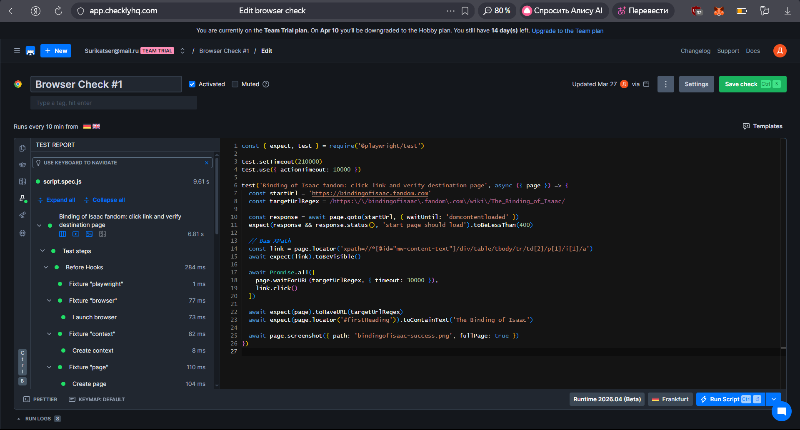
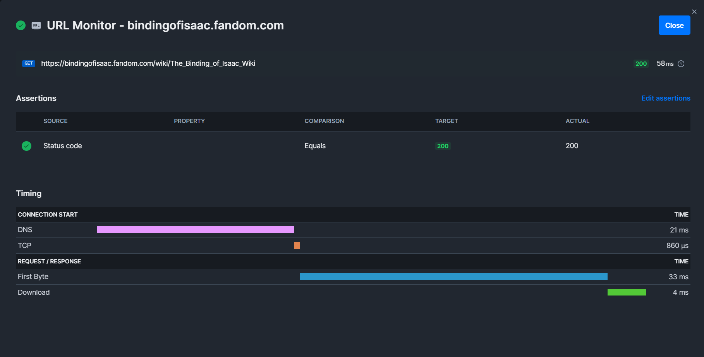
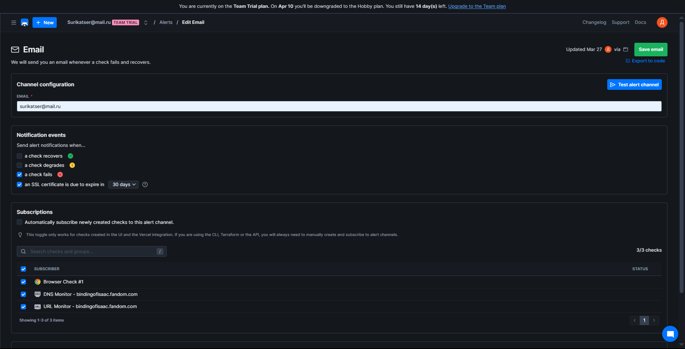
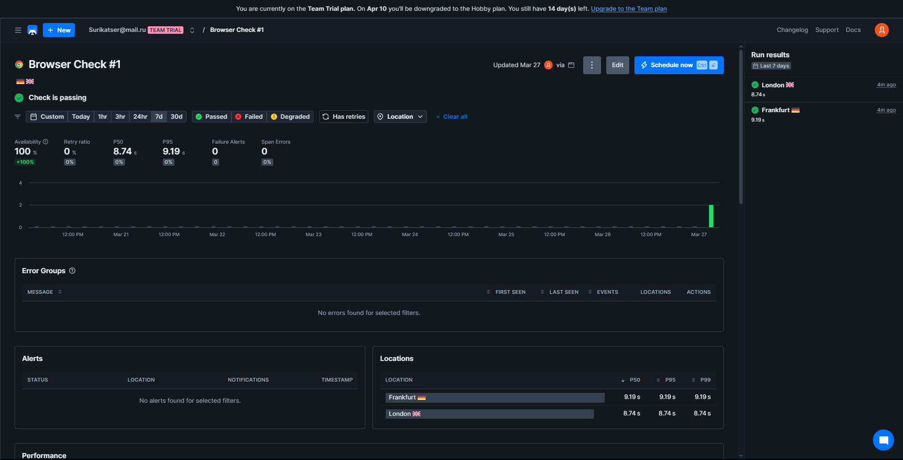

# Submission 8 - Site Reliability Engineering (SRE)

## Task 1 - Key Metrics for SRE and System Analysis

### 1.1 Commands and resource outputs

```bash
htop
iostat -x 1 5
ps -eo comm,%cpu --sort=-%cpu | head -n 4
ps -eo comm,%mem --sort=-%mem | head -n 4
pidstat -d 1 5
```

Top 3 CPU consumers:

```text
COMMAND         %CPU
ps               100
gnome-shell      3.3
gnome-terminal-  0.6
```

Top 3 memory consumers:

```text
COMMAND         %MEM
gnome-shell      6.4
mutter-x11-fram  1.7
dockerd          1.4
```

Top I/O consumers (`pidstat -d`, with short synthetic write load):

```text
Average:      UID   PID   kB_rd/s   kB_wr/s   Command
Average:     1000  3178     14.31  52116.10   bash
```

`iostat -x 1 5` snippet:

```text
avg-cpu:  %user   %nice %system %iowait  %steal   %idle
           0.82    0.20    2.35    0.38    0.00   96.25

Device            r/s     rkB/s     w/s     wkB/s  aqu-sz  %util
sda             13.76   1255.08    3.39    474.97    0.03   1.58
```

### 1.2 Disk space management outputs

```bash
df -h
du -h /var | sort -rh | head -n 10
sudo find /var -type f -exec du -h {} + | sort -rh | head -n 3
```

`df -h` snippet:

```text
Filesystem      Size  Used Avail Use% Mounted on
/dev/sda2        30G   13G   16G  44% /
```

Top `/var` entries:

```text
2.8G    /var
2.5G    /var/lib
2.2G    /var/lib/snapd
```

Top 3 largest files in `/var`:

```text
607M    /var/lib/snapd/cache/6b8f0b8920d12519d7c5e677950a231810fa253e34962f312b3dfa58af9d91eeab9d5c1b3483cf0da6df66f23f3f5f8d
532M    /var/lib/snapd/seed/snaps/gnome-42-2204_247.snap
395M    /var/lib/snapd/cache/651a6f21a71dfa0a5303df4e7e5661ba7a9213d5177cdc99ae3f0a1798e47bd6ee4b3805063e8f86da1f7b1b8ce9eacb
```

- CPU and disk were mostly idle during normal sampling.
- Main memory consumers were desktop services and `dockerd`.
- `/var` usage is mostly Snap data and caches.


## Task 2 - Practical Website Monitoring Setup

### 2.1 Website

- URL: `https://bindingofisaac.fandom.com`

### 2.2 Checkly configuration

API check:

- URL: `https://bindingofisaac.fandom.com/wiki/The_Binding_of_Isaac_Wiki`
- Assertion: status code `200`
- Frequency: every 10 minutes

Browser check:

- Start URL: `https://bindingofisaac.fandom.com`
- Validate XPath element is visible: `//*[@id="mw-content-text"]/div/table/tbody/tr/td[2]/p[1]/i[1]/a`
- Click link and verify final URL: `https://bindingofisaac.fandom.com/wiki/The_Binding_of_Isaac`
- Verify `#firstHeading` contains `The Binding of Isaac`
- Timeout settings: `actionTimeout=10000ms`, URL wait timeout `30000ms`, test timeout `210000ms`

Alerts:

- Notification channel: Email (`surikatser@mail.ru`)
- Triggers: `a check fails`, `an SSL certificate is due to expire in 30 days`

### 2.3 Proof (screenshots)

Browser check configuration:



Successful check result:



Alert settings:



Dashboard overview:




- API check gives fast uptime validation.
- Browser check validates real user interaction and navigation logic.
- Failure + SSL-expiry alerts cover immediate incidents and preventive maintenance.

