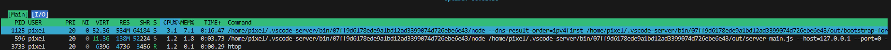
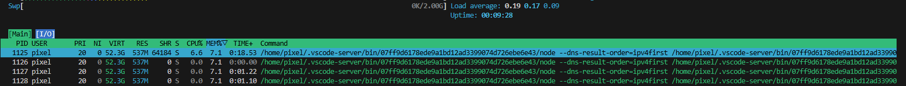
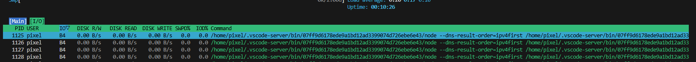
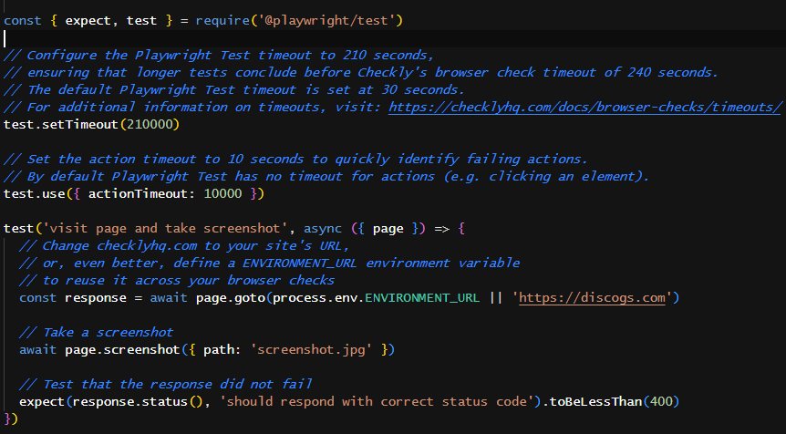
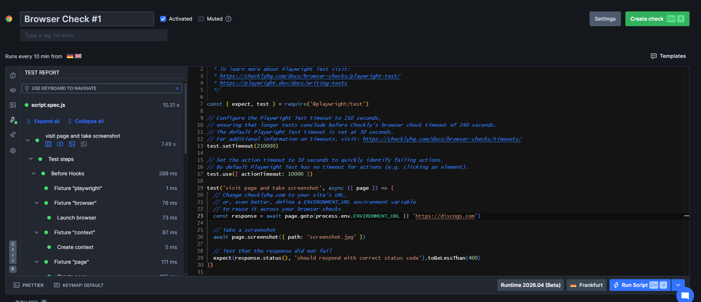
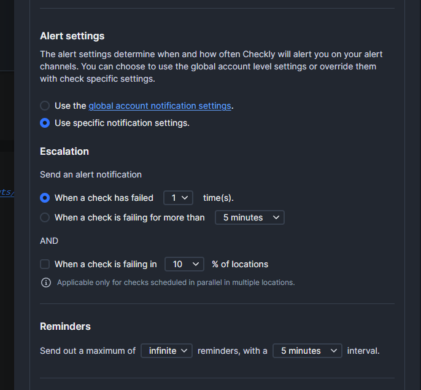

# Lab 8 — Site Reliability Engineering (SRE)

## Task 1 — Key Metrics for SRE and System Analysis

### Top 3 most consuming applications for CPU, memory, and I/O usage
CPU:


Memory:


I/O (all zeros ):


### Command outputs showing resource consumption
```sh
pixel@pixelbook:~/DevOps-Intro$ iostat -x 1 5

Linux 6.6.87.1-microsoft-standard-WSL2 (pixelbook)      03/21/26        _x86_64_        (12 CPU)

avg-cpu:  %user   %nice %system %iowait  %steal   %idle
           0.60    0.00    0.79    0.18    0.00   98.43

Device            r/s     rkB/s   rrqm/s  %rrqm r_await rareq-sz     w/s     wkB/s   wrqm/s  %wrqm w_await wareq-sz     d/s     dkB/s   drqm/s  %drqm d_await dareq-sz     f/s f_await  aqu-sz  %util
sda              2.88    186.32     1.08  27.26    0.36    64.58    0.00      0.00     0.00   0.00    0.00     0.00    0.00      0.00     0.00   0.00    0.00     0.00    0.00    0.00    0.00   0.09
sdb              0.41     18.08     0.17  29.87    0.35    44.30    0.00      0.00     0.00   0.00    0.00     0.00    0.00      0.00     0.00   0.00    0.00     0.00    0.00    0.00    0.00   0.01
sdc              0.23      4.63     0.00   0.00    0.08    19.74    0.01      0.01     0.00   0.00    3.00     2.00    0.00      0.00     0.00   0.00    0.00     0.00    0.00    3.00    0.00   0.00
sdd             37.32   1667.36    15.05  28.73    0.40    44.68    6.92    368.75    14.12  67.13   16.68    53.32    0.76   3683.02     0.14  15.41    0.21  4840.24    1.65    1.25    0.13   2.14
```

```sh
pixel@pixelbook:~/DevOps-Intro$ df -h

Filesystem      Size  Used Avail Use% Mounted on
none            3.7G     0  3.7G   0% /usr/lib/modules/6.6.87.1-microsoft-standard-WSL2
none            3.7G  4.0K  3.7G   1% /mnt/wsl
drivers         477G  311G  166G  66% /usr/lib/wsl/drivers
/dev/sdd       1007G  8.2G  948G   1% /
none            3.7G   84K  3.7G   1% /mnt/wslg
none            3.7G     0  3.7G   0% /usr/lib/wsl/lib
rootfs          3.7G  2.7M  3.7G   1% /init
none            3.7G  556K  3.7G   1% /run
none            3.7G     0  3.7G   0% /run/lock
none            3.7G     0  3.7G   0% /run/shm
none            3.7G  100K  3.7G   1% /mnt/wslg/versions.txt
none            3.7G  100K  3.7G   1% /mnt/wslg/doc
C:\             477G  311G  166G  66% /mnt/c
tmpfs           3.7G     0  3.7G   0% /tmp
tmpfs           1.0M     0  1.0M   0% /run/credentials/systemd-journald.service
tmpfs           1.0M     0  1.0M   0% /run/credentials/systemd-resolved.service
tmpfs           1.0M     0  1.0M   0% /run/credentials/getty@tty1.service
tmpfs           1.0M     0  1.0M   0% /run/credentials/console-getty.service
tmpfs           3.7G   12K  3.7G   1% /run/user/1000
```

```sh
pixel@pixelbook:~/DevOps-Intro$ du -h /var | sort -rh | head -n 10

du: cannot read directory '/var/spool/cron/crontabs': Permission denied
du: cannot read directory '/var/spool/rsyslog': Permission denied
du: cannot read directory '/var/lib/private': Permission denied
du: cannot read directory '/var/lib/containerd': Permission denied
du: cannot read directory '/var/lib/apt/lists/partial': Permission denied
du: cannot read directory '/var/lib/snapd/void': Permission denied
du: cannot read directory '/var/lib/snapd/cookie': Permission denied
du: cannot read directory '/var/lib/docker': Permission denied
du: cannot read directory '/var/log/private': Permission denied
du: cannot read directory '/var/tmp/systemd-private-62c8debaefd4435f8d36709e1c46bd0b-polkit.service-la9Nno': Permission denied
du: cannot read directory '/var/tmp/systemd-private-62c8debaefd4435f8d36709e1c46bd0b-systemd-logind.service-Pgjdgn': Permission denied
du: cannot read directory '/var/cache/private': Permission denied
du: cannot read directory '/var/cache/apt/archives/partial': Permission denied
du: cannot read directory '/var/cache/ldconfig': Permission denied
895M    /var
453M    /var/log
443M    /var/log/journal/73083758aa934a60a12afbc03de18993
443M    /var/log/journal
270M    /var/cache
252M    /var/cache/apt
170M    /var/lib
154M    /var/cache/apt/archives
135M    /var/lib/apt/lists
135M    /var/lib/apt
```

### Top 3 largest files in the `/var` directory
```sh
pixel@pixelbook:~/DevOps-Intro$ sudo find /var -type f -exec du -h {} + | sort -rh | head -n 3

72M     /var/lib/apt/lists/archive.ubuntu.com_ubuntu_dists_questing_universe_binary-amd64_Packages
50M     /var/cache/apt/srcpkgcache.bin
50M     /var/cache/apt/pkgcache.bin
```

### Analysis: What patterns do you observe in resource utilization?
Current System Pattern:
- CPU: Idle
- Disk I/O: Light, mostly reads
- Disk usage: Very low
- Hotspots:
    - systemd journal logs
    - apt caches

### Reflection: How would you optimize resource usage based on your findings?
- Limit logs: Biggest usage is system logs (~443 MB). Set a size cap so they don’t keep growing.
- Clean APT cache: Package lists and cache take ~400 MB. Safe to clean regularly (apt clean).
- Watch hidden storage: Docker/container folders could grow later—check them occasionally.
- Reduce unnecessary writes: Logs are the main source; limiting them helps disk performance.
- No need for performance tuning: CPU and disk usage are already very low.
- Add simple monitoring: Tools like htop or ncdu help catch issues early.
Focus on cleanup and limits (logs + cache), not performance fixes.

## Task 2 — Practical Website Monitoring Setup

### Website URL you chose to monitor
'https://www.discogs.com/'

### Screenshots of browser check configuration


### Screenshots of successful check results


### Screenshots of alert settings


### Analysis: Why did you choose these specific checks and thresholds?
Standard settings, pretty useful. Alerts every 5 minutes if website is down.

### Reflection: How does this monitoring setup help maintain website reliability?
We would know about outage nearly immediatly, so we can fix.