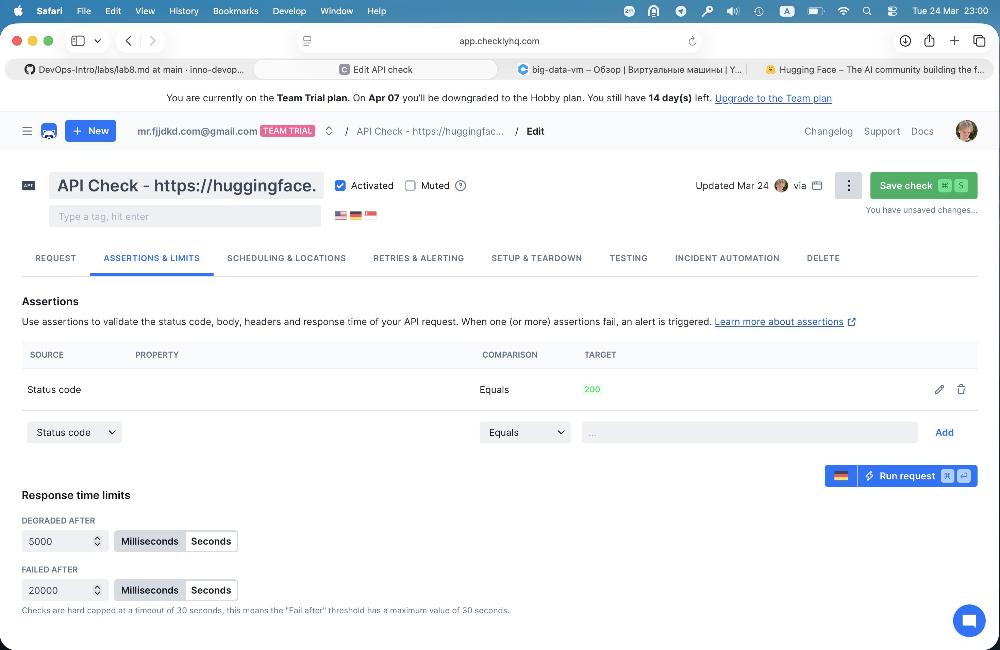
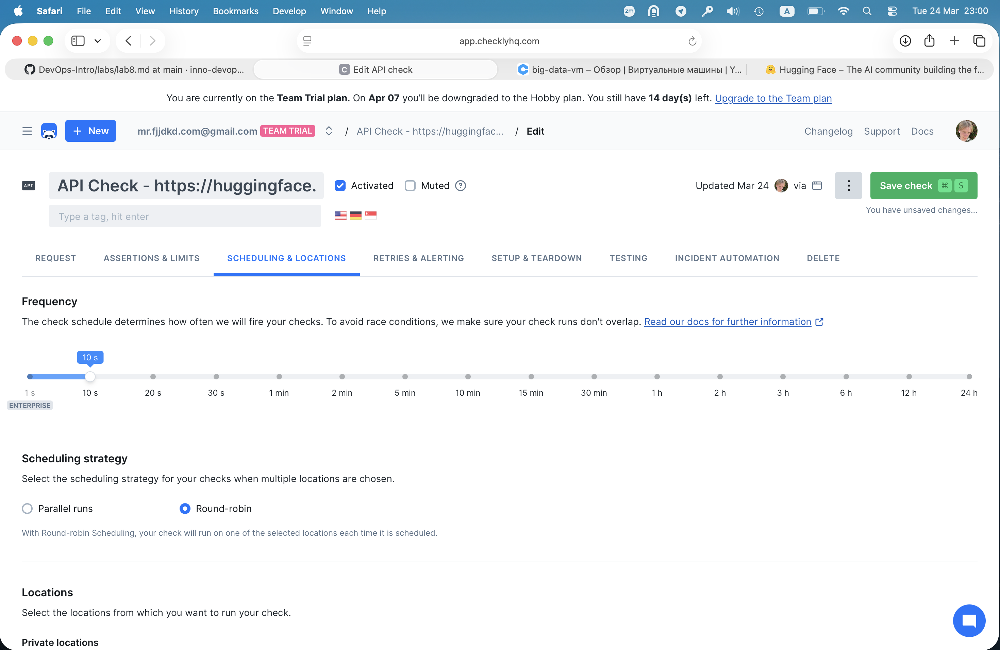
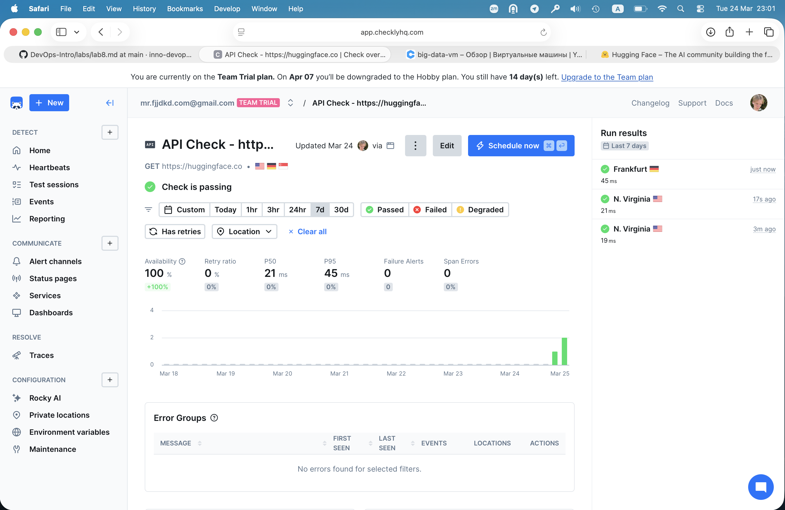
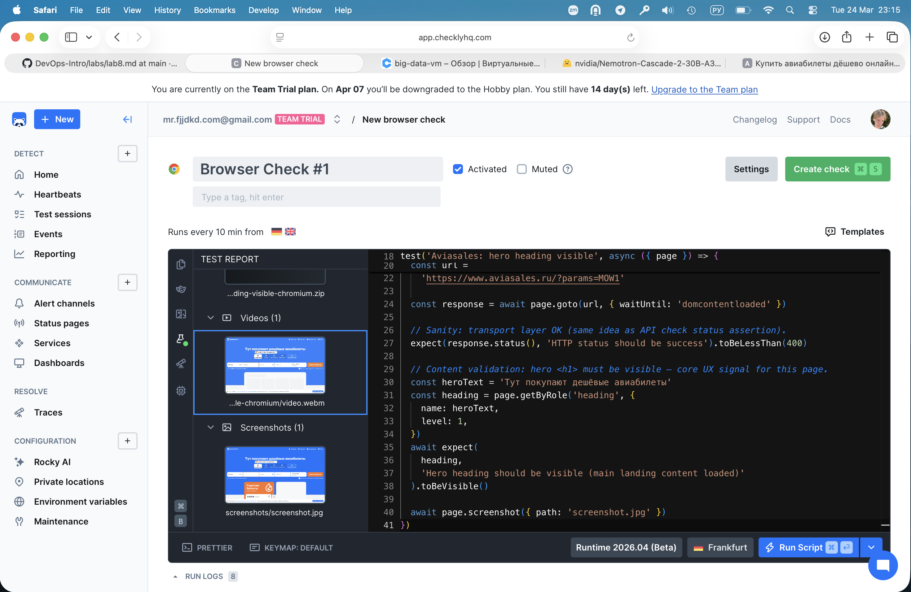
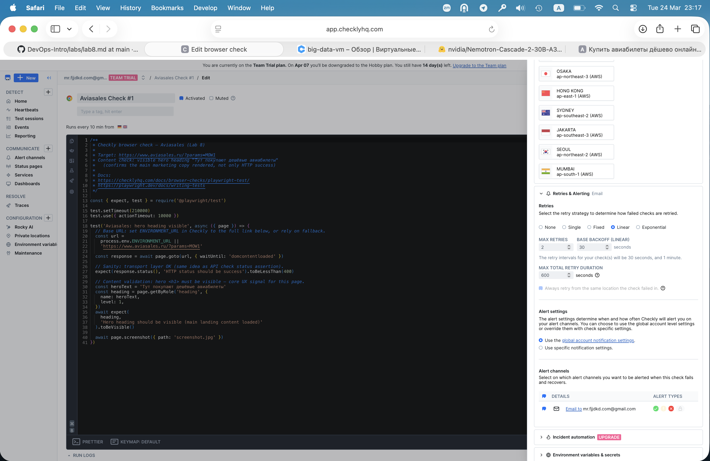
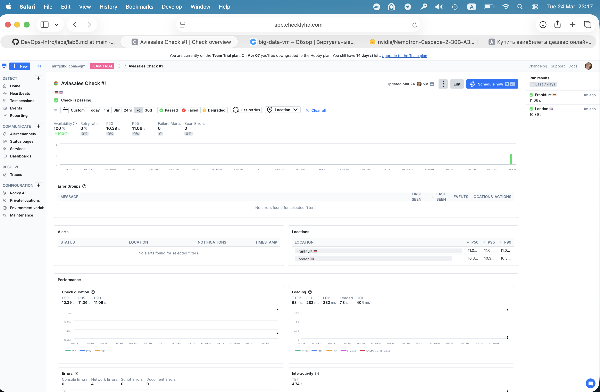

# Task 1 — System metrics

Commands were run on `big-data-vm` (8 vCPUs, ~31 GB RAM). Same shell session as in the log below.

```
chrnegor@big-data-vm:~$ htop

  1  [                          0.0%]   5  [                          0.0%]
  2  [                          0.0%]   6  [                          0.0%]
  3  [                          0.0%]   7  [||||||||||||||||||||||||100.0%]
  4  [                          0.0%]   8  [                          0.0%]
  Mem[|||||||||||||||||||18.3G/31.3G]   Tasks: 45, 374 thr; 1 running
  Swp[                         0K/0K]   Load average: 0.07 0.04 0.01 
                                        Uptime: 1 day, 01:26:15

    PID USER      PRI  NI  VIRT   RES   SHR S CPU% MEM%   TIME+  Command
      1 root       20   0  165M 12916  8520 S  0.0  0.0  0:04.44 /sbin/init
    406 root       19  -1 60336 24728 23592 S  0.0  0.1  0:02.10 /lib/systemd/sy
    439 root       20   0 20316  6020  4020 S  0.0  0.0  0:00.90 /lib/systemd/sy
    531 root       RT   0  209M 17948  8208 S  0.0  0.1  0:00.53 /sbin/multipath
    532 root       RT   0  209M 17948  8208 S  0.0  0.0  0:00.00 /sbin/multipath
    533 root       RT   0  209M 17948  8208 S  0.0  0.1  0:00.08 /sbin/multipath
    534 root       RT   0  209M 17948  8208 S  0.0  0.1  0:03.84 /sbin/multipath
    535 root       RT   0  209M 17948  8208 S  0.0  0.1  0:00.00 /sbin/multipath
    536 root       RT   0  209M 17948  8208 S  0.0  0.1  0:00.00 /sbin/multipath
    530 root       RT   0  209M 17948  8208 S  0.0  0.1  0:07.91 /sbin/multipath
    565 systemd-t  20   0 90888  6036  5260 S  0.0  0.0  0:00.00 /lib/systemd/sy
    563 systemd-t  20   0 90888  6036  5260 S  0.0  0.0  0:00.16 /lib/systemd/sy
    618 systemd-r  20   0 25616 13988  8968 S  0.0  0.0  0:08.34 /lib/systemd/sy
F1Help  F2Setup F3SearchF4FilterF5Tree  F6SortByF7Nice -F8Nice +F9Kill  F10Quit


chrnegor@big-data-vm:~$ iostat -x 1 5
Linux 5.4.0-216-generic (big-data-vm) 	03/24/26 	_x86_64_	(8 CPU)

avg-cpu:  %user   %nice %system %iowait  %steal   %idle
           0.29    0.00    0.39    0.05    0.01   99.27

Device            r/s     rkB/s   rrqm/s  %rrqm r_await rareq-sz     w/s     wkB/s   wrqm/s  %wrqm w_await wareq-sz     d/s     dkB/s   drqm/s  %drqm d_await dareq-sz  aqu-sz  %util
vda              0.17      8.93     0.04  21.01   12.55    53.30    0.74     15.12     0.49  39.95   10.75    20.39    0.00      0.00     0.00   0.00    0.00     0.00    0.01   0.19
vdb              0.54     24.29     0.08  13.35    1.59    44.59    1.24     50.05     1.05  45.87    3.37    40.46    0.00      0.00     0.00   0.00    0.00     0.00    0.00   0.33

chrnegor@big-data-vm:~$ df -h
Filesystem      Size  Used Avail Use% Mounted on
udev             16G     0   16G   0% /dev
tmpfs           3.2G  1.3M  3.2G   1% /run
/dev/vda1        19G  7.4G   12G  40% /
tmpfs            16G     0   16G   0% /dev/shm
tmpfs           5.0M     0  5.0M   0% /run/lock
tmpfs            16G     0   16G   0% /sys/fs/cgroup
/dev/vda15      599M  6.1M  593M   2% /boot/efi
/dev/vdb1       194G   14G  181G   7% /mnt/data
tmpfs           3.2G     0  3.2G   0% /run/user/1000

chrnegor@big-data-vm:~$ sudo du -h /var | sort -rh | head -n 10

12G	/var
11G	/var/lib/docker/overlay2
11G	/var/lib/docker
11G	/var/lib
5.1G	/var/lib/docker/overlay2/6495a703f913dbec5887ded2fdcbe8c679c6b5cd71e4ea472c916ee9d64a5f85
3.9G	/var/lib/docker/overlay2/6495a703f913dbec5887ded2fdcbe8c679c6b5cd71e4ea472c916ee9d64a5f85/merged/usr
3.9G	/var/lib/docker/overlay2/6495a703f913dbec5887ded2fdcbe8c679c6b5cd71e4ea472c916ee9d64a5f85/merged
2.9G	/var/lib/docker/overlay2/6495a703f913dbec5887ded2fdcbe8c679c6b5cd71e4ea472c916ee9d64a5f85/merged/usr/local
2.5G	/var/lib/docker/overlay2/6495a703f913dbec5887ded2fdcbe8c679c6b5cd71e4ea472c916ee9d64a5f85/merged/usr/local/hadoop
1.3G	/var/lib/docker/overlay2/8cfbf33d8510e9065e24ff6bc42c0379460798bb34e66eeef81af425e0e5e1c1/diff/usr/local/hadoop
chrnegor@big-data-vm:~$ sudo find /var -type f -exec du -h {} + | sort -rh | head -n 3
383M	/var/lib/docker/overlay2/c1ee043002554aa24a18ded845596c1b859f49677ae44df395bdabc99e776ac7/diff/spark.tar.gz
184M	/var/lib/docker/overlay2/8cfbf33d8510e9065e24ff6bc42c0379460798bb34e66eeef81af425e0e5e1c1/diff/usr/local/hadoop/share/hadoop/tools/lib/aws-java-sdk-bundle-1.11.901.jar
184M	/var/lib/docker/overlay2/6495a703f913dbec5887ded2fdcbe8c679c6b5cd71e4ea472c916ee9d64a5f85/merged/usr/local/hadoop/share/hadoop/tools/lib/aws-java-sdk-bundle-1.11.901.jar
chrnegor@big-data-vm:~$ 
```

What stood out from the tools:

- CPU: load average was low and almost every line in the htop screenshot is at 0% CPU. One core briefly showed full utilisation on the bar graph but the process list didn’t scroll to whatever caused it — typical for an idle VM with a short spike.

- Memory: ~18 GB in use out of 31 GB. Among the processes that were visible, the largest RSS values were systemd (pid 406), several multipathd threads (~17 MB each), and systemd-resolved (618).

- I/O: `iostat` is per disk, not per process. `vdb` had slightly higher read/write throughput than `vda` in the first sample; after that both disks were basically quiet with near-zero `%util`.

Largest files under `/var` from `find`: `spark.tar.gz` (~383 MB) and two ~184 MB `aws-java-sdk-bundle` jars under Docker overlay paths. Most of `/var` is Docker image layers (Hadoop/Spark related).

## Analysis

The machine wasn’t under stress: high `%idle`, low load, no swap. Disk activity was minimal in the window I captured. `/var` growth is almost entirely `overlay2`, which matches a host that runs big-data containers.

## Reflection

If `/var` keeps growing I’d prune unused Docker data (`docker system prune` and similar) and delete old images I don’t need. For a deeper CPU investigation next time I’d sort htop by CPU % or run `pidstat` while something is actually busy. For I/O troubleshooting I’d watch `%iowait` and map `vda` / `vdb` to mounts (root vs `/mnt/data` here).

# Task 2

I used Checkly with two targets: an API check on `https://huggingface.co` (simple availability) and a separate browser check on Aviasales for content on the page.

## API check (Hugging Face)

For the API check I pointed the request at the Hugging Face homepage and added an assertion that the response status code equals 200.



I set the run interval to every 10 seconds.



On the checks list / request view everything looked healthy after the runs.



## Browser check (Aviasales)

For the browser check I used a Playwright script against `https://www.aviasales.ru/?params=MOW1`. Besides checking that the HTTP response is OK, it waits for the main hero heading text “Тут покупают дешёвые авиабилеты” so we know the real page content rendered, not only a blank or error page with a 200.

```javascript
/**
 * Checkly browser check — Aviasales
 * URL: https://www.aviasales.ru/?params=MOW1
 * Assert: visible h1 "Тут покупают дешёвые авиабилеты"
 */
const { expect, test } = require('@playwright/test')

test.setTimeout(210000)
test.use({ actionTimeout: 10000 })

test('Aviasales: hero heading visible', async ({ page }) => {
  const url =
    process.env.ENVIRONMENT_URL ||
    'https://www.aviasales.ru/?params=MOW1'

  const response = await page.goto(url, { waitUntil: 'domcontentloaded' })
  expect(response.status(), 'HTTP status should be success').toBeLessThan(400)

  const heading = page.getByRole('heading', {
    name: 'Тут покупают дешёвые авиабилеты',
    level: 1,
  })
  await expect(heading, 'Hero heading visible').toBeVisible()
  await page.screenshot({ path: 'screenshot.jpg' })
})
```

The run completed successfully (screenshot below).



## Alerts

I configured email alerts so I get email notification when something breaks instead of having to open Checkly every time.



## Dashboard

Overall dashboard view with the checks and recent status:



## Analysis

Hugging Face was a good fit for the API check: the main URL is stable, returns 200 when the service is up, and 10s frequency is a reasonable balance between fast feedback and load.

Aviasales is a different kind of check: the same status code could still hide a broken UI, so asserting on the visible heading adds a layer that is closer to what a user sees.

## Reflection

Having both an API check and a browser check plus email alerts means I get early warning on outages and on “looks broken but HTTP is fine” cases. That is basically what SRE-style monitoring is about: know when users are impacted and react before they all complain.