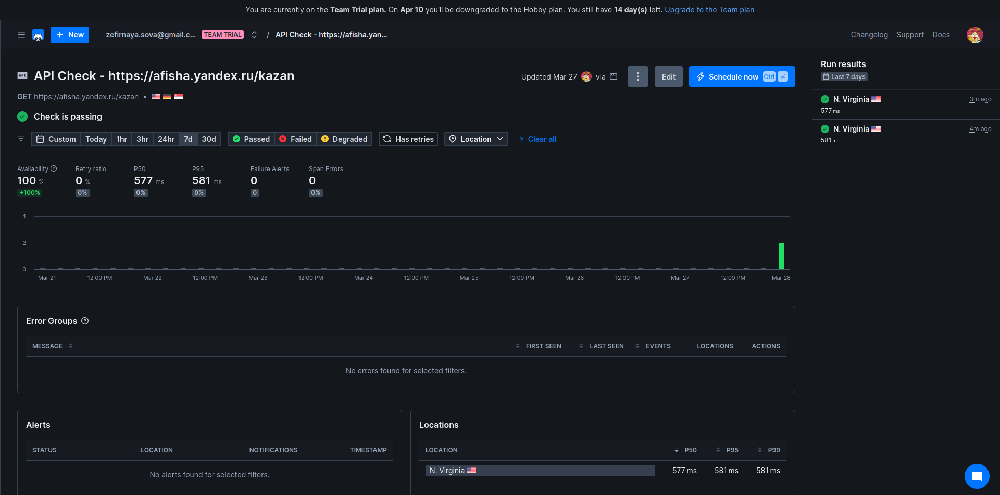
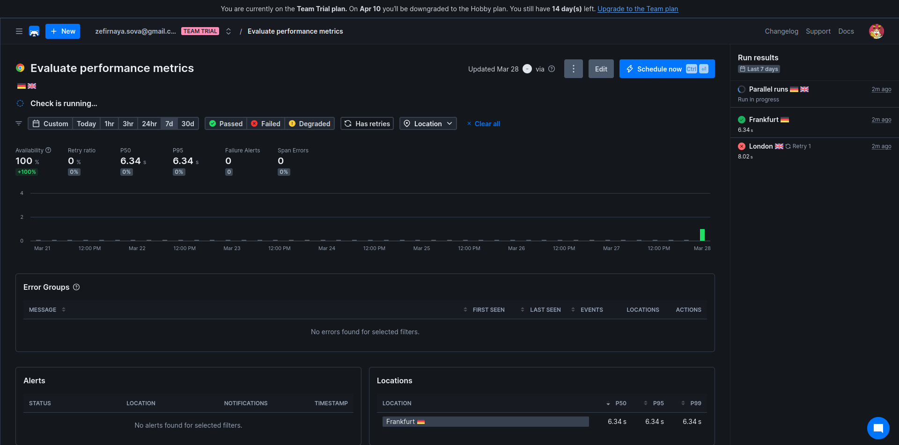
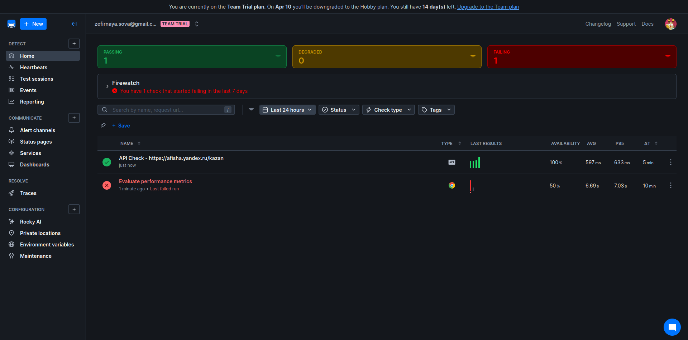

# Lab 8 — Site Reliability Engineering (SRE)

## Task 1 — Key Metrics for SRE and System Analysis

### Top 3 most consuming applications for CPU

1. `firefox` &mdash; 15.0% CPU
2. `htop` &mdash; 3.3% CPU
3. `gnome-shell` &mdash; 2.9% CPU

### Top 3 most consuming applications for memory

1. `firefox` &mdash; 4.2% memory
2. `telegram-desktop` &mdash; 3.0% memory
3. `code` &mdash; 2.6% memory

### Top 3 most consuming applications for I/O rate

1. `pipewire`
2. `code`
3. `firefox`

### Disk Space Management

```bash
thallars@ASUS-TUF:~/Documents/DevOps-Intro$ df -h
Filesystem      Size  Used Avail Use% Mounted on
tmpfs           1.6G  3.1M  1.6G   1% /run
/dev/nvme0n1p3  234G  151G   72G  68% /
tmpfs           7.7G   79M  7.6G   2% /dev/shm
tmpfs           5.0M   16K  5.0M   1% /run/lock
efivarfs        192K  100K   88K  54% /sys/firmware/efi/efivars
/dev/nvme0n1p1  142M   38M  105M  27% /boot/efi
tmpfs           1.6G  148K  1.6G   1% /run/user/1000
```

#### Top 3 largest files in the `/var` directory

```bash
thallars@ASUS-TUF:~/Documents/DevOps-Intro$ du -h /var | sort -rh | head -n 10
8.7G    /var
7.6G    /var/lib
7.1G    /var/lib/snapd
```

```bash
thallars@ASUS-TUF:~/Documents/DevOps-Intro$ sudo find /var -type f -exec du -h {} + | sort -rh | head -n 3
1.1G	/var/lib/docker/overlay2/71ad0a42ffbf0623874991bacebe042ca65a88faeb14b71e3e94efaf95b056e9/diff/usr/local/cuda-12.9/targets/x86_64-linux/lib/libcublasLt_static.a
1.1G	/var/lib/docker/overlay2/19088371ce55893caa23479afc49e69e5f2a666da70129ca667ad25bd244f57e/diff/opt/conda/pkgs/pytorch-1.8.1-py3.7_cuda10.2_cudnn7.6.5_0/lib/python3.7/site-packages/torch/lib/libtorch_cuda.so
1.1G	/var/lib/docker/overlay2/19088371ce55893caa23479afc49e69e5f2a666da70129ca667ad25bd244f57e/diff/opt/conda/lib/python3.7/site-packages/torch/lib/libtorch_cuda.so
```

### Analysis: What patterns do you observe in resource utilization?

**CPU:** Firefox dominates CPU usage at 15%, while other applications show normal background activity levels.

**Memory:** Firefox again leads memory consumption, followed by Telegram Desktop and VS Code—all typical desktop applications with moderate memory footprints.

**I/O:** Pipewire (audio server), VS Code, and Firefox show the highest I/O activity, likely due to real-time audio processing, file indexing/writes, and browser cache operations respectively.

**Disk Space:** The `/var` directory consumes 8.7GB, with `/var/lib/snapd` (7.1GB) and Docker overlay2 layers (1.1GB each) being the primary storage consumers, indicating significant Snap package and Docker container overhead.

### Reflection: How would you optimize resource usage based on your findings?

**CPU/Memory:** Close unnecessary Firefox tabs.

**I/O:** Configure VS Code to minimize auto-save frequency.

**Disk Space:** Clean Snap package versions, prune unused Docker artifacts.

## Task 2 — Practical Website Monitoring Setup

### Website URL

`https://afisha.yandex.ru/kazan`

### API Check



### Browser Check &mdash; Performance Metriccs 



### Dashboard

