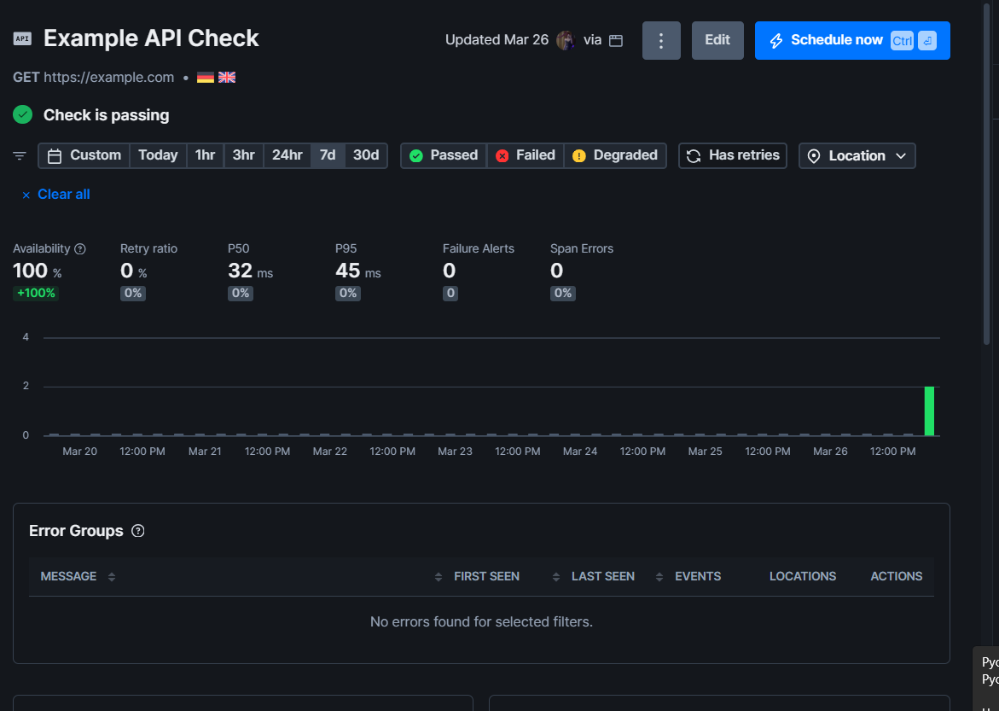
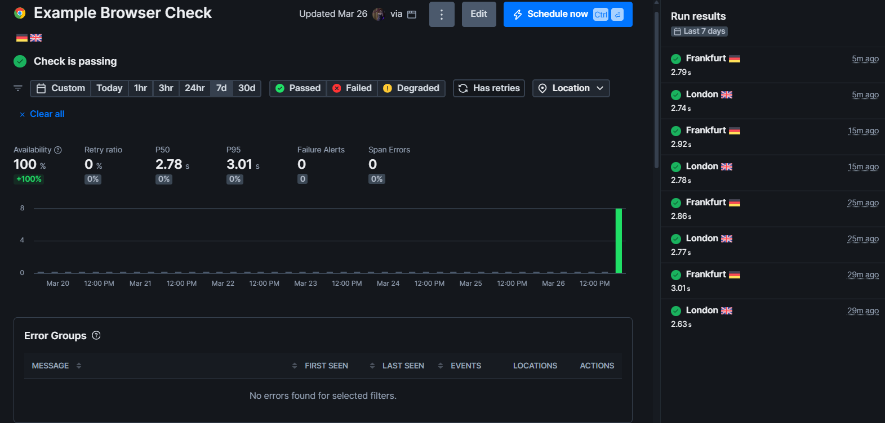

# Task 1 

## 1) Top 3 most consuming applications for CPU, memory, and I/O usage

CPU:

* process (PID 4237) — 4.7%
* systemd (PID 348) — 0.7%
* process (PID 1378) — 0.7%

Memory:

* process (PID 2384) — 9.1%
* root process (PID 1378) — 1.2%
* root process (PID 243) — 0.5%

I/O:

* snapd (PID 4955) — WRITE: 1289.68 K/s
* snapd (PID 836) — WRITE: 528.81 K/s
* snapd (PID 3453) — WRITE: 277.72 K/s

---

## 2) Command outputs showing resource consumption

htop:

```bash
htop
```

Observation:

* System is mostly idle
* CPU load is low
* One process uses noticeable memory (~9%)

iostat:

```bash
iostat -x 1 5
```

Observation:

* Main disk: sda
* Peak utilization ~6–7%, mostly near 0%
* Disk activity is low

iotop:

```bash
sudo iotop -o
```

Observation:

* I/O activity is generated by snapd
* Mostly write operations

df:

```bash
df -h
```

Output:

```bash
/dev/sda2        25G   12G   13G  49% /
```

---

## 3) Top 3 largest files in the /var directory

```bash
sudo find /var -type f -exec du -h {} + | sort -rh | head -n 3
```

* 532M /var/lib/snapd/snaps/gnome-42-2204_247.snap
* 326M /var/lib/snapd/snaps/mesa-2404_1165.snap.partial
* 252M /var/lib/snapd/snaps/firefox_7766.snap

---

## 4) Analysis: What patterns do you observe in resource utilization?

* The system is mostly idle with low CPU usage
* Memory usage is stable with one dominant process
* Disk I/O is minimal and mostly caused by snapd
* Most disk space in /var is used by snap packages
* Cache and docker data also contribute to disk usage

---

## 5) Reflection: How would you optimize resource usage based on your findings?

* Remove unused snap packages to free disk space
* Clean apt cache: sudo apt clean
* Remove unused Docker data: docker system prune
* Monitor background services like snapd
* Regularly clean logs in /var/log

---
# Task 2 

## 1) Website URL you chose to monitor

https://example.com

---

## 2) Screenshots of browser check configuration


---

## 3) Screenshots of successful check results





---

## 4) Screenshots of alert settings


---

## 5) Analysis: Why did you choose these specific checks and thresholds?

I chose example.com because it is a stable and publicly available website suitable for monitoring.

The API check verifies basic availability of the website by ensuring that the server responds with HTTP status code 200. This helps confirm that the backend is reachable.

The browser check validates that the page loads correctly and that the expected content ("Example Domain") is visible. This simulates a real user experience and ensures that not only the server is up, but the content is rendered properly.

The alert is configured to trigger immediately when a check fails. This allows fast detection of issues such as downtime or broken content.

---

## 6) Reflection: How does this monitoring setup help maintain website reliability?

This monitoring setup provides both technical and user-level validation.

API checks ensure that the system is available at the network level, while browser checks confirm that the website works correctly from a user perspective.

Alerts enable quick reaction to failures, reducing downtime and helping maintain high reliability and availability of the service.