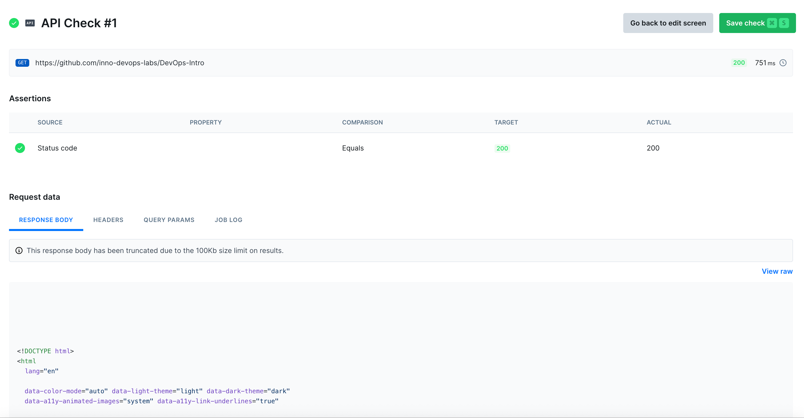
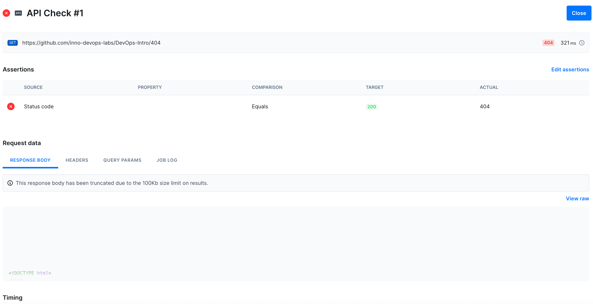
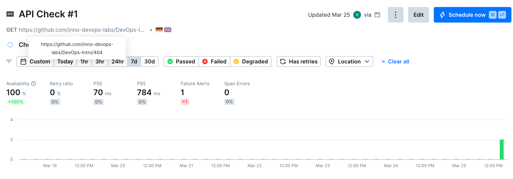

## Task 1 — Key Metrics for SRE and System Analysis

### 1.1 System Resource Monitoring

Since I am using macOS instead of Linux, I used equivalent macOS tools (`top`, `ps`, `vm_stat`, `iostat`, `fs_usage`) to collect system metrics.

#### Commands used

```bash
top -l 1 | head -n 25
ps aux | sort -nrk 3 | head -n 10
ps aux | sort -nrk 4 | head -n 10
vm_stat
iostat -d 1 5
sudo fs_usage -w -f filesystem | head -n 50
```

### Top 3 CPU-consuming applications
- PerfPowerServices — 8.5% CPU
- WindowServer — 4.2% CPU
- Visual Studio Code Helper (Renderer) — 3.2% CPU

### Top 3 memory-consuming applications
- Telegram — 7.1% MEM
- Yandex Helper (Renderer) — 2.1% MEM
- Yandex — 2.1% MEM

### I/O-heavy processes observed

Based on fs_usage, the most noticeable filesystem activity was associated with:

`logd / logd_helper`
`tailspind`
`osqueryd / JamfDaemon`

These processes were involved in log handling, filesystem reads/writes, and background system management activity.

### Command outputs

```txt
Processes: 779 total, 2 running, 777 sleeping, 4327 threads
Load Avg: 1.77, 1.90, 1.90
CPU usage: 2.9% user, 9.1% sys, 88.88% idle
PhysMem: 35G used (3457M wired, 1349M compressor), 570M unused
Disks: 9632774/213G read, 11224901/191G written
```

### Top CPU processes

```txt
PerfPowerServices — 8.5%
WindowServer — 4.2%
Visual Studio Code Helper (Renderer) — 3.2%
Telegram — 2.8%
Visual Studio Code — 2.6%
Figma — 1.7%
```

### Top memory processes

```txt
Telegram — 7.1%
Yandex Helper (Renderer) — 2.1%
Yandex — 2.1%
Yandex Helper (Renderer) — 2.0%
Visual Studio Code Helper (Renderer) — 1.9%
Yandex Team Messenger Helper (Renderer) — 1.8%
```

`vm_stat`

```txt
Mach Virtual Memory Statistics: (page size of 16384 bytes)
Pages free: 32699
Pages active: 984722
Pages inactive: 973547
Pages wired down: 216408
Pages stored in compressor: 260072
Pages occupied by compressor: 86339
Pageins: 5467223
Pageouts: 28071
Swapins: 0
Swapouts: 0
```

`iostat -d 1 5`
```text
disk0
KB/t  tps  MB/s
20.33   19  0.37
0.00     0  0.00
4.00     1  0.00
60.00    3  0.18
0.00     0  0.00
```

`fs_usage` sample
```text
tailspind — filesystem metadata access
logd / logd_helper — reads/writes under /private/var/db/uuidtext
osqueryd — read activity
JamfDaemon — read activity
Code Helper — minor ioctl / filesystem-related activity
launchd — write activity
```

### 1.2 Disk Space Management

Command used

```text
df -h
du -hd 1 /private/var 2>/dev/null | sort -hr
sudo find /private/var -type f -exec du -h {} + 2>/dev/null | sort -hr | head -n 10
```
Disk usage output

`df -h`
```text
/dev/disk3s1s1   926Gi    17Gi   828Gi     2%   /
/dev/disk3s5     926Gi    64Gi   828Gi     8%   /System/Volumes/Data
/dev/disk2s1     5.0Gi   2.0Gi   3.0Gi    40%   /System/Volumes/Update/SFR/mnt1
```

Top directories in `/private/var`

```text
4.0G  /private/var
1.6G  /private/var/db
1.3G  /private/var/folders
1.0G  /private/var/vm
76M   /private/var/log
48M   /private/var/protected
1.5M  /private/var/osquery
1.0M  /private/var/logs
684K  /private/var/tmp
```
Top 10 largest files in `/private/var`

```text
1.0G  /private/var/vm/sleepimage
323M  /private/var/folders/.../T/ZoomInstallerIT.pkg
251M  /private/var/folders/.../Yandex Framework
160M  /private/var/folders/.../T/yabroupdater.tmp
139M  /private/var/db/uuidtext/dsc/6E28F2B95B2930C6AF7C47D23BF9EC34
134M  /private/var/db/uuidtext/dsc/D7397D7F8DF9392081A7C0A144BE9C51
108M  /private/var/db/KernelExtensionManagement/KernelCollections/BootKernelCollection.kc
36M   /private/var/db/uuidtext/dsc/3539ABA81D9339EBB63E03C52E6CE632
33M   /private/var/db/Wallpapers/.../Wallpaper.png
31M   /private/var/folders/.../libraries.data
```

### Analysis

The highest CPU usage came from `PerfPowerServices`, `WindowServer`, and `Visual Studio Code Helper`, which shows mostly normal macOS background and development activity. The highest memory usage came from `Telegram`, `Yandex`, and `VS Code` processes, so communication, browser, and IDE tools were the main RAM consumers.

Disk I/O was low: `iostat` stayed below 0.4 MB/s, and `fs_usage` showed mainly system logging and monitoring activity (`logd`, `tailspind`, `osqueryd`, `JamfDaemon`). Disk space was not a problem, and most `/private/var` usage came from `db`, `folders`, and `vm`, with `sleepimage` being the largest file.

### Reflection

To optimize the system, I would close unnecessary background apps, clean temporary/update files, and monitor large files and memory-heavy processes more regularly.

## Task 2 — Monitoring and Alerting with Checkly

### 2.1 HTTP Monitoring Setup

To simulate real-world service monitoring, I configured an HTTP check in Checkly.

#### Configuration

```bash
Method: GET
URL: https://github.com/inno-devops-labs/DevOps-Intro
```
### Assertions
Status code = 200
Response time limits:
- Degraded after 5000 ms
- Failed after 10 seconds

Check interval: 1 minute

### 2.2 Successful Check

The initial check confirmed that the service is available and returns a valid response.

```text
Status code: 200
Response time: ~750 ms
Assertions: passed
```

Screenshot (SUCCESS):



### 2.3 Failure Simulation

To test alerting and failure detection, I intentionally modified the URL:

```bash
URL: https://github.com/inno-devops-labs/DevOps-Intro/404
```

This resulted in:

```text
Status code: 404
Assertion failure (expected 200)
```

Screenshot (FAIL):



### 2.4 Monitoring Metrics

Checkly provides aggregated monitoring statistics:

```text
Availability: 100%
Retry ratio: 0%
P50 latency: 70 ms
P95 latency: 784 ms
Failure alerts: 1
```

These metrics confirm that the system correctly detected and recorded the failure event.

Screenshot (Dashboard):



### Analysis

The monitoring setup correctly detected both successful and failed states. The valid endpoint returned `200`, while the modified endpoint returned `404` and failed the assertion.

### Reflection

This shows that automated monitoring can quickly detect service issues and help engineers react before they affect users.