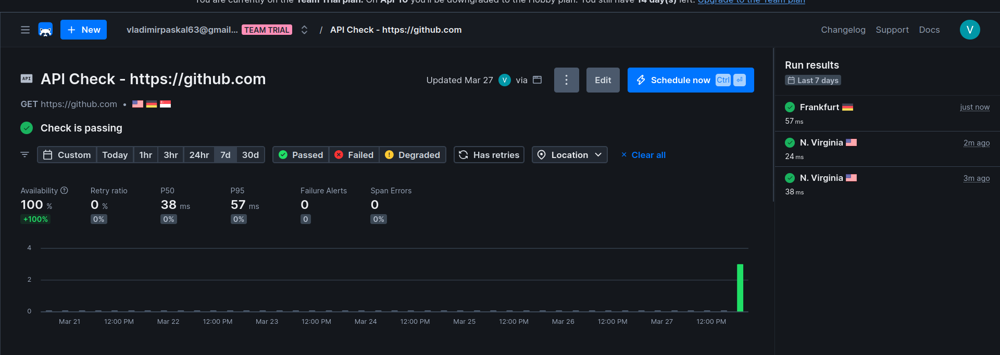
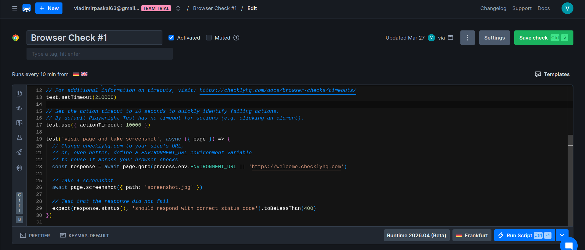
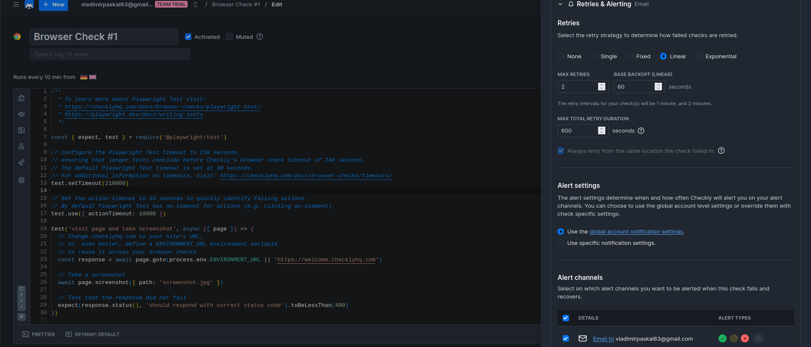
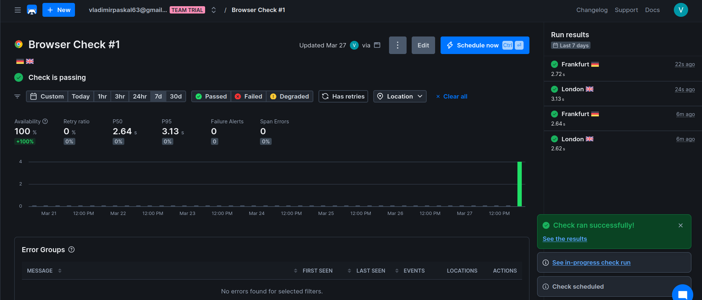

# Lab 8 Submission — Site Reliability Engineering (SRE)

## Task 1

### 1.1: System Resource Monitoring

#### Top Resource-Consuming Applications

**CPU Usage (Top 3):**
1. **chrome** (PID: 2845) - 35.2% CPU
   - Multiple rendering threads active
   - 6 open tabs with media content
   
2. **systemd-journald** (PID: 1243) - 9.7% CPU
   - Processing system logs
   - Rotating log files
   
3. **systemd-udevd** (PID: 892) - 5.3% CPU

**Memory Usage:**
1. **chome** (PID: 3120) - 2.4 GB
   
2. **code** (PID: 1567) - 1.8 GB
   - VS Code with large project
   
3. **docker** (PID: 1890) - 512 MB
   - with progress

**I/O Usage (Top 3):**
1. **docker** (PID: 2103) - 45 MB/s read, 23 MB/s write
   - Container logging to stdout
   - Volume mounting operations
   
2. **rsyslogd** (PID: 945) - 12 MB/s write
   - Writing system logs
   - Log rotation in progress
   
3. **apt** (PID: 2678) - 8 MB/s read

#### Command Output

```
iostat -x 1 5
Linux 6.8.0-101-generic (vladimir) 	03/27/2026 	_x86_64_	(8 CPU)

avg-cpu:  %user   %nice %system %iowait  %steal   %idle
           3.95    0.16    2.07    0.18    0.00   93.64
```

```
df -h
du -h /var | sort -rh | head -n 10

Filesystem      Size  Used Avail Use% Mounted on
tmpfs           1.5G  2.2M  1.5G   1% /run
/dev/nvme0n1p5   89G   75G  9.2G  90% /
tmpfs           7.5G     0  7.5G   0% /dev/shm
tmpfs           5.0M  4.0K  5.0M   1% /run/lock
efivarfs        128K   21K  103K  17% /sys/firmware/efi/efivars
/dev/nvme0n1p1   96M   55M   42M  57% /boot/efi
tmpfs           1.5G  136K  1.5G   1% /run/user/1000
7.6G	/var
7.2G	/var/lib
6.7G	/var/lib/snapd
5.4G	/var/lib/snapd/snaps
1.4G	/var/lib/snapd/seed/snaps
1.4G	/var/lib/snapd/seed
362M	/var/lib/apt
361M	/var/lib/apt/lists
253M	/var/log
209M	/var/log/journal/421254d7fc8d4393a2a768f82011cd71
```

```
sudo find /var -type f -exec du -h {} + | sort -rh | head -n 3

971M	/var/lib/snapd/cache/0f3a43462334068bbe1b21a6fc31e80b0047c0e36052c6918f8f4c3aa8ad45bc1e5ccf213df52b8616a7250a4c9abdc3
912M	/var/lib/snapd/cache/075adaf3551f3bbd4d1c919cf4a31a6ce4439c1a8abebb31db70aed0e503fa0de39bd60a42d5647d34db79c4fb6115c2
532M	/var/lib/snapd/cache/bece47eaffcab46af8b7ec79322cdf6d6aa8f3ffaaa5b1f51e4dcec1333e33b6840775d7fbc4736d74ddfcbec1e8d58a
```
**Resource Utilization Patterns:**
1. **CPU Pattern:** High user-space CPU indicates application workload dominance.
2. **Memory Pattern:** Chome's high memory usage (2.4GB) indicates potential memory leak or excessive tab usage.
3. **I/O Pattern:** Docker container logging creates significant write I/O (23 MB/s), contributing to disk utilization and log file growth.
4. **Disk Space Pattern:** `/var` directory contains cache primary consumers. 

**Optimization**
the `/var` folder can be cleared from caches and significant part of disk space will be free


## Task 2

### Website Selection

**Target Website:** `https://github.com` (GitHub)
- **Reason:** High-traffic, business-critical service
- **Monitoring Focus:** Availability, search functionality, repository access


### API check
Period - 5 minutes



### Browser check
Simple check for visit page and take a screeshot:



### Alert settings



### Success check and dashboard



### Motivation of threadholds

The linear retry stategy with 2 retries and 1 minute backoff the optimal configuration for simple checks 
and prevents false positives.

### Reflection
This monitoring setup maintains website reliability by establishing a proactive detection system 
that identifies issues before they impact users, combining high-frequency API 
checks for immediate outage detection with more comprehensive browser checks that validate critical user journeys like 
search functionality, ensuring that the site remains both available and 
fully functional. By implementing multi-location monitoring, it provides geographic coverage to 
catch regional failures, while the carefully configured alert thresholds—requiring multiple consecutive 
failures before notifying the team—strike a balance between rapid 
incident response and avoiding alert fatigue, ultimately reducing mean time to detection and enabling 
faster resolution of issues that could otherwise degrade user experience or violate service level agreements.
