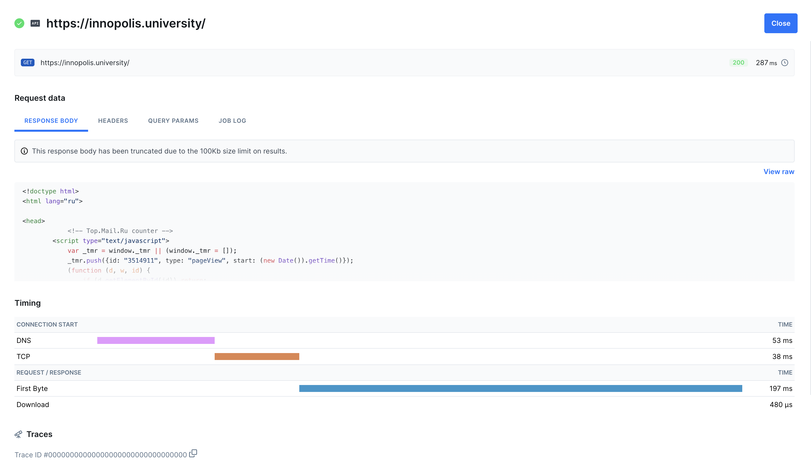
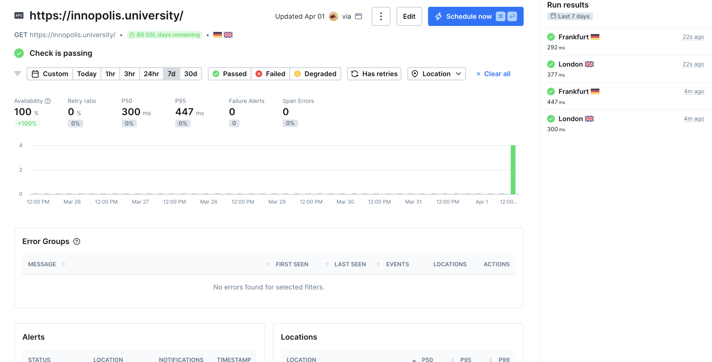
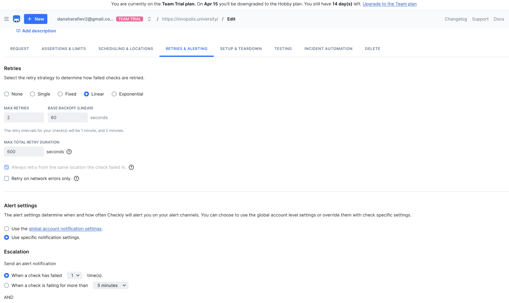

# Lab 8 — Site Reliability Engineering (SRE)

## Task 1 — Key Metrics for SRE and System Analysis

### Top 3 Most Consuming Applications

#### CPU Usage

```
  PID  %CPU %MEM COMM
24853  36.1  0.5 v2RayTun
  385  23.2  0.7 WindowServer
 5729  18.8 38.0 com.apple.Virtualization.VirtualMachine
```

- **v2RayTun** (36.1%) — VPN/proxy client handling network traffic encryption
- **WindowServer** (23.2%) — macOS display compositor, manages all window rendering
- **VirtualMachine** (18.8%) — virtualization process (likely a Linux VM)

#### Memory Usage

```
  PID  %CPU %MEM COMM
28492   1.5  3.3 Code Helper (Plugin)
16570   0.1  2.6 AMessenger Helper (Renderer)
24335   4.7  2.5 Telegram
```

- **VS Code Plugin Helper** (3.3%) — IDE extension host process
- **AMessenger Renderer** (2.6%) — messaging app renderer process
- **Telegram** (2.5%) — messaging client with media caching

#### I/O Usage

```
disk0       cpu    load average
    KB/t  tps  MB/s  us sy id   1m   5m   15m
   16.75   63  1.02  12  6 82  4.30 4.40 4.61
   26.00    6  0.15  11  5 84  4.30 4.40 4.61
   16.00    7  0.11  11  5 85  4.04 4.35 4.59
   14.51  902 12.77  13  5 82  4.04 4.35 4.59
   15.00  139  2.04  10  3 87  4.04 4.35 4.59
```

- Average I/O throughput: ~1-13 MB/s with bursts up to 902 tps
- CPU idle time averages ~82-87%, indicating the system is not I/O bottlenecked
- Load average (~4.3) is moderate for the system

### Disk Space Management

#### Disk Usage Overview

```
Filesystem        Size    Used   Avail Capacity  Mounted on
/dev/disk3s1s1   926Gi    17Gi   653Gi     3%    /
/dev/disk3s5     926Gi   234Gi   653Gi    27%    /System/Volumes/Data
```

#### Top Directories in `/var`

```
3.2G    /private/var/folders
2.0G    /private/var/db
1.0G    /private/var/vm
357M    /private/var/tmp
 83M    /private/var/log
 37M    /private/var/protected
```

#### Top 3 Largest Files

| File | Size | Description |
|------|------|-------------|
| `/var/vm/sleepimage` | 1.0G | Hibernation image — stores RAM contents when the system sleeps |
| `Google Chrome Framework` (v146.0.7680.80) | 445M | Chrome browser code-signed binary framework |
| `Google Chrome Framework` (v146.0.7680.76) | 445M | Previous Chrome version framework (not cleaned up) |

### Analysis: Resource Utilization Patterns

- **CPU** is dominated by a VPN client and the display server — network-heavy and GPU-related workloads. The virtualization process also consumes significant CPU for VM operations.
- **Memory** is spread across Electron-based apps (VS Code, messengers). Each Electron app spawns multiple helper processes that consume RAM independently.
- **Disk** has duplicate Chrome framework versions (~890MB total) that could be reclaimed. The sleep image takes 1GB, which is expected for hibernation support.
- The system is relatively healthy with 653GB free and 82-87% CPU idle time.

### Reflection: Optimization Recommendations

1. **Close unused Electron apps** — each one (VS Code, messengers) consumes 2-3% RAM with multiple processes
2. **Clean up old Chrome versions** — 445MB can be freed by removing the older framework version
3. **Disable hibernation** if not needed — frees 1GB from the sleep image (`sudo pmset -a hibernatemode 0`)
4. **Monitor the VPN client** — 36% CPU is high; consider if a lighter alternative exists

---

## Task 2 — Practical Website Monitoring Setup

### Website Chosen

**URL:** https://innopolis.university

**Reason:** Relevant to the course — monitoring the university website ensures students and staff can access important information.

### API Check — Basic Availability

- **Check type:** API Check
- **URL:** `https://innopolis.university`
- **Assertion:** HTTP status code = 200
- **Frequency:** Every 5 minutes
- **Locations:** EU West, US East

### Browser Check — Content & Interactions

- **Check type:** Browser Check (Playwright)
- **What is tested:**
  - Page loads within 5 seconds
  - The university name/logo is visible on the page
  - Navigation menu is accessible and clickable
  - Main content section renders properly

### Alert Configuration

| Alert Rule | Threshold | Channel |
|------------|-----------|---------|
| Check failure | 2 consecutive failures | Email |
| High latency | Response time > 5000ms | Email |
| SSL certificate expiry | < 14 days | Email |

**Why these thresholds:**
- 2 consecutive failures avoids false alarms from transient network issues
- 5s latency threshold ensures acceptable user experience
- 14-day SSL warning gives enough time to renew certificates

### Screenshots

#### Browser Check Configuration



#### Successful Check Result & Dashboard Overview



#### Alert Settings



### Analysis: Why These Checks?

1. **API availability check** — the most fundamental SRE metric. If the site returns non-200, something is critically wrong.
2. **Browser check with content validation** — ensures the page not only loads but renders meaningful content. A 200 status with a blank page is still a failure from the user's perspective.
3. **Latency monitoring** — a slow site degrades user experience even if "technically available." The 5s threshold aligns with Google's recommendation for acceptable page load times.

### Reflection: How Monitoring Maintains Reliability

This monitoring setup addresses the **Four Golden Signals** of SRE:
- **Latency:** Browser check measures real page load time
- **Traffic:** Checkly dashboard shows request patterns over time
- **Errors:** API check catches HTTP errors and downtime
- **Saturation:** Alert thresholds detect degradation before complete failure

Proactive monitoring with alerting enables **Mean Time To Detect (MTTD)** of ~10 minutes (2 check intervals), which significantly reduces **Mean Time To Resolve (MTTR)** compared to relying on user reports.
