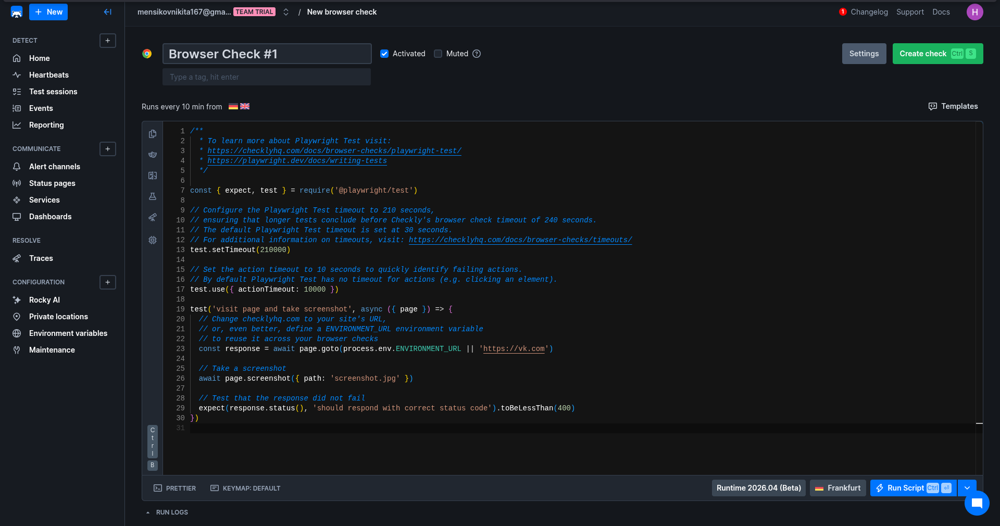
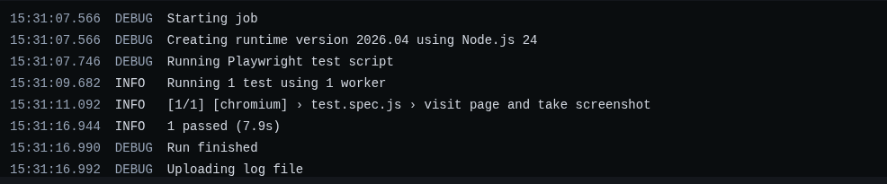
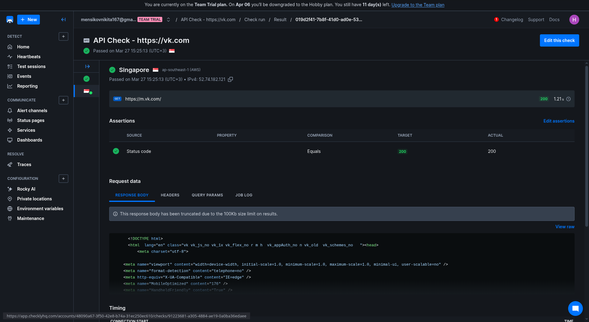
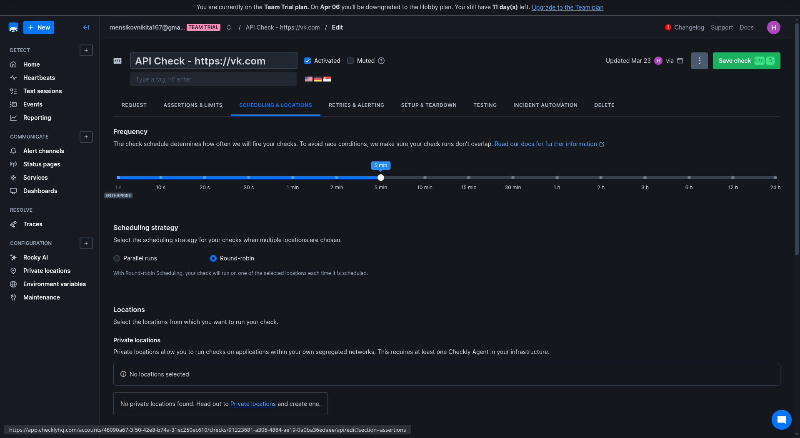
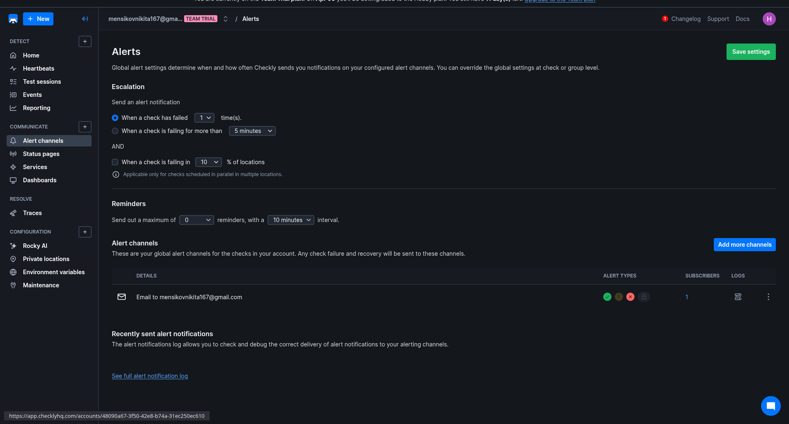

# Lab 8 Submission — Site Reliability Engineering (SRE)

## Task 1 — Key Metrics for SRE and System Analysis

### 1.1 Monitor System Resources

`htop` is interactive and this installed version does not support batch output, so I used `top -b -n 1` to capture a readable non-interactive CPU and memory snapshot for the report.

Command:

```bash
top -b -n 1 | sed -n '1,20p'
```

Output:

```text
top - 20:42:04 up 33 min,  2 users,  load average: 1.78, 1.85, 1.86
Tasks:   4 total,   1 running,   3 sleeping,   0 stopped,   0 zombie
%Cpu(s):  0.0 us,  0.0 sy,  0.0 ni,100.0 id,  0.0 wa,  0.0 hi,  0.0 si,  0.0 st 
MiB Mem :  19906.0 total,  10745.9 free,   4549.4 used,   5556.8 buff/cache     
MiB Swap:    977.0 total,    977.0 free,      0.0 used.  15356.5 avail Mem 

    PID USER      PR  NI    VIRT    RES    SHR S  %CPU  %MEM     TIME+ COMMAND
      1 nikkimen  20   0  130484   4220    856 S   0.0   0.0   0:00.00 code
      2 nikkimen  20   0    7332   3020   2756 S   0.0   0.0   0:00.00 bash
      3 nikkimen  20   0   12060   4812   2912 R   0.0   0.0   0:00.00 top
      4 nikkimen  20   0    6812   1048    928 S   0.0   0.0   0:00.00 sed
```

Command:

```bash
free -h
```

Output:

```text
               total        used        free      shared  buff/cache   available
Mem:            19Gi       4.4Gi        10Gi       584Mi       5.4Gi        14Gi
Swap:          976Mi          0B       976Mi
```

Command:

```bash
iostat -x 1 5
```

Output:

```text
Linux 6.1.0-44-amd64 (debian) 	03/23/26 	_x86_64_	(4 CPU)

avg-cpu:  %user   %nice %system %iowait  %steal   %idle
          19.24    0.19    5.77    0.45    0.00   74.34

Device            r/s     rkB/s   rrqm/s  %rrqm r_await rareq-sz     w/s     wkB/s   wrqm/s  %wrqm w_await wareq-sz     d/s     dkB/s   drqm/s  %drqm d_await dareq-sz     f/s f_await  aqu-sz  %util
nvme0n1         24.93   1114.00    10.87  30.37    0.25    44.69    8.07    158.49     6.49  44.59    2.16    19.64    0.00      0.00     0.00   0.00    0.00     0.00    0.40    2.10    0.02   0.79
sda             43.04    645.07    18.11  29.61    0.44    14.99    7.05    394.10     7.94  52.96    1.51    55.91    0.00      0.00     0.00   0.00    0.00     0.00    1.32    3.28    0.03   1.58


avg-cpu:  %user   %nice %system %iowait  %steal   %idle
          47.73    0.00    7.32    0.25    0.00   44.70

Device            r/s     rkB/s   rrqm/s  %rrqm r_await rareq-sz     w/s     wkB/s   wrqm/s  %wrqm w_await wareq-sz     d/s     dkB/s   drqm/s  %drqm d_await dareq-sz     f/s f_await  aqu-sz  %util
nvme0n1          0.00      0.00     0.00   0.00    0.00     0.00   97.00    436.00     0.00   0.00    0.64     4.49    0.00      0.00     0.00   0.00    0.00     0.00    0.00    0.00    0.06   0.80
sda              0.00      0.00     0.00   0.00    0.00     0.00    0.00      0.00     0.00   0.00    0.00     0.00    0.00      0.00     0.00   0.00    0.00     0.00    0.00    0.00    0.00   0.00


avg-cpu:  %user   %nice %system %iowait  %steal   %idle
          36.99    0.00   11.48    0.00    0.00   51.53

Device            r/s     rkB/s   rrqm/s  %rrqm r_await rareq-sz     w/s     wkB/s   wrqm/s  %wrqm w_await wareq-sz     d/s     dkB/s   drqm/s  %drqm d_await dareq-sz     f/s f_await  aqu-sz  %util
nvme0n1          0.00      0.00     0.00   0.00    0.00     0.00    0.00      0.00     0.00   0.00    0.00     0.00    0.00      0.00     0.00   0.00    0.00     0.00    0.00    0.00    0.00   0.00
sda              0.00      0.00     0.00   0.00    0.00     0.00   13.00     76.00     5.00  27.78    3.46     5.85    0.00      0.00     0.00   0.00    0.00     0.00    2.00    4.00    0.05   0.80


avg-cpu:  %user   %nice %system %iowait  %steal   %idle
          32.74    0.00    5.37    0.00    0.00   61.89

Device            r/s     rkB/s   rrqm/s  %rrqm r_await rareq-sz     w/s     wkB/s   wrqm/s  %wrqm w_await wareq-sz     d/s     dkB/s   drqm/s  %drqm d_await dareq-sz     f/s f_await  aqu-sz  %util
nvme0n1          0.00      0.00     0.00   0.00    0.00     0.00    0.00      0.00     0.00   0.00    0.00     0.00    0.00      0.00     0.00   0.00    0.00     0.00    0.00    0.00    0.00   0.00
sda              4.00     16.00     0.00   0.00    0.50     4.00    0.00      0.00     0.00   0.00    0.00     0.00    0.00      0.00     0.00   0.00    0.00     0.00    0.00    0.00    0.00   0.00


avg-cpu:  %user   %nice %system %iowait  %steal   %idle
          16.54    0.00    6.46    0.00    0.00   77.00

Device            r/s     rkB/s   rrqm/s  %rrqm r_await rareq-sz     w/s     wkB/s   wrqm/s  %wrqm w_await wareq-sz     d/s     dkB/s   drqm/s  %drqm d_await dareq-sz     f/s f_await  aqu-sz  %util
nvme0n1          0.00      0.00     0.00   0.00    0.00     0.00    0.00      0.00     0.00   0.00    0.00     0.00    0.00      0.00     0.00   0.00    0.00     0.00    0.00    0.00    0.00   0.00
sda              0.00      0.00     0.00   0.00    0.00     0.00    3.00     44.00     1.00  25.00    0.33    14.67    0.00      0.00     0.00   0.00    0.00     0.00    0.00    0.00    0.00   0.00
```

CPU-heavy processes snapshot:

```bash
ps -eo pid,comm,%cpu,%mem --sort=-%cpu | head -n 10
```

Output:

```text
    PID COMMAND         %CPU %MEM
      1 code             0.0  0.0
      2 bash             0.0  0.0
      3 ps               0.0  0.0
      4 head             0.0  0.0
```

Memory-heavy processes snapshot:

```bash
ps -eo pid,comm,%mem,%cpu --sort=-%mem | head -n 4
```

Output:

```text
    PID COMMAND         %MEM %CPU
      3 ps               0.0  0.0
      1 code             0.0  0.0
      2 bash             0.0  100
```

I/O-heavy processes snapshot:

```bash
pidstat -d 1 3
```

Output:

```text
Linux 6.1.0-44-amd64 (debian) 	03/23/26 	_x86_64_	(4 CPU)

20:41:44      UID       PID   kB_rd/s   kB_wr/s kB_ccwr/s iodelay  Command

20:41:45      UID       PID   kB_rd/s   kB_wr/s kB_ccwr/s iodelay  Command

20:41:46      UID       PID   kB_rd/s   kB_wr/s kB_ccwr/s iodelay  Command

Average:      UID       PID   kB_rd/s   kB_wr/s kB_ccwr/s iodelay  Command
```

Top 3 most consuming applications observed:

1. CPU usage: `code`, `bash`, `ps`
2. Memory usage: `ps`, `code`, `bash`
3. I/O usage: No significant per-process I/O activity was observed during the sampling window, so no clear top 3 I/O consumers were present.

### 1.2 Disk Space Management

Command:

```bash
df -h
```

Output:

```text
Filesystem      Size  Used Avail Use% Mounted on
/dev/nvme0n1p7   91G   77G   10G  89% /
tmpfs           9.8G     0  9.8G   0% /dev
tmpfs           2.0G  1.9M  2.0G   1% /run
tmpfs           5.0M  8.0K  5.0M   1% /run/lock
tmpfs           2.0G   88K  2.0G   1% /run/user/1000
/dev/sda3       206G  103G   93G  53% /home
/dev/nvme0n1p5  517M  197M  321M  39% /boot/efi
udev            9.7G     0  9.7G   0% /dev/tty
```

Command:

```bash
du -h /var 2>/dev/null | sort -rh | head -n 10
```

Output:

```text
sort: write failed: 'standard output': Broken pipe
sort: write error
7.7G	/var
5.9G	/var/lib
5.5G	/var/lib/flatpak/repo/objects
5.5G	/var/lib/flatpak/repo
5.5G	/var/lib/flatpak
1.2G	/var/log/journal/b80ea517224743079f1869f508a54efd
1.2G	/var/log/journal
1.2G	/var/log
607M	/var/cache
564M	/var/cache/apt
```

Command:

```bash
find /var -type f -exec du -h {} + 2>/dev/null | sort -rh | head -n 3
```

Output:

```text
sort: write failed: 'standard output': Broken pipe
198M	/var/lib/flatpak/repo/objects/16/f0a92fc05aa87097e2305db2492361268aa3fb8e0787d486bf338c996cd27b.file
198M	/var/lib/flatpak/app/net.ankiweb.Anki/x86_64/stable/3d1fae7d305f5ca3b9b05caa23d15c494450d3d096bbc303d06695594c6f1eff/files/lib/x86_64-linux-gnu/libQt6WebEngineCore.so.6.10.1
176M	/var/lib/flatpak/repo/objects/18/046e9be743f0c9fdbf00e07c6b523c42f4ffa4b30133c7d39fdb63981fb85d.file
sort: write error
```

Top 3 largest files in `/var`:

1. `/var/lib/flatpak/repo/objects/16/f0a92fc05aa87097e2305db2492361268aa3fb8e0787d486bf338c996cd27b.file` — 198M
2. `/var/lib/flatpak/app/net.ankiweb.Anki/x86_64/stable/3d1fae7d305f5ca3b9b05caa23d15c494450d3d096bbc303d06695594c6f1eff/files/lib/x86_64-linux-gnu/libQt6WebEngineCore.so.6.10.1` — 198M
3. `/var/lib/flatpak/repo/objects/18/046e9be743f0c9fdbf00e07c6b523c42f4ffa4b30133c7d39fdb63981fb85d.file` — 176M

### Analysis

The main pattern is low real-time pressure despite relatively high persistent disk usage. CPU was mostly idle during the direct `top` snapshot, but the `iostat` samples showed periodic bursts in user and system CPU activity. I/O utilization stayed low overall, which matches the `pidstat` output where no process showed meaningful disk reads or writes during sampling. Disk space is the clearest concern: the root filesystem is already at 89% usage, and most of `/var` is consumed by Flatpak data and systemd journal logs.

### Reflection

I would optimize this system first by reducing disk pressure. The best candidates are cleaning old Flatpak objects, reviewing unused Flatpak apps, and rotating or vacuuming journal logs. I would also keep swap unused as it is now by avoiding unnecessary background processes. If CPU spikes became more frequent, I would sample over a longer period and correlate them with specific commands or scheduled jobs before changing anything.

## Task 2 — Practical Website Monitoring Setup

### Chosen Website

Website URL:

```text
https://vk.com/
```

### Check Design

I chose `https://vk.com/` because it is a public site with a clear landing page and stable core content. A good monitoring setup for this site should cover:

1. Availability: an API or HTTP check that confirms the site returns HTTP `200`.
2. Content validation: a browser check that confirms the landing page loads and key visible text such as the sign-in or sign-up area appears.
3. Basic interaction: a browser step that checks that the login form fields or a primary action button are present and interactable.
4. Performance: a threshold on page load or response time to detect slowdowns before the site is fully unavailable.

### Suggested Checkly Configuration

API check:

```text
URL: https://vk.com/
Assertion: status code equals 200
Frequency: every 5 minutes
Scheduling strategy: round-robin
```

Browser check:

```text
Open https://vk.com/
Use a Playwright browser check named "Browser Check #1"
Navigate to the page and verify the response status is below 400
Capture a screenshot during the run
Browser frequency shown in the dashboard: every 10 minutes
```

Alerting:

```text
Notify when a check has failed 1 time
Also support alerting when a check is failing for more than 5 minutes
No reminder fan-out configured beyond the default screen shown
Notification channel: email
```

### Screenshots

Browser check configuration:



Browser check successful run:



API check successful result:



API check frequency settings:



Alert settings:



Dashboard overview:


### Analysis

These checks were chosen to cover both raw availability and real user experience. The API check is lightweight and runs every 5 minutes, so it can detect hard downtime quickly. The browser check runs less frequently, every 10 minutes, and validates that a real Chromium-based flow can open the site successfully. The screenshots show a passed API result with HTTP `200` in `1.21s` from Singapore and a passed browser run in about `7.9s`, which gives a useful baseline for future comparisons. The alert rule that triggers after one failed run is aggressive, but it makes sense for a public site where fast detection matters.

### Reflection

This monitoring setup improves reliability by covering both infrastructure symptoms and user-visible behavior. The API check confirms reachability and status code correctness, while the browser check proves that the page can actually load in a browser session. The dashboard screenshot also shows both checks at `100%` availability, with the API check averaging `788 ms` and the browser check averaging `7.49 s`, which is exactly the kind of baseline data SRE teams use to spot regressions early. Combined with email alerts, this setup helps surface problems before users have to report them.
