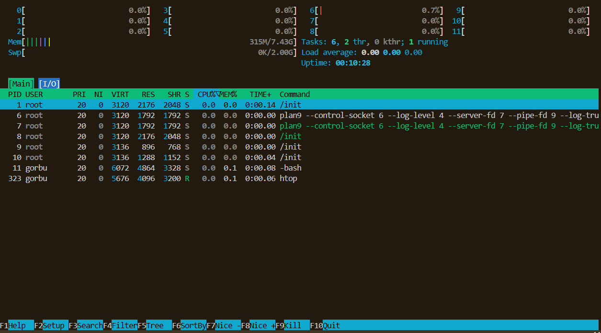
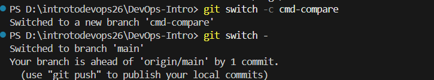
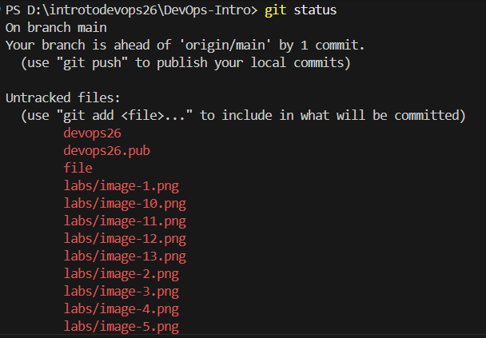
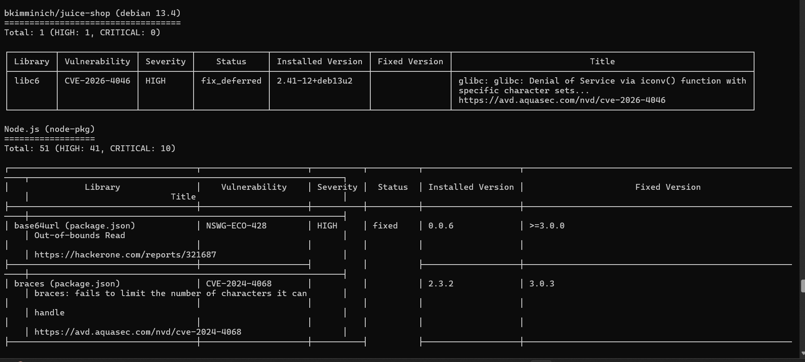

## Задание 1
Скрины htop и iostat -x 1 5:

1. Три приложения, наиболее потребляющие ресурсы
- CPU:
htop
bash
init
- Memory:
htop
bash
init
- I/O:
Основная активность наблюдается на устройстве sdd
Значимых приложений, создающих нагрузку на I/O, не выявлено (нагрузка минимальная)

2. Результаты выполнения команд
- iostat
avg-cpu:  %user   %system %iowait  %idle
           0.07    0.15    0.05   99.72

Device    r/s     rkB/s     w/s     wkB/s    %util
sdd      16.82   592.28    2.37   209.53     0.59

- df -h
Filesystem      Size  Used Avail Use%
/dev/sdd       1007G  1.6G  955G   1%
/mnt/c          120G  120G  425M 100%

- du -h /var
440M    /var
256M    /var/lib
227M    /var/lib/apt/lists
132M    /var/cache
52M     /var/log

3. Три самых больших файла в /var
70M  /var/lib/apt/lists/archive.ubuntu.com_ubuntu_dists_noble_universe_binary-amd64_Packages
59M  /var/cache/apt/srcpkgcache.bin
59M  /var/cache/apt/pkgcache.bin

4. Анализ
Наблюдается очень низкое использование ресурсов: процессор большую часть времени находится в состоянии простоя (99–100% idle), потребление памяти минимальное, а дисковая активность практически отсутствует. Система работает без нагрузки, а основные операции связаны с системными процессами и фоновыми задачами.

5. Размышления
Оптимизация в текущем состоянии не требуется. Однако можно очистить кэш APT и старые логи для освобождения дискового пространства, а также контролировать заполненность диска /mnt/c. В целом, важно регулярно мониторить систему, чтобы своевременно выявлять рост нагрузки.

## Задание 2
- Скрины

Фото апи:

Экран с кодом проверки:

Подключила почту для уведов:

Финальный скрин:

- Анализ

Были выбраны API check и Browser check, так как они проверяют разные уровни работы сайта.
API check проверяет доступность сервера и корректный ответ (status 200), что позволяет быстро выявить проблемы на уровне бэкенда.
Browser check имитирует пользователя и проверяет, что страница реально загружается.

Пороговые значения выбраны простые: регулярные проверки и оповещение при первом сбое, чтобы быстро обнаруживать проблемы без лишней сложности.

- Размышления

Такая система мониторинга помогает быстро выявлять сбои и снижать время простоя сайта.
API check показывает техническую доступность, а Browser check — корректность работы сайта для пользователя.

Уведомления позволяют оперативно реагировать на ошибки, что повышает надежность системы.