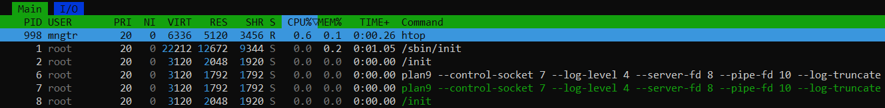
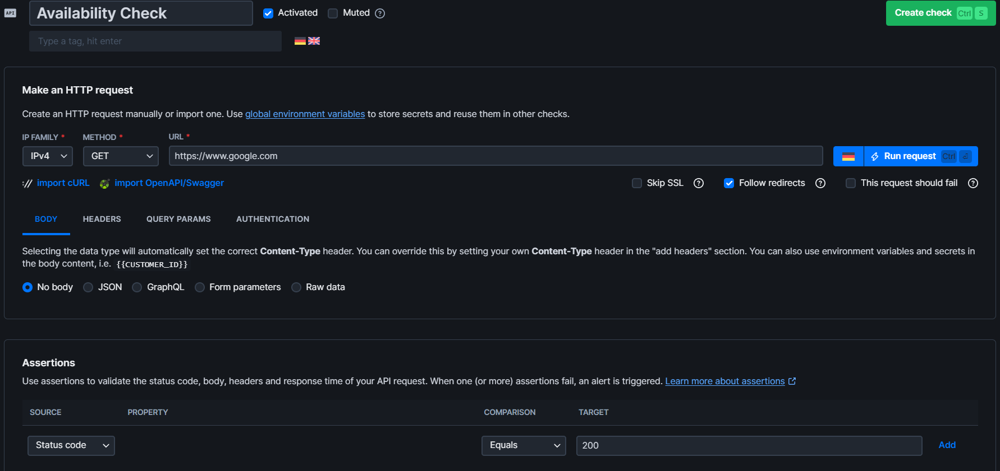
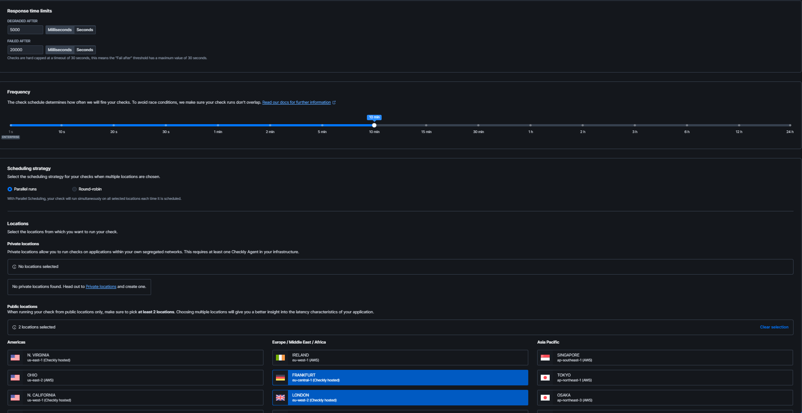
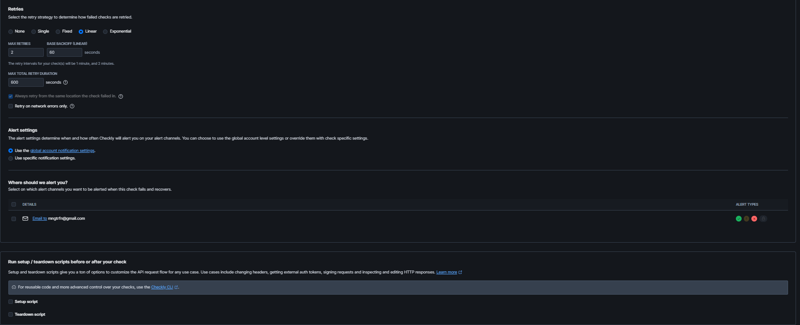
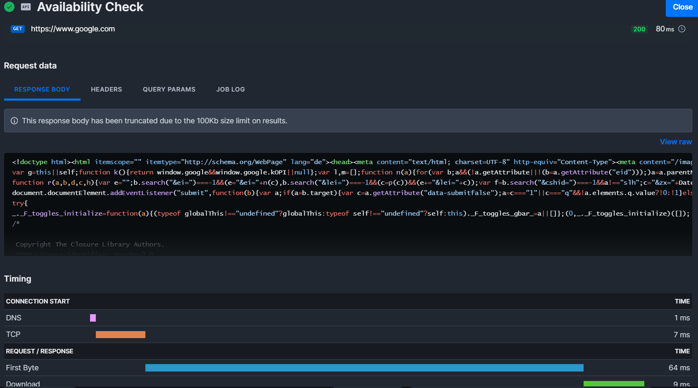
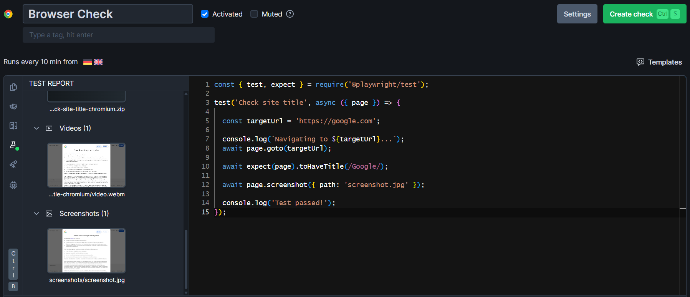
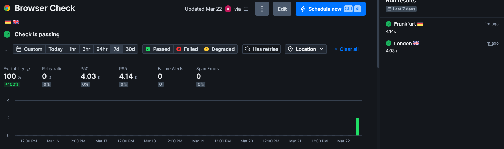
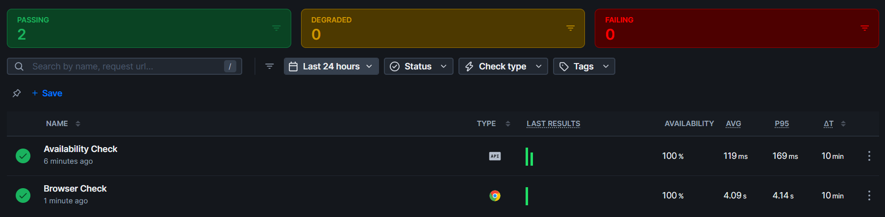
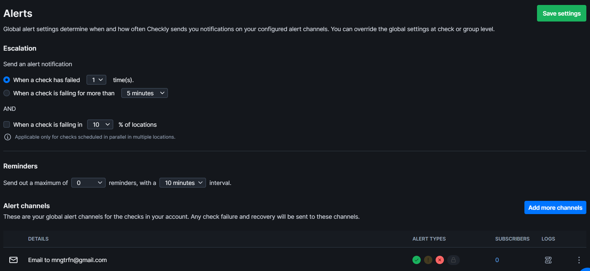

# Task 1 — Key Metrics for SRE and System Analysis

## Top 3 most consuming applications:

*CPU*



*Memory*


*I/O*

```
avg-cpu:  %user   %nice %system %iowait  %steal   %idle
           0.08    0.00    0.15    0.05    0.00   99.73

Device            r/s     rkB/s   rrqm/s  %rrqm r_await rareq-sz     w/s     wkB/s   wrqm/s  %wrqm w_await wareq-sz     d/s     dkB/s   drqm/s  %drqm d_await dareq-sz     f/s f_await  aqu-sz  %util
sda              2.89    190.21     1.12  27.92    0.35    65.71    0.00      0.00     0.00   0.00    0.00     0.00    0.00      0.00     0.00   0.00    0.00     0.00    0.00    0.00    0.00   0.08
sdb              0.35     17.61     0.18  34.15    0.39    50.82    0.00      0.00     0.00   0.00    0.00     0.00    0.00      0.00     0.00   0.00    0.00     0.00    0.00    0.00    0.00   0.03
sdc              0.25      5.72     0.00   0.00    0.04    22.73    0.01      0.01     0.00   0.00    1.50     2.00    0.00      0.00     0.00   0.00    0.00     0.00    0.00    1.00    0.00   0.00
sdd             22.98    882.15     4.59  16.65    0.32    38.38    5.06    362.86    10.34  67.13    2.23    71.67    0.34   2290.88     0.07  17.90    0.16  6712.27    1.39    0.54    0.02   5.10

```


## Top 3 largest files in the /var directory

```
70M	/var/lib/apt/lists/archive.ubuntu.com_ubuntu_dists_noble_universe_binary-amd64_Packages
60M	/var/cache/apt/srcpkgcache.bin
60M	/var/cache/apt/pkgcache.bin
```

## Analysis: What patterns do you observe in resource utilization?

```
From running iostat -x 1 5, I would look for patterns such as consistently high %iowait values indicating disk I/O bottlenecks, or elevated %system time suggesting kernel-level contention. Using htop, I would identify whether CPU or memory pressure correlates with specific processes. The du and find commands typically reveal that log files in /var/log are the largest consumers, with predictable growth patterns over time.
```

## Reflection: How would you optimize resource usage based on your findings?

```
To optimize resource usage, I would address the top consumers identified in htop—for example, by adjusting log rotation in /etc/logrotate.conf if logging daemons show high I/O. If %iowait is high, I would consider moving heavy-write operations to faster storage. I would also implement automated alerts using cron and df -h to proactively manage disk space.
```


# Task 2 — Practical Website Monitoring Setup

*Website URL*

```
https://www.google.com
```

## Availability Check













## Browser Check










## Alert settings





## Analysis: Why did you choose these specific checks and thresholds?

```
I chose these checks and thresholds to balance early issue detection with avoiding alert fatigue, ensuring critical user-facing functionality is validated without unnecessary noise. This approach prioritizes monitoring the most impactful user journeys while filtering out transient flakiness that would otherwise distract from genuine incidents.
```

## Reflection: How does this monitoring setup help maintain website reliability?

```
This monitoring setup helps maintain website reliability by proactively validating both availability and critical user interactions, ensuring issues are detected before they impact end users. It establishes a clear feedback loop where automated checks catch failures early, and thoughtfully configured alerts enable rapid response without overwhelming the team. By focusing on meaningful user journeys and filtering out transient noise, it supports consistent uptime and a stable user experience.
```