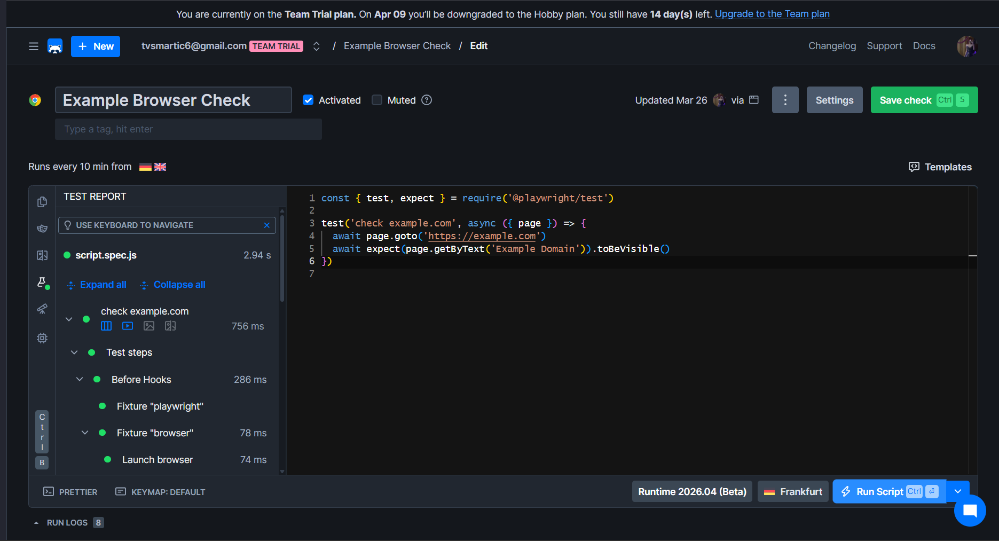
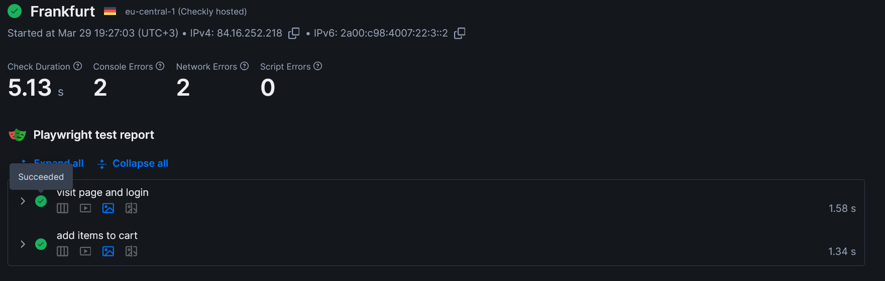
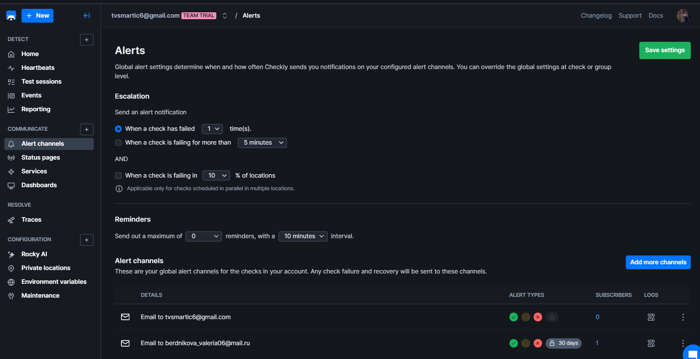

# TASK 1

Note that I am using WSL, so the results are not exactly the same as on a real Linux system.

Top CPU Consumers:

| Application | CPU(%) |
| ----------- | --- |
| htop        | 0.3 |
| /sbin/init      | 0.0 |
| /usr/lib/systemd/systemd-journald | 0.0 |

Top Memory Consumers:

| Application | Memory(%) |
| ----------- | --- |
| /usr/bin/python3        | 0.6 |
| /usr/lib/systemd/systemd-journald | 0.4 |
| /sbin/init      | 0.3 |

There were no I/O consumers on my WSL system. Everything was at 0.

I looked at `htop` and `iotop` outputs to find resource consumptions.

```
70M     /var/lib/apt/lists/archive.ubuntu.com_ubuntu_dists_noble_universe_binary-amd64_Packages
59M     /var/cache/apt/srcpkgcache.bin
59M     /var/cache/apt/pkgcache.bin
```

Resource utilization is very minimal because I am using WSL.

It doesn't need optimization because nothing is running.

# TASK 2

Website URL: https://news.ycombinator.com/



Browser check code:

```javascript
const { expect, test } = require('@playwright/test')

test.setTimeout(210000)

test.use({ actionTimeout: 10000 })

test('visit page and login', async ({ page }) => {
  const response = await page.goto(process.env.PAGE_URL)

  const usernameLocator = page.locator('//input[@name="user-name"]')
  const passwordLocator = page.locator('//input[@name="password"]')
  const submitLocator = page.locator('//input[@type="submit"]')

  await expect(usernameLocator).toBeEditable()
  await expect(passwordLocator).toBeEditable()

  await usernameLocator.fill(process.env.USERNAME)
  await passwordLocator.fill(process.env.PASSWORD)

  await page.screenshot({path: "login.jpg"})

  await submitLocator.click()

  await expect(page).toHaveURL(/.*inventory/)

  await page.screenshot({ path: "logged_in.jpg" })
})

test('add items to cart', async ({page}) => {
  const response = await page.goto(process.env.PAGE_URL)

  const usernameLocator = page.locator('//input[@name="user-name"]')
  const passwordLocator = page.locator('//input[@name="password"]')
  const submitLocator = page.locator('//input[@type="submit"]')

  await expect(usernameLocator).toBeEditable()
  await expect(passwordLocator).toBeEditable()

  await usernameLocator.fill(process.env.USERNAME)
  await passwordLocator.fill(process.env.PASSWORD)

  await submitLocator.click()

  await expect(page).toHaveURL(/.*inventory/)

  const addToCartLocator = page.locator('//button[.="Add to cart"]')
  const addToCartButton = addToCartLocator.first()
  await addToCartButton.click()
  const cartItemsLocator = page.locator('//span[@data-test="shopping-cart-badge"]')

  await expect(cartItemsLocator).toHaveText("1")

  await page.screenshot({path: "cart.jpg"})
})
```





This website is a demo online store.
I chose to check for login and add items to cart, checking that the cart count is correct, which makes sense for this domain.

This monitoring setup helps maintain website reliability by alerting me when something goes wrong (login failure or cart count not increasing).