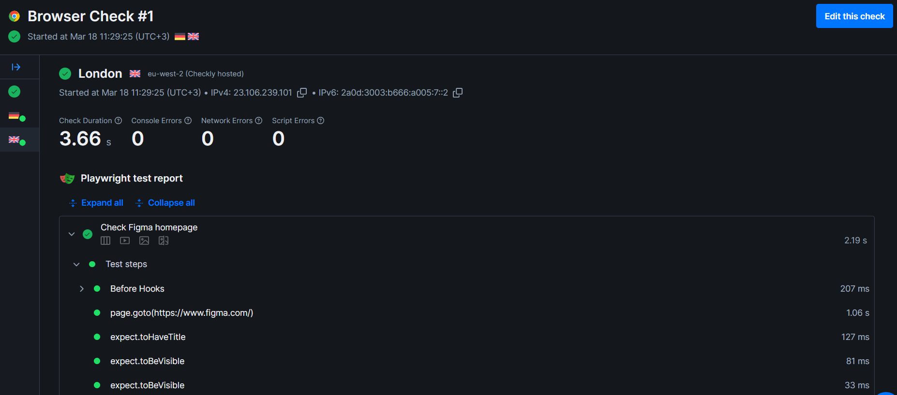
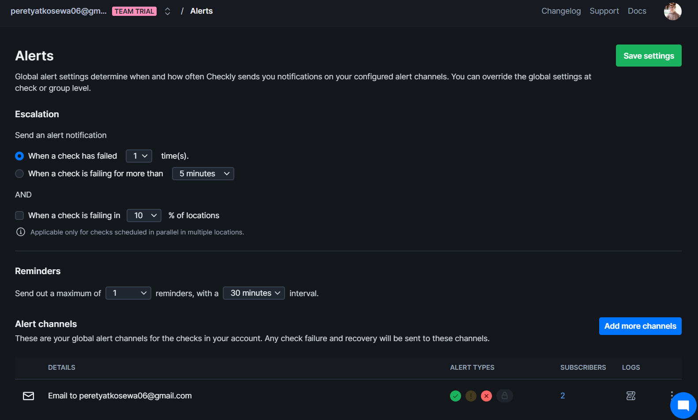
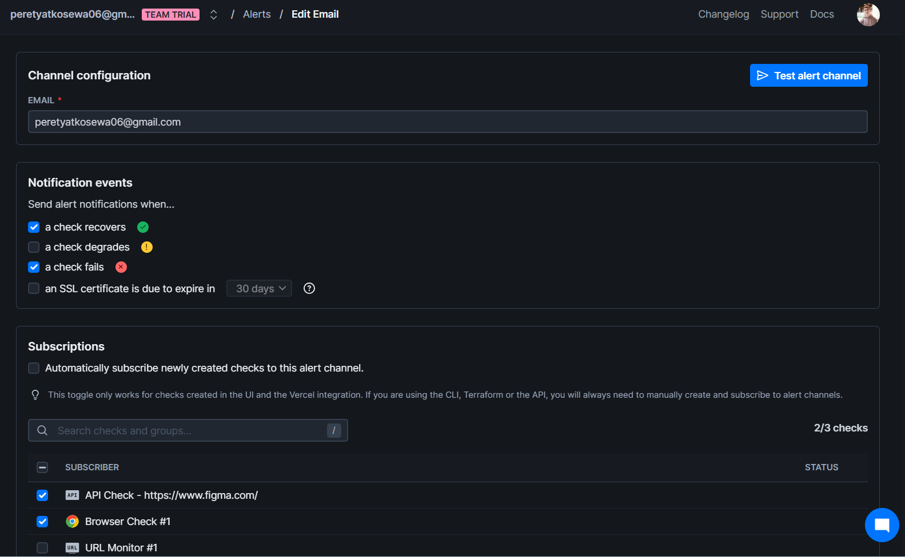
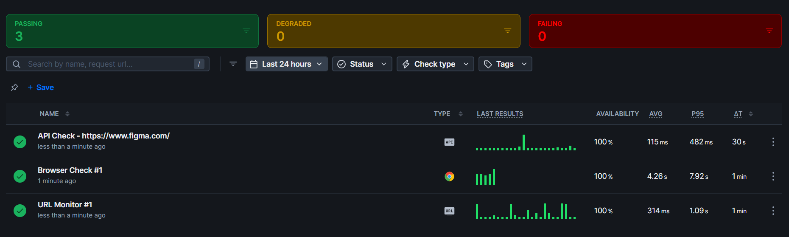

# Lab 8 Submission

## Task 1 - Key Metrics for SRE and System Analysis

### 1.1. Monitor System Resources

#### Monitor CPU, Memory, and I/O Usage

I run a tool to observe CPU, memory, and running processes in real time.

```bash
seva@Seva:/mnt/c/.../DevOps-Intro$ htop
```


The system is mostly idle, `CPU` usage is very low, and there are no heavy processes. Memory usage is also small, and no clear bottlenecks are visible.


#### Identify Top Resource Consumers

##### CPU usage


- `systemd-udevd` - 0.7% CPU
- `htop` - 0.7% CPU
- `other` - 0.0% CPU

The CPU usage is very low. No application significantly loads the CPU.


##### Memory usage


- `unattended-upgrades` - 0.3% 
- `/usr/libexec/packagekitd` - 0.3% 
- `/usr/lib/systemd/systemd-journald` - 0.2% 

Memory usage is also low. Only system services consume a small amount of memory.


##### I/O usage

I check disk I/O statistics to understand read/write activity.

```bash
seva@Seva:/mnt/c/.../DevOps-Intro$ iostat -x 1 5
Linux 6.6.87.2-microsoft-standard-WSL2 (Seva)   03/18/26        _x86_64_        (12 CPU)

avg-cpu:  %user   %nice %system %iowait  %steal   %idle
           0.03    0.00    0.08    0.03    0.00   99.86

Device            r/s     rkB/s   rrqm/s  %rrqm r_await rareq-sz     w/s     wkB/s   wrqm/s  %wrqm w_await wareq-sz     d/s     dkB/s   drqm/s  %drqm d_await dareq-sz     f/s f_await  aqu-sz  %util
sda              1.28     83.54     0.49  27.82    0.43    65.47    0.00      0.00     0.00   0.00    0.00     0.00    0.00      0.00     0.00   0.00    0.00     0.00    0.00    0.00    0.00   0.04
sdb              0.15      8.34     0.08  33.82    0.42    54.11    0.00      0.00     0.00   0.00    0.00     0.00    0.00      0.00     0.00   0.00    0.00     0.00    0.00    0.00    0.00   0.00
sdc              0.11      2.51     0.00   0.00    0.18    22.73    0.00      0.00     0.00   0.00    4.00     2.00    0.00      0.00     0.00   0.00    0.00     0.00    0.00    4.00    0.00   0.00
...
```

I/O activity is minimal. The disks are almost idle, and there is no heavy read/write load.


### 1.2. Disk Space Management

#### Check Disk Usage

I check overall disk usage and which directories take the most space.

```bash
seva@Seva:/mnt/c/.../DevOps-Intro$ df -h

Filesystem      Size  Used Avail Use% Mounted on
none            3.9G     0  3.9G   0% /usr/lib/modules/6.6.87.2-microsoft-standard-WSL2
none            3.9G  4.0K  3.9G   1% /mnt/wsl
drivers         300G  163G  138G  55% /usr/lib/wsl/drivers
/dev/sdd       1007G  1.7G  954G   1% /
...

seva@Seva:/mnt/c/.../DevOps-Intro$ du -h /var | sort -rh | head -n 10
...
562M    /var
408M    /var/log
406M    /var/log/journal/82432597ec3f49f29f860733af277fc4
406M    /var/log/journal
112M    /var/lib
92M     /var/lib/apt/lists
92M     /var/lib/apt
43M     /var/cache
33M     /var/cache/apt
19M     /var/lib/dpkg
```

The disk has a lot of free space. Most of the used space in `/var` comes from logs and package management files.


#### Identify Largest Files

I search for the largest files in the `/var` directory.

```bash
seva@Seva:/mnt/c/.../DevOps-Intro$ sudo find /var -type f -exec du -h {} + | sort -rh | head -n 3
17M     /var/cache/apt/srcpkgcache.bin
17M     /var/cache/apt/pkgcache.bin
15M     /var/lib/apt/lists/security.ubuntu.com_ubuntu_dists_noble-security_restricted_binary-amd64_Packages
```

The largest files are related to package cache and system updates. No unusually large files are found.


### Analysis: What patterns do you observe in resource utilization?

The system shows very low resource usage in all categories: `CPU`, `memory`, and `disk I/O`. Most of the activity comes from system services, not user applications. Disk usage is also low, with most space used by logs and `package-related` files. There are no performance bottlenecks or overloaded components. Overall, the system is in an idle and stable state.


### Reflection: How would you optimize resource usage based on your findings?

Even though the system is not under heavy load, some optimizations can still be applied. For example, old log files in `/var/log` can be cleaned or rotated to save space. Package cache files can be cleared using package manager tools. Background services can be reviewed and disabled if not needed. These steps help keep the system clean and efficient over time.


## Task 2 - Practical Website Monitoring Setup

### 2.1. Choose Your Website

#### Select Target Website

I choose a public website to monitor:

https://www.figma.com

The website is stable, popular, and has both API and UI elements to test.

### 2.2. Create Checks in Checkly

#### Create API Check for Basic Availability

I configure an API check to verify that the website is reachable and returns a valid response.


The configuration shows that the check targets the correct `URL` and validates the response `status`.


#### Create Browser Check for Content & Interactions

I create a `browser check` to simulate real user interaction with the website.

```javascript
const { test, expect } = require('@playwright/test');

test.setTimeout(60000);
test.use({ actionTimeout: 20000 })

test('Check Figma homepage', async ({ page }) => {
  // Go to Figma homepage
  const response = await page.goto(process.env.ENVIRONMENT_URL || 'https://www.figma.com/')


  // Check that page has loaded
  await expect(page).toHaveTitle(/Figma: The Collaborative Interface Design Tool/, { timeout: 10000 });


  // Check that logo is visible
  const logo = page.locator('svg[aria-label="Homepage"]').first();
  await expect(logo).toBeVisible();


  // Check that navigation is visible
  const nav = page.locator('nav[aria-label="Main"]').first();
  await expect(nav).toBeVisible();


  // Check that slider is visible
  const slider = page.locator('section[aria-label="Make anything possible, all in Figma"]').first();
  await expect(slider).toBeVisible();


  // Check that there are links
  const links = page.locator('a');
  await expect(links.first()).toBeVisible();

  const count = await links.count();
  expect(count).toBeGreaterThan(4);


  // Check that get started button is active
  const getStarted = page.locator('a[location="hero"]:has-text("Get started")');
  await expect(getStarted).toBeVisible();
  await expect(getStarted).toBeEnabled();


  // Test that response did not fail
  expect(response.status(), 'should respond with correct status code').toBeLessThan(400)
});
```

The test checks key UI elements such as `title`, `logo`, `navigation`, `main section`, `links`, and `button`. This ensures that the page is fully functional, not just available.

I review the browser check configuration in `Checkly`.




The test passes successfully. All required elements are visible and working as expected


### 2.3. Set Up Alerts

#### Configure Alert Rules

I configure alert rules to detect failures and notify about issues.



The alert triggers after `one failed check`. A reminder is sent once with `30-minute interval`. This setup helps detect issues quickly without too many notifications.

I configure notification channels for alerts.



Notifications are sent when `check fails` or `recovers`. Both `API` and `Browser checks` are included.


### 2.4. Capture Proof & Documentation

#### Screenshots



The dashboard shows that all checks are passing. It provides a clear overview of system health and monitoring status.


### Analysis: Why did you choose these specific checks and thresholds?

I selected checks that validate both availability and user-facing functionality. The API check ensures the website is reachable and responds correctly. The browser check verifies that key UI elements like `navigation`, `logo`, and `buttons` are visible and working. This approach covers both backend and frontend reliability. The alert threshold is simple (fail once) to quickly detect issues. The reminder interval prevents too many notifications.


### Reflection: How does this monitoring setup help maintain website reliability?

This setup helps detect problems early and from a user perspective. It checks not only if the site is online, but also if it works correctly. Alerts notify about failures and recovery, which helps track incidents. Monitoring from different locations improves reliability checks. Overall, it ensures that the website remains available and functional for users.
