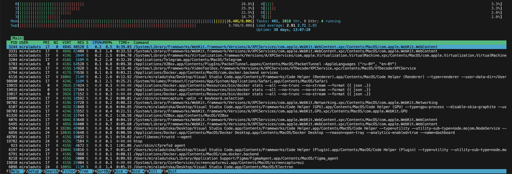
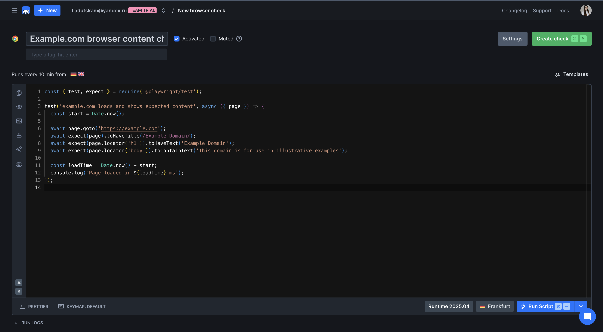
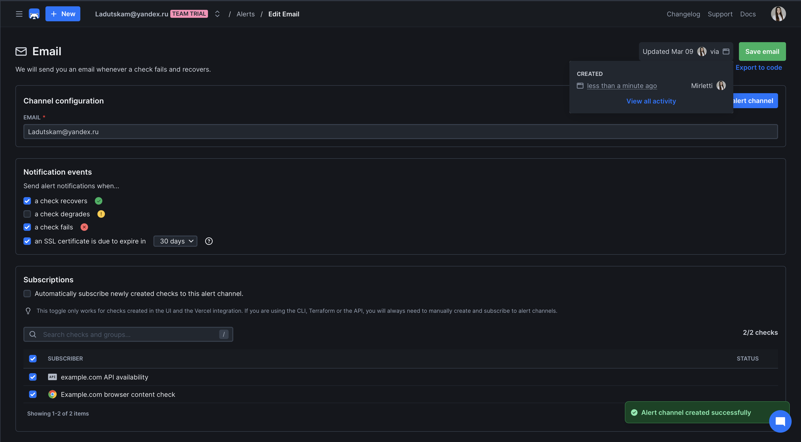

# Lab 8 — Site Reliability Engineering (SRE)


## Task 1 — Key Metrics for SRE and System Analysis

### Monitor CPU, Memory, and I/O Usage:

```bash
htop
iostat 1 5
```



```bash
iostat 1 5
              disk0               disk4               disk5       cpu    load average
    KB/t  tps  MB/s     KB/t  tps  MB/s     KB/t  tps  MB/s  us sy id   1m   5m   15m
   22.31  129  2.81   207.30    0  0.00   405.92    0  0.00  16  8 76  4.28 3.87 3.28
    0.00    0  0.00     0.00    0  0.00     0.00    0  0.00   7  4 89  4.28 3.87 3.28
   19.09   22  0.41     0.00    0  0.00     0.00    0  0.00   5  4 91  4.28 3.87 3.28
   26.00  121  3.08     0.00    0  0.00     0.00    0  0.00   5  3 91  4.28 3.87 3.28
   35.02  296 10.11     0.00    0  0.00     0.00    0  0.00   7  4 89  4.10 3.84 3.27
```

Identify Top Resource Consumers:

- **CPU usage**: com.apple.WebKit.WebContent
- **Memory usage**: com.apple.Virtualization.VirtualMachine
- **I/O usage**: Docker Desktop

### Check Disk Usage:

```bash
df -h
du -h /var | sort -rh | head -n 10
```

```bash
Filesystem        Size    Used   Avail Capacity iused ifree %iused  Mounted on
/dev/disk3s1s1   460Gi    15Gi   210Gi     7%    453k  2.2G    0%   /
devfs            212Ki   212Ki     0Bi   100%     733     0  100%   /dev
/dev/disk3s6     460Gi   5.0Gi   210Gi     3%       5  2.2G    0%   /System/Volumes/VM
/dev/disk3s2     460Gi    15Gi   210Gi     7%    1.9k  2.2G    0%   /System/Volumes/Preboot
/dev/disk3s4     460Gi   751Mi   210Gi     1%     489  2.2G    0%   /System/Volumes/Update
/dev/disk1s2     500Mi   6.0Mi   483Mi     2%       1  4.9M    0%   /System/Volumes/xarts
/dev/disk1s1     500Mi   5.6Mi   483Mi     2%      34  4.9M    0%   /System/Volumes/iSCPreboot
/dev/disk1s3     500Mi   1.1Mi   483Mi     1%      91  4.9M    0%   /System/Volumes/Hardware
/dev/disk3s5     460Gi   212Gi   210Gi    51%    2.9M  2.2G    0%   /System/Volumes/Data
map auto_home      0Bi     0Bi     0Bi   100%       0     0     -   /System/Volumes/Data/home
/dev/disk4s1     1.0Gi   430Mi   594Mi    43%      68  4.3G    0%   /Volumes/Telegram Desktop
/dev/disk2s1     5.0Gi   1.9Gi   3.0Gi    40%      63   32M    0%   /System/Volumes/Update/SFR/mnt1
/dev/disk3s1     460Gi    15Gi   210Gi     7%    453k  2.2G    0%   /System/Volumes/Update/mnt1
/dev/disk7s2     2.5Gi   2.4Gi   170Mi    94%     724  4.3G    0%   /Volumes/Docker

0B    /var
```

### Identify Largest Files:

```bash
sudo find /var -type f -exec du -h {} + | sort -rh | head -n 3
```

```bash
- 2.0G    /private/var/vm/sleepimage
- 390M    /private/var/folders/23/v8lkjpps5mx5w_t0dswtfpz00000gn/X/ru.bitrix.bitrix24desktop.code_sign_clone/code_sign_clone.lbgf9m/Bitrix24.app.bundle/Contents/Frameworks/Bitrix24 Framework.framework/Versions/20.0.28.90/Bitrix24 Framework
- 157M    /private/var/db/uuidtext/dsc/068332B570DD387C9D2814DF021F716F
```

**Analysis:** What patterns do you observe in resource utilization?

- Low CPU usage
- The main load falls on background services and GUI applications
- The memory is used more actively than the CPU
- Many auxiliary processes

**Reflection:** How would you optimize resource usage based on your findings?

- Reducing the number of background applications
- Resource limitation of virtual machines or Docker
- Closing unused applications
- Monitoring long-lived processes
- Setting resource limits


## Task 2 — Practical Website Monitoring Setup 

### Website URL chose to monitor

example.com

### Screenshots of browser check configuration



### Screenshots of successful check results


### Screenshots of alert settings



### Analysis: Why did you choose these specific checks and thresholds?

I chose these checks because they cover both basic uptime and actual user-visible functionality.
The API check verifies that the website responds with HTTP 200 and expected content.
The Browser check validates that the real page loads correctly and displays the expected title and text.
The selected thresholds are strict enough to detect downtime and noticeable slowdown, but not so strict that they create unnecessary noise.

### Reflection: How does this monitoring setup help maintain website reliability?

This setup improves website reliability because it detects both backend availability issues and frontend user experience problems.
API checks provide fast availability monitoring, while browser checks confirm that the site is actually usable from a visitor’s perspective.
Alerts help react quickly to incidents and reduce downtime.
