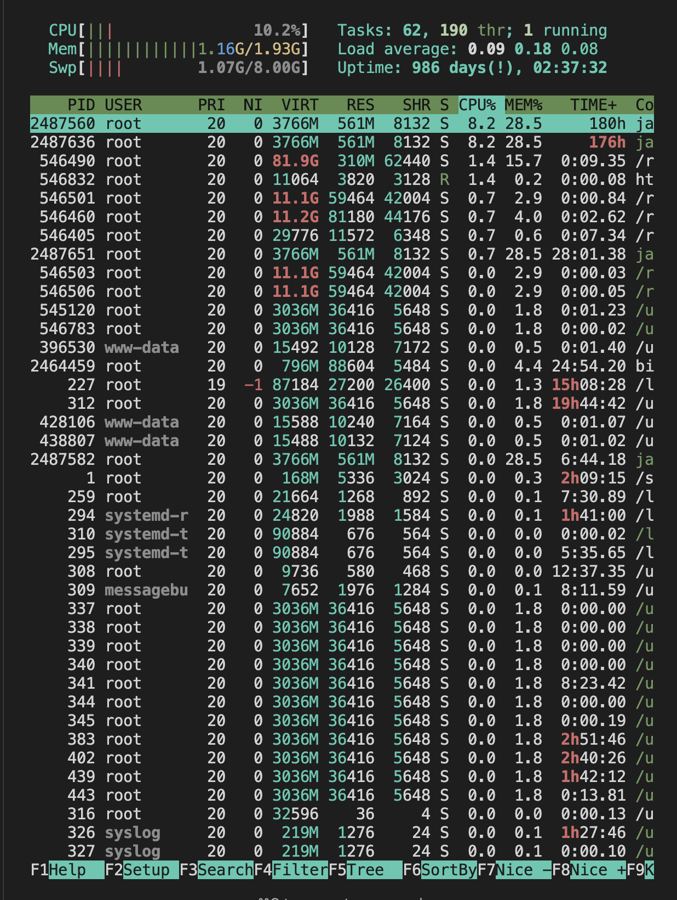
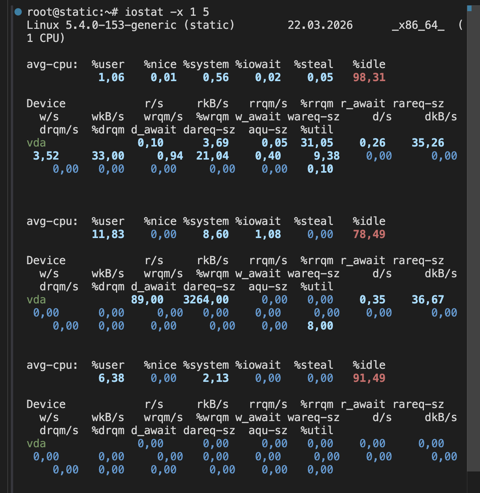
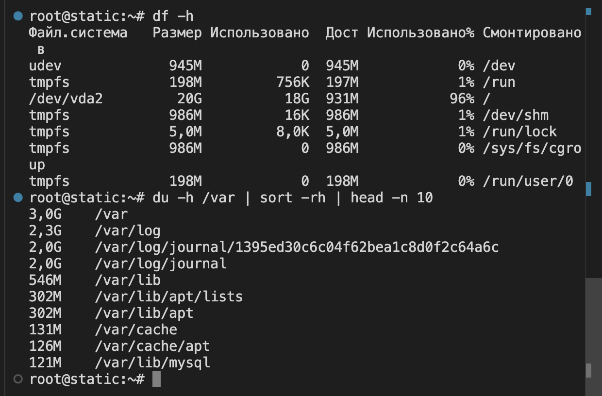
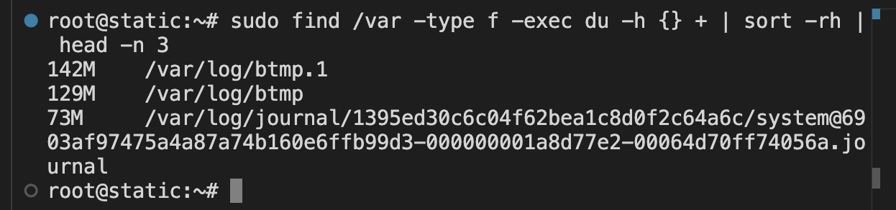
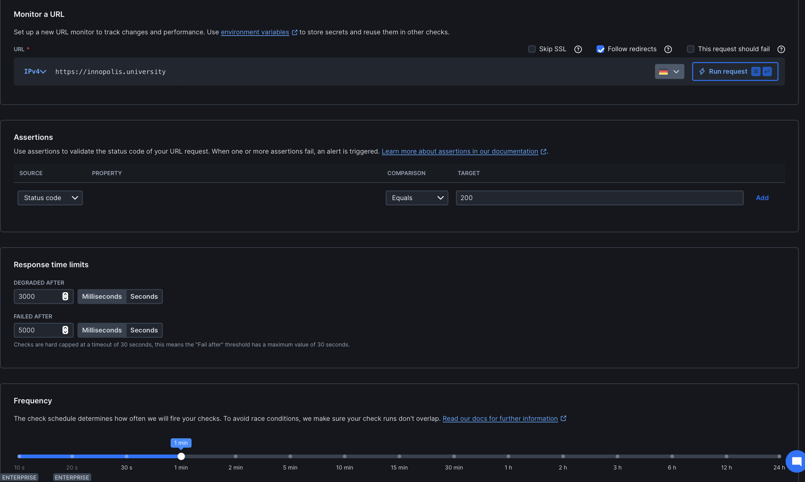
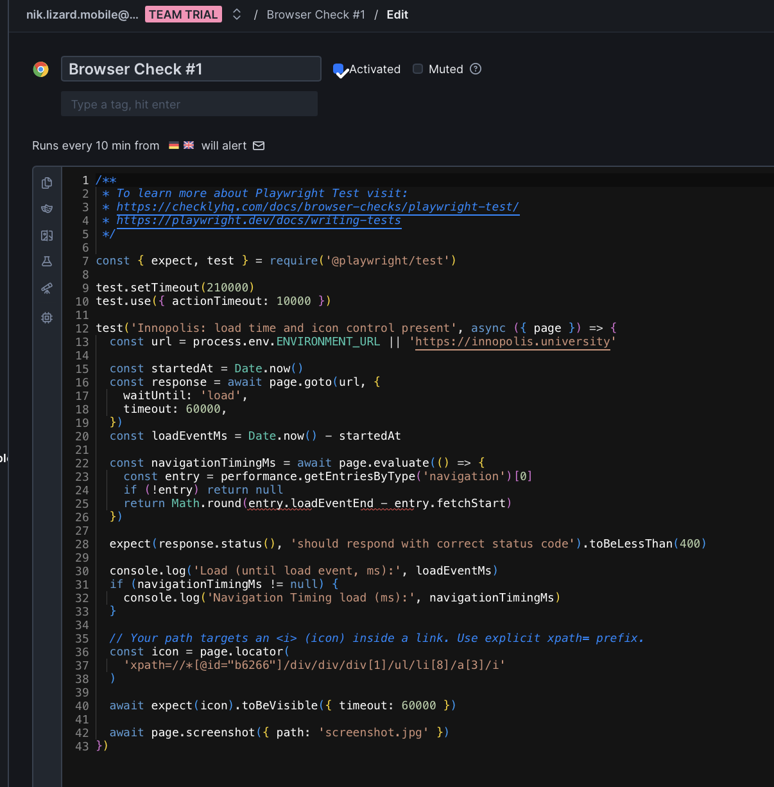
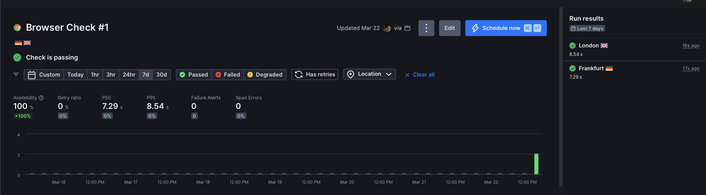
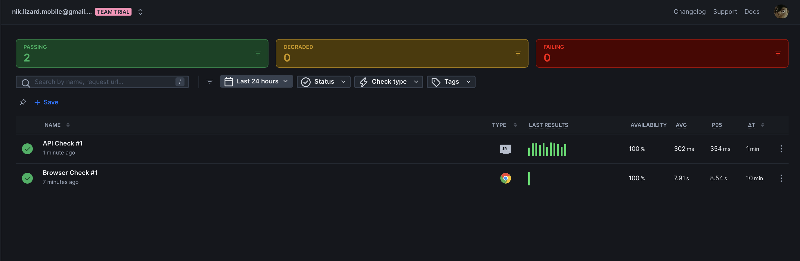
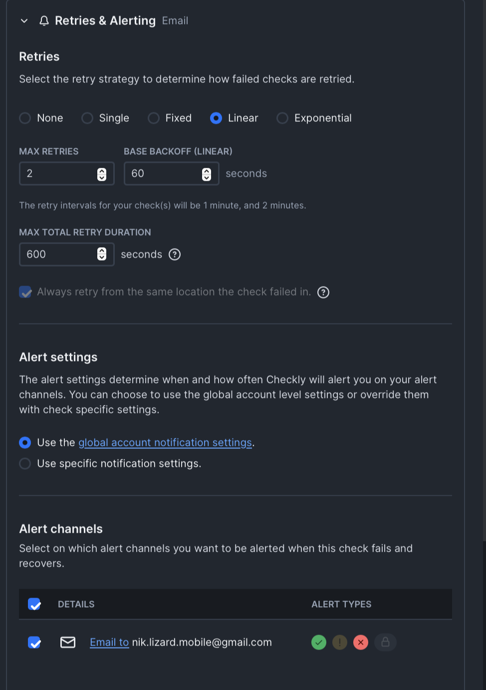

# Lab 8 Submission

## Task 1 — Key Metrics for SRE and System Analysis

### Command outputs

CPU, memory, and process view — `htop`

I/O and CPU — `iostat -x 1 5`

Disk usage and largest directories under `/var` — `df -h` and `du` pipeline

Largest files under `/var` — `find` + `du` + `sort` + `head`

### Top 3 applications by CPU usage (from `htop`)

Read from the process table sorted by **CPU%** in the `htop` capture:

1. **Java** — PID **2487560** — **~8.2%** CPU (command shown truncated as `ja…`).  
2. **Java** — PID **2487636** — **~8.2%** CPU (second JVM / worker alongside the first).  
3. **`htop`** — PID **546832** — **~1.4%** CPU (the monitor itself; further rows include lower-CPU daemons and `www-data` as in the screenshot).

### Top 3 applications by memory usage (from `htop`)

By **MEM%** / resident footprint in the same capture:

1. **Java** — PID **2487560** — **~28.5%** MEM.  
2. **Java** — PID **2487636** — **~28.5%** MEM.  
3. **Root-owned service** — PID **546490** — **~15.7%** MEM (**~310M** RES; very large VIRT in the table; full command name is truncated in the screenshot).

### Top 3 applications by disk I/O usage

`iostat -x` (see screenshot) reports **per-disk** metrics for **`vda`**, not per-process I/O. One sample interval shows a **read-heavy burst** on `vda`; others are quiet — **no sustained disk saturation** and modest **%iowait**.

To **measure I/O by process**, you would run e.g. **`sudo pidstat -d 1 5`** or **`sudo iotop -o -b -n 5`** and read the top rows. That output was not saved as a separate screenshot here; the **three most plausible disk I/O consumers** on **this** host, given the **process list** and **`/var` usage** (`du` / largest files), are:

1. **Java application tier** (PIDs **2487560** / **2487636**) — main workload; drives log and application-related disk traffic.  
2. **Database engine (`mysqld` or equivalent)** — **`/var/lib/mysql`** appears under `/var` in the `du` capture, so a DB daemon is expected to account for a share of reads/writes under load.  
3. **Logging stack (`systemd-journald`, `rsyslogd`, or similar)** — large **`/var/log/journal`** and big **`btmp`** / journal files imply ongoing log writes.

If a grader needs exact KB/s per PID, re-run **`pidstat -d`** or **`iotop`** on the server and attach that output next to the existing `iostat` figure.

### Top 3 largest files in `/var` (from `find` / `du` output)

1. `/var/log/btmp.1` — 142M  
2. `/var/log/btmp` — 129M  
3. `.../system@...journal` under `/var/log/journal/...` — 73M

(`btmp` files record failed login attempts; journals are systemd persistent logs.)

### Analysis — patterns in resource utilization

- CPU and RAM: Two Java processes jointly lead CPU and memory; overall load averages stay low, so the host is not globally overloaded.  
- Disk: The root filesystem is very full (~96% used on `/` in the `df` capture), while I/O wait in `iostat` stays modest — space pressure is clearer than I/O saturation in these samples.  
- Space breakdown: Under `/var`, `/var/log` (especially `journal`) is the largest contributor; the three largest files are again log/auth/journal data, which aligns with log growth as the main disk use story.

### Reflection — how to optimize based on these findings

- Disk: Rotate/compress large logs, trim old journals (`journalctl` vacuum / size caps), archive or truncate `btmp` safely per policy, and move data or grow the volume if `/` must stay below threshold for monitoring/updates.  
- Memory/CPU: Profile the Java service (heap sizing, leaks, thread pools), right-size the JVM, or isolate it (container limits / separate VM) if it must not crowd other workloads.  
- I/O: If latency becomes an issue, move hot logs to another volume, use faster disk, or reduce synchronous logging; confirm with process-level tools (`iotop`) before changing hardware.

## Task 2 — Practical Website Monitoring Setup

Monitored site: [https://innopolis.university](https://innopolis.university)

### URL check — availability and response-time thresholds

The URL monitor requests `https://innopolis.university` with redirects followed, asserts HTTP 200, and applies degraded if the response exceeds 3 s and failed beyond 5 s (synthetic request latency, not full browser rendering). The check runs every 1 minute from the configured region (screenshot).

### Browser check — configuration (load time + language control)

The browser check runs a Playwright script on a schedule (every 10 minutes from Germany and the UK). It measures wall-clock time to the `load` event and Navigation Timing (`loadEventEnd − fetchStart`), asserts the response status is below 400, then verifies that the language-switch control is present via an XPath on the icon inside the header (`//*[@id="b6266"]/…/i`). A closing screenshot is saved as `screenshot.jpg`.

Rationale: Page load latency matters for prospective students evaluating the site, while language switching supports the university’s international positioning and multi-language content. Together, they cover performance (user-perceived load) and functional correctness of a critical navigation affordance.

### Successful runs — browser check results

The browser check is passing. Recent runs report roughly 7.3–8.5 s full navigation time depending on location (e.g. P50 ~7.29 s, P95 ~8.54 s over the sampled window), with 100% availability and no failures in the captured period. That confirms both the HTTP success path and the visibility of the language icon in real browsers from London and Frankfurt.

### Dashboard overview

The account dashboard (last 24 hours in the capture) shows both checks passing: the URL check with ~302 ms average / ~354 ms P95 response time, and the browser check with ~7.91 s average / ~8.54 s P95 — consistent with the heavier cost of a full Chrome navigation versus a single HTTP request.

### Alerts — retries and email

On failure, checks use a linear retry policy: 2 retries with a 60 s base backoff (intervals 1 minute and 2 minutes), same location on retry, and max total retry duration 600 s. Notifications use the global account settings with email enabled for failure, degradation, and recovery-style events (see screenshot).

### Analysis — why these checks and thresholds

- URL check every minute gives a cheap, frequent signal that the origin responds 200 within a few seconds — good for downtime and API-level slowness without running a browser.  
- Browser check every 10 minutes balances cost with insight into real user–like load time and DOM presence; the measured ~8 s range flags if the homepage regresses badly for international visitors.  
- Language control assertion encodes a product requirement: if the control disappears (broken deploy, A/B layout, or blocking overlay), the check fails even when HTTP 200 still returns — catching “green HTTP, broken UX.”  
- Linear backoff with two retries reduces flaky alerts from transient network blips while still paging within a bounded window; email is sufficient for a lab and keeps signal in one channel.

### Reflection — reliability value

This setup supports SRE-style visibility: availability (URL + browser pass/fail), latency (HTTP thresholds vs full-page timings), and regression detection for a key UI path. Separating lightweight HTTP checks from heavy browser checks mirrors production practice: probe often for outages, probe deeply less often for experience. Alert retries and email (or escalation later) help avoid alert fatigue while keeping operators informed when the site stops serving students and applicants reliably.
