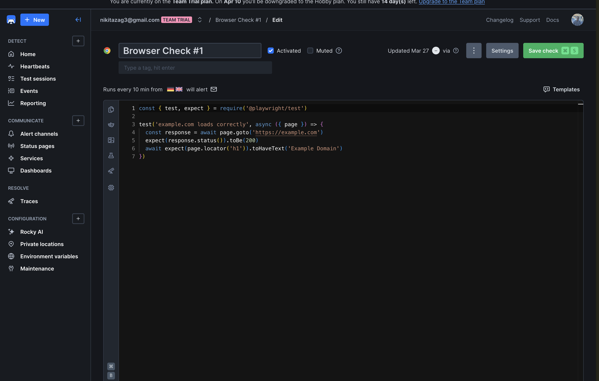
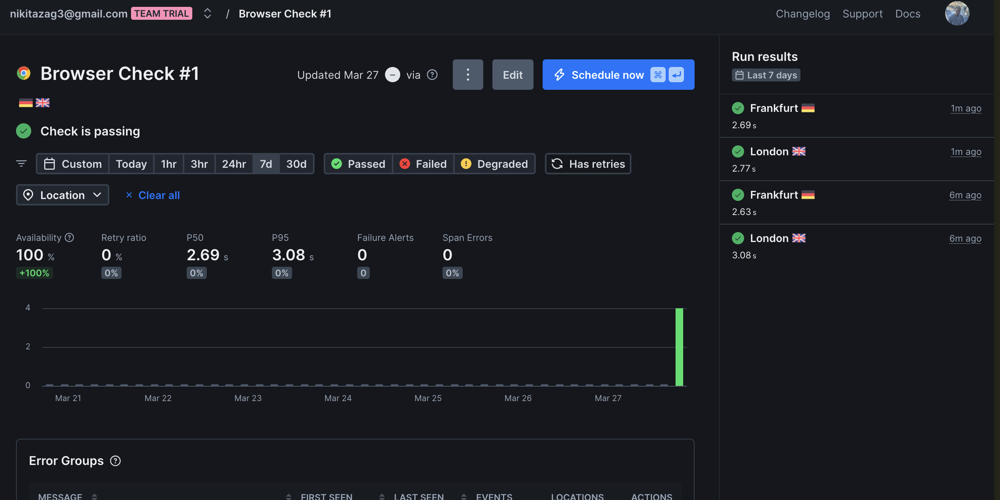
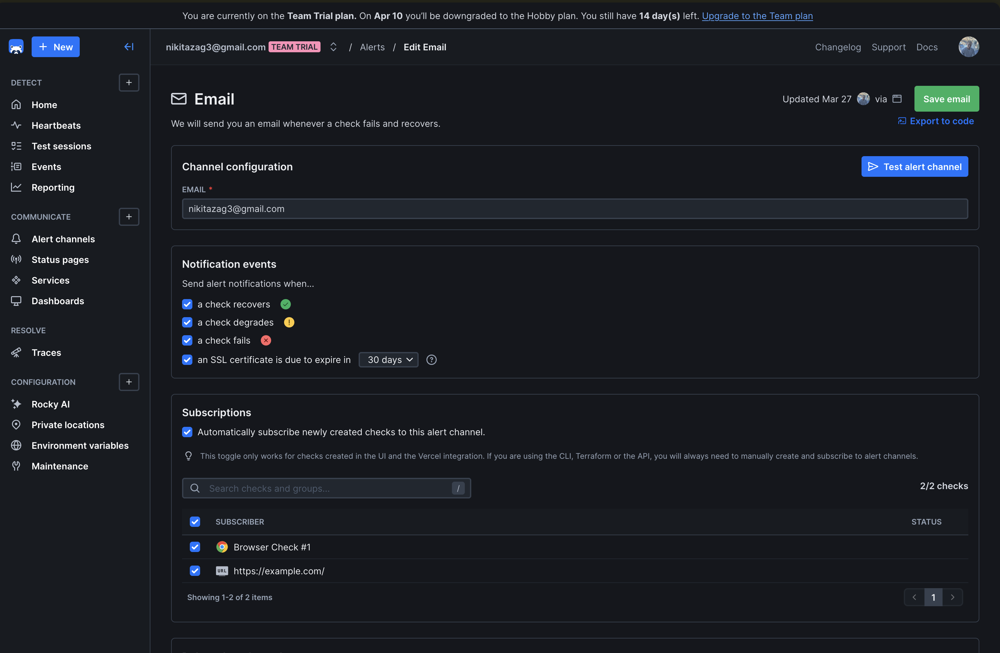
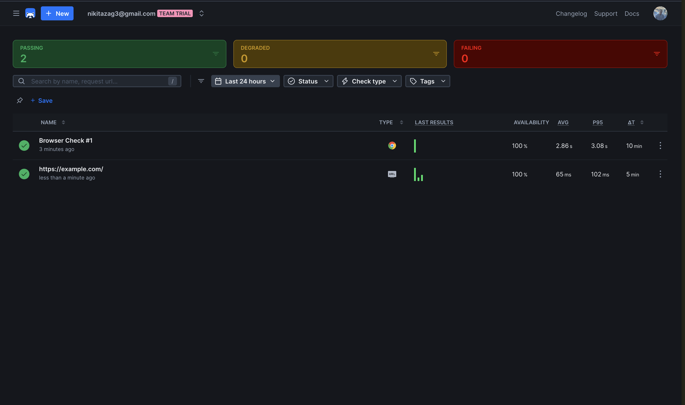

### Task 1

#### 1.1: Monitor System Resources

I ran `iostat`, but did not capture `htop` / process list output, so exact top 3 applications by CPU and memory are not available from this session.

```bash
$ iostat -x 1 5
Linux 6.10.14-linuxkit (9ed6c7fafc01)   03/27/26        _aarch64_       (8 CPU)

avg-cpu:  %user   %nice %system %iowait  %steal   %idle
           0.45    0.00    0.20    0.05    0.00   99.29

Device            r/s     rkB/s   rrqm/s  %rrqm r_await rareq-sz     w/s     wkB/s   wrqm/s  %wrqm w_await wareq-sz     d/s     dkB/s   drqm/s  %drqm d_await dareq-sz     f/s f_await  aqu-sz  %util
vda              8.96    208.63     4.82  34.97    0.18    23.29    3.15    282.06    19.16  85.88    7.92    89.51    0.61   2531.91     0.00   0.00    0.09  4181.40    0.34    0.50    0.03   0.12
vdb             50.97   2688.55     0.12   0.23    0.16    52.75    0.00      0.00     0.00   0.00    0.00     0.00    0.00      0.00     0.00   0.00    0.00     0.00    0.00    0.00    0.01   0.10


avg-cpu:  %user   %nice %system %iowait  %steal   %idle
           0.00    0.00    0.25    0.00    0.00   99.75

Device            r/s     rkB/s   rrqm/s  %rrqm r_await rareq-sz     w/s     wkB/s   wrqm/s  %wrqm w_await wareq-sz     d/s     dkB/s   drqm/s  %drqm d_await dareq-sz     f/s f_await  aqu-sz  %util
vda              0.00      0.00     0.00   0.00    0.00     0.00    0.00      0.00     0.00   0.00    0.00     0.00    0.00      0.00     0.00   0.00    0.00     0.00    0.00    0.00    0.00   0.00
vdb              0.00      0.00     0.00   0.00    0.00     0.00    0.00      0.00     0.00   0.00    0.00     0.00    0.00      0.00     0.00   0.00    0.00     0.00    0.00    0.00    0.00   0.00


avg-cpu:  %user   %nice %system %iowait  %steal   %idle
           0.00    0.00    0.00    0.00    0.00  100.00

Device            r/s     rkB/s   rrqm/s  %rrqm r_await rareq-sz     w/s     wkB/s   wrqm/s  %wrqm w_await wareq-sz     d/s     dkB/s   drqm/s  %drqm d_await dareq-sz     f/s f_await  aqu-sz  %util
vda              0.00      0.00     0.00   0.00    0.00     0.00    0.00      0.00     0.00   0.00    0.00     0.00    0.00      0.00     0.00   0.00    0.00     0.00    0.00    0.00    0.00   0.00
vdb              0.00      0.00     0.00   0.00    0.00     0.00    0.00      0.00     0.00   0.00    0.00     0.00    0.00      0.00     0.00   0.00    0.00     0.00    0.00    0.00    0.00   0.00


avg-cpu:  %user   %nice %system %iowait  %steal   %idle
           0.00    0.00    0.25    0.00    0.00   99.75

Device            r/s     rkB/s   rrqm/s  %rrqm r_await rareq-sz     w/s     wkB/s   wrqm/s  %wrqm w_await wareq-sz     d/s     dkB/s   drqm/s  %drqm d_await dareq-sz     f/s f_await  aqu-sz  %util
vda              0.00      0.00     0.00   0.00    0.00     0.00    0.00      0.00     0.00   0.00    0.00     0.00    0.00      0.00     0.00   0.00    0.00     0.00    0.00    0.00    0.00   0.00
vdb              0.00      0.00     0.00   0.00    0.00     0.00    0.00      0.00     0.00   0.00    0.00     0.00    0.00      0.00     0.00   0.00    0.00     0.00    0.00    0.00    0.00   0.00


avg-cpu:  %user   %nice %system %iowait  %steal   %idle
           0.12    0.00    0.99    0.00    0.00   98.88

Device            r/s     rkB/s   rrqm/s  %rrqm r_await rareq-sz     w/s     wkB/s   wrqm/s  %wrqm w_await wareq-sz     d/s     dkB/s   drqm/s  %drqm d_await dareq-sz     f/s f_await  aqu-sz  %util
vda              0.00      0.00     0.00   0.00    0.00     0.00  136.00  83448.00   970.00  87.70   47.76   613.59    0.00      0.00     0.00   0.00    0.00     0.00    0.00    0.00    6.50   3.40
vdb              0.00      0.00     0.00   0.00    0.00     0.00    0.00      0.00     0.00   0.00    0.00     0.00    0.00      0.00     0.00   0.00    0.00     0.00    0.00    0.00    0.00   0.00
```

Top resource consumers:
- CPU usage: not captured
- Memory usage: not captured
- I/O usage: device `vda` had the biggest write burst in the last sample, `vdb` had the biggest read activity in the first sample

#### 1.2: Disk Space Management

```bash
$ df -h
Filesystem      Size  Used Avail Use% Mounted on
overlay         503G   69G  409G  15% /
tmpfs            64M     0   64M   0% /dev
shm              64M     0   64M   0% /dev/shm
/dev/vda1       503G   69G  409G  15% /etc/hosts
tmpfs           3.9G     0  3.9G   0% /proc/scsi
tmpfs           3.9G     0  3.9G   0% /sys/firmware
```

---

```bash
$ du -h /var | sort -rh | head -n 10
71M     /var
69M     /var/lib
63M     /var/lib/apt/lists
63M     /var/lib/apt
6.2M    /var/lib/dpkg
5.7M    /var/lib/dpkg/info
1.7M    /var/cache/debconf
1.7M    /var/cache
376K    /var/log
320K    /var/lib/systemd
```

---

`sudo` was not available in this environment, so I used `find` without `sudo`:

```bash
$ find /var -type f -exec du -h {} + | sort -rh | head -n 3
30M     /var/lib/apt/lists/ports.ubuntu.com_ubuntu-ports_dists_noble_universe_binary-arm64_Packages.lz4
8.1M    /var/lib/apt/lists/ports.ubuntu.com_ubuntu-ports_dists_noble-updates_restricted_binary-arm64_Packages.lz4
7.8M    /var/lib/apt/lists/ports.ubuntu.com_ubuntu-ports_dists_noble-security_restricted_binary-arm64_Packages.lz4
```

### Observations and Analysis

- CPU usage was very low in all samples, and `%idle` stayed close to `99-100%`.
- I/O usage was mostly low, with a short write spike on `vda` and a read spike on `vdb`.
- `/var` usage is mostly under `/var/lib`, especially `/var/lib/apt/lists`.
- Top 3 largest files in `/var` were all package list files under `/var/lib/apt/lists`.
- I think this environment is mostly idle, with occasional package-management related disk activity.
- To optimize resource usage, I would first clean apt cache / package lists if not needed, avoid unnecessary background writes, and capture process-level data with `htop` or `ps` next time for CPU and memory consumers.

### Task 2

Website chosen for monitoring: `https://example.com`

#### Browser check configuration

Used a browser check for `example.com` with simple content validation.



#### Successful check result

The check completed successfully.



#### Alert settings

Configured alerts for the check and confirmed email notifications.




#### Dashboard overview

Dashboard with created checks:



### Observations and Analysis

- I chose `example.com` because it is public, simple, and stable enough for a basic monitoring demo.
- I used a browser check because it validates not only availability, but also page content.
- A success status plus expected page content helps detect both downtime and incorrect responses.
- Alerting by email is enough for this lab, since it gives immediate notification if the check starts failing.
- This setup helps maintain website reliability because it checks whether the page is reachable and whether the expected content is still shown.
