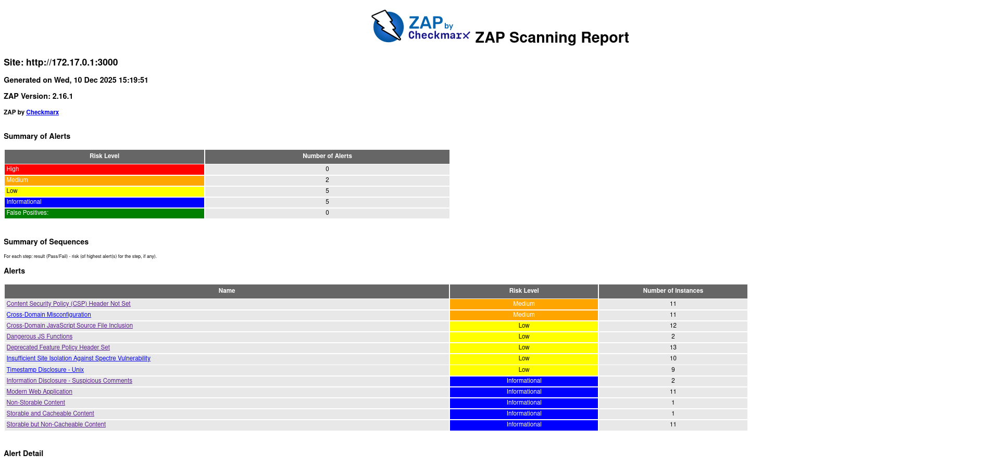
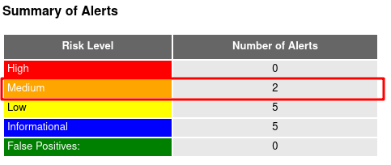
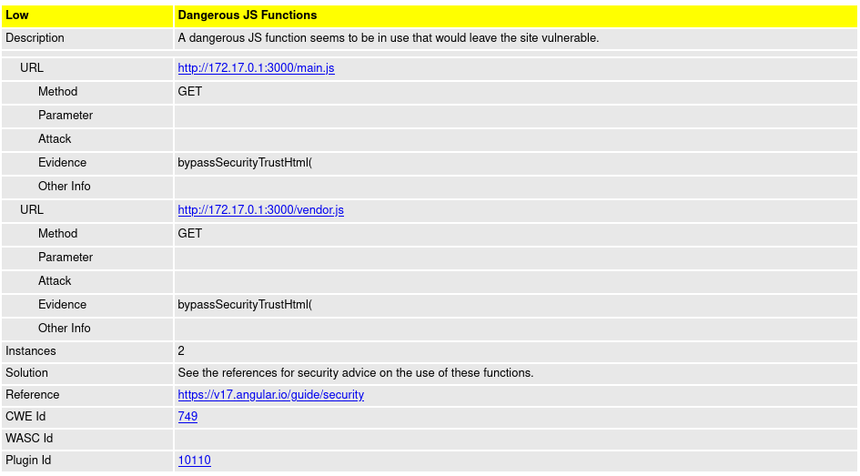
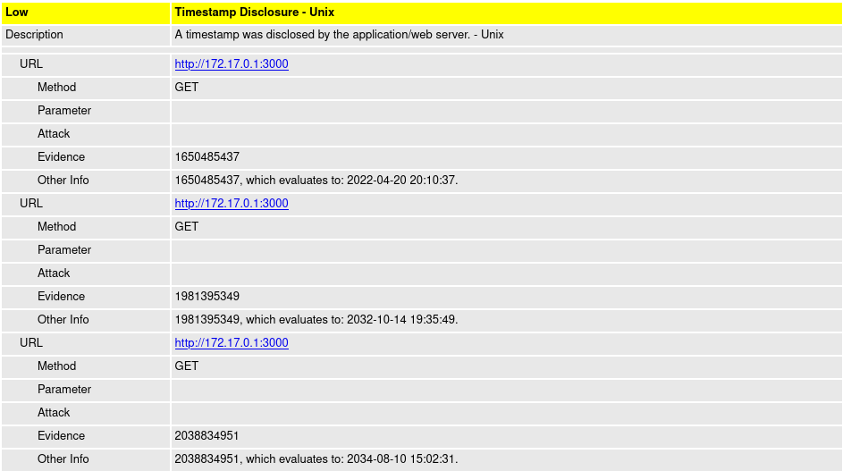

## Task 1

Alerts Summary:


2 Medium vulnerabilities

Misssing header: Content Security Policy (CSP)

Depercated header: Feature-Policy, instead of Permissions-Policy

Personally interesting vulnerabilities:

Dangerous JS Functions


Timestamp Disclosure


From my experience, the most common vulnerability is misused headers, mostly because nobody cares to use them correctly

## Task 2

```sh
sudo docker run --rm -v /var/run/docker.sock:/var/run/docker.sock aquasec/trivy:latest image --severity HIGH,CRITICAL bkimminich/juice-shop > Desktop/out.txt 
[RatPC|rightrat ~] cat Desktop/out.txt | grep Total
Total: 31 (HIGH: 23, CRITICAL: 8)
```
Vulnerabilities:
crypto-js (package.json) (CRITICAL), as per CVE-2023-46233
marsdb (package.json) (CRITICAL), as per GHSA-5mrr-rgp6-x4gr

Most common type: node-pkg

A screenshot of Trivy would be too big to attach, so instead the output is in the out.txt file.

It is neccessary to scan images before deployment because as soon as you deploy anything, robots will swarm your service in order to attack it/you. Cybersecurity cannot be overlooked, especially in enterprise.

I would add a requirement for passing the image scan without any non-low vulnerabilities before deployment, failing the deployment otherwise.