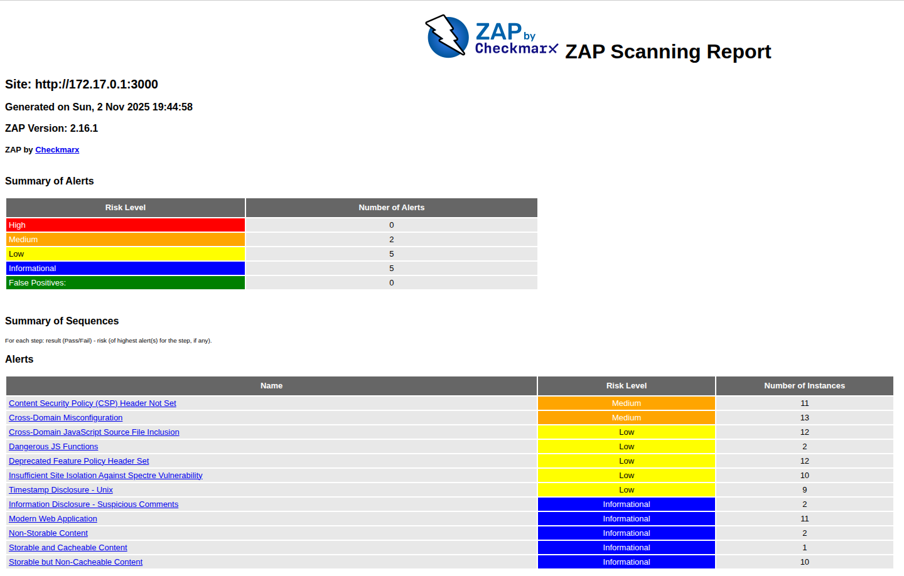
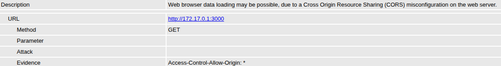
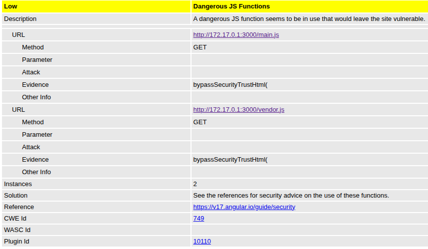
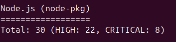
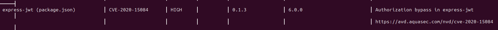
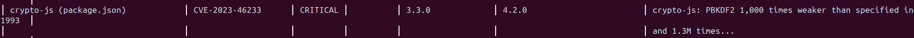

# Lab 9 — Introduction to DevSecOps Tools
## Task 1 — Web Application Scanning with OWASP ZAP
Web application scanning helps discover security flaws like XSS, SQL injection, and misconfigurations before attackers exploit them. ZAP is an industry-standard tool maintained by OWASP.

### ZAP Overview

### 2 Medium risk vulnerabilities found

### Interesting vulnerabilities
1. Cross-domain misconfiguration

- Web browser data loading may be possible, due to a Cross Origin Resource Sharing (CORS) misconfiguration on the web server.
- Due to the `Access-Control-Allow-Origin: *` security header, any origin can fetch the resource. The header should either be removed or set to specific origins

2. Dangerous JS function used to bypass SecurityTrustHtml

### Security Headers
- `X-Frame-Options` is set to `SAMEORIGIN`. The official recommendation is `NONE`
- `X-Content-Type-Options: nosniff` (good)
- `Content-Type: text/html; charset=UTF-8` (good, prevents XSS in HTML)
- `Access-Control-Allow-Origin` is set to `*` (insecure)

Missing:
- `X-XSS-Protection` (recommendation is `0`, so its absence is okay)
- `Referrer-Policy` (should be `strict-origin-when-cross-origin`)
- `Strict-Transport-Security` (for enforcing HTTPS, should be `max-age=63072000; includeSubDomains; preload`)
- `Content-Security-Policy` (specifies the origin of content that is allowed to be loaded on a website)
- `Cross-Origin-Opener-Policy` (should be `same-origin`)
- `Cross-Origin-Resource-Policy` (should be `same-site`)

### Analysis
What type of vulnerabilities are most common in web applications?
- **Broken Access Control**: misconfigurations that allow users to act outside of their intended permissions
- **Cryptographic Failures**: improperly protecting sensitive data
- **Injection**: tricking an interpreter into executing unintended commands
- **Server-Side Request Forgery**: tricking a server into making unauthorized requests
- **Identification and Authentication Failures**: weak passwords, using tokens that don't timeout, exposing session IDs

## Task 2 — Container Vulnerability Scanning with Trivy
### Total number of vulnerabilities
- `HIGH`: 25
- `CRITICAL`: 8

Primarily coming from `Node.js` (`node-pkg`)

### Vulnerable packages
1. `express-jwt` v0.1.3 has authorization bypass vulnerability

2. `crypto-js` v3.3.0 is an insecure cryptographic library

### Most common vulnerability type
- **Broken Authentication** (e.g. `nodejs-jsonwebtoken` CVE-2015-9235, `express-jwt` CVE-2020-15084)
- In general, **vulnerable software packages**

### Analysis
Why is container image scanning important before deploying to production?
- It allows to detect weaknesses at development stage before exposing them to real attackers and patch them to ensure security of the product

### Reflection
How would you integrate these scans into a CI/CD pipeline?
- Implement a CI workflow that runs a vulnerability scanning tool on the product after building and testing
- If there are any CRITICAL vulnerabilities found, fail the workflow and notify developers