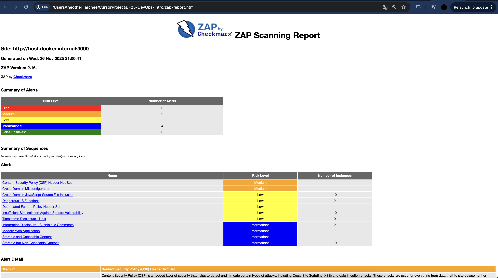
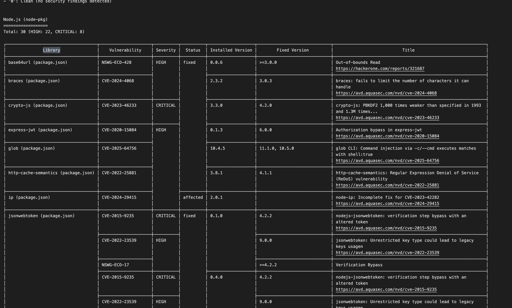

# Lab 9 Submission — Introduction to DevSecOps Tools

## Task 1 — Web Application Scanning with OWASP ZAP

### Target
- **App:** OWASP Juice Shop (intentionally vulnerable)
- **URL:** `http://localhost:3000`
- **Deployed:** Docker container `bkimminich/juice-shop`

### ZAP Scan Results

**Summary:**
- Scanned 95 URLs
- **Medium:** 2 alerts
- **Low:** 5 alerts
- **Informational:** 4 alerts

**Medium Risk (2):**
1. **Content Security Policy (CSP) Header Not Set** (11 instances) — No CSP headers means XSS attacks are easier to pull off
2. **Cross-Domain Misconfiguration** (11 instances) — CORS issues that could enable CSRF attacks

**Low Risk (5):**
- Cross-Domain JavaScript Source File Inclusion (10 instances)
- Dangerous JS Functions like `eval()` (2 instances)
- Deprecated Feature Policy Header (11 instances)
- Insufficient Site Isolation (10 instances)
- Timestamp Disclosure (9 instances)

### Two Most Interesting Vulnerabilities

**1. CSP Header Not Set**

CSP is a defense-in-depth layer that tells browsers what scripts/resources are allowed. Without it, any XSS bug becomes way more dangerous because there's nothing blocking malicious scripts. Super common oversight — easy to miss, easy to fix.

**2. Dangerous JS Functions**

Found `eval()` or similar functions that can execute arbitrary code. If user input reaches these without sanitization, you're looking at remote code execution. In a Node.js app, that's game over.

### Security Headers Status

**Missing:**
- CSP — should be there
- X-Content-Type-Options — should be "nosniff"
- HSTS — not applicable for HTTP, but needed in production

**Present:**
- Feature-Policy — but it's deprecated, should use Permissions-Policy instead

Headers matter because they're the first line of defense. Even if your code has bugs, proper headers can mitigate the damage.

### Screenshot

### Task 1 Analysis

**What type of vulnerabilities are most common in web applications?**

From this scan, the pattern is clear:

1. **Configuration issues** — Missing headers, deprecated policies. These don't break functionality, so they get ignored until someone scans.

2. **Cross-domain problems** — Modern apps use CDNs and multiple domains, so CORS misconfigurations are everywhere.

3. **Information leakage** — Timestamps, stack traces, version numbers. Developers expose way more than needed.

4. **Unsafe APIs** — Using `eval()` or `innerHTML` because it's convenient, not realizing the security implications.

Most of these are easy to fix but easy to miss. That's why automated scanning is essential — catches what humans overlook.

---

## Task 2 — Container Vulnerability Scanning with Trivy

### Target
- **Image:** `bkimminich/juice-shop:latest`
- **Base OS:** Debian 12.12 (clean, no OS vulnerabilities)

### Trivy Scan Results

**Summary:**
- **CRITICAL:** 8
- **HIGH:** 22
- **Total:** 30 HIGH/CRITICAL vulnerabilities
- **Secrets:** Found 2 RSA private keys in source code (yikes)

All vulnerabilities are in Node.js packages. The base OS is clean.

### Two Vulnerable Packages with CVE IDs

**1. crypto-js (CVE-2023-46233) — CRITICAL**
- Version: 3.3.0 → should be 4.2.0
- Issue: PBKDF2 is 1,000x weaker than 1993 spec and 1.3M times weaker than current recommendations
- Impact: Weak crypto = easier to crack encrypted data

**2. vm2 (CVE-2023-32314) — CRITICAL**
- Version: 3.9.17 → should be 3.9.18
- Issue: Sandbox escape
- Impact: Attackers can break out of the sandbox and run code on the host

**Other critical ones:**
- jsonwebtoken (CVE-2015-9235) — verification bypass
- lodash (CVE-2019-10744) — prototype pollution
- marsdb (GHSA-5mrr-rgp6-x4gr) — command injection

### Most Common Vulnerability Type

**Prototype pollution and code injection** dominate:
- lodash has multiple prototype pollution CVEs
- marsdb, vm2, jsonwebtoken all have code execution/bypass issues
- crypto-js has weak cryptography

JavaScript's flexibility is a double-edged sword. Third-party deps introduce risk, especially in security-critical libraries (crypto, auth).

### Screenshot

### Task 2 Analysis

**Why is container image scanning important before deploying to production?**

Simple answer: catch vulnerabilities before they hit production. In this scan, we found 30 HIGH/CRITICAL issues that could lead to:
- Remote code execution (vm2, marsdb)
- Auth bypass (jsonwebtoken)
- Data compromise (crypto-js, prototype pollution)

Fixing these in production costs way more than fixing them during development. Plus, scanning gives you severity ratings to prioritize — CRITICAL should block deployments, HIGH needs attention.

Base images can have vulnerabilities too (though Debian 12.12 was clean here). Supply chain attacks are real, so scanning helps catch compromised packages before they reach production.

### Task 2 Reflection

**How would you integrate these scans into a CI/CD pipeline?**

**Basic setup:**
- Run Trivy on every Docker build, fail on CRITICAL
- Run ZAP on staging deployments
- Generate reports (SARIF, HTML) and store them

**Policy:**
- Development: warn on HIGH, fail on CRITICAL
- Staging: fail on HIGH, require approval
- Production: zero tolerance — all HIGH/CRITICAL must be fixed

**Automation:**
- Use Dependabot/Renovate for dependency updates
- Send alerts to Slack/email
- Track trends over time

The key is making security part of the workflow, not an afterthought. Start strict, adjust based on your team's capacity, but always prioritize CRITICAL vulnerabilities that could lead to RCE or data breaches.

---

## Final Thoughts

Both scans found real issues. ZAP caught missing headers and misconfigurations — easy fixes that are easy to miss. Trivy found 30 HIGH/CRITICAL vulnerabilities in dependencies — the kind that could lead to RCE or data breaches.

The takeaway: automated scanning is essential. Manual reviews don't scale, and these tools catch what humans miss. Combining application-level (ZAP) and container-level (Trivy) scanning gives you defense-in-depth, catching vulnerabilities at different layers.

Most vulnerabilities are in dependencies and configuration, not your code. That's both good news (easier to fix) and bad news (harder to spot without scanning).
