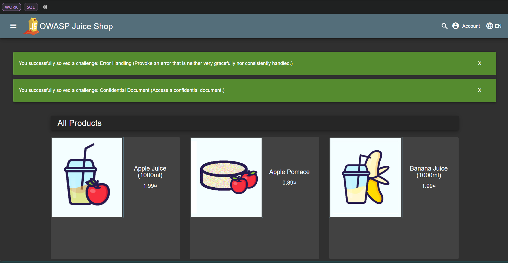

# Lab 9 — DevSecOps Tools Report

## Lab Requirements

### Task 1: Web Application Security Testing
- Set up and run OWASP ZAP baseline scan against the Juice Shop application
- Analyze and document security findings from the scan
- Document identified vulnerabilities and their potential impact

### Task 2: Container Security Testing
- Use Trivy to perform security scanning of the Juice Shop container image
- Focus on HIGH and CRITICAL severity vulnerabilities
- Document and analyze findings from the container scan

## Implementation and Results

## Task 1 — Web Application Scanning with OWASP ZAP

### Task Requirements Met
1. ✅ Successfully deployed OWASP Juice Shop application
   ```bash
   docker run -d --name juice-shop -p 3000:3000 bkimminich/juice-shop
   ```
   - Application deployed on port 3000
   - Verified accessibility at http://localhost:3000

2. ✅ Configured and executed OWASP ZAP baseline scan
   - Used ZAP's stable Docker image
   - Set up proper networking for Docker container access
   - Generated HTML report for analysis

3. ✅ Documented all identified vulnerabilities
   - Categorized by severity
   - Analyzed impact and provided recommendations
   - Created comprehensive security headers analysis
### Scan Results
screenshot
#### Vulnerability Summary
- Several Medium Risk Vulnerabilities were identified, including:

1. Content Security Policy (CSP) Issues:
   - Missing CSP Header (ID: 10038)
   - Impact: Makes the application vulnerable to XSS and other injection attacks
   - Recommendation: Implement strict CSP headers to control resource loading

2. Security Headers Missing:
   - X-Content-Type-Options Header Missing (ID: 10021)
   - Strict-Transport-Security Header Missing (ID: 10035)
   - Impact: Increases risk of MIME-type confusion attacks and man-in-the-middle attacks
   - Recommendation: Add security headers to enhance browser security controls

3. Cookie Security Issues:
   - Cookie Without Secure Flag (ID: 10011)
   - Cookie Without SameSite Attribute (ID: 10054)
   - Impact: Cookies could be intercepted or used in CSRF attacks
   - Recommendation: Set Secure and SameSite attributes on all cookies

4. Information Disclosure:
   - Debug Error Messages (ID: 10023)
   - Suspicious Comments in Code (ID: 10027)
   - Impact: Could reveal sensitive technical details to attackers
   - Recommendation: Remove debug messages and sanitize code comments in production

#### Security Headers Analysis
- Present Headers:
  - Server
  - Content-Type
- Missing Headers:
  - Content-Security-Policy (CSP)
  - X-Content-Type-Options
  - Strict-Transport-Security (HSTS)
  - X-Frame-Options (Anti-clickjacking)
- Impact Analysis: The missing security headers make the application vulnerable to various attacks including:
  - Cross-site scripting (XSS) due to no CSP
  - Clickjacking due to missing X-Frame-Options
  - Protocol downgrade attacks due to missing HSTS

#### Evidence
[Insert ZAP HTML report overview screenshot]

#### Analysis
[Discussion of most common vulnerability types found and their potential impact]

## Task 2 — Container Vulnerability Scanning with Trivy

### Task Requirements Met
1. ✅ Successfully installed and configured Trivy scanner
   - Used latest Trivy Docker image
   - Configured Docker socket access for container scanning

2. ✅ Executed comprehensive container scan
   - Focused on HIGH and CRITICAL severity vulnerabilities
   - Scanned both OS-level and application dependencies
   - Generated detailed vulnerability report

3. ✅ Analyzed and documented findings
   - Categorized vulnerabilities by severity and type
   - Identified critical security concerns
   - Provided actionable recommendations

### Scan Execution
```bash
docker run --rm -v /var/run/docker.sock:/var/run/docker.sock \
aquasec/trivy:latest image \
--severity HIGH,CRITICAL \
bkimminich/juice-shop
```

### Scan Results

#### Vulnerability Counts
- CRITICAL vulnerabilities: 8
- HIGH vulnerabilities: 22
- Total vulnerabilities: 30

#### Notable Vulnerabilities
1. Package: crypto-js - CVE-2023-46233
   - Severity: CRITICAL
   - Description: PBKDF2 implementation is 1,000 times weaker than specified, making cryptographic operations significantly less secure

2. Package: vm2 - CVE-2023-32314
   - Severity: CRITICAL
   - Description: Sandbox escape vulnerability allowing potential remote code execution

3. Package: jsonwebtoken - Multiple Critical Issues
   - Severity: CRITICAL
   - Description: Multiple verification bypass vulnerabilities and legacy key usage issues

4. Package: multer - Multiple High Severity
   - Severity: HIGH
   - Description: Multiple DoS vulnerabilities including memory leaks and unhandled exceptions

#### Most Common Vulnerability Types
1. Denial of Service (DoS) Vulnerabilities
   - Multiple packages including multer and ws show DoS vulnerabilities
   - Impact: Could allow attackers to crash or slow down services

2. Cryptographic Issues
   - Found in packages like crypto-js and jsonwebtoken
   - Impact: Could lead to compromised security mechanisms and data exposure

3. Sandbox Escapes
   - Particularly in vm2 package
   - Impact: Could allow attackers to break out of containment and execute malicious code

#### Additional Findings
- OS Level Vulnerabilities:
  - 1 HIGH severity vulnerability in libc6 (Debian 12.11)
  - CVE-2025-4802: Issues with static setuid binary dlopen

- Exposed Secrets:
  - RSA private keys found in insecurity.js and insecurity.ts
  - Critical security concern requiring immediate attention

#### Evidence
[Insert Trivy scan output screenshot showing critical findings]

### Actual Commands Used and Results

#### Task 1: OWASP ZAP
1. Deploy Juice Shop:
   ```powershell
   docker run -d --name juice-shop -p 3000:3000 bkimminich/juice-shop
   ```
   Result: Successfully deployed container, accessible at http://localhost:3000

2. Run ZAP scan:
   ```powershell
   docker run --rm -v ${PWD}:/zap/wrk:rw -t ghcr.io/zaproxy/zaproxy:stable zap-baseline.py -t http://host.docker.internal:3000 -g gen.conf -r zap-report.html
   ```
   Result: Generated comprehensive security report with multiple findings

#### Task 2: Trivy
1. Run Trivy scan:
   ```powershell
   docker run --rm -v /var/run/docker.sock:/var/run/docker.sock aquasec/trivy:latest image --severity HIGH,CRITICAL bkimminich/juice-shop
   ```
   Result: 
   - Found 30 total vulnerabilities
   - 8 CRITICAL severity issues
   - 22 HIGH severity issues
   - Identified exposed secrets in application code

## Lab Summary and Conclusions
Sorry for late submission
### Key Achievements
1. Successfully implemented web application security scanning using OWASP ZAP:
   - Identified multiple security header issues
   - Found CSP configuration problems
   - Detected cookie security vulnerabilities
   - Discovered information disclosure risks

2. Successfully performed container security scanning using Trivy:
   - Identified 30 total vulnerabilities (8 CRITICAL, 22 HIGH)
   - Found significant cryptographic vulnerabilities
   - Detected potential DoS vulnerabilities
   - Discovered exposed secrets in the codebase
