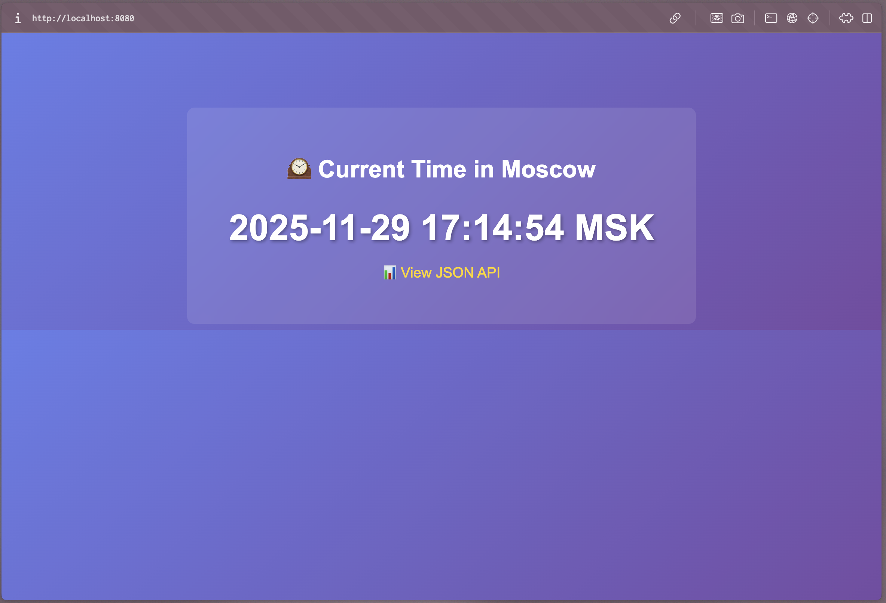

# Lab 9 — Introduction to DevSecOps Tools

# Task 1 — Web Application Scanning with OWASP ZAP 

### Summary
| Risk Level | Risks |
| ----------- | -------: |
| High        | 0 |
| Medium      | 2 |
| Low         | 5 |
| Informational | 4 |

### at least 2 Medium risk vulnerabilities

Web browser data loading may be possible, due to a Cross Origin Resource Sharing (CORS) misconfiguration on the web server.

Access-Control-Allow-Origin: *
The CORS misconfiguration on the web server permits cross-domain read requests from arbitrary third party domains, using unauthenticated APIs on this domain. Web browser implementations do not permit arbitrary third parties to read the response from authenticated APIs, however. This reduces the risk somewhat. This misconfiguration could be used by an attacker to access data that is available in an unauthenticated manner, but which uses some other form of security, such as IP address white-listing.

### Security Headers

| Header | Status | Explanation |
| ------- | ------- | ----------- |
| **Content-Security-Policy (CSP)** | Missing | Helps prevent **Cross-Site Scripting (XSS)**, **data injection**, and **clickjacking** by specifying which resources (scripts, images, styles) can be loaded. Without CSP, attackers can more easily inject malicious scripts into the page. |
| **X-Frame-Options** |  Missing | Controls whether the site can be embedded in an `<iframe>`. Without it, the application is vulnerable to **clickjacking attacks**, where users can be tricked into interacting with hidden elements. |
| **X-Content-Type-Options** |  Present | Prevents browsers from **MIME-sniffing** content types. It tells browsers to trust the declared `Content-Type` and helps prevent certain **injection** and **drive-by download** attacks. |
| **Strict-Transport-Security (HSTS)** |  Missing | Enforces **HTTPS-only connections** and prevents protocol downgrade attacks, protecting users from **man-in-the-middle (MITM)** threats. |

### Analysis: Common Web Application Vulnerabilities

The most common web vulnerabilities include:

- **Cross-Site Scripting (XSS):** Unsanitized input allows script injection.  
- **Injection (SQL, Command):** Unvalidated input manipulates backend queries.  
- **Broken Authentication:** Weak or exposed session handling.  
- **Security Misconfiguration:** Missing headers, debug info, or default settings.

**Summary:**  
Most web app vulnerabilities stem from poor input validation, weak authentication, and misconfigurations — as highlighted in the **OWASP Top 10**.

# Task 2 — Container Vulnerability Scanning with Trivy 

### Summary
| Severity | Count |
| --------- | -----: |
| CRITICAL  | **8** |
| HIGH      | **23** |
| **Total** | **31** |

### Scan Summary

- **Total CRITICAL vulnerabilities:** 4  
- **Total HIGH vulnerabilities:** 3  
- **Vulnerable packages:** `jsonwebtoken [CVE-2015-9235]`, `lodash [CVE-2019-10744]`, `crypto-js [CVE-2023-46233]`, `vm2 [CVE-2023-32314]`, `libc6 [CVE-2025-4802]`, `ws [CVE-2024-37890]`  
- **Most common vulnerability type:** **Vulnerable or outdated dependencies** (CVE category: *Broken Authentication / Code Execution Risks*)

### Analysis: Importance of Container Image Scanning
Container image scanning is essential before deploying to production because it:
- Detects **known vulnerabilities (CVEs)** in base images and dependencies.  
- Prevents **compromised or outdated packages** from reaching production.  
- Ensures compliance with **security and organizational policies**.  
- Reduces the attack surface by identifying risky libraries early in the development cycle.

---

### Reflection: Integrating Scans into CI/CD
To maintain secure pipelines, image scanning should be automated in the **CI/CD process** by:
- Adding **Trivy or similar tools** as a build step (e.g., GitHub Actions, Jenkins).  
- Setting **fail conditions** if CRITICAL or HIGH vulnerabilities are found.  
- Continuously rescanning updated images to catch **newly disclosed CVEs**.  
- Integrating results into **security dashboards or issue trackers** for visibility and remediation tracking.