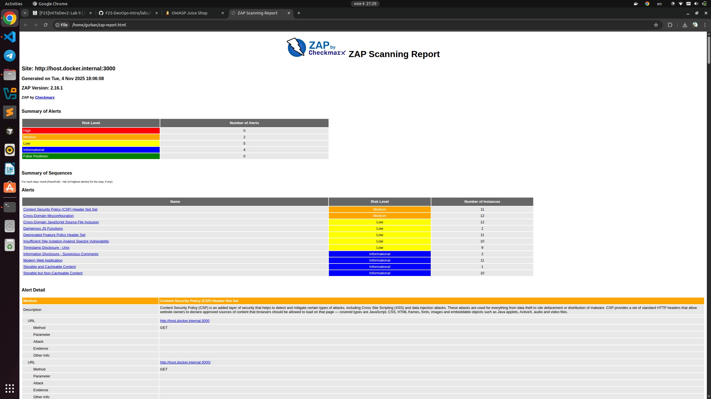
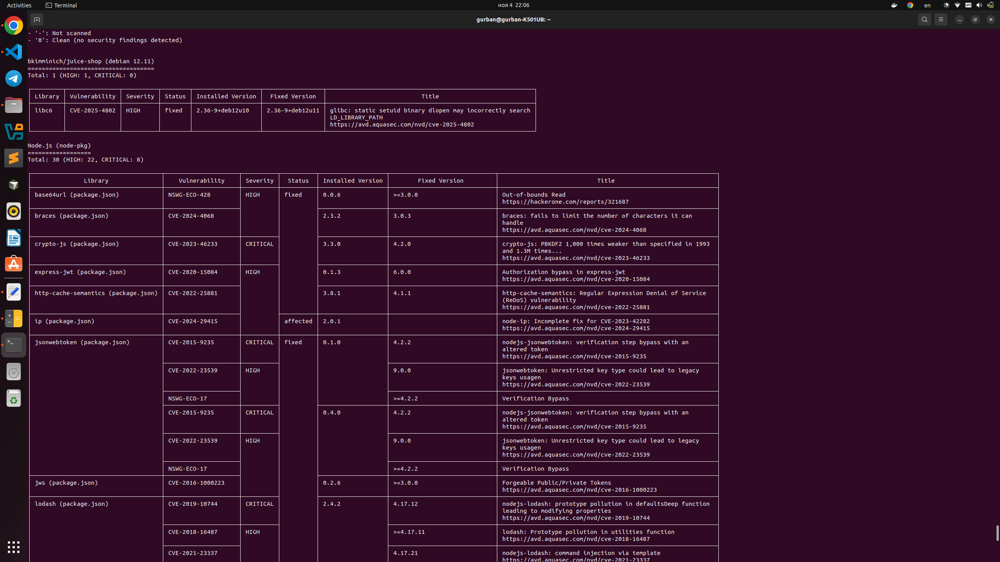

# Task 1. Web Application Scanning with OWASP ZAP

## 1. Number of medium risk vulnerabilities found is 2:
### Content Security Policy (CSP) Header Not Set
### Cross-Domain Misconfiguration

## 2. Two Most Interesting Vulnerabilities:
###  Vulnerability 1: Content Security Policy (CSP) Header Not Set
Content Security Policy (CSP) is an added layer of security that helps to detect and mitigate certain types of attacks, including Cross Site Scripting (XSS) and data injection attacks. These attacks are used for everything from data theft to site defacement or distribution of malware. CSP provides a set of standard HTTP headers that allow website owners to declare approved sources of content that browsers should be allowed to load on that page — covered types are JavaScript, CSS, HTML frames, fonts, images and embeddable objects such as Java applets, ActiveX, audio and video files.
### Vulnerability 2: Cross-Domain Misconfiguration
Web browser data loading may be possible, due to a Cross Origin Resource Sharing (CORS) misconfiguration on the web server.

## 3. Security Headers Status
### Content-Security-Policy - missing - Prevents XSS and content injection attacks
### Access-Control-Allow-Origin - present but * - Permissive CORS policy allows any origin
### Feature-Policy / Permissions-Policy - deprecated header used - Should be replaced with `Permissions-Policy` to control browser features
### Strict-Transport-Security - missing - Enforces HTTPS and protects against downgrade attacks
### X-Frame-Options - missing - Prevents clickjacking attacks
### X-Content-Type-Options - missing - Prevents MIME-type sniffing
### Referrer-Policy - missing - Reduces information leakage via referrer URLs

## 4. Screenshot

## 5. Analysis

The most common web vulnerabilities are:

- **Broken Access Control**
- **Cryptographic Failures**
- **Injection (including XSS)**
- **Security Misconfigurations (including headers/CORS)**
- **Vulnerable and Outdated Components**

# Task 2. Container Vulnerability Scanning with Trivy
## 1. Number of Critical and High vulnerabilities:
### Critical: 8
### High: 25
## 2. List of 2 vulnerable packages with their CVE IDs
### braces (package.json)  - CVE-2024-4068 
### crypto-js (package.json) - CVE-2023-46233
## 3. Most common vulnerability type found
- **Verification/authentication bypass - jsonwebtoken** - cve-2015-9235, cve-2022-23539: 2, nswg-eco-17
## 4. Screenshot of Trivy terminal output showing critical findings

## 5. Analysis: Why is container image scanning important before deploying to production?
### Container images often inherit vulnerabilities from their base OS layers. Regular scanning identifies outdated or exploitable components before deployment, allowing teams to patch or rebuild securely.

## 6. Reflection: How would you integrate these scans into a CI/CD pipeline?
-  **Integrate Trivy scans in the **CI/CD pipeline** (e.g., GitHub Actions or GitLab CI).**
-  **Set pipeline rules to **fail** if CRITICAL vulnerabilities are found.**