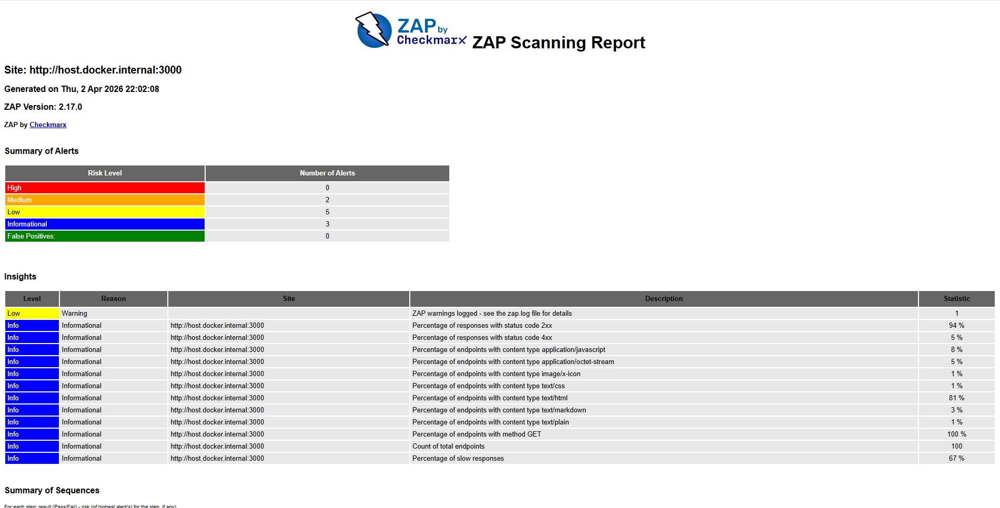
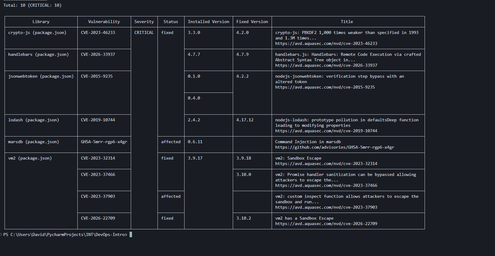

# Lab 9 Submission

## Task 1 - Web Application Scanning with OWASP ZAP

### Scan Setup

- Target application: bkimminich/juice-shop
- Local URL: http://localhost:3000
- Tool version: OWASP ZAP 2.17.0
- ZAP command used:

docker run --rm -u zap -v "${PWD}:/zap/wrk:rw" -t ghcr.io/zaproxy/zaproxy:stable zap-baseline.py -t http://host.docker.internal:3000 -g gen.conf -r zap-report.html -x zap-report.xml -J zap-report.json

### Results

- Number of Medium risk vulnerabilities found: 2 medium-risk alert categories (10 total instances across scanned URLs)
- Most interesting vulnerability found: Cross-Domain Misconfiguration

### Two Interesting Vulnerabilities

1. Content Security Policy (CSP) Header Not Set
   - Description: ZAP reported that the application does not send a Content-Security-Policy header, so the browser is not restricted to approved sources for scripts, styles, images, and frames.
   - Why it matters: Missing CSP makes client-side attacks like XSS and data injection easier to exploit and harder to contain.
2. Cross-Domain Misconfiguration
   - Description: The application responds with Access-Control-Allow-Origin: *, which means resources can be requested cross-origin from arbitrary domains.
   - Why it matters: Overly permissive CORS can expose unauthenticated data to third-party sites and weakens the browser's Same-Origin Policy protections.

### Security Headers Status

- Present headers: X-Frame-Options: SAMEORIGIN, X-Content-Type-Options: nosniff, Feature-Policy: payment 'self'
- Missing headers: Content-Security-Policy, Cross-Origin-Embedder-Policy, Cross-Origin-Opener-Policy
- Additional note: Access-Control-Allow-Origin: * is present, but it is too permissive and was flagged by ZAP as a medium-risk CORS misconfiguration.
- Why these headers matter: X-Frame-Options helps reduce clickjacking, X-Content-Type-Options helps prevent MIME-sniffing attacks, and CSP/COEP/COOP help isolate browser contexts and reduce XSS, data injection, and cross-origin abuse. Feature-Policy is present, but it is deprecated and should be replaced by Permissions-Policy.

### Screenshot

### Analysis

The most common issues in web applications are usually security misconfigurations, missing browser hardening headers, weak authentication/session handling, and input-validation problems such as XSS or injection flaws. In this scan, the dominant pattern was misconfiguration: missing CSP and overly permissive cross-origin access.

---

## Task 2 - Container Vulnerability Scanning with Trivy

### Scan Setup

- Target image: bkimminich/juice-shop
- Target image digest: sha256:5539448a1d3fa88d932d3f80a8d3f69a16cde6253c1d4256b28a38ef910e4114
- Tool version: Trivy 0.69.3
- Trivy command used:

bash
trivy image --severity HIGH,CRITICAL bkimminich/juice-shop

### Results

- Total number of CRITICAL vulnerabilities: 10
- Total number of HIGH vulnerabilities: 49
- Reproducible summary: Trivy found 10 CRITICAL and 49 HIGH vulnerabilities for image digest sha256:5539448a1d3fa88d932d3f80a8d3f69a16cde6253c1d4256b28a38ef910e4114
- Most common vulnerability type found: Denial of Service (DoS/ReDoS) based on vulnerability titles in the Trivy results

### Vulnerable Packages

1. Package: vm2
   - CVE ID: CVE-2023-32314
2. Package: jsonwebtoken
   - CVE ID: CVE-2015-9235

### Screenshot

### Analysis

Container image scanning is important before production deployment because images often bundle old OS packages and application dependencies with known CVEs. If these issues are shipped as-is, attackers can exploit them consistently across every environment where the image runs. Scanning early helps catch vulnerable packages before release, prioritize fixes, and reduce the blast radius of a compromised workload.
