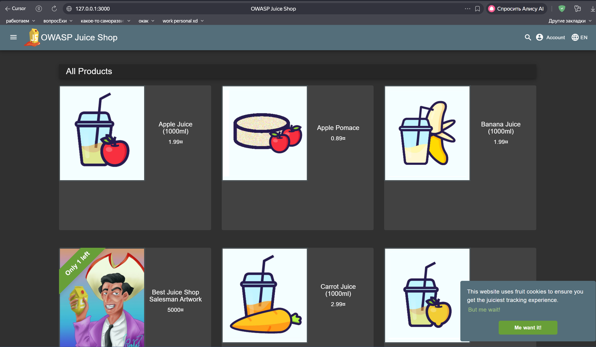
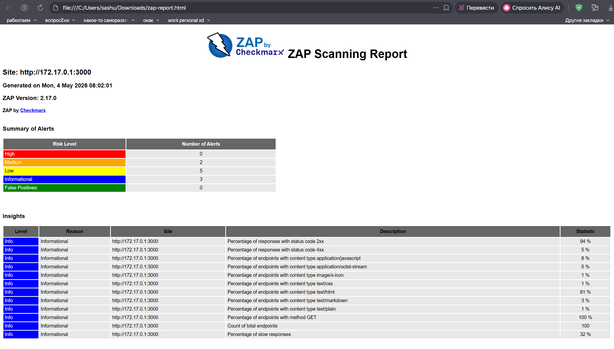
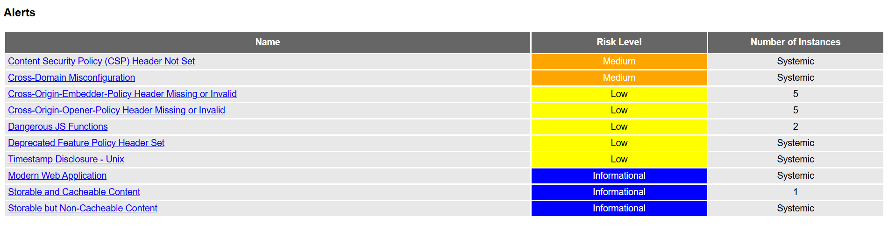

# Solution

## Task 1

First I started a container:

```bash
(hw) lexandrinnn_t@63906:~/inno/devops/DevOps-Intro$ docker run -d --name juice-shop -p 3000:3000 bkimminich/juice-shop
Unable to find image 'bkimminich/juice-shop:latest' locally
latest: Pulling from bkimminich/juice-shop
142f89355a3a: Pull complete 
01639daf4ea0: Pull complete 
7d664d9802de: Pull complete 
d58f7981a01a: Download complete 
Digest: sha256:a8139c141311c7f31fcf2e611125246928f703ee42827de33983fd9425d1b2f6
Status: Downloaded newer image for bkimminich/juice-shop:latest
b3fcc11827a4d714dd320e0e1a83d739fe808f7d79d642d3ed6c62ae2ea81e7e
(hw) lexandrinnn_t@63906:~/inno/devops/DevOps-Intro$ docker ps --filter name=juice-shop
CONTAINER ID   IMAGE                   COMMAND                  CREATED          STATUS          PORTS                                         NAMES
b3fcc11827a4   bkimminich/juice-shop   "/nodejs/bin/node /j…"   58 seconds ago   Up 58 seconds   0.0.0.0:3000->3000/tcp, [::]:3000->3000/tcp   juice-shop
```




Then I ran ZAP and opened the report:



It found 2 vulnerabilities:  
1. Content Security Policy (CSP) Header Not Set: an added layer of security that helps to detect and mitigate certain types of attacks, including Cross Site Scripting (XSS) and data injection attacks.  
2. Cross-Domain Misconfiguration: Web browser data loading may be possible, due to a Cross Origin Resource Sharing (CORS) misconfiguration on the web server.



## Task 2

I saved the scan outputs to the json file:  
```bash
(hw) lexandrinnn_t@63906:~/inno/devops/DevOps-Intro$ docker run --rm -v /var/run/docker.sock:/var/run/docker.sock \
-v "$(pwd):/out" \
aquasec/trivy:latest image \
--severity HIGH,CRITICAL \
--format json \
-o /out/juice-shop-trivy.json \
```

It shows the following statistics:  
1. 46 high vulnerabilities  
2. 9 critical vulnerabilities  

Examples:
- **crypto-js**: crypto-js is a JavaScript library of crypto standards. Prior to version 4.2.0, crypto-js PBKDF2 is 1,000 times weaker than originally specified in 1993, and at least 1,300,000 times weaker than current industry standard. This is because it both defaults to SHA1, a cryptographic hash algorithm considered insecure since at least 2005, and defaults to one single iteration, a 'strength' or 'difficulty' value specified at 1,000 when specified in 1993. PBKDF2 relies on iteration count as a countermeasure to preimage and collision attacks. If used to protect passwords, the impact is high. If used to generate signatures, the impact is high. Version 4.2.0 contains a patch for this issue. As a workaround, configure crypto-js to use SHA256 with at least 250,000 iterations.
- **jsonwebtoken**: In jsonwebtoken node module before 4.2.2 it is possible for an attacker to bypass verification when a token digitally signed with an asymmetric key (RS/ES family) of algorithms but instead the attacker send a token digitally signed with a symmetric algorithm (HS* family).
- **marsdb**: All versions of `marsdb` are vulnerable to Command Injection. In the `DocumentMatcher` class, selectors on `$where` clauses are passed to a Function constructor unsanitized. This allows attackers to run arbitrary commands in the system when the function is executed.\n\n\n## Recommendation\n\nNo fix is currently available. Consider using an alternative package until a fix is made available. 

**Why to use container image scanning**: it catches known CVEs and risky misconfigurations in image layers before they reach prod, when fixes are cheaper than incident response.  

**How to integrate scans into CI/CD**: run scans in CI after `docker build/push` on every meaningful change.