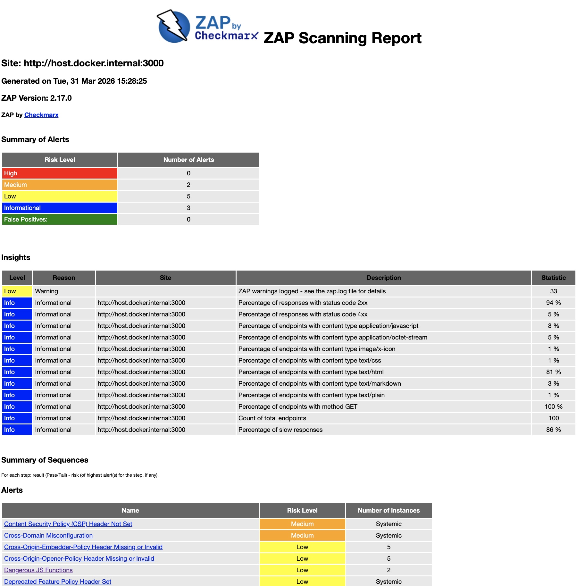

# Задание 1.

Количество medium vulnerabilities равно 2.

## Две самые интересные уязвимости

### Dangerous JS Functions
Description: ```A dangerous JS function seems to be in use that would leave the site vulnerable.```

### Timestamp Disclosure - Unix
Description: ```A timestamp was disclosed by the application/web server. - Unix```

## Уязвимости, связанные с заголовками
Вот уязвимости, связанные с заголовками:
```
Content Security Policy (CSP) Header Not Set
Cross-Origin-Embedder-Policy Header Missing or Invalid
Cross-Origin-Opener-Policy Header Missing or Invalid
Deprecated Feature Policy Header Set
```
## Самые опасные уязвимости

Из OWASP Top 10:

- Security Misconfiguration: Missing CSP, Cross-Domain Misconfiguration, Missing COEP/COOP
- Injections: SQL-инъекции, Cross-Site Scripting (XSS), OS Command Injection
- Sensitive Data Exposure: Timestamp Disclosure - Unix
- Broken Access Control
- Deprecated libraries

## Скриншот


# Задание 2.

```
bkimminich/juice-shop (debian 13.4)
===================================
Total: 1 (HIGH: 1, CRITICAL: 0)
```

```
Node.js (node-pkg)
==================
Total: 57 (HIGH: 47, CRITICAL: 10)
```

Vulnerable packages with CVE's:
```
crypto-js (package.json)           CVE-2023-46233 
express-jwt (package.json)         CVE-2020-15084
```

Most common vulnerability type is `debian`:

```
Report Summary

┌──────────────────────────────────────────────────────────────────────────────────┬──────────┬─────────────────┬─────────┐
│                                      Target                                      │   Type   │ Vulnerabilities │ Secrets │
├──────────────────────────────────────────────────────────────────────────────────┼──────────┼─────────────────┼─────────┤
│ bkimminich/juice-shop (debian 13.4)                                              │  debian  │        1        │    -    │
├──────────────────────────────────────────────────────────────────────────────────┼──────────┼─────────────────┼─────────┤
│ juice-shop/build/package.json                                                    │ node-pkg │        0        │    -    │
├──────────────────────────────────────────────────────────────────────────────────┼──────────┼─────────────────┼─────────┤
```


# Screenshot part

```
Node.js (node-pkg)
==================
Total: 57 (HIGH: 47, CRITICAL: 10)

┌─────────────────────────────────────┬─────────────────────┬──────────┬──────────┬───────────────────┬─────────────────────────────────────────────────────────┬──────────────────────────────────────────────────────────────┐
│               Library               │    Vulnerability    │ Severity │  Status  │ Installed Version │                      Fixed Version                      │                            Title                             │
├─────────────────────────────────────┼─────────────────────┼──────────┼──────────┼───────────────────┼─────────────────────────────────────────────────────────┼──────────────────────────────────────────────────────────────┤
│ base64url (package.json)            │ NSWG-ECO-428        │ HIGH     │ fixed    │ 0.0.6             │ >=3.0.0                                                 │ Out-of-bounds Read                                           │
│                                     │                     │          │          │                   │                                                         │ https://hackerone.com/reports/321687                         │
├─────────────────────────────────────┼─────────────────────┤          │          ├───────────────────┼─────────────────────────────────────────────────────────┼──────────────────────────────────────────────────────────────┤
│ braces (package.json)               │ CVE-2024-4068       │          │          │ 2.3.2             │ 3.0.3                                                   │ braces: fails to limit the number of characters it can       │
│                                     │                     │          │          │                   │                                                         │ handle                                                       │
│                                     │                     │          │          │                   │                                                         │ https://avd.aquasec.com/nvd/cve-2024-4068                    │
├─────────────────────────────────────┼─────────────────────┼──────────┤          ├───────────────────┼─────────────────────────────────────────────────────────┼──────────────────────────────────────────────────────────────┤
│ crypto-js (package.json)            │ CVE-2023-46233      │ CRITICAL │          │ 3.3.0             │ 4.2.0                                                   │ crypto-js: PBKDF2 1,000 times weaker than specified in 1993  │
│                                     │                     │          │          │                   │                                                         │ and 1.3M times...                                            │
│                                     │                     │          │          │                   │                                                         │ https://avd.aquasec.com/nvd/cve-2023-46233                   │
├─────────────────────────────────────┼─────────────────────┼──────────┤          ├───────────────────┼─────────────────────────────────────────────────────────┼──────────────────────────────────────────────────────────────┤
│ express-jwt (package.json)          │ CVE-2020-15084      │ HIGH     │          │ 0.1.3             │ 6.0.0                                                   │ Authorization bypass in express-jwt                          │
│                                     │                     │          │          │                   │                                                         │ https://avd.aquasec.com/nvd/cve-2020-15084                   │
├─────────────────────────────────────┼─────────────────────┼──────────┤          ├───────────────────┼─────────────────────────────────────────────────────────┼──────────────────────────────────────────────────────────────┤
│ handlebars (package.json)           │ CVE-2026-33937      │ CRITICAL │          │ 4.7.7             │ 4.7.9                                                   │ handlebars.js: Handlebars: Remote Code Execution via crafted │
│                                     │                     │          │          │                   │                                                         │ Abstract Syntax Tree object in...                            │
│                                     │                     │          │          │                   │                                                         │ https://avd.aquasec.com/nvd/cve-2026-33937                   │
│                                     ├─────────────────────┼──────────┤          │                   │                                                         ├──────────────────────────────────────────────────────────────┤
│                                     │ CVE-2026-33938      │ HIGH     │          │                   │                                                         │ handlebars: Handlebars: Arbitrary code execution via         │
│                                     │                     │          │          │                   │                                                         │ @partial-block overwrite                                     │
│                                     │                     │          │          │                   │                                                         │ https://avd.aquasec.com/nvd/cve-2026-33938                   │
│                                     ├─────────────────────┤          │          │                   │                                                         ├──────────────────────────────────────────────────────────────┤
│                                     │ CVE-2026-33939      │          │          │                   │                                                         │ handlebars.js: Handlebars.js: Denial of Service via          │
│                                     │                     │          │          │                   │                                                         │ malformed decorator syntax in template compilation...        │
│                                     │                     │          │          │                   │                                                         │ https://avd.aquasec.com/nvd/cve-2026-33939                   │
│                                     ├─────────────────────┤          │          │                   │                                                         ├──────────────────────────────────────────────────────────────┤
│                                     │ CVE-2026-33940      │          │          │                   │                                                         │ handlebars.js: Handlebars.js: Arbitrary code execution via   │
│                                     │                     │          │          │                   │                                                         │ crafted template context                                     │
│                                     │                     │          │          │                   │                                                         │ https://avd.aquasec.com/nvd/cve-2026-33940                   │
│                                     ├─────────────────────┤          │          │                   │                                                         ├──────────────────────────────────────────────────────────────┤
```

## Ответы на вопросы

1. Сканировать прежде чем деплоить важно, чтобы не допустить, что на проде окажется продукт с уязвимостями.

2. На этапе сборки можно применить Trivy, а на этапе тестирования OWASP ZAP. Мы правда делали в обратном порядке на этой лабе, но тут просто продукт уже был собран.
