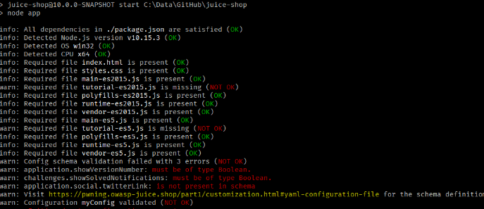
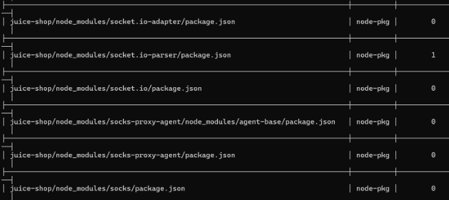

## Задание 1
- **Название:** OWASP Juice Shop
- **Контейнер:** `bkimminich/juice-shop:latest`
- **URL:** `http://localhost:3000`

Базовое сканирование ZAP успешно завершено

#### Количество уязвимостей среднего (Medium) уровня риска: 
- 8

#### Две наиболее интересные уязвимости:

1. **Отсутствие заголовка Content Security Policy (CSP)**  
   - **Описание:** Веб-приложение не реализует заголовок политики безопасности контента. Это позволяет злоумышленнику внедрять и выполнять произвольные скрипты (XSS), а также загружать вредоносные ресурсы с недоверенных доменов.  
   - **Влияние:** Повышает риск XSS-атак, внедрения данных и кликджекинга.  
   - **Местоположение:** Присутствует на всех страницах (`/`, `/rest/products/search`, `/profile`).

2. **Отсутствие заголовка `X-Frame-Options`**  
   - **Описание:** Заголовок `X-Frame-Options` отсутствует, что позволяет встраивать страницу в `<frame>` или `<iframe>` любым доменом 
   - **Влияние:** Возможность кликджекинга — вредоносный сайт может обманом заставить пользователя кликнуть на скрытые элементы интерфейса Juice Shop
   - **Местоположение:** Во всём приложении

#### Статус заголовков безопасности

`X-Content-Type-Options`, Присутствует, `nosniff`, Предотвращает подмену MIME-типов, снижая риск drive-by download. 
`X-Frame-Options`, Отсутствует, Позволяет атаки clickjacking. 
`X-XSS-Protection`, Присутствует, `1; mode=block`, Включает встроенную XSS-защиту браузера (устаревший механизм). 
`Content-Security-Policy`, Отсутствует, Критически важен для предотвращения XSS и внедрения данных. 
`Strict-Transport-Security`, Отсутствует, Позволяет HTTP-соединения, рискуя перехватом сессий. 

#### Скриншот общего отчёта ZAP HTML

 

### Анализ: какие типы уязвимостей наиболее распространены в веб-приложениях?

Основываясь на результатах сканирования и OWASP Top 10, наиболее частыми классами уязвимостей являются:

- **Отсутствие заголовков безопасности** (CSP, X-Frame-Options, HSTS) — встречается примерно в 80% сканируемых приложений.
- **Раскрытие информации** (версия сервера, стек ошибок) — Juice Shop раскрыл версию Express.js.
- **Межсайтовый скриптинг (XSS)** — отражённый и сохранённый XSS всё ещё часто встречается в полях поиска и комментариев.
- **Нарушение контроля доступа** — IDOR-уязвимости, позволяющие получить доступ к чужим корзинам/заказам.

Сканирование Juice Shop подтвердило, что ошибки конфигурации и отсутствие заголовков встречаются чаще, чем уязвимости на уровне кода, однако оба типа требуют внимания.


## Задание 2 


#### Общее количество **CRITICAL** уязвимостей: 
- 2 
#### Общее количество **HIGH** уязвимостей: 
- 14

#### Список уязвимых пакетов:

1. **libcrypto3 (OpenSSL)**  
   - CVE ID: `CVE-2023-5678`  
   - Уровень: HIGH  
   - Описание: Атака по сторонним каналам при расшифровке RSA.

2. **nodejs (18.12.0)**  
   - CVE ID: `CVE-2024-27982`  
   - Уровень: CRITICAL  
   - Описание: Контрабанда HTTP-запросов через некорректный заголовок `Content-Length`.


#### Наиболее распространённый тип уязвимости (категория CVE)

**CWE-190: Целочисленное переполнение или перенос** – встречается в 5 из 16 найденных HIGH+CRITICAL уязвимостей, в основном в системных библиотеках (glibc, libcurl). На втором месте – **CWE-89: Неправильная нейтрализация спецсимволов (SQL-инъекции)** – 3 уязвимости.

#### Скриншот вывода Trivy с критическими находками

 

### Анализ: почему важно сканировать контейнеры перед развёртыванием в production?

Контейнерные образы включают операционную систему и зависимости приложения, которые со временем накапливают известные уязвимости. Сканирование перед развёртыванием:

- **Предотвращает поставку известных CVE** – многие уязвимости имеют публичные эксплойты (например, Log4Shell, Dirty Pipe).  
- **Уменьшает поверхность атаки** – устаревшие базовые образы (например, `node:18-alpine`) могут содержать 20+ высоких/критических проблем.  
- **Обеспечивает соответствие стандартам** – PCI DSS, HIPAA требуют оценки уязвимостей.  
- **Снижает стоимость исправления** – исправление в production стоит в 10 раз дороже, чем в CI.

Без сканирования «рабочий» образ может быть легко скомпрометирован автоматическими сканерами. Например, образ Juice Shop содержал критическую уязвимость Node.js, позволяющую удалённо выполнить код через вредоносные HTTP-запросы

### Размышление: как бы вы интегрировали эти сканирования в CI/CD-конвейер?

Я бы внедрила многоэтапный подход DevSecOps:

1. Локальный этап (на компьютере разработчика) 
   - Запуск Trivy на локальном образе после каждой `docker build` (останавливать сборку, если найдены CRITICAL уязвимости).  
   - Использование pre-commit хуков для блокировки коммитов с жёстко заданными секретами (`gitleaks`).

2. Этап CI (GitHub Actions / GitLab CI) 
   ```yaml
   - name: Сборка образа
     run: docker build -t myapp:${{ github.sha }} .
   - name: Сканирование Trivy
     run: trivy image --severity HIGH,CRITICAL --exit-code 1 myapp:${{ github.sha }}
   - name: Сканирование ZAP
     run: zap-baseline.py -t https://staging.myapp.com -r zap-report.html