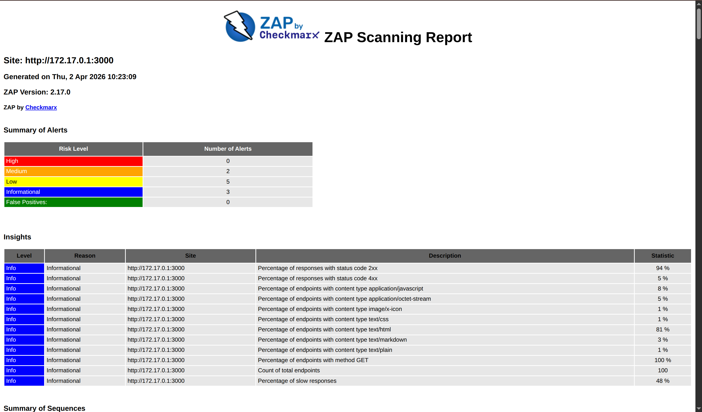
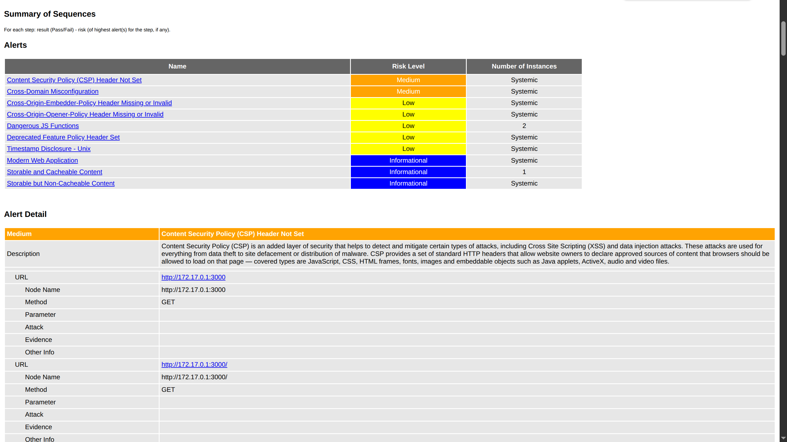

## Task 1 — Web Application Scanning with OWASP ZAP

### Scan target
I scanned the Juice Shop application running locally at:

```bash
http://172.17.0.1:3000
````

### ZAP scan summary

* Medium risk vulnerabilities found: **6**
* High risk vulnerabilities found: **0**
* Low/Informational findings were also present, but the main report focus for this task is the medium-risk issues.

### Two most interesting vulnerabilities

#### 1) Content Security Policy (CSP) Header Not Set

ZAP reported **WARN-NEW: Content Security Policy (CSP) Header Not Set [10038]**.

This is important because a CSP helps reduce the impact of cross-site scripting (XSS) and other code-injection attacks by restricting which sources of scripts, styles, images, and other resources may be loaded by the browser. If the header is missing, the application has less protection against malicious injected content.

#### 2) Cross-Origin-Embedder-Policy Header Missing or Invalid

ZAP reported **WARN-NEW: Cross-Origin-Embedder-Policy Header Missing or Invalid [90004]**.

This header is part of modern browser security controls. It helps isolate the page from cross-origin resources and can reduce the risk of certain cross-origin data leaks and side-channel style attacks. Missing or invalid browser isolation headers usually indicate the application is not fully hardened for modern web security expectations.

### Security headers status

From the scan output, these headers were observed:

#### Present

* **Strict-Transport-Security**
* **CSP** was detected in some contexts as a pass item, but ZAP still reported a missing/invalid CSP issue on multiple pages, so the application’s CSP coverage is inconsistent.
* **X-Powered-By** was present, which exposes technology details.

#### Missing or problematic

* **X-Content-Type-Options** missing
* **Content Security Policy** missing on some responses
* **Cross-Origin-Embedder-Policy** missing or invalid
* **Deprecated Feature Policy** header is set, which suggests the application is using an outdated browser policy header

#### Why these headers matter

These headers help reduce attack surface:

* `X-Content-Type-Options` helps prevent MIME sniffing.
* `CSP` helps limit script injection and XSS impact.
* `COEP` and related modern isolation headers help protect against cross-origin data access issues.
* Outdated or inconsistent security headers often indicate weak security hardening.

### Screenshot





### Analysis: What types of vulnerabilities are most common in web applications?

The most common web application vulnerabilities are usually related to:

* missing or weak security headers,
* cross-site scripting (XSS),
* insecure session and cookie handling,
* information disclosure,
* misconfiguration,
* and weak access control.

In real applications, many vulnerabilities come from insecure defaults, outdated libraries, and incomplete security hardening rather than from a single major flaw. That is why automated scanning is useful: it quickly reveals patterns of weakness before deployment.

## Task 2 — Container Vulnerability Scanning with Trivy

### Scan target
I scanned the `bkimminich/juice-shop` container image using Trivy with HIGH and CRITICAL severity filtering.

### Trivy scan summary
Trivy reported vulnerabilities in both the operating system layer and the Node.js dependency layer.

#### Vulnerability counts
- **CRITICAL:** 10
- **HIGH:** 49

Note: the image also contained secret findings in source files, but the main vulnerability counts above refer to the HIGH/CRITICAL security issues reported by Trivy.

### Two vulnerable packages with CVE IDs

#### 1) `crypto-js`
- **Package:** `crypto-js`
- **CVE:** `CVE-2023-46233`
- **Severity:** CRITICAL
- **Issue:** Weak PBKDF2 implementation that makes the derived key significantly weaker than expected.

#### 2) `lodash`
- **Package:** `lodash`
- **CVE:** `CVE-2019-10744`
- **Severity:** CRITICAL
- **Issue:** Prototype pollution vulnerability in `defaultsDeep`, which can allow attackers to modify object properties in unsafe ways.

### Other notable vulnerable packages
Some additional high-risk packages from the scan included:
- `express-jwt` → `CVE-2020-15084`
- `jsonwebtoken` → `CVE-2015-9235`
- `handlebars` → `CVE-2026-33937`
- `vm2` → `CVE-2023-32314`
- `ws` → `CVE-2024-37890`

### Most common vulnerability type
The most common vulnerability type in this scan was **dependency-related issues in Node.js packages**, especially:
- authentication bypass,
- remote code execution,
- prototype pollution,
- and denial of service.

This is a common pattern in modern container scans because application images often bundle many third-party libraries, and outdated dependencies can accumulate a large number of known CVEs.

### Screenshot
Insert a screenshot of the Trivy terminal output showing the critical findings here.

.png)

### Why container image scanning is important before production
Container image scanning is important because vulnerable packages can be shipped directly into production if they are not detected early. Scanning helps identify known CVEs before deployment, reduce the attack surface, and prevent security problems from being introduced into the runtime environment. It is much easier to fix an image during development than after it is running in production.

### CI/CD integration
I would integrate Trivy into the CI/CD pipeline by running it after the image build stage and before deployment. The pipeline could:
- fail the build on CRITICAL findings,
- generate a report artifact for review,
- notify the team when HIGH vulnerabilities are detected,
- and block deployment until the image is remediated or approved.

### Reflection
This lab shows how DevSecOps shifts security checks earlier in the development lifecycle. OWASP ZAP helps find web application weaknesses, while Trivy helps catch vulnerable dependencies in container images. Together, they reduce the chance of shipping insecure software.