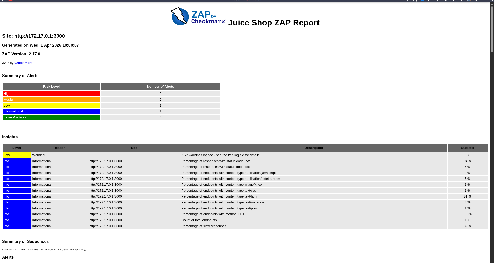
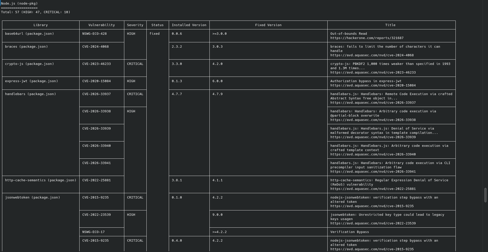

# Lab 9 Submission — Introduction to DevSecOps Tools

## Task 1 — Web Application Scanning with OWASP ZAP

### 1.1 Start the Vulnerable Target Application

Command:

```bash
docker run -d --name juice-shop -p 3000:3000 bkimminich/juice-shop
```

Verification:

Juice Shop was reachable from the host at http://localhost:3000 and from inside another container at http://172.17.0.1:3000.

### 1.2 Scan with OWASP ZAP

The packaged scan wrappers (`zap-baseline.py` and `zap-full-scan.py`) repeatedly logged lines like:

```text
Starting new HTTP connection (1): localhost:37840
```

Juice Shop was reachable from both the host and from inside the ZAP image container. The repeated localhost connection messages indicated that the Python wrapper was retrying communication with the ZAP service inside the same container, so the issue was with ZAP wrapper startup/readiness rather than connectivity to the target application. To work around that, the scan was run through the ZAP Automation Framework.

Working approach used:

```bash
docker run --rm --shm-size=1g -u zap -v $(pwd):/zap/wrk:rw \
-t ghcr.io/zaproxy/zaproxy:stable \
zap.sh -cmd -autorun /zap/wrk/zap.yaml
```

Automation file used:

```yaml
env:
  contexts:
    - name: juice
      urls:
        - "http://172.17.0.1:3000"
  parameters:
    failOnError: false
    failOnWarning: false

jobs:
  - type: spider
    parameters:
      context: juice
      url: "http://172.17.0.1:3000"
      maxDuration: 1

  - type: passiveScan-wait
    parameters:
      maxDuration: 5

  - type: report
    parameters:
      template: traditional-html
      reportDir: /zap/wrk
      reportFile: zap-report.html
      reportTitle: "Juice Shop ZAP Report"
```

Output:



### 1.3 Analyze Results

Number of Medium risk vulnerabilities found:

```text
2
```

Medium vulnerabilities identified:

1. `Content Security Policy (CSP) Header Not Set`
2. `Cross-Domain Misconfiguration`

Description of the 2 most interesting vulnerabilities:

1. `Content Security Policy (CSP) Header Not Set`
   CSP is missing, which weakens browser-side protection against content injection and makes attacks such as XSS harder to mitigate. ZAP flagged this as a systemic issue across the application.

2. `Cross-Domain Misconfiguration`
   ZAP found `Access-Control-Allow-Origin: *` in responses, meaning cross-origin reads are broadly permitted for unauthenticated content. That can expose data more widely than intended and weakens the browser’s same-origin protections.

Security headers status:

1. Present: `X-Content-Type-Options: nosniff`
   This helps stop MIME-type confusion attacks by telling browsers not to guess content types.

2. Present: `X-Frame-Options: SAMEORIGIN`
   This reduces clickjacking risk by restricting framing to the same origin.

3. Missing: `Content-Security-Policy`
   This matters because CSP constrains which scripts and other resources can run or load, significantly reducing the impact of XSS and content injection issues.

4. Not observed in the saved evidence: `Strict-Transport-Security`
   Since the lab target was scanned over plain HTTP, HSTS was not present in the captured headers. HSTS matters on HTTPS deployments because it forces browsers to use secure transport.

Relevant ZAP report excerpt:

```text
Alerts
- Content Security Policy (CSP) Header Not Set — Medium
- Cross-Domain Misconfiguration — Medium
- Timestamp Disclosure - Unix — Low
- Modern Web Application — Informational
```

Evidence for CORS finding from the report:

```text
Evidence: Access-Control-Allow-Origin: *
```

### 1.4 Analysis

The most common web-application weaknesses found here were security misconfigurations rather than direct injection flaws. Missing security headers and permissive CORS are very common in real applications because they are easy to overlook during development, especially when teams focus more on functionality than hardening. This lab was a good example of how automated scanning quickly surfaces insecure defaults and missing defensive controls.

## Task 2 — Container Vulnerability Scanning with Trivy

### 2.1 Run Trivy Scan

Command:

```bash
docker run --rm -v /var/run/docker.sock:/var/run/docker.sock \
ghcr.io/aquasecurity/trivy:0.69.3 image \
--severity HIGH,CRITICAL \
bkimminich/juice-shop
```

Output excerpt:

```text
Report Summary

┌──────────────────────────────────────────────────────────────────────────────────┬──────────┬─────────────────┬─────────┐
│                                      Target                                      │   Type   │ Vulnerabilities │ Secrets │
├──────────────────────────────────────────────────────────────────────────────────┼──────────┼─────────────────┼─────────┤
│ bkimminich/juice-shop (debian 13.4)                                              │  debian  │        1        │    -    │
├──────────────────────────────────────────────────────────────────────────────────┼──────────┼─────────────────┼─────────┤
│ juice-shop/build/package.json                                                    │ node-pkg │        0        │    -    │
├──────────────────────────────────────────────────────────────────────────────────┼──────────┼─────────────────┼─────────┤
│ ...
│ juice-shop/node_modules/base64url/package.json                                   │ node-pkg │        1        │    -    │
│ ...
│ juice-shop/node_modules/braces/package.json                                      │ node-pkg │        1        │    -    │
│ ...
│ juice-shop/node_modules/crypto-js/package.json                                   │ node-pkg │        1        │    -    │
│ ...
Total: 1 (HIGH: 1, CRITICAL: 0)
Total: 57 (HIGH: 47, CRITICAL: 10)
```

Important findings excerpt:

```text
libc6   CVE-2026-4046     HIGH      glibc: Denial of Service via iconv() function
base64url (package.json)  NSWG-ECO-428      HIGH      Out-of-bounds Read
braces (package.json)     CVE-2024-4068     HIGH      braces fails to limit the number of characters it can process
crypto-js (package.json)  CVE-2023-46233    CRITICAL  PBKDF2 1,000 times weaker than specified
jsonwebtoken (package.json) CVE-2015-9235   CRITICAL  verification step bypass
handlebars (package.json) CVE-2026-33937    CRITICAL  Remote Code Execution
lodash (package.json)     CVE-2019-10744    CRITICAL  prototype pollution
vm2 (package.json)        CVE-2023-32314    CRITICAL  Sandbox Escape
ws (package.json)         CVE-2024-37890    HIGH      denial of service
```

### 2.2 Analyze Results

Screenshot of Trivy output:



Total count of CRITICAL vulnerabilities:

```text
10
```

Total count of HIGH vulnerabilities:

```text
48
```

The Trivy output shows one HIGH vulnerability in the Debian base layer and a larger application dependency section totaling 57 vulnerabilities (47 HIGH, 10 CRITICAL). Combined, this yields 48 HIGH and 10 CRITICAL findings.

List of 2 vulnerable packages with CVE IDs:

1. `crypto-js` — `CVE-2023-46233` — CRITICAL
2. `vm2` — `CVE-2023-32314` — CRITICAL

Other notable vulnerable packages:

1. `handlebars` — `CVE-2026-33937` — CRITICAL
2. `jsonwebtoken` — `CVE-2015-9235` — CRITICAL
3. `lodash` — `CVE-2019-10744` — CRITICAL
4. `ws` — `CVE-2024-37890` — HIGH

Most common vulnerability type found:

```text
Denial of Service appeared most often in the saved Trivy output, with repeated findings across packages such as glibc, minimatch, multer, moment, and ws.
```

### 2.3 Analysis

Container image scanning is important before production deployment because vulnerabilities are often inherited indirectly through base images and transitive dependencies, not just through application code. In this case the image contained both OS-level and Node.js package vulnerabilities, including critical issues such as sandbox escape, remote code execution, and JWT verification bypass. Scanning before deployment gives teams a chance to block unsafe releases, update dependencies, or rebuild with a safer base image.

### 2.4 Reflection

In a CI/CD pipeline, I would run Trivy during the build stage and fail the pipeline on CRITICAL vulnerabilities by default. ZAP-style web scanning fits better in a later integration or staging stage because it needs a running application to test. A practical pipeline would build the image, run Trivy on the image, deploy to a temporary environment, run automated ZAP scans, archive the HTML and terminal reports as artifacts, and only promote the release if the security gates pass or approved exceptions exist.
