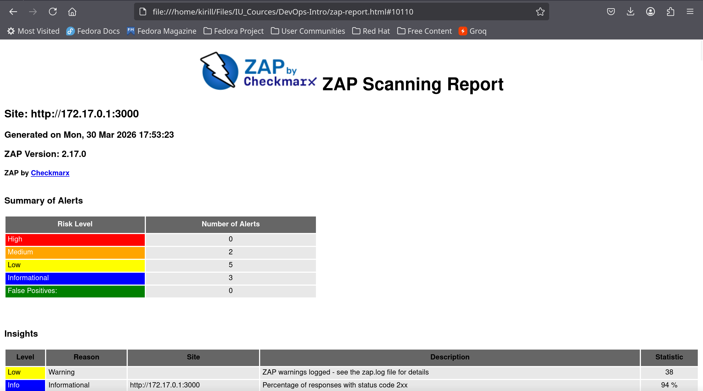
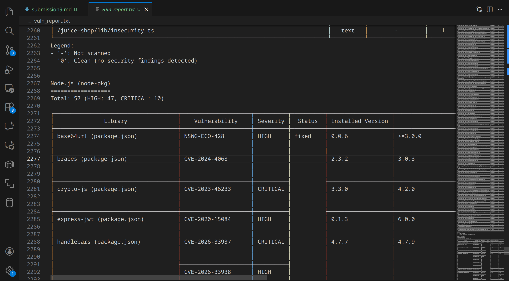

# Task 1


## Number of Medium risk vulnerabilities found
2

## Description of the 2 most interesting vulnerabilities
```
Medium
	Content Security Policy (CSP) Header Not Set
Description 	
Content Security Policy (CSP) is an added layer of security that helps to detect and mitigate certain types of attacks, including Cross Site Scripting (XSS) and data injection attacks. These attacks are used for everything from data theft to site defacement or distribution of malware. CSP provides a set of standard HTTP headers that allow website owners to declare approved sources of content that browsers should be allowed to load on that page — covered types are JavaScript, CSS, HTML frames, fonts, images and embeddable objects such as Java applets, ActiveX, audio and video files.
```

```
Medium
	Cross-Domain Misconfiguration
Description 	
Web browser data loading may be possible, due to a Cross Origin Resource Sharing (CORS) misconfiguration on the web server.	
```

## Security headers status (which are present/missing and why they matter)

### Missing

`Content-Security-Policy` Reduces XSS/data-injection risk by restricting allowed script/content sources

`Cross-Origin-Embedder-Policy` Helps block unsafe cross-origin embeds unless explicitly allowed.

`Cross-Origin-Opener-Policy` Isolates browsing context to reduce cross-window data leak risks

### Present

`Access-Control-Allow-Origin: *` overly permissive. Allows any origin to read unauthenticated responses, can expose data broadly

## Screenshot of ZAP HTML report overview



## Analysis: What type of vulnerabilities are most common in web applications?

Most common web vulnerabilities are access control issues, injection flaws (especially SQL/command injection), and cross-site scripting XSS
In practice, many findings also come from security misconfig (missing headers, verbose errors, weak defaults)

# Task 2

## Total count of CRITICAL and HIGH vulnerabilities
Total: 57 (HIGH: 47, CRITICAL: 10)


## List of 2 vulnerable packages with their CVE IDs
braces (package.json) CVE-2024-4068
crypto-js (package.json) CVE-2023-46233

## Most common vulnerability type found

Seems like it is DoS connected vuln type. However report does not specify it explicitly

## Screenshot of Trivy terminal output showing critical findings



## Analysis: Why is container image scanning important before deploying to production?

It efficiently reduces amount of exploitable vulnerabilities before deploying the app.  

## Reflection: How would you integrate these scans into a CI/CD pipeline?

Run scans automatically on every PR and build (dependency scan + image scan), publish reports as artifacts, and block merge/deploy on CRITICAL/HIGH unless approved exception
