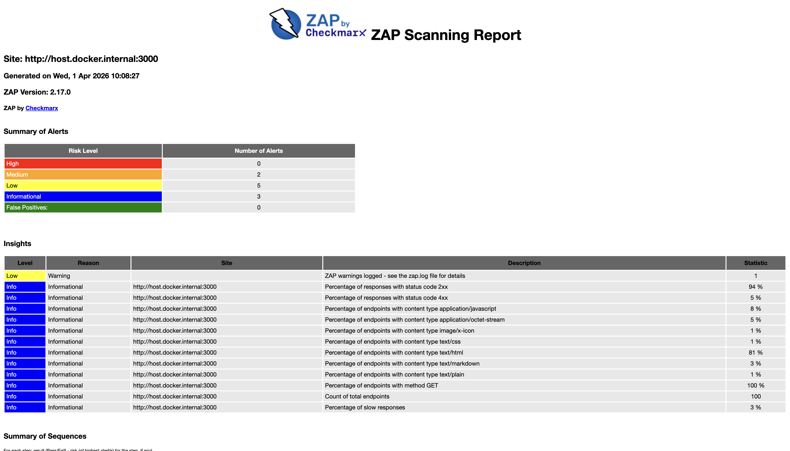
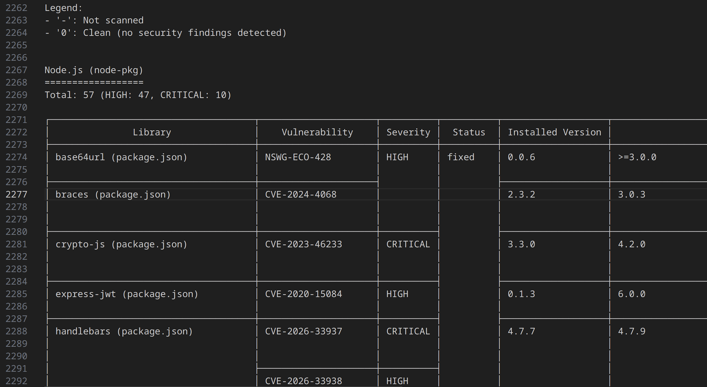

# Lab 9 — DevSecOps Tools: Security Scanning

## Task 1 — Web Application Scanning with OWASP ZAP

### Number of Medium Risk Vulnerabilities Found

**2** medium-risk vulnerabilities were identified during the baseline scan.

### Two Most Noteworthy Vulnerabilities

**1. Missing Content Security Policy (CSP) Header — Medium**

The application does not return a `Content-Security-Policy` header in its HTTP responses. Without CSP, the browser has no instruction on which content sources are trustworthy. This significantly widens the attack surface for Cross-Site Scripting (XSS) and various data injection techniques, since an attacker can load malicious scripts or resources from arbitrary origins.

**2. Cross-Domain Misconfiguration (CORS) — Medium**

The server's CORS policy is configured in an overly relaxed manner, potentially allowing external websites to read response data from the application. If sensitive endpoints are exposed this way, a malicious page could silently retrieve user data or internal API responses through the victim's browser session.

### Security Headers Assessment

| Header | Status | Significance |
|--------|--------|-------------|
| `Content-Security-Policy` | **Missing** | Without it, browsers permit loading resources from any source, making XSS and injection attacks far easier to execute. |
| `Cross-Origin-Embedder-Policy` | **Missing** | Its absence means the app cannot enforce restrictions on cross-origin resource embedding, leaving room for unintended data exposure. |
| `Cross-Origin-Opener-Policy` | **Missing** | Without this header, the browsing context is not isolated, which increases the risk of cross-window information leakage. |
| `Access-Control-Allow-Origin` | **Present (`*`)** | While technically present, the wildcard value is excessively permissive — any origin can read unauthenticated responses, which undermines same-origin protections. |

### ZAP Report Screenshot

### Analysis: Most Prevalent Web Vulnerability Categories

Based on both the scan results and broader industry data (e.g., OWASP Top 10), the most frequently encountered web application flaws fall into these categories:

- **Security misconfiguration** — absent or incorrect headers, default credentials, verbose error pages. This was the dominant finding in the ZAP scan.
- **Injection vulnerabilities** — SQL injection, command injection, and similar flaws where untrusted input reaches an interpreter.
- **Cross-Site Scripting (XSS)** — attackers inject client-side scripts due to insufficient output encoding or lack of CSP enforcement.
- **Broken access control** — users can act outside their intended permissions, access other users' data, or escalate privileges.

---

## Task 2 — Container Vulnerability Scanning with Trivy

### Vulnerability Totals

| Severity | Count |
|----------|-------|
| CRITICAL | 10 |
| HIGH | 47 |
| **Total** | **57** |

### Two Vulnerable Packages with CVE IDs

| Package | Source | CVE ID | Details |
|---------|--------|--------|---------|
| `braces` | package.json | CVE-2024-4068 | A flaw in the brace expansion library that can be exploited to cause resource exhaustion. |
| `crypto-js` | package.json | CVE-2023-46233 | A weakness in the cryptographic library that undermines the strength of encryption operations. |

### Most Frequently Observed Vulnerability Type

The majority of flagged issues relate to **Denial of Service (DoS)** vectors — resource exhaustion through crafted input or algorithmic complexity attacks. The scan output does not categorize vulnerabilities by CWE explicitly, but manual inspection of the CVE descriptions reveals DoS as the recurring pattern.

### Trivy Output Screenshot

### Analysis: Importance of Container Image Scanning Before Production

Container images bundle the entire runtime stack — OS packages, language runtimes, third-party libraries. Any known vulnerability in these layers becomes part of the deployed application. Scanning before deployment serves several purposes:

- **Early detection** — vulnerabilities are caught when they are cheapest to fix, before they reach live infrastructure.
- **Supply chain visibility** — teams gain awareness of transitive dependencies they may not have chosen directly.
- **Compliance** — many regulatory frameworks require evidence that known vulnerabilities have been assessed prior to release.
- **Reduced blast radius** — fixing issues pre-deployment avoids emergency patching of running production systems.

### Reflection: Integrating Security Scans into CI/CD

A practical integration approach:

1. **PR stage** — run dependency and image scans automatically when a pull request is opened; post results as a PR comment or status check.
2. **Build stage** — after the container image is built, scan it with Trivy before pushing to the registry; fail the pipeline if any CRITICAL findings exist.
3. **Gate policy** — define severity thresholds (e.g., block on CRITICAL, warn on HIGH) with an exception/approval workflow for known accepted risks.
4. **Artifact storage** — publish scan reports (HTML/JSON) as pipeline artifacts for audit trails and historical tracking.
5. **Scheduled rescans** — periodically rescan already-deployed images against updated vulnerability databases to catch newly disclosed CVEs.