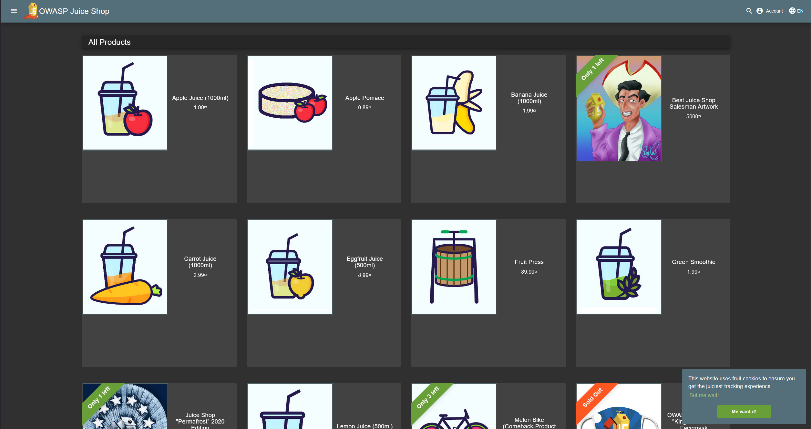

# Lab 9 — Introduction to DevSecOps Tools

## Task 1 — Web Application Scanning with OWASP ZAP (5 pts)

### Vulnerable Target Application

**Target:** OWASP Juice Shop
**URL:** `http://localhost:3000`
**Status:** Successfully deployed and running
**Screenshot:** 
### ZAP Baseline Scan Results

**Total Medium risk vulnerabilities:** 2

**Security headers status:**

| Header | Status | Why it matters |
|--------|--------|----------------|
| Access-Control-Allow-Origin | Present with `*` | Allows any domain to access resources — CORS misconfiguration |
| Content-Security-Policy (CSP) | Missing | Cannot mitigate XSS and data injection attacks |
| X-Frame-Options | Missing | Vulnerable to clickjacking attacks |
| X-Content-Type-Options | Missing | Vulnerable to MIME type sniffing |

---

### Most Interesting Vulnerabilities (Medium Risk)

**Vulnerability #1: Cross-Domain Misconfiguration (CORS)**
- **Risk level:** Medium
- **Description:** The web server returns `Access-Control-Allow-Origin: *` header, which permits cross-domain read requests from arbitrary third-party domains.
- **Affected URLs:** Multiple assets including `favicon.js.ico`, chunk files, `robots.txt`
- **Impact:** An attacker could use this misconfiguration to access data available in an unauthenticated manner from a malicious website, bypassing same-origin policy.

**Vulnerability #2: Content Security Policy (CSP) Header Missing**
- **Risk level:** Medium
- **Description:** The web server does not return a Content-Security-Policy header, which helps detect and mitigate XSS and data injection attacks.
- **Impact:** Without CSP, the application is more vulnerable to Cross-Site Scripting (XSS) attacks, where attackers can inject malicious scripts into web pages viewed by users.

## Task 2 — Container Vulnerability Scanning with Trivy (5 pts)

### Scan Command

```bash
docker run --rm -v /var/run/docker.sock:/var/run/docker.sock \
  ghcr.io/aquasecurity/trivy:latest image \
  --severity HIGH,CRITICAL \
  bkimminich/juice-shop

Scan Results Summary
Severity	Count
CRITICAL	9
HIGH	44

Total: 53 vulnerabilities (HIGH: 44, CRITICAL: 9)
Vulnerable Packages (2 examples)
Package	Version	CVE ID	Severity
crypto-js	3.3.0	CVE-2023-46233	CRITICAL
jsonwebtoken	0.1.0	CVE-2015-9235	CRITICAL
Additional Critical Vulnerabilities Found

    lodash (2.4.2) — CVE-2019-10744 (Prototype pollution)

    marsdb (0.6.11) — GHSA-5mrr-rgp6-x4gr (Command Injection)

    vm2 (3.9.17) — CVE-2023-32314 (Sandbox Escape)

Most Common Vulnerability Type

The most common vulnerability types found were:

    Prototype Pollution (lodash, marsdb)

    Sandbox Escape (vm2)

    Denial of Service (DoS) (minimatch, multer, tar, ws)

    Authorization Bypass (express-jwt, jsonwebtoken, jws)

Most frequent: Denial of Service (DoS) vulnerabilities affecting multiple packages (minimatch, multer, tar, ws, moment).
Secrets Found

Trivy also detected embedded private RSA keys in the container:

    /juice-shop/build/lib/insecurity.js — HIGH severity

    /juice-shop/lib/insecurity.ts — HIGH severity

This is a critical security issue — private keys should never be embedded in container images.

Screenshot: images/trivy-output.png
Analysis: Why is container image scanning important before deploying to production?

Container images often contain operating system packages and application dependencies with known vulnerabilities. Scanning before deployment provides several critical benefits:

    Prevents vulnerable code from reaching production environments — in this case, 9 CRITICAL and 44 HIGH vulnerabilities were found

    Reduces attack surface — identifies unnecessary packages and embedded secrets (like private RSA keys)

    Enables compliance with security standards (PCI DSS, SOC2, HIPAA) which require vulnerability scanning

    Shifts security left — finds issues earlier in the development lifecycle, when fixes are cheaper

    Protects supply chain — detects vulnerable dependencies introduced via third-party packages

Without scanning, containers with known CVEs become easy targets for attackers. The 53 vulnerabilities found in Juice Shop demonstrate how vulnerable even a "simple" Node.js application can be.
