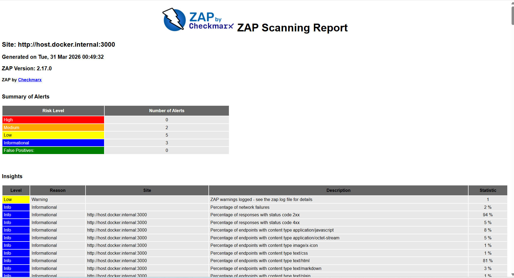
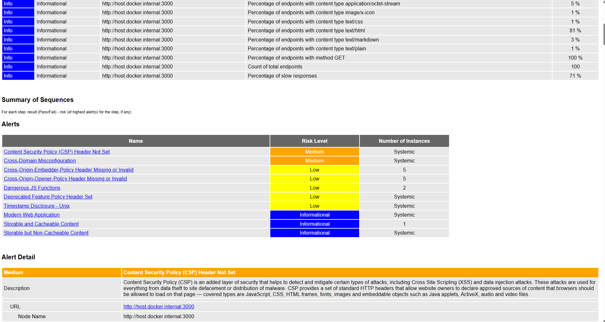
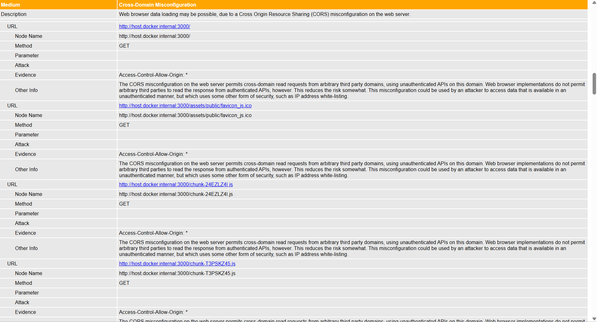
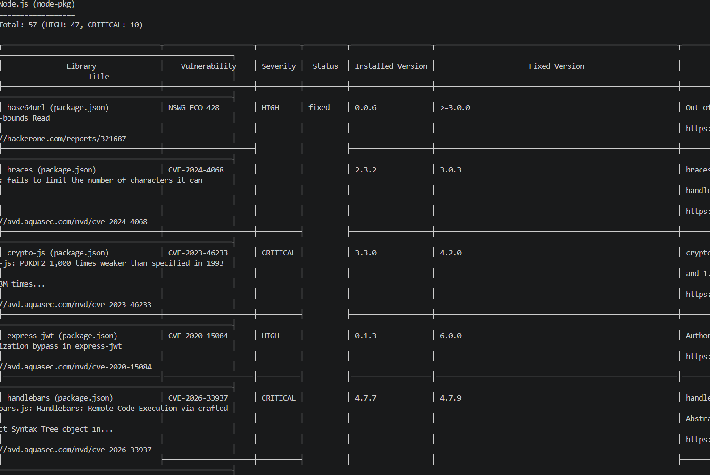
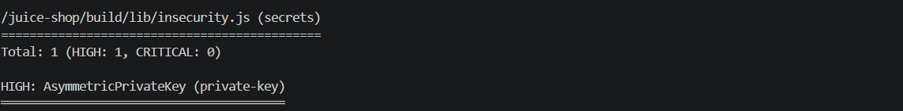
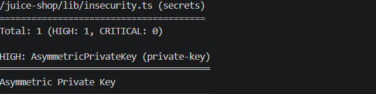

# Task 1
## Task 1.3
html report 






Medium risk vulnerabilities


Name	Risk Level	Number of Instances
Content Security Policy (CSP) Header Not Set	Medium	Systemic
Cross-Domain Misconfiguration	Medium	Systemic

## Task 1.4
### Missing
Content-Security-Policy Lowers the risk of XSS and data injection attacks by limiting which sources can execute scripts or load content.

Cross-Origin-Embedder-Policy Prevents potentially harmful cross-origin embedded resources unless they are explicitly permitted.

Cross-Origin-Opener-Policy Keeps the browsing context isolated, reducing the chance of data leakage between different windows.

### Present
Access-Control-Allow-Origin: * is excessively lenient. It grants any domain access to read unauthenticated responses, which could lead to broad exposure of sensitive data.


### Analyze
The most frequent web security weaknesses involve broken access controls, injection vulnerabilities (particularly SQL and command injection), and cross-site scripting (XSS). In real-world scenarios, a significant number of issues also stem from misconfigurations in security settings—such as absent security headers, overly detailed error messages, and insecure default configurations.


docker run --rm -v /var/run/docker.sock:/var/run/docker.sock aquasec/trivy:latest image --severity HIGH,CRITICAL bkimminich/juice-shop

# Task 2

scan output




### Number of High and Critical
'High' - 49
'Critical' - 10

### Twp package example
express-jwt (package.json)          │ CVE-2020-15084      │ HIGH   
handlebars (package.json)           │ CVE-2026-33937      │ CRITICAL 

### Most Common 
ReDoS(CVE-2022-25858/ CVE-2024-45296 / CVE-2025-25288) and Prototype Pollution(CVE-2024-57083)

### Analyze + Answer
#### Why Image Scanning Matters

Container images frequently bundle numerous dependencies that may carry known security flaws. Without scanning, these vulnerabilities can slip into production environments unnoticed.

#### CI/CD Integration

```yaml
- uses: aquasecurity/trivy-action@master
  with:
    image-ref: 'my-image:latest'
    severity: 'CRITICAL,HIGH'
    exit-code: '1'  # stops deployment if issues are found
```