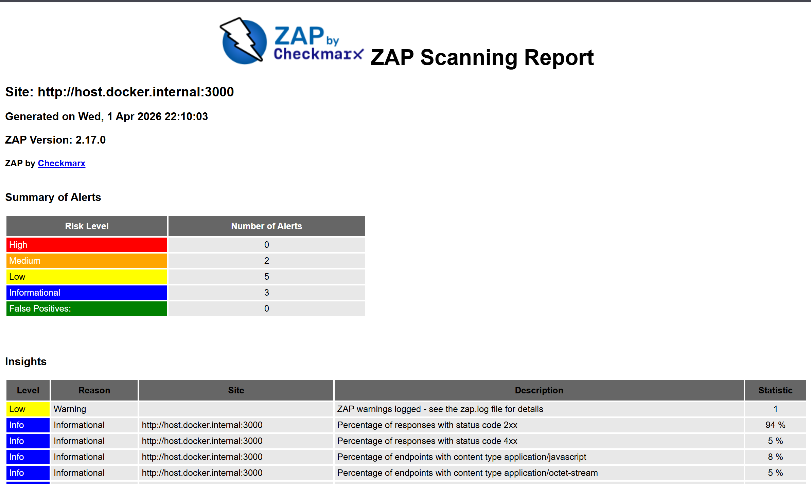
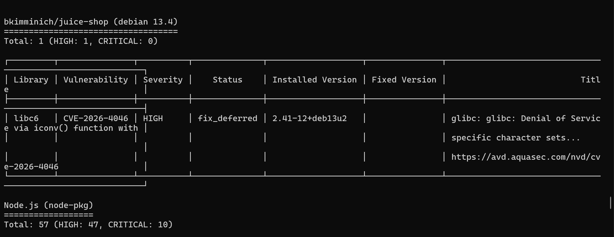

# Lab 9 — Introduction to DevSecOps Tools Submission

## Task 1 — Web Application Scanning with OWASP ZAP

### Scan Results Overview
- **Number of Medium risk vulnerabilities found:** 2
- **Security headers status:** Заголовки безопасности настроены не полностью. Сканирование показало отсутствие важного заголовка Content Security Policy (CSP). Это означает, что браузер не получает инструкций о том, из каких источников разрешено загружать скрипты и контент, что оставляет приложение беззащитным перед атаками типа XSS (Cross Site Scripting). Также выявлена неправильная настройка CORS (Cross-Domain Misconfiguration), из-за которой сторонние домены могут получать несанкционированный доступ к данным нашего приложения.

### Top 2 Interesting Vulnerabilities
1. **Content Security Policy (CSP) Header Not Set:** 
- **Description:** Content Security Policy (CSP) is an added layer of security that helps to detect and mitigate certain types of attacks, including Cross Site Scripting (XSS) and data injection attacks. These attacks are used for everything from data theft to site defacement or distribution of malware. CSP provides a set of standard HTTP headers that allow website owners to declare approved sources of content that browsers should be allowed to load on that page — covered types are JavaScript, CSS, HTML frames, fonts, images and embeddable objects such as Java applets, ActiveX, audio and video files.
3. **Cross-Domain Misconfiguration:**
- **Description:** Web browser data loading may be possible, due to a Cross Origin Resource Sharing (CORS) misconfiguration on the web server.

### ZAP HTML Report Overview


### Analysis
**What type of vulnerabilities are most common in web applications?**
Опираясь на результаты моего сканирования и рейтинги уязвимостей (такие как OWASP Top 10), наиболее частыми проблемами в веб-приложениях, это некорректные конфигурации безопасности (Security Misconfigurations) и проблемы с контролем доступа. Наш отчет это тоже подтверждает: найденные уязвимости (отсутствие заголовка CSP и неверно настроенный CORS) являются классическими ошибками конфигурации.


## Task 2 — Container Vulnerability Scanning with Trivy

### Scan Findings
- **Total count of CRITICAL vulnerabilities:** 10
- **Total count of HIGH vulnerabilities:** 50
- **Most common vulnerability type found:** Наиболее часто встречаются уязвимости, связанные с устаревшими зависимостями Node.js, а также хардкод приватных ключей шифрования (Asymmetric Private Key) прямо в исходных файлах контейнера.

### Vulnerable Packages Example
1. **Package:** libc6 | **CVE ID:** CVE-2026-4046
2. **Package:** crypto-js | **CVE ID:** CVE-2023-46233

### Trivy Terminal Output


```text
bkimminich/juice-shop (debian 13.4)
===================================
Total: 1 (HIGH: 1, CRITICAL: 0)

┌─────────┬───────────────┬──────────┬──────────────┬───────────────────┬───────────────┬───────────────────────────────────────────────────────────┐
│ Library │ Vulnerability │ Severity │    Status    │ Installed Version │ Fixed Version │                           Title                           │
├─────────┼───────────────┼──────────┼──────────────┼───────────────────┼───────────────┼───────────────────────────────────────────────────────────┤
│ libc6   │ CVE-2026-4046 │ HIGH     │ fix_deferred │ 2.41-12+deb13u2   │               │ glibc: glibc: Denial of Service via iconv() function with │
│         │               │          │              │                   │               │ specific character sets...                                │
│         │               │          │              │                   │               │ [https://avd.aquasec.com/nvd/cve-2026-4046](https://avd.aquasec.com/nvd/cve-2026-4046)                 │
└─────────┴───────────────┴──────────┴──────────────┴───────────────────┴───────────────┴───────────────────────────────────────────────────────────┘

Node.js (node-pkg)
==================
Total: 57 (HIGH: 47, CRITICAL: 10)
```

### Analysis & Reflection
**Why is container image scanning important before deploying to production?**
Сканирование образов критически важно, так как контейнеры инкапсулируют в себе всю среду выполнения, включая системные утилиты и сторонние пакеты. Даже если код самого приложения написан идеально безопасно, уязвимость в базовом образе ОС (например, как в данном случае в лабе с `libc6`) или случайно оставленный приватный RSA-ключ в файлах сборки (`insecurity.ts`) позволит злоумышленнику скомпрометировать весь сервер. Сканирование обнаруживает эти проблемы до того, как образ покинет защищенный контур.

**How would you integrate these scans into a CI/CD pipeline?**
Важно, чтобы пайплайны были предсказуемыми и защищенными от человеческого фактора. Сканирование безопасности необходимо встраивать в CI/CD на самых ранних этапах. На практике это означает добавление отдельного шага в пайплайн, который будет запускать Trivy после сборки Docker-образа. Если сканер обнаруживает уязвимости уровня CRITICAL или слитые секреты, пайплайн должен принудительно прерываться, не пропуская небезопасный артефакт в продакшен.
