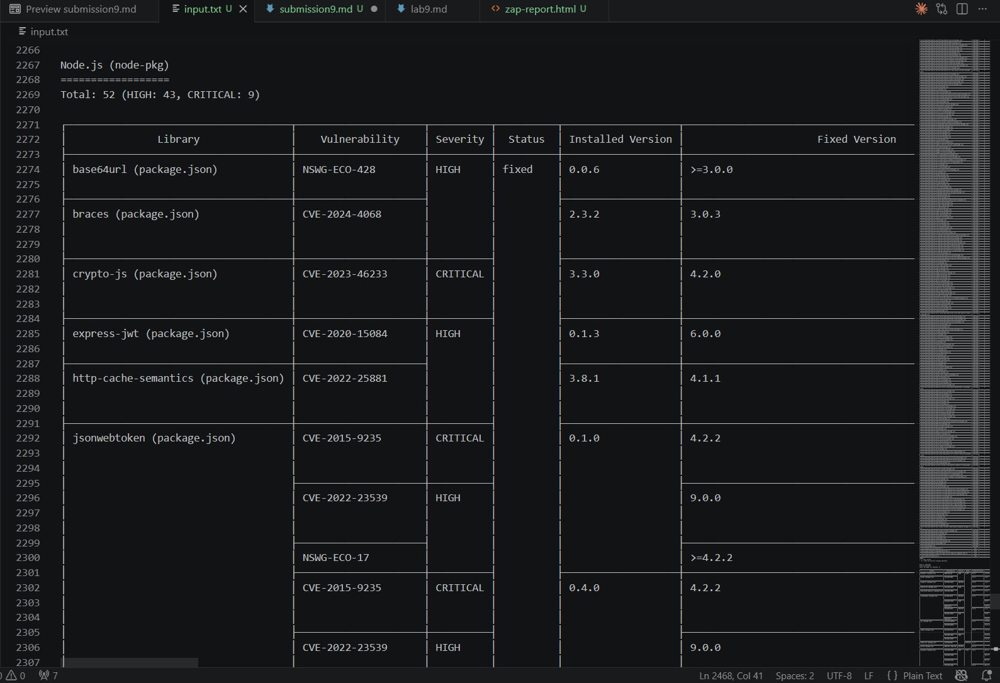

# Lab 9 — Introduction to DevSecOps Tools

## Task 1 — Web Application Scanning with OWASP ZAP

### Number of Medium risk vulnerabilities found
2

### Description of the 2 most interesting vulnerabilities
- **Content Security Policy (CSP) Header Not Set:** Content Security Policy (CSP) is an added layer of security that helps to detect and mitigate certain types of attacks, including Cross Site Scripting (XSS) and data injection attacks. These attacks are used for everything from data theft to site defacement or distribution of malware. CSP provides a set of standard HTTP headers that allow website owners to declare approved sources of content that browsers should be allowed to load on that page — covered types are JavaScript, CSS, HTML frames, fonts, images and embeddable objects such as Java applets, ActiveX, audio and video files.
- **Cross-Domain Misconfiguration:** Web browser data loading may be possible, due to a Cross Origin Resource Sharing (CORS) misconfiguration on the web server.

### Security headers status (which are present/missing and why they matter)
- **Content-Security-Policy (CSP): missing**

*Why it matters:* CSP limits where scripts, styles, images, frames, and other resources can load from. It is one of the main browser-side mitigations against XSS and script injection.

- **Cross-Origin-Embedder-Policy (COEP): missing or invalid**

*Why it matters:* COEP helps prevent a page from loading cross-origin resources unless they explicitly allow it. It strengthens browser isolation and reduces some cross-origin data exposure risks.

- **Cross-Origin-Opener-Policy (COOP): missing or invalid**

*Why it matters:* COOP isolates the browsing context from other origins. This helps reduce risks involving cross-window interactions and certain data leaks.

- **CORS is overly permissive**

*Why it matters:* allows any origin to read responses for eligible unauthenticated resources. That is often fine for truly public static assets, but risky if applied broadly to data-bearing endpoints.

### Screenshot of ZAP HTML report overview

### Analysis: What type of vulnerabilities are most common in web applications?
The most common web application vulnerabilities are:
- Broken access control: users can access data or actions they should not.
- Injection flaws: attackers inject SQL, commands, or other malicious input.
- Cross-site scripting (XSS): malicious JavaScript runs in the victim’s browser.
- Authentication and session weaknesses: weak passwords, poor login controls, insecure sessions.
- Security misconfiguration: missing headers, open CORS, default settings, exposed files.
- Sensitive data exposure: personal or confidential information is not properly protected.
- Vulnerable dependencies: outdated libraries or frameworks with known flaws.
- Cross-site request forgery (CSRF): attackers trick users into performing unwanted actions.
- Insecure file upload handling: malicious files can be uploaded and executed.
- Server-side request forgery (SSRF): the server is tricked into making unintended requests.

## Task 2 — Container Vulnerability Scanning with Trivy

### Total count of CRITICAL and HIGH vulnerabilities
Total HIGH + CRITICAL vulnerabilities: 53
- CRITICAL: 9
- HIGH: 44

### List of 2 vulnerable packages with their CVE IDs
Vulnerable packages:
- crypto-js — CVE-2023-46233
- vm2 — CVE-2023-32314

### Most common vulnerability type found
Most common vulnerability type found: Denial of Service (DoS), including ReDoS, malformed request handling, memory leaks, and catastrophic backtracking issues.

### Screenshot of Trivy terminal output showing critical findings

### Analysis: Why is container image scanning important before deploying to production?
Container image scanning is important before production because it finds vulnerable packages, exposed secrets, and insecure dependencies early. This helps prevent issues like authentication bypass, remote code execution, file overwrite, and denial-of-service attacks.

It also helps teams prioritize fixes, meet security policies, and stop risky images from being deployed. Finding these problems during CI/CD is much easier and cheaper than dealing with a security incident in production.

### Reflection: How would you integrate these scans into a CI/CD pipeline?
Add the scans as automated pipeline steps on every pull request and build.

A simple flow is:
- Code and dependency scan after install
- Secret scan before image build
- Container image scan right after the image is built
- Fail the pipeline for critical issues, leaked secrets, or policy violations
- Publish the scan results as build artifacts or comments on the pull request

Then run the same scans again before release to staging or production, with stricter blocking rules. This makes security checks continuous, catches problems early, and prevents vulnerable images from being deployed.