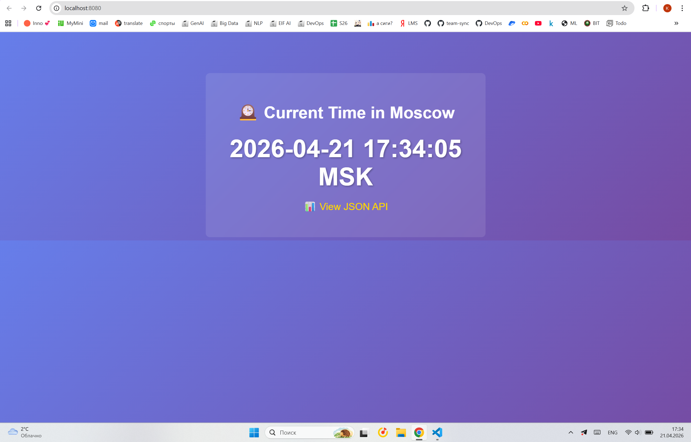
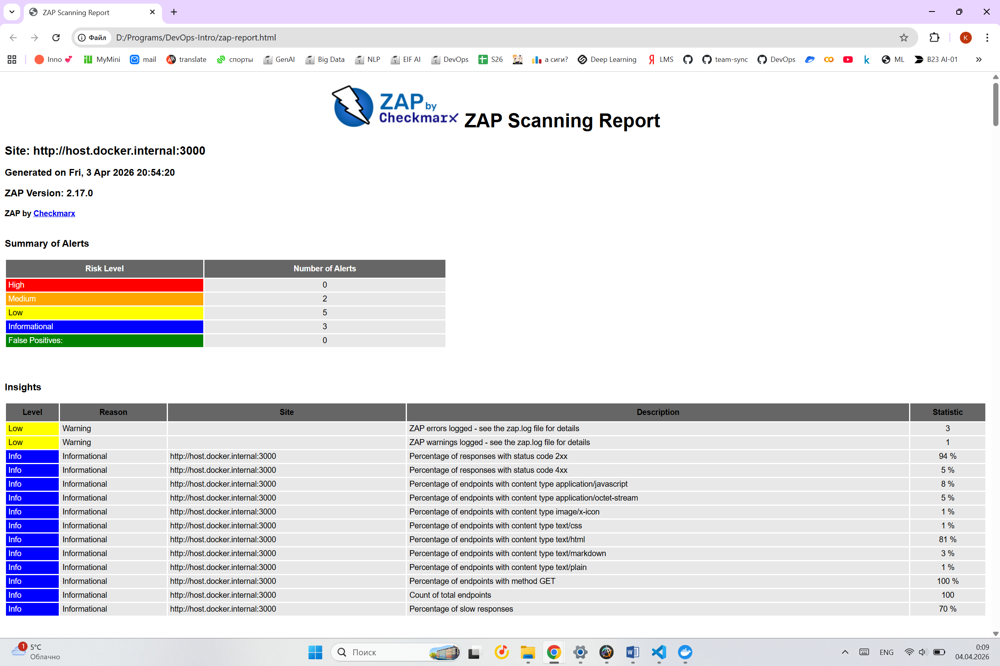
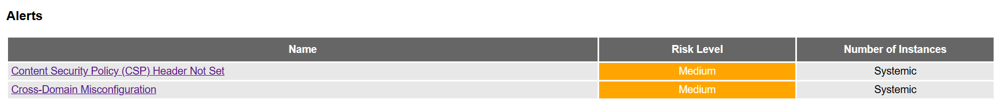

# Lab 9 — Introduction to DevSecOps Tools

**Student:** Kamilya Shakirova
**Date:** 03-04-2026

---


## Task 1 — Web Application Scanning with OWASP ZAP

- [x] Number of Medium risk vulnerabilities found
- [x] Description of the 2 most interesting vulnerabilities
- [x] Security headers status (which are present/missing and why they matter)
- [x] Screenshot of ZAP HTML report overview
- [x] Analysis: What type of vulnerabilities are most common in web applications?


### 1.1 Start the Vulnerable Target Application

1. **Deploy Juice Shop (Intentionally Vulnerable Application):**

```bash
PS D:\Programs\DevOps-Intro> docker run -d --name juice-shop -p 3000:3000 bkimminich/juice-shop
Unable to find image 'bkimminich/juice-shop:latest' locally
latest: Pulling from bkimminich/juice-shop
52630fc75a18: Pulling fs layer
c172f21841df: Pulling fs layer                                                                                                                                                   
2780920e5dbf: Pulling fs layer                                                                                                                                                   
7c12895b777b: Pulling fs layer                                                                                                                                                   
b4e6f1bfce0a: Pulling fs layer                                                                                                                                                   
b4242723c53f: Pulling fs layer                                                                                                                                                   
fa8ae93e2b3a: Pulling fs layer                                                                                                                                                   
3214acf345c0: Pulling fs layer                                                                                                                                                   
ebddc55facdc: Pulling fs layer                                                                                                                                                   
d6b1b89eccac: Pulling fs layer                                                                                                                                                   
dd64bf2dd177: Pulling fs layer                                                                                                                                                   
4ec36cb7292a: Pulling fs layer                                                                                                                                                   
e65d8d69ea29: Pulling fs layer                                                                                                                                                   
b839dfae01f6: Pulling fs layer                                                                                                                                                   
bdfd7f7e5bf6: Pulling fs layer                                                                                                                                                   
bd8962e29291: Pulling fs layer                                                                                                                                                   
dbd6fdc2f147: Pulling fs layer                                                                                                                                                   
cac2ae0193cb: Pulling fs layer                                                                                                                                                   
dbd6fdc2f147: Pull complete
7cc70dfd88cf: Pull complete
8224d91da70b: Pull complete
1a4be5562d92: Pull complete
7d664d9802de: Pull complete
2f72b5f199b4: Pull complete
Digest: sha256:5539448a1d3fa88d932d3f80a8d3f69a16cde6253c1d4256b28a38ef910e4114
Status: Downloaded newer image for bkimminich/juice-shop:latest
e7c92d738fe65eba7069c3aecaba150ce2fd5b34d58246bcd47c4331c4e11aee
```

2. **Verify It's Running:**

Open your browser and navigate to `http://localhost:3000`


### 1.2 Scan with OWASP ZAP

1. **Run ZAP Baseline Scan:**

   <details>
   <summary>🐧 Linux Users - Network Configuration</summary>

   On Linux, Docker containers can't use `host.docker.internal`. Get your Docker bridge IP:

   ```bash
   ip -f inet -o addr show docker0 | awk '{print $4}' | cut -d '/' -f 1
   ```

   Then use that IP in the ZAP command below instead of `host.docker.internal`.

   </details>

```bash
PS D:\Programs\DevOps-Intro> docker run --rm -u zap -v ${PWD}:/zap/wrk:rw -t ghcr.io/zaproxy/zaproxy:stable zap-baseline.py -t http://host.docker.internal:3000 -g gen.conf -r zap-report.html
Unable to find image 'ghcr.io/zaproxy/zaproxy:stable' locally
stable: Pulling from zaproxy/zaproxy
91d5eed96c45: Pulling fs layer
84a2afebaf4d: Pulling fs layer                                                                                                                                                   
03d5798b4e28: Pulling fs layer                                                                                                                                                   
cbc86f9bec2f: Pulling fs layer                                                                                                                                                   
7a4bb520bb3f: Pulling fs layer                                                                                                                                                   
54ea64e8f1a7: Pulling fs layer                                                                                                                                                   
26312832d6e7: Pulling fs layer                                                                                                                                                   
4f4fb700ef54: Pulling fs layer                                                                                                                                                   
694a77eeec82: Pulling fs layer                                                                                                                                                   
0518d3bee6c6: Pulling fs layer                                                                                                                                                   
8dfab5f77c29: Pulling fs layer                                                                                                                                                   
80414daa6971: Pulling fs layer                                                                                                                                                   
04c9bfddfe0a: Pulling fs layer                                                                                                                                                   
5c5ce62775ba: Pulling fs layer                                                                                                                                                   
91d5eed96c45: Pull complete
94428a06f602: Pull complete
4e108a765cac: Pull complete
7b417353d040: Pull complete
f65449d4570b: Pull complete
605dcdf58e46: Pull complete
Digest: sha256:c4da4c234258d444d9988fce9d034b00323724818daa4c91ca46f09aa04b46db
Status: Downloaded newer image for ghcr.io/zaproxy/zaproxy:stable
Total of 123 URLs
PASS: Vulnerable JS Library (Powered by Retire.js) [10003]
PASS: In Page Banner Information Leak [10009]
PASS: Cookie No HttpOnly Flag [10010]
PASS: Cookie Without Secure Flag [10011]
PASS: Re-examine Cache-control Directives [10015]
PASS: Cross-Domain JavaScript Source File Inclusion [10017]
PASS: Content-Type Header Missing [10019]
PASS: Anti-clickjacking Header [10020]
PASS: X-Content-Type-Options Header Missing [10021]
PASS: Information Disclosure - Debug Error Messages [10023]
PASS: Information Disclosure - Sensitive Information in URL [10024]
PASS: Information Disclosure - Sensitive Information in HTTP Referrer Header [10025]
PASS: HTTP Parameter Override [10026]
PASS: Information Disclosure - Suspicious Comments [10027]
PASS: Off-site Redirect [10028]
PASS: Cookie Poisoning [10029]
PASS: User Controllable Charset [10030]
PASS: User Controllable HTML Element Attribute (Potential XSS) [10031]
PASS: Viewstate [10032]
PASS: Directory Browsing [10033]
PASS: Heartbleed OpenSSL Vulnerability (Indicative) [10034]
PASS: Strict-Transport-Security Header [10035]
PASS: HTTP Server Response Header [10036]
PASS: Server Leaks Information via "X-Powered-By" HTTP Response Header Field(s) [10037]
PASS: X-Backend-Server Header Information Leak [10039]
PASS: Secure Pages Include Mixed Content [10040]
PASS: HTTP to HTTPS Insecure Transition in Form Post [10041]
PASS: HTTPS to HTTP Insecure Transition in Form Post [10042]
PASS: User Controllable JavaScript Event (XSS) [10043]
PASS: Big Redirect Detected (Potential Sensitive Information Leak) [10044]
PASS: Content Cacheability [10049]
PASS: Retrieved from Cache [10050]
PASS: X-ChromeLogger-Data (XCOLD) Header Information Leak [10052]
PASS: Cookie without SameSite Attribute [10054]
PASS: CSP [10055]
PASS: X-Debug-Token Information Leak [10056]
PASS: Username Hash Found [10057]
PASS: X-AspNet-Version Response Header [10061]
PASS: PII Disclosure [10062]
PASS: Hash Disclosure [10097]
PASS: Source Code Disclosure [10099]
PASS: Weak Authentication Method [10105]
PASS: Reverse Tabnabbing [10108]
PASS: Modern Web Application [10109]
PASS: Authentication Request Identified [10111]
PASS: Session Management Response Identified [10112]
PASS: Verification Request Identified [10113]
PASS: Script Served From Malicious Domain (polyfill) [10115]
PASS: ZAP is Out of Date [10116]
PASS: Absence of Anti-CSRF Tokens [10202]
PASS: Private IP Disclosure [2]
PASS: Session ID in URL Rewrite [3]
PASS: Script Passive Scan Rules [50001]
PASS: Insecure JSF ViewState [90001]
PASS: Java Serialization Object [90002]
PASS: Sub Resource Integrity Attribute Missing [90003]
PASS: Charset Mismatch [90011]
PASS: Application Error Disclosure [90022]
PASS: WSDL File Detection [90030]
PASS: Loosely Scoped Cookie [90033]
WARN-NEW: Content Security Policy (CSP) Header Not Set [10038] x 15
        http://host.docker.internal:3000/ (200 OK)
        http://host.docker.internal:3000 (200 OK)
        http://host.docker.internal:3000/sitemap.xml (200 OK)
        http://host.docker.internal:3000/ftp/coupons_2013.md.bak (403 Forbidden)
        http://host.docker.internal:3000/ftp/encrypt.pyc (403 Forbidden)
WARN-NEW: Deprecated Feature Policy Header Set [10063] x 12
        http://host.docker.internal:3000/ (200 OK)
        http://host.docker.internal:3000/chunk-24EZLZ4I.js (200 OK)
        http://host.docker.internal:3000/chunk-TWZW5B45.js (200 OK)
        http://host.docker.internal:3000/chunk-T3PSKZ45.js (200 OK)
        http://host.docker.internal:3000 (200 OK)
WARN-NEW: Timestamp Disclosure - Unix [10096] x 9
        http://host.docker.internal:3000/ (200 OK)
        http://host.docker.internal:3000/ (200 OK)
        http://host.docker.internal:3000/ (200 OK)
        http://host.docker.internal:3000 (200 OK)
        http://host.docker.internal:3000 (200 OK)
WARN-NEW: Cross-Domain Misconfiguration [10098] x 11
        http://host.docker.internal:3000/ (200 OK)
        http://host.docker.internal:3000/robots.txt (200 OK)
        http://host.docker.internal:3000/assets/public/favicon_js.ico (200 OK)
        http://host.docker.internal:3000/chunk-24EZLZ4I.js (200 OK)
        http://host.docker.internal:3000/chunk-T3PSKZ45.js (200 OK)
WARN-NEW: Dangerous JS Functions [10110] x 2
        http://host.docker.internal:3000/chunk-LHKS7QUN.js (200 OK)
        http://host.docker.internal:3000/main.js (200 OK)
WARN-NEW: Cross-Origin-Embedder-Policy Header Missing or Invalid [90004] x 12
        http://host.docker.internal:3000/ (200 OK)
        http://host.docker.internal:3000/ (200 OK)
        http://host.docker.internal:3000 (200 OK)
        http://host.docker.internal:3000 (200 OK)
        http://host.docker.internal:3000/sitemap.xml (200 OK)
FAIL-NEW: 0     FAIL-INPROG: 0  WARN-NEW: 6     WARN-INPROG: 0  INFO: 0 IGNORE: 0       PASS: 60
```

   > Mac/Windows users: Use `host.docker.internal` as shown above

### 1.3 Analyze Results

1. **Open the Report:**

   - Find `zap-report.html` in your current directory
   - Open it in a browser



2. **Identify Vulnerabilities:**

   - Find at least 2 Medium risk vulnerabilities
        

        ### Medium Risk Vulnerabilities Found (2)

        **Content Security Policy (CSP) Header Not Set** (Plugin ID: 10038)
        - The application doesn't set the CSP header, making it vulnerable to XSS and data injection attacks
        - Affects: Multiple URLs including root, `/ftp/coupons_2013.md.bak`, `/ftp/encrypt.pyc`, `/sitemap.xml`

        **Cross-Domain Misconfiguration** (Plugin ID: 10098)
        - CORS misconfiguration with `Access-Control-Allow-Origin: *`
        - Allows arbitrary third-party domains to read unauthenticated API responses
        - Affects: Root, `favicon_js.ico`, multiple chunk.js files, `robots.txt`

   - Check security headers status (which headers are present/missing?)
        **Missing Headers (Issues Found):**
        - ❌ `Content-Security-Policy` - **MISSING** (Medium risk)
        - ❌ `Cross-Origin-Embedder-Policy` - **MISSING** (Low risk)
        - ❌ `Cross-Origin-Opener-Policy` - **MISSING** (Low risk)
        - ⚠️ `Feature-Policy` - **DEPRECATED** (Should use Permissions-Policy instead)

        **Present but Problematic:**
        - `Access-Control-Allow-Origin: *` - Too permissive (Medium risk)

   - Note the most interesting vulnerability found

        The **Cross-Domain Misconfiguration** with `Access-Control-Allow-Origin: *` is particularly concerning because:

        - It allows **any website** to make cross-origin requests to your application
        - Attackers could host a malicious site that reads sensitive data from your app
        - Evidence found in multiple locations including root path, JavaScript chunks, and `robots.txt`
        - While unauthenticated APIs have somewhat reduced risk, this could still expose sensitive data or be used for reconnaissance


### 1.4 Clean Up

```bash
PS D:\Programs\DevOps-Intro> docker stop juice-shop                        
juice-shop
PS D:\Programs\DevOps-Intro> docker rm juice-shop                          
juice-shop
```

### 1.5 What type of vulnerabilities are most common in web applications?
1. **Injection** (SQL, NoSQL, Command)
2. **Broken Authentication**
3. **XSS** (Cross-Site Scripting)
4. **Security Misconfiguration**
5. **Sensitive Data Exposure**


---

## Task 2 — Container Vulnerability Scanning with Trivy

- [] Total count of CRITICAL and HIGH vulnerabilities
- [] List of 2 vulnerable packages with their CVE IDs
- [] Most common vulnerability type found
- [] Screenshot of Trivy terminal output showing critical findings
- [] Analysis: Why is container image scanning important before deploying to production?
- [] Reflection: How would you integrate these scans into a CI/CD pipeline?

### 2.1: Scan Container Image

1. **Run Trivy Scan:**

```bash
docker run --rm -v /var/run/docker.sock:/var/run/docker.sock aquasec/trivy:0.62.0 image --severity HIGH,CRITICAL bkimminich/juice-shop
```

   <details>
   <summary>🔍 Understanding Trivy flags</summary>

   - `--severity HIGH,CRITICAL`: Only show high and critical vulnerabilities
   - `-v /var/run/docker.sock`: Allows Trivy to access Docker images on your host
   - `image`: Scan a container image

   </details>

### 2.2: Analyze Results

1. **Identify Key Findings:**

   From the scan output, identify:
   - Total number of CRITICAL vulnerabilities
   - Total number of HIGH vulnerabilities
   - At least 2 vulnerable package names
   - The most common vulnerability type (CVE category)


**CRITICAL Vulnerabilities: 10** 

**HIGH Vulnerabilities: 42** (1 from OS + 41 from Node.js)


### **Vulnerable Packages (at least 2):**
1. **crypto-js** (v3.3.0) - CRITICAL
2. **vm2** (v3.9.17) - CRITICAL
3. **handlebars** (v4.7.7) - CRITICAL
4. **lodash** (v2.4.2) - CRITICAL
5. **jsonwebtoken** (v0.1.0) - CRITICAL


**Most Common Vulnerability Type:**

**Remote Code Execution (RCE) / Sandbox Escape**

Multiple CVEs allow attackers to escape sandboxes or execute arbitrary code:
- `vm2` - Sandbox escape (CVE-2023-32314, CVE-2023-37466)
- `handlebars` - RCE via crafted AST (CVE-2026-33937)
- `lodash` - Command injection via template (CVE-2021-23337)
- `marsdb` - Command injection (GHSA-5mrr-rgp6-x4gr)

---

**Critical Findings (10):**

| Package | Vulnerability | Severity |
|---------|--------------|----------|
| crypto-js | CVE-2023-46233 (PBKDF2 weakness) | CRITICAL |
| handlebars | CVE-2026-33937 (RCE) | CRITICAL |
| jsonwebtoken | CVE-2015-9235 (verification bypass) | CRITICAL |
| lodash | CVE-2019-10744 (prototype pollution) | CRITICAL |
| marsdb | GHSA-5mrr-rgp6-x4gr (command injection) | CRITICAL |
| vm2 | CVE-2023-32314 (sandbox escape) | CRITICAL |
| vm2 | CVE-2023-37466 (sandbox escape) | CRITICAL |

---

**Additional Security Issue:**

**Hardcoded RSA Private Key** found in:
- `/juice-shop/build/lib/insecurity.js:47`
- `/juice-shop/lib/insecurity.ts:23`

This is a **HIGH** severity secret exposure issue.

---

**OS Level Vulnerability:**
- **libc6** (CVE-2026-4046) - HIGH - DoS via iconv() function

### 2.3: Clean Up

```bash
PS D:\Programs\DevOps-Intro> docker rmi bkimminich/juice-shop 
```