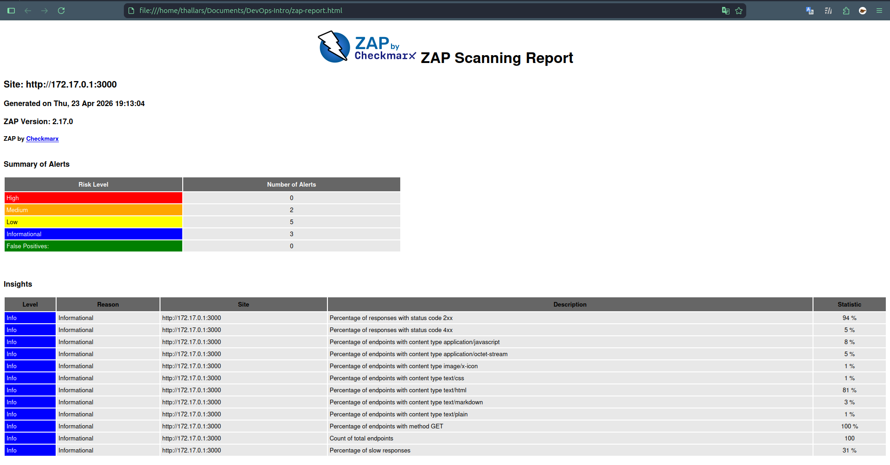
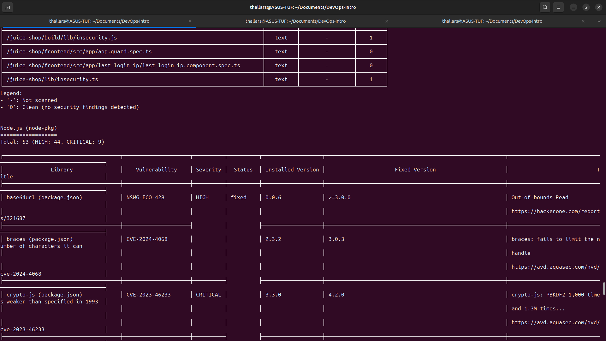

# Lab 9 — Introduction to DevSecOps Tools

## Task 1 — Web Application Scanning with OWASP ZAP

**Number of Medium risk vulnerabilities found:** 2

**Description of the 2 most interesting vulnerabilities:**

- Content Security Policy (CSP) Header Not Set
> Content Security Policy (CSP) is an added layer of security that helps to detect and mitigate certain types of attacks, including Cross Site Scripting (XSS) and data injection attacks. These attacks are used for everything from data theft to site defacement or distribution of malware. CSP provides a set of standard HTTP headers that allow website owners to declare approved sources of content that browsers should be allowed to load on that page — covered types are JavaScript, CSS, HTML frames, fonts, images and embeddable objects such as Java applets, ActiveX, audio and video files.

-  	Cross-Domain Misconfiguration
> Web browser data loading may be possible, due to a Cross Origin Resource Sharing (CORS) misconfiguration on the web server.

**Security headers status:** 

Missing Headers:

| Header | Severity | Why It Matters |
|--------|----------|----------------|
| **Content-Security-Policy (CSP)** | Medium | Prevents XSS and data injection by controlling which sources of content (scripts, styles, images) the browser can load. Without it, attackers can inject malicious scripts. |
| **Cross-Origin-Embedder-Policy (COEP)** | Low | Prevents cross-origin data leakage by controlling whether a document can load cross-origin resources. Missing this makes side-channel attacks like Spectre easier. |
| **Cross-Origin-Opener-Policy (COOP)** | Low | Protects against cross-origin attacks like Spectre by isolating browsing contexts. Missing allows malicious sites to access window references. |

**Screenshot:**

## Task 2 — Container Vulnerability Scanning with Trivy

**Total count of CRITICAL and HIGH vulnerabilities:** Total: 53 (HIGH: 44, CRITICAL: 9)

**List of 2 vulnerable packages with their CVE IDs:**

- crypto-js (package.json) : CVE-2023-46233

- jsonwebtoken (package.json) : CVE-2015-9235

**Most common vulnerability type found:** Denial of Service (DoS)

**Screenshot:**

### Reflection

**Analysis: Why is container image scanning important before deploying to production?**

ontainer image scanning is critical before production deployment because it identifies known vulnerabilities (like the 22+ DoS and critical issues found in Juice Shop) that attackers could exploit to compromise your application, steal data, or cause service disruption.

**Reflection: How would you integrate these scans into a CI/CD pipeline?**

Integrate scans into CI/CD by adding an automated image scanning stage (using tools like Trivy, Snyk, or Grype) after image build but before registry push, failing the pipeline on high/critical vulnerabilities unless explicitly overridden, and scheduling recurring scans of deployed images to catch newly disclosed CVEs.