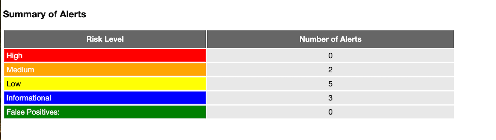
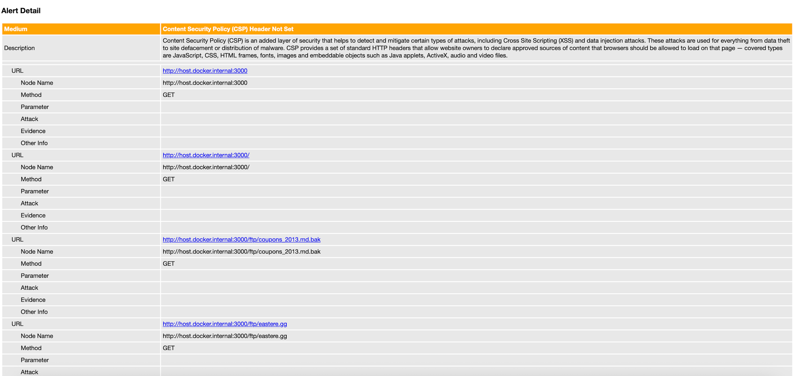
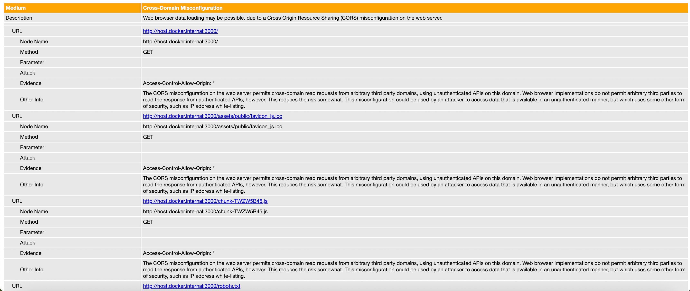
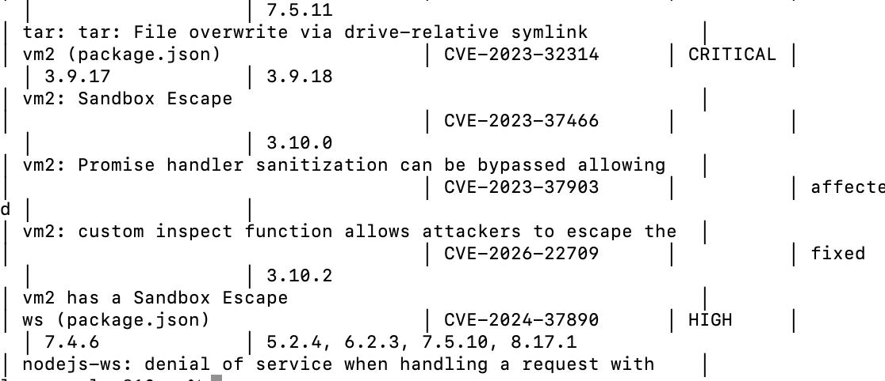

## Task 1 — Web Application Scanning with OWASP ZAP

### Medium Risk Vulnerabilities

- Total Medium vulnerabilities: **2**

### Two Most Interesting Vulnerabilities

#### 1. Content Security Policy (CSP) Header Not Set

This vulnerability indicates that the web application does not define a Content Security Policy (CSP). CSP is a security mechanism that restricts which resources (scripts, styles, images) can be loaded by the browser.

Without CSP, the application becomes vulnerable to attacks such as Cross-Site Scripting (XSS), where an attacker can inject malicious scripts into the application. These scripts may execute in the user’s browser and steal sensitive data such as cookies or session tokens.

---

#### 2. Cross-Domain Misconfiguration (CORS)

This vulnerability is caused by improper configuration of Cross-Origin Resource Sharing (CORS). The server allows access from any origin using:
`Access-Control-Allow-Origin: *`

This means that any external website can send requests to this application and read responses. As a result, sensitive data may be exposed to unauthorized third-party domains.

---

### Security Headers

#### Missing Headers:

- Content-Security-Policy (CSP)
- Cross-Origin-Embedder-Policy
- Cross-Origin-Opener-Policy

These headers are critical for protecting modern web applications. Their absence increases the risk of attacks such as:

- Cross-Site Scripting (XSS)
- Data injection
- Cross-origin data leakage

---

### Analysis

Most of the detected vulnerabilities are related to missing or misconfigured security headers. This is a very common issue in web applications because developers often prioritize functionality over security.

The absence of a Content Security Policy significantly increases the risk of XSS attacks. At the same time, incorrect CORS configuration allows external domains to access application data, which may lead to data leakage.

Overall, the scan demonstrates that even simple applications can have serious security weaknesses if proper security mechanisms are not implemented.

---

### Screenshots

#### ZAP Report Overview

---

#### Example Vulnerability (CSP)

---

#### Example Vulnerability (CORS)

## Task 2 — Container Vulnerability Scanning with Trivy

### Vulnerability Counts

Trivy reported results for multiple targets inside the container image.

Overall scan results:
- Total HIGH vulnerabilities: **48**
- Total CRITICAL vulnerabilities: **10**
- Total HIGH + CRITICAL vulnerabilities: **58**

Breakdown:
- OS packages (Debian): **1 HIGH**, **0 CRITICAL**
- Application dependencies: **47 HIGH**, **10 CRITICAL**

---

### Two Vulnerable Packages with CVE IDs

#### 1. vm2

- Package: `vm2`
- CVE: `CVE-2023-32314`
- Severity: **CRITICAL**
- Installed version: `3.9.17`
- Fixed version: `3.9.18`

This vulnerability is dangerous because it allows a sandbox escape. In practice, this means that code running inside the vm2 sandbox may break isolation and execute outside the intended secure environment.

---

#### 2. ws

- Package: `ws`
- CVE: `CVE-2024-37890`
- Severity: **HIGH**
- Installed version: `7.4.6`
- Fixed version: `5.2.4`, `6.2.3`, `7.5.10`, `8.17.1`

This vulnerability affects the WebSocket library and may lead to denial of service when handling specially crafted HTTP headers. Such an issue can reduce service availability and make the application unstable under malicious traffic.

---

### Most Common Vulnerability Type

The most common vulnerability type in this scan is vulnerable third-party Node.js dependencies.

Among the recurring issue categories, many findings are related to:
- denial of service
- arbitrary file overwrite / path traversal
- sandbox escape
- authorization or verification bypass

A large number of repeated findings came from dependency packages such as `tar`, which contained multiple file overwrite and path traversal related CVEs.

---

### Analysis

Container image scanning is important before deployment because vulnerabilities may already exist inside the base operating system packages or application dependencies, even if the application code itself appears to work correctly.

In this scan, Trivy found both HIGH and CRITICAL vulnerabilities inside the Juice Shop image. This shows that deploying a container without scanning may expose the system to known attacks such as sandbox escape, denial of service, path traversal, or authorization bypass.

Security scanning helps identify outdated and unsafe dependencies early. This reduces the risk of shipping vulnerable software to production and makes remediation easier before deployment.

---

### Reflection: CI/CD Integration

I would integrate Trivy into the CI/CD pipeline as an automated security step during the image build process.

The pipeline should:
- build the container image
- run Trivy automatically on each build
- fail the pipeline if CRITICAL vulnerabilities are found
- generate a scan report for developers or the security team
- notify developers about vulnerable packages and available fixed versions

This approach would shift security checks earlier in the development lifecycle and make container security part of the normal delivery workflow.

---

### Screenshot

#### Trivy Terminal Output

