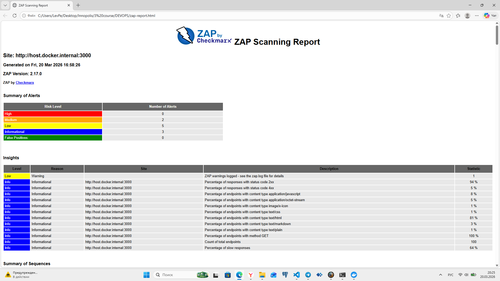
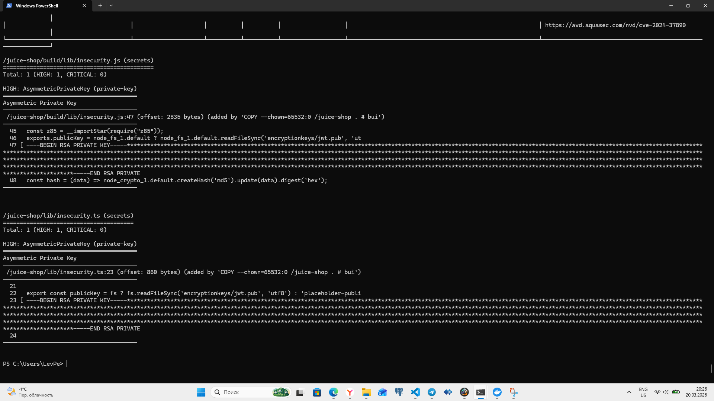

# Lab 9 — Introduction to DevSecOps Tools

## Task 1 — Web Application Scanning with OWASP ZAP

### Scan Results
- **Number of Medium risk vulnerabilities:** 2

### Medium Risk Vulnerabilities

#### 1. Content Security Policy (CSP) Header Not Set
The application does not implement Content Security Policy headers. This allows attackers to inject malicious scripts, steal session cookies, and perform XSS attacks.

#### 2. Cross-Domain Misconfiguration (CORS)
The server allows cross-domain requests from any origin (`Access-Control-Allow-Origin: *`). Any third-party website can make requests to this application and access potentially sensitive data.

### Security Headers Status
| Security Header | Status |
|-----------------|--------|
| Content-Security-Policy | Missing |
| X-Frame-Options | Missing |
| X-Content-Type-Options | Missing |
| Strict-Transport-Security | Present |

**Why these headers matter:** Security headers provide critical protection against common web attacks. CSP prevents XSS, X-Frame-Options prevents clickjacking, and X-Content-Type-Options prevents MIME-sniffing attacks.

### Screenshot

### Analysis: Most Common Vulnerabilities in Web Applications
Missing security headers (CSP, CORS) are the most common vulnerabilities found. This indicates developers often prioritize functionality over security, leaving applications exposed to XSS, clickjacking, and cross-origin data leakage.

---

## Task 2 — Container Vulnerability Scanning with Trivy

### Vulnerability Summary
| Severity | Count |
|----------|-------|
| CRITICAL | 9 |
| HIGH | 43 |

### Vulnerable Packages

#### 1. vm2 (version 3.9.17)
- **CVE IDs:** CVE-2023-32314, CVE-2023-37466, CVE-2023-37903
- Sandbox escape vulnerability allows attackers to execute arbitrary code on the host system

#### 2. crypto-js (version 3.3.0)
- **CVE ID:** CVE-2023-46233
- Weak cryptography implementation makes password cracking feasible

### Most Common Vulnerability Type
**Denial of Service (DoS)** is the most common vulnerability type, affecting multiple packages including minimatch, multer, tar, and ws through ReDoS attacks and memory leaks.

### Screenshot

### Analysis: Why Container Image Scanning is Important
Container image scanning identifies known vulnerabilities in base images and dependencies before deployment. Without scanning, applications with 52 HIGH/CRITICAL vulnerabilities (as found in Juice Shop) would reach production, exposing the organization to supply chain attacks, data breaches, and compliance violations.

### Reflection: How to Integrate These Scans into a CI/CD Pipeline
These scans should be integrated as automated gates in the CI/CD pipeline. Trivy can run during the build stage to block images with HIGH/CRITICAL vulnerabilities. ZAP baseline scans can run against staging environments after deployment. Both should fail the pipeline if critical vulnerabilities are found, forcing remediation before code reaches production.