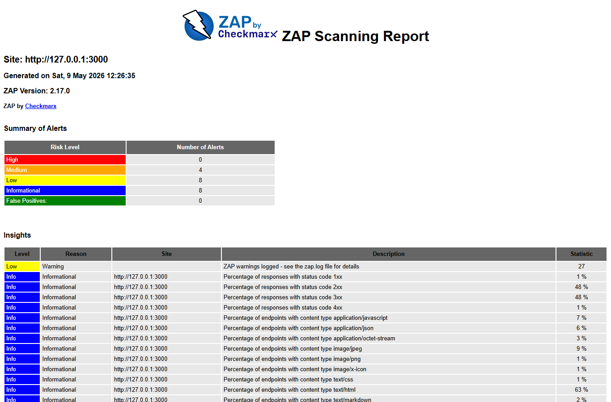
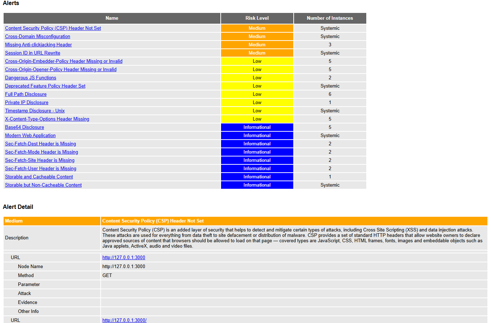
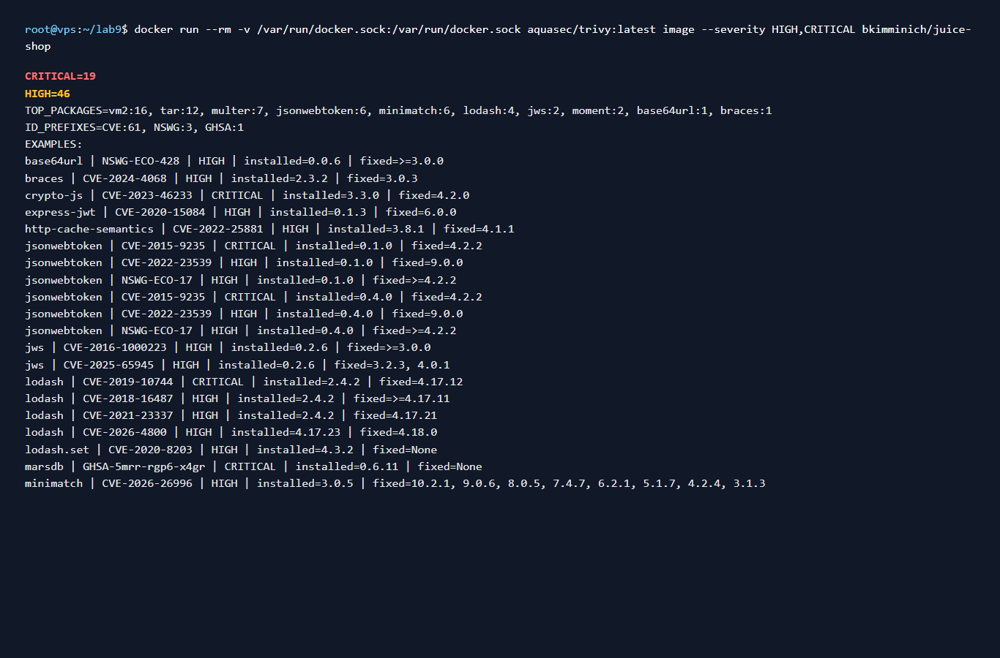

# Lab 9 — Introduction to DevSecOps Tools

## Task 1 — Web Application Scanning with OWASP ZAP

### Запуск Juice Shop

Сначала я подняла Juice Shop в Docker:

```bash
docker run -d --name juice-shop -p 3000:3000 bkimminich/juice-shop
```

Потом проверила, что приложение отвечает:

```bash
curl -I http://127.0.0.1:3000
```

Основные заголовки в ответе:

```text
HTTP/1.1 200 OK
Access-Control-Allow-Origin: *
X-Content-Type-Options: nosniff
X-Frame-Options: SAMEORIGIN
Feature-Policy: payment 'self'
Cache-Control: public, max-age=0
Content-Type: text/html; charset=UTF-8
Content-Length: 75002
```

### Запуск OWASP ZAP

Так как сканирование выполнялось на Linux VPS, я использовала `--network host`, чтобы ZAP-контейнер видел локальный Juice Shop на `127.0.0.1:3000`.

```bash
docker run --rm --network host -v "$(pwd)":/zap/wrk:rw \
  -t ghcr.io/zaproxy/zaproxy:stable zap-baseline.py \
  -t http://127.0.0.1:3000 \
  -j \
  -a \
  -m 5 \
  -r zap-report.html
```

Короткий итог из вывода ZAP:

```text
Using the Automation Framework
Total of 166 URLs
FAIL-NEW: 0  FAIL-INPROG: 0  WARN-NEW: 15  WARN-INPROG: 0  INFO: 0  IGNORE: 0  PASS: 55
```

В HTML-отчете ZAP получилась такая сводка:

```text
High: 0
Medium: 4
Low: 8
Informational: 8
False Positives: 0
```



### Medium risk vulnerabilities

ZAP нашел 4 Medium risk проблемы:

| Vulnerability | Risk | Instances |
| --- | --- | --- |
| Content Security Policy (CSP) Header Not Set | Medium | Systemic |
| Cross-Domain Misconfiguration | Medium | Systemic |
| Missing Anti-clickjacking Header | Medium | 3 |
| Session ID in URL Rewrite | Medium | Systemic |



### Две наиболее интересные проблемы

**Content Security Policy (CSP) Header Not Set.**  
На части страниц нет `Content-Security-Policy`. Из-за этого браузеру не задается строгий список разрешенных источников для скриптов, стилей, картинок и фреймов. Если в приложении появится XSS или возможность подмешать внешний скрипт, отсутствие CSP упростит эксплуатацию. Для исправления я бы добавила CSP с базовым ограничением вроде `default-src 'self'` и отдельно настроила источники для API, статики и `frame-ancestors`.

**Session ID in URL Rewrite.**  
ZAP увидел session id в URL у Socket.IO-запросов, например в параметре `sid`. Это плохая практика, потому что такие значения могут попасть в историю браузера, reverse proxy logs, server logs или `Referer`. Сессионные идентификаторы лучше передавать через cookie с `HttpOnly`, `Secure` и `SameSite`, а не через query string.

Самой интересной для меня была `Session ID in URL Rewrite`, потому что это не просто "не хватает заголовка", а реальный пример утечки чувствительного идентификатора через URL.

### Security headers status

На главной странице часть защитных заголовков есть:

| Header | Status | Комментарий |
| --- | --- | --- |
| `X-Content-Type-Options: nosniff` | present | Помогает браузеру не угадывать MIME-type. |
| `X-Frame-Options: SAMEORIGIN` | present | Снижает риск clickjacking для основной страницы. |
| `Feature-Policy: payment 'self'` | present | Ограничивает payment API, но сам `Feature-Policy` уже устаревший, лучше использовать `Permissions-Policy`. |
| `Access-Control-Allow-Origin: *` | present, but risky | Любой origin может читать разрешенные CORS-ответы, поэтому ZAP отметил Cross-Domain Misconfiguration. |

Проблемные или отсутствующие заголовки:

| Header / check | Status | Почему важно |
| --- | --- | --- |
| `Content-Security-Policy` | missing | Без CSP слабее защита от XSS и content injection. |
| Anti-clickjacking header | missing on some Socket.IO responses | На части ответов нет защиты от встраивания во frame. |
| `X-Content-Type-Options` | missing on some Socket.IO responses | Не везде одинаково настроена защита от MIME sniffing. |
| `Cross-Origin-Embedder-Policy` | missing or invalid | Слабее изоляция cross-origin ресурсов. |
| `Sec-Fetch-Dest` | missing | Сервер не может использовать этот сигнал для фильтрации подозрительных запросов. |

### Web application analysis

В этом скане чаще всего встречались не SQL injection или XSS, а security misconfiguration: отсутствующие или непоследовательно выставленные security headers, слишком широкий CORS и передача session id через URL. В реальных веб-приложениях это тоже частая проблема: приложение может работать корректно функционально, но быть плохо защищено на уровне HTTP policy и конфигурации.

После сканирования я остановила и удалила контейнер:

```bash
docker stop juice-shop && docker rm juice-shop
```

## Task 2 — Container Vulnerability Scanning with Trivy

### Запуск Trivy

Для проверки Docker-образа я использовала Trivy и оставила только `HIGH` и `CRITICAL` уязвимости:

```bash
docker run --rm -v /var/run/docker.sock:/var/run/docker.sock \
  aquasec/trivy:latest image \
  --severity HIGH,CRITICAL \
  bkimminich/juice-shop
```

Также сохранила вывод в table/json, чтобы было проще разобрать результаты:

```bash
docker run --rm -v /var/run/docker.sock:/var/run/docker.sock \
  aquasec/trivy:latest image \
  --severity HIGH,CRITICAL \
  --format table \
  bkimminich/juice-shop > trivy-table.txt

docker run --rm -v /var/run/docker.sock:/var/run/docker.sock \
  aquasec/trivy:latest image \
  --severity HIGH,CRITICAL \
  --format json \
  -o trivy.json \
  bkimminich/juice-shop
```

Итог по Trivy:

```text
Total: 65 (HIGH: 46, CRITICAL: 19)
CRITICAL=19
HIGH=46
```



### Key findings

| Package | Vulnerability | Severity | Installed version | Fixed version |
| --- | --- | --- | --- | --- |
| `crypto-js` | `CVE-2023-46233` | CRITICAL | `3.3.0` | `4.2.0` |
| `jsonwebtoken` | `CVE-2015-9235` | CRITICAL | `0.1.0`, `0.4.0` | `4.2.2` |
| `lodash` | `CVE-2019-10744` | CRITICAL | `2.4.2` | `4.17.12` |
| `braces` | `CVE-2024-4068` | HIGH | `2.3.2` | `3.0.3` |

Самые частые пакеты в результатах: `vm2`, `tar`, `multer`, `jsonwebtoken`, `minimatch`, `lodash`. Самый частый тип уязвимостей — CVE: в результатах было `CVE: 61`, `NSWG: 3`, `GHSA: 1`.

### Container scanning analysis

Container image scanning важен до production, потому что образ может содержать старые библиотеки даже тогда, когда само приложение собирается и запускается без ошибок. В моем скане видно много уязвимостей уровня зависимостей Node.js: `crypto-js`, `jsonwebtoken`, `lodash`, `vm2` и другие. Если такой образ отправить в production без проверки, команда может случайно выкатить уже известные уязвимости.

Trivy помогает найти такие проблемы до деплоя. По результатам можно обновить зависимости, пересобрать образ, заменить base image или временно задокументировать исключение, если уязвимость не эксплуатируется в конкретном контексте.

### CI/CD reflection

Я бы встроила эти проверки так:

1. После сборки Docker image запускать Trivy:

```bash
trivy image --severity HIGH,CRITICAL --exit-code 1 my-app:${CI_COMMIT_SHA}
```

Если есть `CRITICAL`, pipeline должен падать. Для `HIGH` можно либо тоже блокировать merge, либо сначала отправлять отчет в security review, если проект только внедряет DevSecOps.

2. После деплоя в test/staging окружение запускать ZAP baseline scan:

```bash
zap-baseline.py -t https://staging.example.com -r zap-report.html
```

ZAP HTML report и Trivy JSON/SARIF я бы сохраняла как CI artifacts. Так у команды будет история сканов, а не только красный или зеленый статус job.
