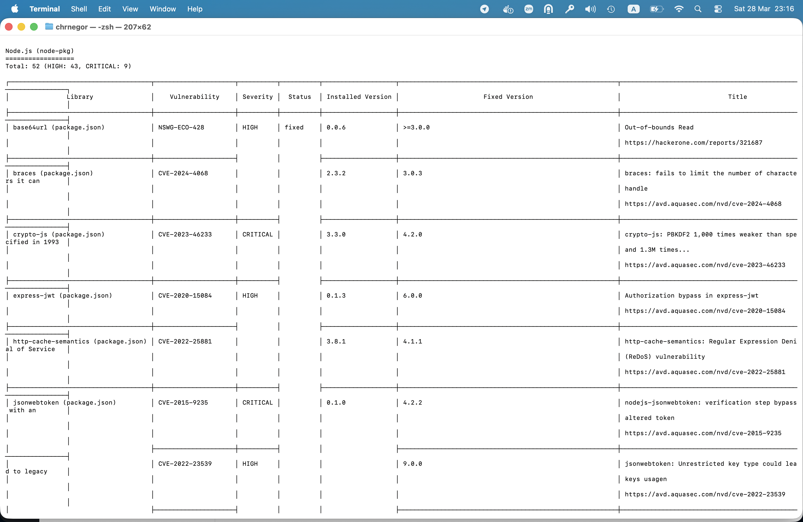

# Task 1

I ran OWASP Juice Shop in Docker on my Mac and scanned it with the ZAP baseline image. The target URL inside ZAP was `http://host.docker.internal:3000` so the scanner container could reach the app on the host. I wrote the HTML report to `labs/zap-report.html` in this repo.

**Setup and scan:**

```
docker run -d --name juice-shop -p 3000:3000 bkimminich/juice-shop

docker run --rm -u zap -v $(pwd):/zap/wrk:rw \
  -t ghcr.io/zaproxy/zaproxy:stable zap-baseline.py \
  -t http://host.docker.internal:3000 \
  -g gen.conf \
  -r zap-report.html
```

The CLI finished with 123 URLs crawled, 60 passive rules passed, 6 warnings (WARN-NEW), and no failures (FAIL-NEW: 0). The HTML report is what I used for the real risk counts and descriptions.

**What the report summary says**

There are 2 Medium alerts, 5 Low, and 3 Informational. The two Medium ones are:

1) Content Security Policy (CSP) header not set — the app does not send a CSP, so the browser has less help blocking malicious scripts or other injected content. It is a standard hardening header for reducing XSS impact.

2) Cross-domain misconfiguration — responses include a very open CORS setup (the report mentions `Access-Control-Allow-Origin: *`). That can let other sites trigger the browser to read responses from your API in ways that are risky if anything sensitive is exposed without proper auth.

Those two are the most interesting to me because they affect how the whole app behaves in the browser, not just one endpoint.

Other findings from the same scan (Low) include missing Cross-Origin-Embedder-Policy and Cross-Origin-Opener-Policy, deprecated Feature-Policy-style headers, timestamp values visible in responses, and "dangerous JS functions" flagged in bundled files. They are worth fixing but the Medium items are the priority from this baseline run.

**Security headers in plain terms**

CSP is missing (Medium). COEP and COOP are missing or invalid (Low). The report also flags the permissive CORS pattern under cross-domain misconfiguration (Medium). In production I would add a real CSP, tighten CORS to known origins, and set modern headers (COOP/COEP where appropriate) so the browser can enforce same-origin rules more strictly.


Overview from `zap-report.html` (Summary of Alerts):


```
Risk Level          Number of Alerts
High                0
Medium              2
Low                 5
Informational       3
False Positives:    0
```

**Analysis**

A lot of common web issues are configuration and header related (CSP, CORS, cookie flags, clickjacking). Injection-style bugs (XSS, SQLi) often show up when input is not handled safely. Even on a baseline passive scan you already see how missing headers stack up; active scanning and manual testing find more logic bugs. Juice Shop is built to be vulnerable on purpose, so the report is a good practice target without touching a real production site.

**Cleanup**

When I was done testing, I ran `docker stop juice-shop && docker rm juice-shop` so the vulnerable app was not left running.

# Task 2

I scanned the same image `bkimminich/juice-shop` with Trivy from the official container. I used the image from GitHub Container Registry (`ghcr.io/aquasecurity/trivy:latest`); it is the same tool as `aquasec/trivy` in the lab. Mounting `/var/run/docker.sock` lets Trivy read images that Docker already pulled.

```
docker run --rm -v /var/run/docker.sock:/var/run/docker.sock \
  ghcr.io/aquasecurity/trivy:latest image \
  --severity HIGH,CRITICAL \
  bkimminich/juice-shop
```

On first run Trivy downloaded its vulnerability DB, then reported OS packages (Debian 13.4) and a very long list of Node dependencies under `juice-shop/node_modules/...`.

For the Debian base layer in this image, the table showed 0 HIGH/CRITICAL CVEs for `bkimminich/juice-shop (debian 13.4)`.

For Node.js (`node-pkg`), Trivy printed: **Total: 52** findings at HIGH or CRITICAL severity — **43 HIGH** and **9 CRITICAL** (aggregated across nested `package.json` targets).

**Totals from the scan:** **CRITICAL — 9**, **HIGH — 43** (all in Node.js `node-pkg` in this run). The Debian base layer reported **0 CRITICAL** and **0 HIGH** with the same severity filter.

Trivy also ran **secret** scanning and flagged **HIGH**: an RSA private key embedded in `insecurity.js` / `insecurity.ts` (JWT-related demo material shipped inside the image — bad practice in real life because anyone with the image can read it).

**Two example packages with CVEs**

1. **crypto-js** (installed version 3.3.0) — **CVE-2023-46233** (CRITICAL): weak PBKDF2 implementation compared to the intended security level.

2. **jsonwebtoken** (old nested versions, e.g. 0.1.0 / 0.4.0) — **CVE-2015-9235** (CRITICAL): verification bypass with a tampered token; also **CVE-2022-23539** (HIGH) about key-type handling.



Other heavy hitters in the same report include **vm2** (sandbox escape CVEs), **marsdb** (command injection advisory), **lodash** / **lodash.set** (prototype pollution), **multer** and **tar** (multiple DoS / path issues), **express-jwt** (auth bypass), **jws**, **braces**, **ws**, etc.

Most lines were **DoS/ReDoS**-type issues or **old crypto and auth** libraries rather than one exotic bug class. Juice Shop pins old dependencies on purpose, so the scan still shows how supply-chain debt piles up in a single image.

**Analysis**

Scanning the image before deploy matters because you catch **known CVEs in the OS and in every layer of dependencies**, not only what your own code does. A clean `npm audit` on one repo is not the same as scanning the exact bits that ship in the container. For production you would fail the pipeline on critical findings, pin versions, and rebuild when the base image or lockfile changes.

**Reflection**

In CI I would run Trivy on **every image build**, store SARIF or JSON in the job artifacts, and block merge or deploy when severity thresholds are exceeded. Optionally scan on a schedule too, because new CVEs appear after the image was built. Secret scanning in the same tool is a reminder not to bake keys into images — use mounts or a secret manager instead.

**Cleanup**

After the lab, `docker rmi bkimminich/juice-shop` removes the vulnerable image from the machine so it is not sitting around by mistake.
