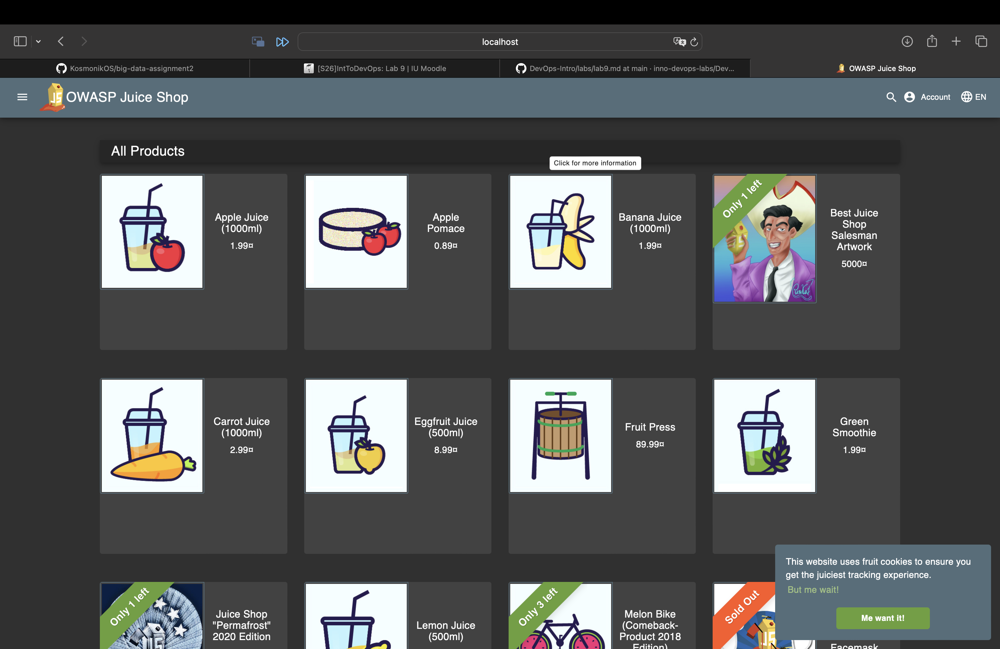
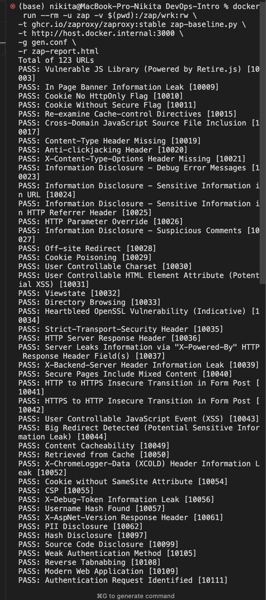
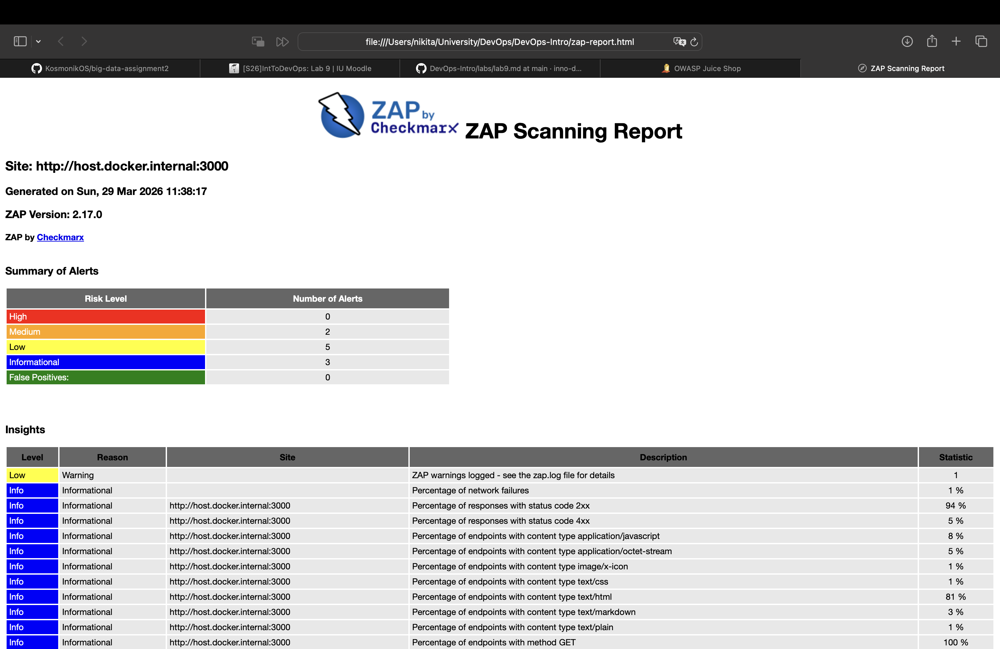
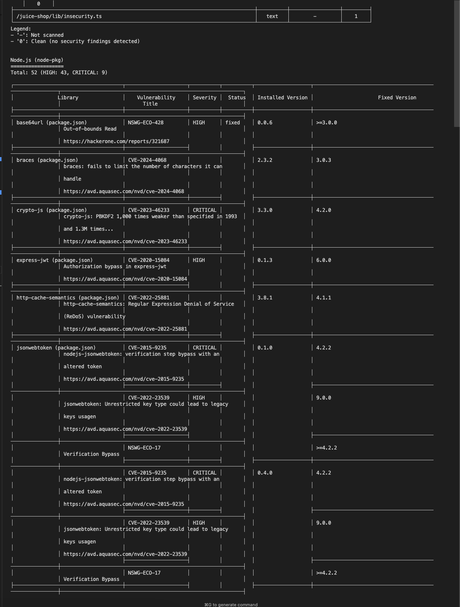
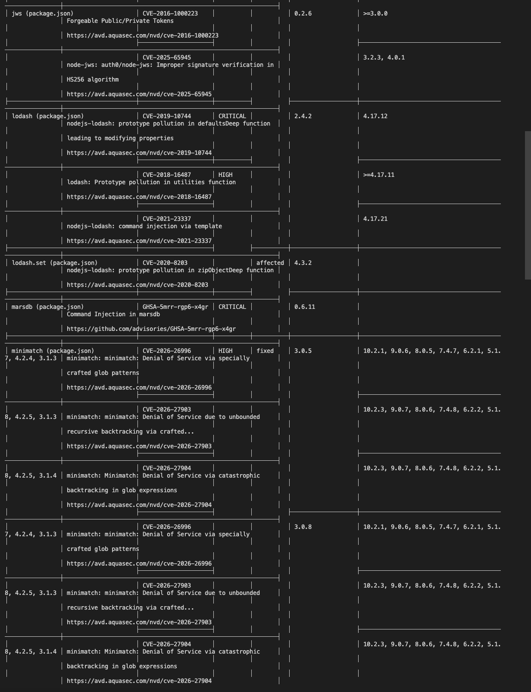
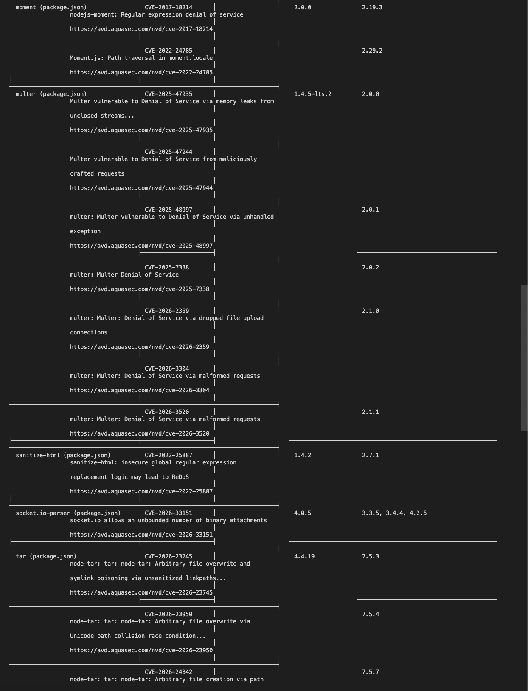
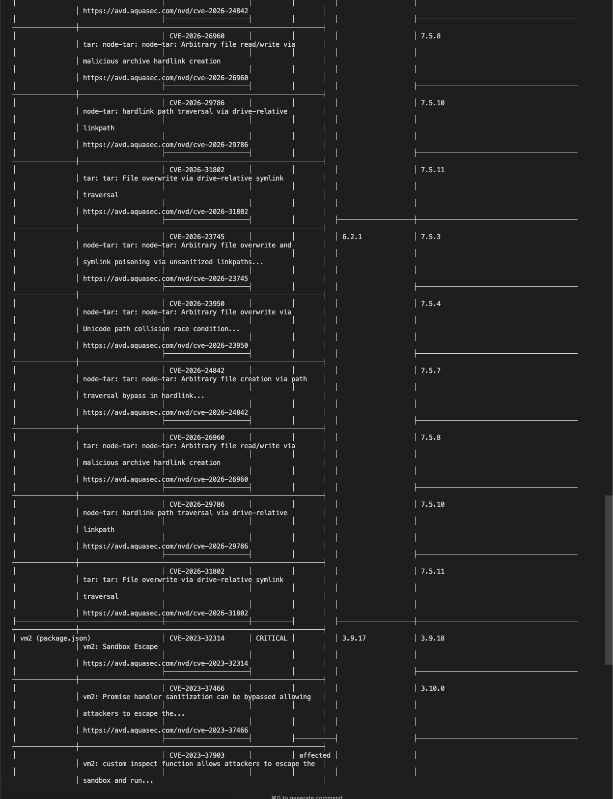
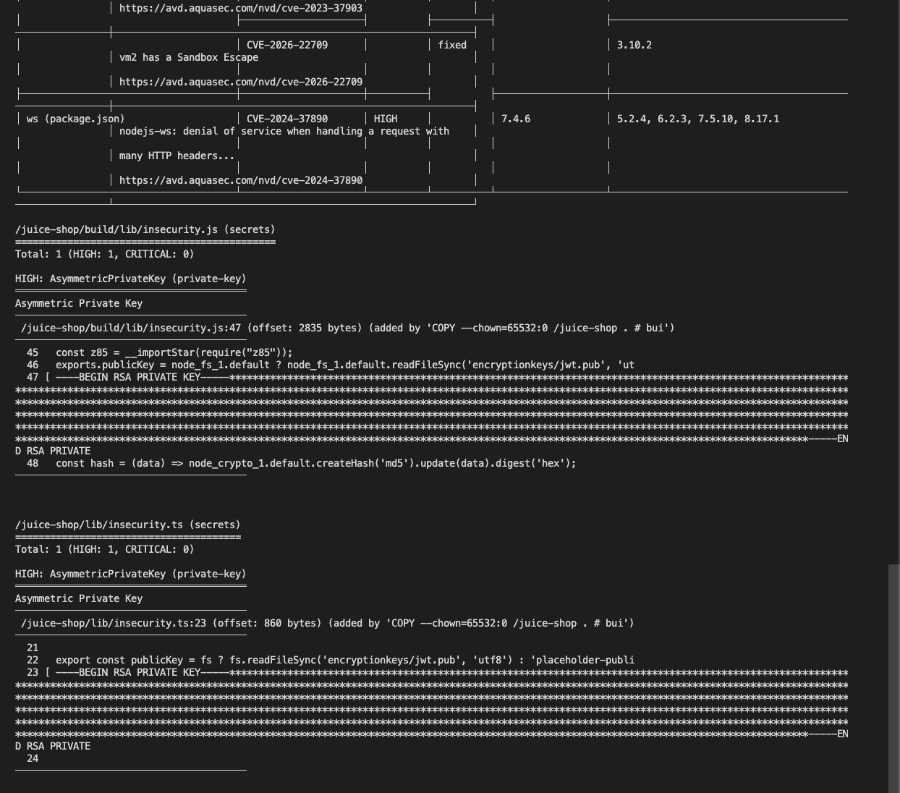

# Lab 9 Submission

## Task 1 — Web Application Scanning with OWASP ZAP

First of all, I ran the following command to start the Juice Shop application:

Then, I ran zap baseline scan command:

And got the following report:

### 1) Number of Medium risk vulnerabilities found

- 2 Medium alerts were found in `zap-report.html`.
  - `Content Security Policy (CSP) Header Not Set`
  - `Cross-Domain Misconfiguration`

### 2) Two most interesting vulnerabilities

#### A. Content Security Policy (CSP) Header Not Set (Medium)

- What it means: The app does not define a `Content-Security-Policy` response header.
- Why it matters: CSP reduces the impact of script injection and data injection by restricting what sources are allowed for scripts, styles, frames, and other content.
- Potential impact: If an XSS payload is introduced anywhere in the app, missing CSP makes exploitation easier and potential damage larger.

#### B. Cross-Domain Misconfiguration (Medium)

- What it means: ZAP found permissive CORS behavior (`Access-Control-Allow-Origin: *`).
- Why it matters: Overly broad CORS can allow untrusted origins to read responses from the application in cross-origin browser contexts.
- Potential impact: Publicly accessible endpoints and metadata may be exfiltrated by malicious third-party sites, especially when combined with other weaknesses.

### 3) Security headers status (present/missing + why they matter)

#### Missing / misconfigured (from report)

- `Content-Security-Policy` (missing)  
  Important for reducing XSS and content injection risk.
- `Cross-Origin-Embedder-Policy` (missing or invalid)  
  Helps isolate browsing context and block unsafe cross-origin resource embedding.
- `Cross-Origin-Opener-Policy` (missing or invalid)  
  Helps prevent cross-window data leakage and cross-origin interaction abuse.
- `Permissions-Policy` (not set as modern replacement)  
  ZAP reports deprecated `Feature-Policy` is used instead; migration is recommended.

#### Present (observed in report)

- `Access-Control-Allow-Origin` (present, currently permissive `*`)  
  Header exists, but the value is too broad and increases cross-origin data exposure risk.
- `Feature-Policy` (present but deprecated)  
  Should be replaced by `Permissions-Policy`.
- `Cache-Control` and `Pragma` (present)  
  Improve caching behavior control and can reduce accidental sensitive-data caching.

### 4) Analysis: most common vulnerability type in web applications

In modern web applications, security misconfiguration and missing/misconfigured HTTP security headers are among the most common findings (as also seen in this scan). They appear frequently because teams prioritize feature delivery, while hardening headers and browser security policies are often left to late stages or defaults. Input-validation issues (XSS/SQLi) remain critical classes overall, but in automated baseline scans, header and policy weaknesses commonly dominate because they are easy to detect consistently across many endpoints.

## Task 2 — Container Vulnerability Scanning with Trivy

First, here are the Trivy scan output screenshots:

### 1) Total count of CRITICAL and HIGH vulnerabilities

- From Trivy `Node.js (node-pkg)` section:
  - **CRITICAL: 9**
  - **HIGH: 43**
  - Total HIGH+CRITICAL vulnerabilities: **52**

### 2) List of 2 vulnerable packages with CVE IDs

- `crypto-js` — `CVE-2023-46233` (CRITICAL)
- `lodash` — `CVE-2019-10744` (CRITICAL)

Additional examples also visible in the output:
- `vm2` — `CVE-2023-32314` (CRITICAL)
- `jsonwebtoken` — `CVE-2015-9235` (CRITICAL)

### 3) Most common vulnerability type found

The most common category in this scan is **Denial of Service (DoS)** and related resource-exhaustion issues (for example in `minimatch`, `multer`, and `moment`), with many repeated entries across different installed versions. There are also multiple **path traversal / arbitrary file overwrite** issues in `tar`, but DoS-style vulnerabilities appear most frequently overall.

### 4) Analysis: why container image scanning is important before production

Container images include many transitive OS/library dependencies, and vulnerabilities can exist even when application code looks clean. Scanning before deployment helps detect exploitable components early, reduce attack surface, and prevent shipping known CVEs to production. It also supports risk-based patching by prioritizing CRITICAL/HIGH issues and tracking remediation over time.

### 5) Reflection: integrating these scans into CI/CD

- Run Trivy automatically in CI for every PR and on the default branch.
- Fail the pipeline on policy thresholds (for example any CRITICAL, or HIGH above a configured limit).
- Publish scan artifacts (SARIF/JSON/HTML) to CI for review and auditing.
- Add scheduled rescans (daily/weekly) to catch newly disclosed CVEs in existing images.
- Pair scanning with base image update automation and dependency update PRs.