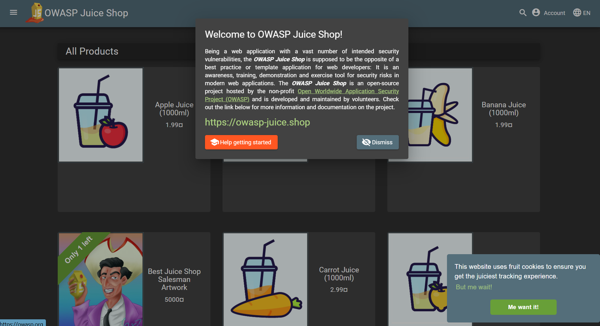

# Lab 9 Submission

## Task 1 - Web Application Scanning with OWASP ZAP

### 1.1. Start the Vulnerable Target Application

#### Deploy Juice Shop (Intentionally Vulnerable Application)

I start the vulnerable `Juice Shop` application using Docker.

```bash
seva@Seva:/mnt/.../DevOps-Intro$ docker run -d --name juice-shop -p 3000:3000 bkimminich/juice-shop
Unable to find image 'bkimminich/juice-shop:latest' locally
latest: Pulling from bkimminich/juice-shop
ebddc55facdc: Pulling fs layer
1a4be5562d92: Pull complete
...
Digest: sha256:5539448a1d3fa88d932d3f80a8d3f69a16cde6253c1d4256b28a38ef910e4114
Status: Downloaded newer image for bkimminich/juice-shop:latest
53e3c1d2f4e615dad5fb97d5462c7747f891edbed87ef80674f06392c8db4de7
```

The image was successfully downloaded and the container started. Docker pulled all required layers and created a running container.


#### Verify It's Running

I check that the application is доступible in the browser.



The application is running correctly on port `3000`.


### 1.2. Scan with OWASP ZAP

#### Run ZAP Baseline Scan

I run an automated security scan using `OWASP ZAP`.

```bash
seva@Seva:/mnt/.../DevOps-Intro$ docker run --rm -u zap -v $(pwd):/zap/wrk:rw \
-t ghcr.io/zaproxy/zaproxy:stable zap-baseline.py \
-t http://host.docker.internal:3000 \
-g gen.conf \
-r zap-report.html
Unable to find image 'ghcr.io/zaproxy/zaproxy:stable' locally
stable: Pulling from zaproxy/zaproxy
5c5ce62775ba: Pull complete
...
Digest: sha256:c4da4c234258d444d9988fce9d034b00323724818daa4c91ca46f09aa04b46db
Status: Downloaded newer image for ghcr.io/zaproxy/zaproxy:stable
Total of 123 URLs
PASS: Vulnerable JS Library (Powered by Retire.js) [10003]
...
PASS: Loosely Scoped Cookie [90033]
WARN-NEW: Content Security Policy (CSP) Header Not Set [10038] x 11
        http://host.docker.internal:3000/ (200 OK)
        http://host.docker.internal:3000/sitemap.xml (200 OK)
        http://host.docker.internal:3000 (200 OK)
        http://host.docker.internal:3000/ftp/coupons_2013.md.bak (403 Forbidden)
        http://host.docker.internal:3000/ftp/eastere.gg (403 Forbidden)
WARN-NEW: Deprecated Feature Policy Header Set [10063] x 11
        http://host.docker.internal:3000/ (200 OK)
        http://host.docker.internal:3000/chunk-TWZW5B45.js (200 OK)
        http://host.docker.internal:3000/chunk-24EZLZ4I.js (200 OK)
        http://host.docker.internal:3000/chunk-T3PSKZ45.js (200 OK)
        http://host.docker.internal:3000/polyfills.js (200 OK)
WARN-NEW: Timestamp Disclosure - Unix [10096] x 13
        http://host.docker.internal:3000/ (200 OK)
        http://host.docker.internal:3000/ (200 OK)
        http://host.docker.internal:3000/ (200 OK)
        http://host.docker.internal:3000/styles.css (200 OK)
        http://host.docker.internal:3000/styles.css (200 OK)
WARN-NEW: Cross-Domain Misconfiguration [10098] x 12
        http://host.docker.internal:3000/ (200 OK)
        http://host.docker.internal:3000/robots.txt (200 OK)
        http://host.docker.internal:3000/assets/public/favicon_js.ico (200 OK)
        http://host.docker.internal:3000/chunk-24EZLZ4I.js (200 OK)
        http://host.docker.internal:3000/chunk-T3PSKZ45.js (200 OK)
WARN-NEW: Dangerous JS Functions [10110] x 2
        http://host.docker.internal:3000/chunk-LHKS7QUN.js (200 OK)
        http://host.docker.internal:3000/main.js (200 OK)
WARN-NEW: Cross-Origin-Embedder-Policy Header Missing or Invalid [90004] x 12
        http://host.docker.internal:3000/ (200 OK)
        http://host.docker.internal:3000/ (200 OK)
        http://host.docker.internal:3000/sitemap.xml (200 OK)
        http://host.docker.internal:3000 (200 OK)
        http://host.docker.internal:3000/sitemap.xml (200 OK)
FAIL-NEW: 0     FAIL-INPROG: 0  WARN-NEW: 6     WARN-INPROG: 0  INFO: 0 IGNORE: 0       PASS: 60
```

The scan completed successfully and analyzed URLs. Several warnings were found, mostly related to missing security headers and misconfigurations.


### 1.3. Analyze Results

#### Open the Report

I open the generated `ZAP HTML` report.


The report shows multiple warnings with `Medium` and `Low` risk level.


#### Identify Vulnerabilities

The scan identified multiple Medium risk vulnerabilities.

**Alerts**

| Name  | Risk Level | Number of Instances |
|-------|-----|------------|
| Content Security Policy (CSP) Header Not Set | Medium | Systemic |
| Cross-Domain Misconfiguration | Medium | Systemic |
| ... | Low | ... |

Number of Medium risk vulnerabilities found: `2 Medium risk`

Description of the 2 most interesting vulnerabilities:
- `Content Security Policy (CSP)` is an added layer of security that helps to detect and mitigate certain types of attacks, including Cross Site Scripting (XSS) and data injection attacks. These attacks are used for everything from data theft to site defacement or distribution of malware. CSP provides a set of standard HTTP headers that allow website owners to declare approved sources of content that browsers should be allowed to load on that page — covered types are JavaScript, CSS, HTML frames, fonts, images and embeddable objects such as Java applets, ActiveX, audio and video files.
- Web browser data loading may be possible, due to a `Cross Origin Resource Sharing (CORS)` misconfiguration on the web server.

Security headers status:

Missing:
- Content-Security-Policy (CSP)
- Cross-Origin-Embedder-Policy
- Other security-related headers

Present:
- Some default headers (basic HTTP responses)

Why they matter:
- Security headers help protect against common attacks like XSS, data injection, and clickjacking.
- Missing headers significantly increase the attack surface of the application.


### 1.4. Clean Up

I stop and remove the running container.

```bash
seva@Seva:/mnt/.../DevOps-Intro$ docker stop juice-shop && docker rm juice-shop
juice-shop
juice-shop
```

The container was successfully stopped and removed from the system.


### Analysis: What type of vulnerabilities are most common in web applications?

The most common vulnerabilities are related to misconfiguration and missing security controls.
Examples include missing security headers like `CSP` and incorrect `CORS` settings.
These issues do not require complex attacks and are easy to exploit.
They often appear because developers forget to configure security properly.
Such vulnerabilities can lead to XSS, data leaks, or unauthorized access.


## Task 2 - Container Vulnerability Scanning with Trivy

### 2.1. Scan Container Image

#### Run Trivy Scan

I run a vulnerability scan of the container image using Trivy.

```bash
seva@Seva:/mnt/.../DevOps-Intro$ docker run --rm -v /var/run/docker.sock:/var/run/docker.sock \
ghcr.io/aquasecurity/trivy:latest image \
--severity HIGH,CRITICAL \
bkimminich/juice-shop
Unable to find image 'ghcr.io/aquasecurity/trivy:latest' locally
latest: Pulling from aquasecurity/trivy
653c20201193: Pull complete
7b08753d422d: Pull complete
fc2618f97117: Pull complete
Digest: sha256:bcc376de8d77cfe086a917230e818dc9f8528e3c852f7b1aff648949b6258d1c
Status: Downloaded newer image for ghcr.io/aquasecurity/trivy:latest
...
```

The image was successfully scanned. Trivy downloaded its database and analyzed the container for vulnerabilities.


### 2.2. Analyze Results

#### Identify Key Findings

I review the detected vulnerabilities in the container image.

```bash
Node.js (node-pkg)
==================
Total: 52 (HIGH: 43, CRITICAL: 9)
```

Total count of vulnerabilities:
- `9 CRITICAL`
- `43 HIGH`

Most issues are related to outdated dependencies in Node.js packages. Some vulnerabilities allow code execution, authentication bypass, or denial of service.

List of 2 vulnerable packages with their CVE IDs:
- `crypto-js`
- - `CVE-2023-46233`
- - Issue: Weak PBKDF2 implementation → reduced security of cryptographic operations
- `lodash`
- - `CVE-2019-10744`
- - Issue: Prototype pollution → attacker can modify object properties and execute malicious logic

Most common vulnerability type found:
- The most common type is `Denial of Service (DoS)` and `Prototype Pollution`
- Many vulnerabilities are also related to:
- - outdated dependencies
- - improper input handling
- - weak cryptographic implementations

These issues mainly come from outdated `Node.js` packages.


### 2.3. Clean Up

I remove the container image from the local system.

```bash
seva@Seva:/mnt/.../DevOps-Intro$ docker rmi bkimminich/juice-shop
Untagged: bkimminich/juice-shop:latest
Deleted: sha256:5539448a1d3fa88d932d3f80a8d3f69a16cde6253c1d4256b28a38ef910e4114
```

The image was successfully removed and disk space was freed.


### Analysis: Why is container image scanning important before deploying to production?

Container image scanning helps detect vulnerabilities before deployment.
Many issues come from outdated libraries and dependencies.
If not fixed, attackers can exploit them in production systems.
Scanning allows teams to fix critical problems early.
This reduces security risks and improves overall system reliability.


### Reflection: How would you integrate these scans into a CI/CD pipeline?

Security scans should be added as automatic steps in the pipeline.
For example, run `ZAP` and `Trivy` during the build stage.
If `CRITICAL` vulnerabilities are found, the build should fail.
Reports can be generated and reviewed by the team.
This approach ensures that insecure code is not deployed to production.
