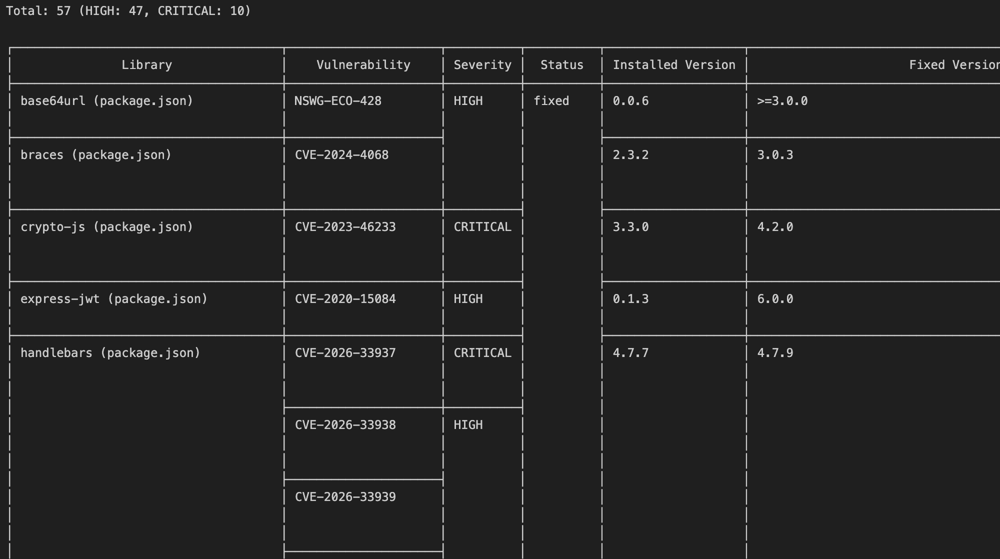

# Lab 9 — Introduction to DevSecOps Tools

## Task 1 — Web Application Scanning with OWASP ZAP

### Scan Summary

- **Target:** OWASP Juice Shop (`http://localhost:3000`)
- **Total URLs scanned:** 123
- **Results:** FAIL: 0 | WARN: 6 | PASS: 60

### Medium Risk Vulnerabilities Found

ZAP baseline scan found **6 warnings** (Medium-level alerts). No high-risk failures were detected.

### 2 Most Interesting Vulnerabilities

1. **Content Security Policy (CSP) Header Not Set** (11 instances)
   - CSP is a critical security header that helps prevent Cross-Site Scripting (XSS) and data injection attacks. Without CSP, the browser has no policy to restrict which scripts, styles, or resources can be loaded, making the application vulnerable to code injection.

2. **Dangerous JS Functions** (2 instances, found in `chunk-LHKS7QUN.js` and `main.js`)
   - The application uses potentially dangerous JavaScript functions (e.g., `eval()`, `innerHTML`, `document.write()`). These functions can introduce XSS vulnerabilities if user input is passed to them without proper sanitization.

### Security Headers Status

| Header | Status | Why It Matters |
|--------|--------|----------------|
| Content Security Policy (CSP) | **Missing** | Prevents XSS and data injection attacks by controlling which resources the browser can load |
| Feature-Policy / Permissions-Policy | **Deprecated header used** | The application uses the deprecated `Feature-Policy` header instead of the modern `Permissions-Policy` header |
| Cross-Origin-Embedder-Policy (COEP) | **Missing** | Prevents cross-origin resources from being loaded without explicit permission, mitigating Spectre-like attacks |
| X-Content-Type-Options | Present | Prevents MIME-type sniffing |
| X-Frame-Options | Present | Prevents clickjacking |

### ZAP HTML Report Overview


### Analysis: Most Common Web Application Vulnerabilities

The most common vulnerabilities in web applications align with the OWASP Top 10:
- **Injection attacks** (SQL injection, XSS) — caused by unsanitized user input
- **Missing security headers** — CSP, HSTS, X-Frame-Options help browsers enforce security policies
- **Misconfiguration** — default settings, verbose error messages, unnecessary services
- **Cross-Domain Misconfiguration** — overly permissive CORS policies allowing unauthorized cross-origin access

In this scan, **missing security headers** and **cross-domain misconfiguration** were the most prevalent issues, which is typical for applications that haven't undergone security hardening.

---

## Task 2 — Container Vulnerability Scanning with Trivy

### Scan Summary

- **Image:** `bkimminich/juice-shop`
- **OS (Debian 13.4):** 1 HIGH, 0 CRITICAL
- **Node.js packages:** 47 HIGH, 10 CRITICAL
- **Secrets found:** 2 HIGH (embedded RSA private keys)
- **Total: 10 CRITICAL and 49 HIGH vulnerabilities**

### 2 Vulnerable Packages with CVE IDs

| Package | CVE ID | Severity | Description |
|---------|--------|----------|-------------|
| **vm2** (v3.9.17) | CVE-2023-32314 | CRITICAL | Sandbox Escape — allows attackers to break out of the vm2 sandbox and execute arbitrary code on the host |
| **jsonwebtoken** (v0.1.0) | CVE-2015-9235 | CRITICAL | JWT verification bypass — allows attackers to forge valid tokens by exploiting a flaw in the verification step |

### Most Common Vulnerability Type

**Denial of Service (DoS)** via Regular Expression Denial of Service (ReDoS) and resource exhaustion. Packages like `minimatch`, `multer`, `moment`, and `sanitize-html` all contained DoS vulnerabilities caused by crafted input patterns that trigger catastrophic backtracking in regular expressions.

### Trivy Terminal Output



### Analysis: Why Is Container Image Scanning Important?

Container image scanning before production deployment is critical because:

1. **Supply chain security:** Container images bundle hundreds of dependencies (this image has 700+ packages). Each one is an attack surface. Trivy found 10 CRITICAL vulnerabilities in third-party Node.js packages.
2. **Known exploit prevention:** Vulnerabilities like `vm2` Sandbox Escape (CVE-2023-32314) have public exploits. Deploying unscanned images means running known-vulnerable code.
3. **Secrets detection:** Trivy found embedded RSA private keys in the image — a common misconfiguration that can lead to full system compromise.
4. **Compliance requirements:** Many security standards (SOC 2, PCI DSS, ISO 27001) require vulnerability scanning as part of the deployment process.

### Reflection: CI/CD Integration

To integrate these scans into a CI/CD pipeline:

1. **Add Trivy as a build step** — scan the built image before pushing to a registry:
   ```yaml
   - name: Trivy scan
     run: trivy image --exit-code 1 --severity CRITICAL my-app:${{ github.sha }}
   ```
2. **Fail the pipeline on CRITICAL vulnerabilities** — use `--exit-code 1` to block deployments with critical issues.
3. **Run ZAP in CI as a DAST step** — after deploying to a staging environment, run automated ZAP scans against the running application.
4. **Generate reports** — store scan results as pipeline artifacts for security team review.
5. **Schedule regular scans** — new CVEs are published daily; scan existing images periodically, not just at build time.
