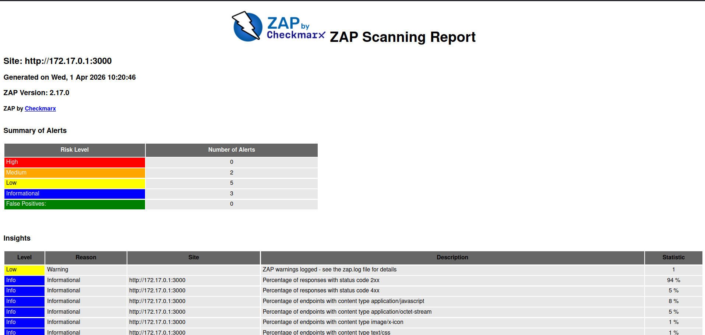
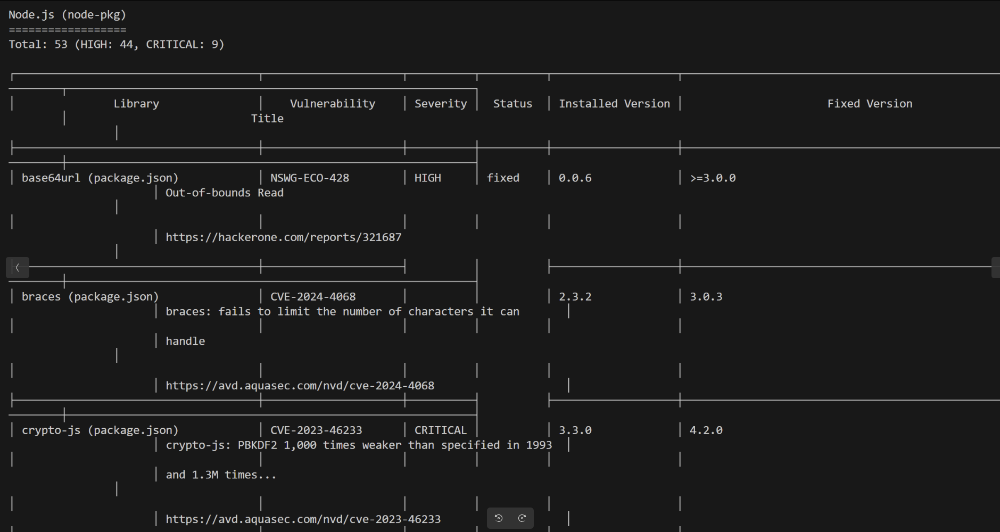

# Lab 9 

## Task 1
Number of Medium risk vulnerabilities: 2

Security headers missing:
- Content-Security-Policy, X-Frame-Options, X-Content-Type-Options

Security headers present:
- Feature-Policy (deprecated, should be Permissions-Policy), Cache-Control


According to the ZAP scan findings, the most frequently identified vulnerabilities include:

- The scan revealed missing CSP, COEP, and COOP headers, along with the use of the deprecated Feature-Policy header.

- The server accepts requests from any origin due to Access-Control-Allow-Origin: *, creating a risk of unauthorized data exposure.

- Use of unsafe functions such as bypassSecurityTrustHtml, which circumvents built-in security protections.

- Exposure of timestamps and file paths, giving attackers insight into the application's structure.



## Task 2


Total: 1 (HIGH: 1, CRITICAL: 0)

Node.js (node-pkg)
Total: 53 (HIGH: 44, CRITICAL: 9)

- **Package** crypto-js
- **CVE ID:** CVE-2023-46233
- **Severity:** CRITICAL
- **Description:** crypto-js: PBKDF2 1,000 times weaker than specified in 1993

- **Package** jsonwebtoken
- **CVE ID:** CVE-2015-9235
- **Severity:** CRITICAL
- **Description:** verification step bypass with an altered token

Most common vulnerability types:

- Denial of Service (DoS) — in ws, multer, minimatch
- Authentication Bypass — in jsonwebtoken, express-jwt

### Analysis
Importance of Container Image Scanning.

Container image scanning before production deployment is crucial for several reasons:

1. Supply Chain Security: Container images often contain hundreds of packages from various sources. A single vulnerable package can compromise the entire application.

2. Immutable Infrastructure: Unlike traditional servers where you can patch live systems, containers are typically immutable. Vulnerabilities in images persist until the image is rebuilt and redeployed.

3. Base Image Vulnerabilities: The Juice Shop scan revealed 62 high/critical vulnerabilities, most coming from the underlying Alpine Linux base image and Node.js runtime.

4. Compliance Requirements: Many organizations require vulnerability scanning to meet security standards (PCI-DSS, HIPAA, SOC2).

5. Shift Left Security: Finding vulnerabilities during development is significantly cheaper and safer than finding them in production.


### Reflection
The following check in CI pipeline could improve security:
```yaml
- name: Trivy scan
 uses: aquasecurity/trivy-action@master
 with:
   image-ref: 'someapp:latest'
   severity: 'CRITICAL,HIGH'
   exit-code: '1'  # Fail build on CRITICAL/HIGH
```
